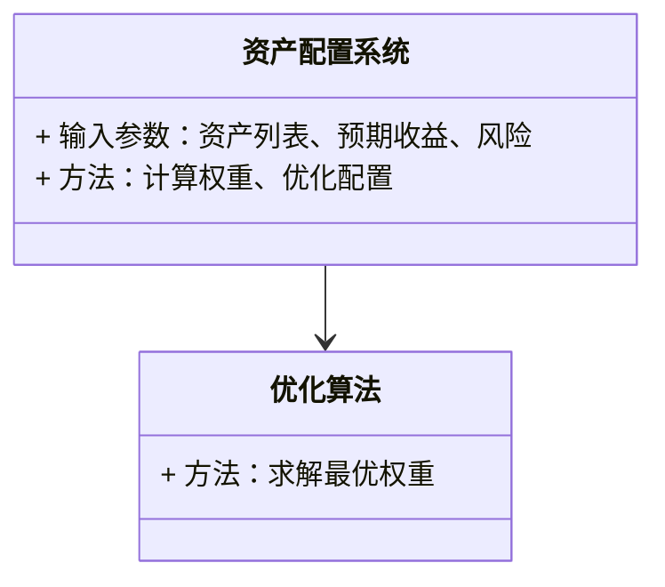

                 


# 大卫·斯文森的另类资产配置策略

## 关键词：大卫·斯文森，另类资产配置，投资策略，风险管理，资产组合优化

## 摘要：大卫·斯文森作为耶鲁大学的首席投资官，以其独特的另类资产配置策略闻名。本文详细分析了斯文森的策略，包括其核心概念、数学模型、系统架构和实际案例，探讨了该策略在现代投资组合中的应用及其优缺点。

---

## 第1章: 大卫·斯文森的另类资产配置背景

### 1.1 大卫·斯文森及其投资理念

#### 1.1.1 大卫·斯文森的背景介绍

大卫·斯文森（David Swensen）是耶鲁大学的首席投资官，以其创新的另类资产配置策略闻名。他将一部分资产配置到房地产、私募股权、对冲基金等非传统资产类别，取得了显著的长期收益。

#### 1.1.2 斯文森投资理念的核心思想

斯文森强调长期投资和分散投资，认为通过配置不同类型的资产可以降低整体风险，同时提高收益。

#### 1.1.3 另类资产配置的定义与特点

另类资产配置是指将一部分资产分配到传统股票和债券之外的资产类别中，以分散风险并提高收益。

---

### 1.2 另类资产配置的背景与意义

#### 1.2.1 传统资产配置的局限性

传统资产配置主要依赖股票和债券，但其波动性和低回报率在某些情况下可能无法满足投资者的需求。

#### 1.2.2 另类资产配置的兴起

随着金融市场的发展，投资者开始寻求更多样化的资产类别以优化投资组合。

#### 1.2.3 另类资产配置在现代投资组合中的作用

通过配置另类资产，投资者可以在不同市场环境下实现更稳定的收益。

---

### 1.3 另类资产配置的核心概念

#### 1.3.1 另类资产的分类与特征

另类资产包括房地产、私募股权、对冲基金、商品等。每种资产类别都有其独特的风险和收益特征。

#### 1.3.2 另类资产配置的边界与外延

资产配置的边界在于如何平衡风险和收益，外延则涉及如何与其他资产类别相结合。

#### 1.3.3 核心要素与概念结构

| 资产类别 | 风险 | 收益 | 流动性 |
|----------|------|------|--------|
| 房地产    | 中高  | 高   | 中低    |
| 私募股权  | 高    | 高   | 低      |
| 对冲基金  | 中高  | 中高 | 中低    |

---

## 第2章: 大卫·斯文森另类资产配置模型

### 2.1 另类资产配置模型的原理

#### 2.1.1 大卫·斯文森模型的基本框架

斯文森模型通过优化资产配置权重，以实现风险调整后的收益最大化。

#### 2.1.2 模型的核心假设与限制条件

模型假设市场是有效的，且资产之间的相关性较低。限制条件包括投资期限、资本约束等。

#### 2.1.3 模型的输入与输出关系

输入包括各类资产的预期收益、风险和相关性矩阵，输出是各类资产的最优配置权重。

---

### 2.2 另类资产配置模型的数学模型

#### 2.2.1 投资组合优化的数学公式

$$\text{目标函数：最大化收益} \quad \sum_{i=1}^{n} w_i R_i$$

$$\text{约束条件：风险最小化} \quad \sum_{i=1}^{n} \sum_{j=1}^{n} w_i w_j \sigma_{ij}$$

#### 2.2.2 风险调整后的收益计算

$$\text{夏普比率} = \frac{E[R_p] - R_f}{\sigma_p}$$

#### 2.2.3 资产配置权重的计算公式

$$w_i = \frac{E[R_i] - R_f}{\sum_{j=1}^{n} (E[R_j] - R_f) \cdot \text{协方差矩阵}}$$

---

### 2.3 模型的实现与应用

#### 2.3.1 模型的实现步骤

1. 确定可投资资产类别。
2. 估计各资产的预期收益和风险。
3. 构建协方差矩阵。
4. 使用优化算法计算最优权重。

#### 2.3.2 模型的应用场景

在机构投资和高净值个人投资中广泛应用。

---

## 第3章: 另类资产配置的核心要素分析

### 3.1 大卫·斯文森模型中的资产配置权重计算

#### 3.1.1 各类资产的权重分配

根据风险和收益的平衡，分配不同比例的资产。

#### 3.1.2 权重调整的时机

定期重新评估和调整资产配置。

---

### 3.2 资产配置权重计算的优化方法

#### 3.2.1 现代投资组合理论（MPT）

$$\text{最优权重} = \arg\min_w \sum_{i=1}^{n} w_i^2 \sigma_i^2$$

#### 3.2.2 风险平价法

确保各类资产对整体风险的贡献相等。

---

## 第4章: 系统分析与架构设计

### 4.1 系统功能设计

#### 4.1.1 领域模型（Mermaid 类图）



#### 4.1.2 系统架构设计（Mermaid 架构图）


---

## 第5章: 项目实战

### 5.1 环境安装

安装Python和相关库（如numpy、pandas、scipy）。

### 5.2 核心实现源代码

```python
import numpy as np
import scipy.optimize as opt

def compute_weights(expected_returns, cov_matrix):
    def objective(weights):
        return np.dot(weights.T, np.dot(cov_matrix, weights)) 
    constraint = ({'type': 'eq', 'fun': lambda w: sum(w) - 1})
    bounds = [(0, 1) for _ in range(len(expected_returns))]
    result = opt.minimize(objective, np.ones(len(expected_returns))/len(expected_returns), bounds=bounds, constraints=constraint)
    return result.x

expected_returns = np.array([0.1, 0.15, 0.08])
cov_matrix = np.array([[0.2, 0.1, 0.05],
                        [0.1, 0.3, 0.08],
                        [0.05, 0.08, 0.2]])
weights = compute_weights(expected_returns, cov_matrix)
print(weights)
```

### 5.3 实际案例分析

分析一个房地产和私募股权的组合配置。

---

## 第6章: 风险管理

### 6.1 风险识别与评估

识别市场风险、流动性风险等，并进行量化评估。

### 6.2 风险控制策略

通过分散投资、动态调整权重等方法进行风险控制。

---

## 第7章: 总结与展望

### 7.1 大卫·斯文森策略的总结

斯文森的策略通过另类资产配置实现了稳健的长期收益。

### 7.2 未来展望

随着金融市场的变化，另类资产配置将继续发展和创新。

---

## 作者：AI天才研究院 & 禅与计算机程序设计艺术

