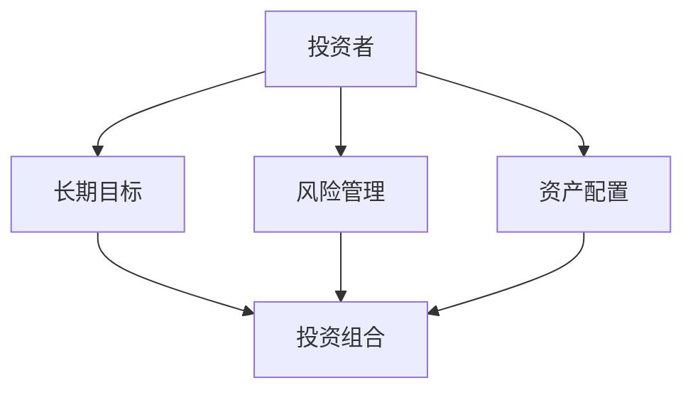
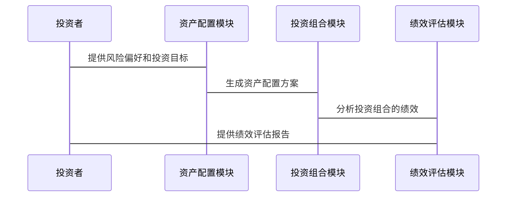

                 


# 大卫·斯文森的耐心资本投资理念

> 关键词：耐心资本，大卫·斯文森，投资理念，资产配置，风险管理，长期投资

> 摘要：大卫·斯文森作为耶鲁大学的首席投资官，提出了耐心资本的理念，强调长期视角和科学的资产配置。本文将详细分析耐心资本的核心概念、算法原理、系统架构以及实际应用，帮助读者理解这一投资理念的精髓。

---

## 第1章: 大卫·斯文森与耐心资本的背景介绍

### 1.1 大卫·斯文森的背景与成就

#### 1.1.1 大卫·斯文森的个人经历
大卫·斯文森（David Swensen）是耶鲁大学的首席投资官，以其卓越的投资业绩和创新的“耐心资本”理念闻名。他在耶鲁大学捐赠基金的管理中，通过长期视角和科学的资产配置策略，实现了超越市场平均水平的收益。

#### 1.1.2 耐心资本理念的提出背景
20世纪80年代，斯文森意识到传统的短期投资策略无法满足机构投资者的需求。他提出“耐心资本”理念，强调长期视角和科学的投资方法，以应对市场的波动性和不确定性。

#### 1.1.3 耐心资本与机构投资的关系
耐心资本理念不仅适用于个人投资者，更强调机构投资者的长期视角和风险管理能力。通过科学的资产配置和纪律性的投资策略，耐心资本理念帮助机构投资者在长期实现稳定的收益。

### 1.2 耐心资本的核心概念

#### 1.2.1 耐心资本的定义与特点
耐心资本是指以长期视角为基础，通过科学的资产配置和风险管理，实现投资组合稳定增长的投资理念。其核心特点是注重长期收益、降低短期波动风险，并通过分散投资来优化回报。

#### 1.2.2 耐心资本与传统投资的区别
传统投资往往关注短期收益，容易受到市场波动的影响。而耐心资本强调长期视角，注重资产配置的科学性和纪律性，通过长期持有优质资产实现稳定增长。

#### 1.2.3 耐心资本的边界与外延
耐心资本的边界在于其长期视角和科学方法，而其外延则包括多种资产类别和投资策略。通过不断优化资产配置和风险管理，耐心资本理念可以应用于不同类型的投资者和投资目标。

---

## 第2章: 耐心资本的核心概念与联系

### 2.1 耐心资本的核心要素

#### 2.1.1 长期视角的重要性
耐心资本强调长期视角，认为市场波动是短期的，而优质资产的长期收益是可持续的。通过长期持有优质资产，投资者可以避免短期波动的影响，实现稳定增长。

#### 2.1.2 风险管理的关键作用
风险管理是耐心资本理念的核心要素之一。通过科学的资产配置和分散投资，投资者可以降低单一资产的风险，并在市场波动中保持投资组合的稳定性。

#### 2.1.3 资产配置的科学方法
资产配置是耐心资本理念的重要组成部分。通过分析不同资产类别的风险收益特征，投资者可以制定科学的资产配置方案，实现收益与风险的最佳平衡。

### 2.2 核心概念的对比分析

#### 2.2.1 耐心资本与短期投资的对比表格
| 对比维度 | 耐心资本 | 短期投资 |
|----------|----------|----------|
| 视野 | 长期视角 | 短期波动 |
| 风险管理 | 强调风险管理 | 侧重短期收益 |
| 投资策略 | 科学资产配置 | 灵活调整 |

#### 2.2.2 耐心资本与其他投资策略的对比表格
| 对比维度 | 耐心资本 | 主动投资 | 被动投资 |
|----------|----------|----------|----------|
| 投资目标 | 长期稳定收益 | 通过选股超越市场 | 模拟市场指数 |
| 管理方式 | 科学资产配置 | 选股和择时 | 买入并持有 |

### 2.3 耐心资本的ER实体关系图


---

## 第3章: 耐心资本投资理念的算法原理

### 3.1 现代投资组合理论（MPT）

#### 3.1.1 MPT的核心思想
现代投资组合理论（MPT）由哈里·马科维茨提出，强调通过分散投资降低风险。MPT认为，通过科学的资产配置，投资者可以在不同风险水平下实现最优收益。

#### 3.1.2 MPT的数学模型
$$ \text{风险} = \sqrt{w^T \Sigma w} $$
$$ \text{收益} = w^T \mu $$

其中：
- \( w \) 是资产权重向量。
- \( \Sigma \) 是资产之间的协方差矩阵。
- \( \mu \) 是资产收益的均值向量。

#### 3.1.3 MPT在耐心资本中的应用
耐心资本通过MPT优化资产配置，实现风险与收益的最佳平衡。通过分析不同资产类别的风险收益特征，投资者可以制定科学的资产配置方案。

### 3.2 资产配置优化算法

#### 3.2.1 均值-方差优化的Python实现
```python
import numpy as np
import matplotlib.pyplot as plt

# 示例数据
returns = np.array([0.05, 0.07, 0.03, 0.04])
covariance_matrix = np.array([[0.02, 0.01], [0.01, 0.03]])

# 均值-方差优化
mu = np.mean(returns)
sigma = np.sqrt(returns.var())

print(f"均值: {mu}, 方差: {sigma}")
```

---

## 第4章: 系统分析与架构设计方案

### 4.1 问题场景介绍

#### 4.1.1 投资者需求
投资者希望通过耐心资本理念实现长期稳定的收益。

#### 4.1.2 投资目标
制定科学的资产配置策略，优化风险与收益的平衡。

### 4.2 系统功能设计

#### 4.2.1 领域模型设计


### 4.3 系统架构设计

#### 4.3.1 系统架构图


### 4.4 系统接口设计

#### 4.4.1 输入接口
- 投资者的风险偏好
- 投资目标和时间 horizon

#### 4.4.2 输出接口
- 资产配置方案
- 投资组合的风险收益特征
- 绩效评估报告

### 4.5 系统交互设计

#### 4.5.1 序列图


---

## 第5章: 项目实战

### 5.1 环境安装

#### 5.1.1 安装Python和相关库
```bash
pip install numpy matplotlib pandas
```

### 5.2 系统核心实现

#### 5.2.1 资产配置优化代码
```python
import numpy as np

def optimize_portfolio(returns, covariance_matrix):
    n = len(returns)
    # 使用均值-方差优化
    mu = np.mean(returns)
    sigma = np.sqrt(returns.var())
    return mu, sigma

# 示例数据
returns = np.array([0.05, 0.07, 0.03, 0.04])
covariance_matrix = np.array([[0.02, 0.01], [0.01, 0.03]])

mu, sigma = optimize_portfolio(returns, covariance_matrix)
print(f"均值: {mu}, 方差: {sigma}")
```

### 5.3 代码应用解读

#### 5.3.1 代码实现
通过上述代码，投资者可以根据自己的风险偏好和投资目标，优化资产配置方案。

#### 5.3.2 案例分析
假设投资者有100万元，希望实现长期稳定的收益。通过耐心资本理念，投资者可以将资金分散投资于股票、债券、房地产等多种资产类别，降低风险并实现长期增长。

### 5.4 项目小结

---

## 第6章: 最佳实践与总结

### 6.1 最佳实践 tips
- 制定长期投资目标
- 通过分散投资降低风险
- 定期调整资产配置

### 6.2 小结
耐心资本理念通过长期视角和科学的资产配置，帮助投资者实现稳定增长。通过本文的分析和实战，读者可以更好地理解和应用这一理念。

### 6.3 注意事项
- 风险管理是投资的核心
- 定期评估和调整投资组合
- 避免过度交易和短期波动的影响

### 6.4 拓展阅读
- 《机构投资的职业经理人》
- 《投资最重要的事情》
- 《投资学原理》

---

# 作者：AI天才研究院/AI Genius Institute & 禅与计算机程序设计艺术 /Zen And The Art of Computer Programming

