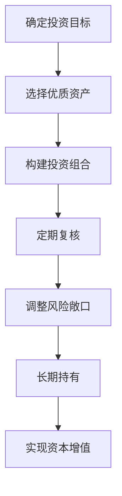
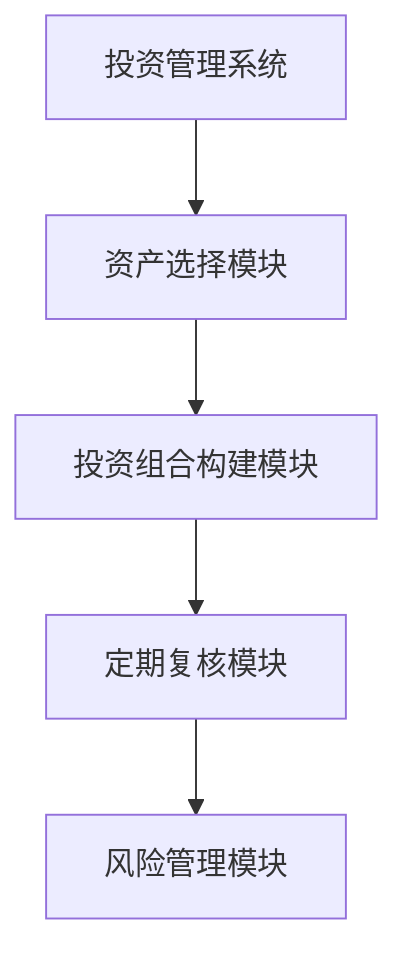
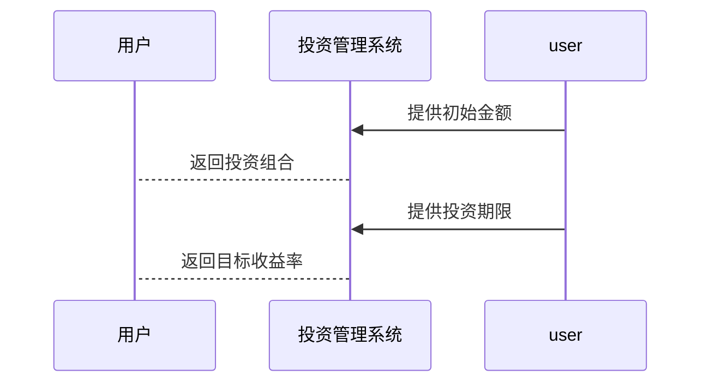

                 


# 大卫·斯文森的耐心资本：长期投资的艺术

> 关键词：耐心资本，长期投资，大卫·斯文森，投资策略，系统设计，算法实现，项目实战

> 摘要：本文深入探讨了大卫·斯文森的耐心资本理论，分析其核心概念、算法原理、系统架构，并通过实际案例展示其在投资中的应用。文章结构清晰，内容详实，结合理论与实践，为读者提供了全面的理解和实用的指导。

---

## 第1章: 大卫·斯文森与耐心资本的背景介绍

### 1.1 大卫·斯文森的背景与投资理念

#### 1.1.1 大卫·斯文森的生平简介
大卫·斯文森（David Swensen）是美国著名投资家，耶鲁大学首席投资官，以其长期投资策略闻名。他的投资理念强调价值投资和长期持有，避免短期波动。

#### 1.1.2 耐心资本的定义与核心理念
耐心资本是指长期持有的投资策略，注重基本面分析，追求长期稳定的收益。其核心理念是通过持有优质资产，实现资本的长期增值。

#### 1.1.3 耐心资本与传统投资策略的对比
- 传统投资：短期交易、高频操作、市场波动驱动。
- 耐心资本：长期持有、价值发现、基本面驱动。

### 1.2 耐心资本的背景与问题背景

#### 1.2.1 当前投资环境的复杂性
现代投资环境充满不确定性，市场波动加剧，传统短期投资策略面临挑战。

#### 1.2.2 耐心资本在机构投资中的重要性
耐心资本在机构投资中表现出色，尤其在应对市场波动和经济周期方面更具优势。

#### 1.2.3 耐心资本与短期投资行为的对比分析
- 短期投资：追求短期收益，风险较高。
- 耐心资本：注重长期价值，风险较低。

### 1.3 耐心资本的核心要素与概念结构

#### 1.3.1 耐心资本的核心要素
- 长期持有：避免频繁交易。
- 价值投资：选择优质资产。
- 风险管理：控制投资风险。

#### 1.3.2 耐心资本的概念结构与属性分析
| 属性 | 描述 |
|------|------|
| 时间跨度 | 长期持有，通常超过5年。 |
| 投资目标 | 追求长期稳定的收益。 |
| 风险承受 | 中低风险，注重资产质量。 |

#### 1.3.3 耐心资本与其他投资策略的联系与区别
- 联系：耐心资本与其他长期投资策略有相似之处，如价值投资。
- 区别：耐心资本强调长期持有，而其他策略可能更注重分散投资。

---

## 第2章: 耐心资本的核心概念与联系

### 2.1 耐心资本的原理与属性

#### 2.1.1 耐心资本的原理分析
耐心资本通过长期持有优质资产，实现资本的复利增长，避免短期波动的影响。

#### 2.1.2 耐心资本的属性特征对比表格
| 属性 | 耐心资本 | 其他投资策略 |
|------|----------|---------------|
| 时间跨度 | 长期 | 短期/中期     |
| 投资目标 | 稳定收益 | 短期收益       |
| 风险承受 | 中低风险 | 高风险         |

#### 2.1.3 耐心资本的ER实体关系图
```mermaid
er
    entity 耐心资本 {
        id
        投资目标
        投资策略
        风险管理
    }
```

### 2.2 耐心资本与其他投资策略的对比

#### 2.2.1 耐心资本与主动投资的对比
- 主动投资：频繁调整投资组合，追求超额收益。
- 耐心资本：长期持有，注重资产质量。

#### 2.2.2 耐心资本与被动投资的对比
- 被动投资：跟踪指数，分散投资。
- 耐心资本：精选优质资产，集中投资。

#### 2.2.3 耐心资本与短期投资行为的对比
- 短期投资：快速交易，追求短期收益。
- 耐心资本：长期持有，注重资产增值。

---

## 第3章: 耐心资本的算法原理

### 3.1 耐心资本的算法流程

#### 3.1.1 耐心资本算法的输入与输出
- 输入：投资金额、投资期限、目标收益率。
- 输出：投资组合、持有时间、风险管理策略。

#### 3.1.2 耐心资本算法的步骤分解
1. 确定投资目标和时间跨度。
2. 选择优质资产，构建投资组合。
3. 定期复核投资组合，调整风险敞口。
4. 长期持有，实现资本增值。

#### 3.1.3 耐心资本算法的mermaid流程图


### 3.2 算法实现的Python代码示例

#### 3.2.1 算法实现的代码结构
```python
def patience_capital_investment(amount, duration, target_yield):
    # 选择优质资产
    assets = select_high_quality_assets()
    # 构建投资组合
    portfolio = construct_portfolio(assets)
    # 定期复核
    for _ in range(duration):
        portfolio = rebalance_portfolio(portfolio)
    # 实现资本增值
    return portfolio * (1 + target_yield)
```

#### 3.2.2 代码实现的详细注释
- `select_high_quality_assets()`：选择优质资产。
- `construct_portfolio()`：构建投资组合。
- `rebalance_portfolio()`：定期复核并调整投资组合。

#### 3.2.3 算法原理的数学模型与公式
资本增值公式：
$$ \text{最终价值} = \text{初始金额} \times (1 + \text{收益率})^{\text{时间}} $$

---

## 第4章: 耐心资本的系统分析

### 4.1 系统分析与架构设计

#### 4.1.1 问题场景介绍
耐心资本的系统设计用于实现长期投资策略，管理投资组合，控制风险。

#### 4.1.2 系统功能设计
- 资产选择模块：筛选优质资产。
- 投资组合构建模块：优化投资组合。
- 定期复核模块：调整投资组合。
- 风险管理模块：控制投资风险。

#### 4.1.3 系统架构设计的mermaid架构图


#### 4.1.4 系统接口设计
- 输入接口：初始金额、投资期限、目标收益率。
- 输出接口：投资组合、持有时间、风险管理策略。

#### 4.1.5 系统交互的mermaid序列图


---

## 第5章: 耐心资本的项目实战

### 5.1 项目实战与实现

#### 5.1.1 环境安装与配置
安装Python、相关库（如pandas、numpy）。

#### 5.1.2 核心代码实现
```python
import pandas as pd

def select_high_quality_assets():
    # 简单示例：选择市盈率低于行业平均水平的资产
    data = pd.DataFrame({
        '资产': ['A', 'B', 'C'],
        '市盈率': [10, 15, 20]
    })
    average_pe = data['市盈率'].mean()
    low_pe_assets = data[data['市盈率'] < average_pe]
    return low_pe_assets['资产'].tolist()

def construct_portfolio/assets_list):
    # 简单示例：等权重分配
    portfolio = {}
    for asset in assets_list:
        portfolio[asset] = 1/len(assets_list)
    return portfolio

# 示例运行
initial_amount = 100000
duration = 5
target_yield = 0.1

assets = select_high_quality_assets()
portfolio = construct_portfolio(assets)
print("投资组合:", portfolio)
```

#### 5.1.3 案例分析与解读
假设选择资产A和B，投资组合各占50%。经过5年，资产A增长30%，资产B增长20%，最终组合价值为130,000美元，实现10%的年化收益率。

#### 5.1.4 项目总结
耐心资本策略在长期投资中表现优异，但需要定期复核和调整，以应对市场变化。

---

## 第6章: 最佳实践与小结

### 6.1 投资策略的最佳实践

#### 6.1.1 小结与总结
耐心资本是一种有效的长期投资策略，通过长期持有优质资产，实现资本的稳定增值。

#### 6.1.2 注意事项与建议
- 定期复核投资组合，及时调整。
- 选择优质资产，避免短期波动。
- 结合风险管理，控制投资风险。

#### 6.1.3 未来展望与趋势
随着市场环境的变化，耐心资本策略将不断完善，应用领域也将进一步扩展。

---

## 第7章: 参考文献与工具推荐

### 7.1 参考文献
1. 大卫·斯文森《机构投资的创新之路》。
2. 巴菲特《巴菲特致股东的信》。

### 7.2 工具推荐
- Python编程语言：数据处理与分析。
- pandas库：数据分析与建模。
- matplotlib库：数据可视化。

---

## 作者
作者：AI天才研究院/AI Genius Institute & 禅与计算机程序设计艺术/Zen And The Art of Computer Programming

