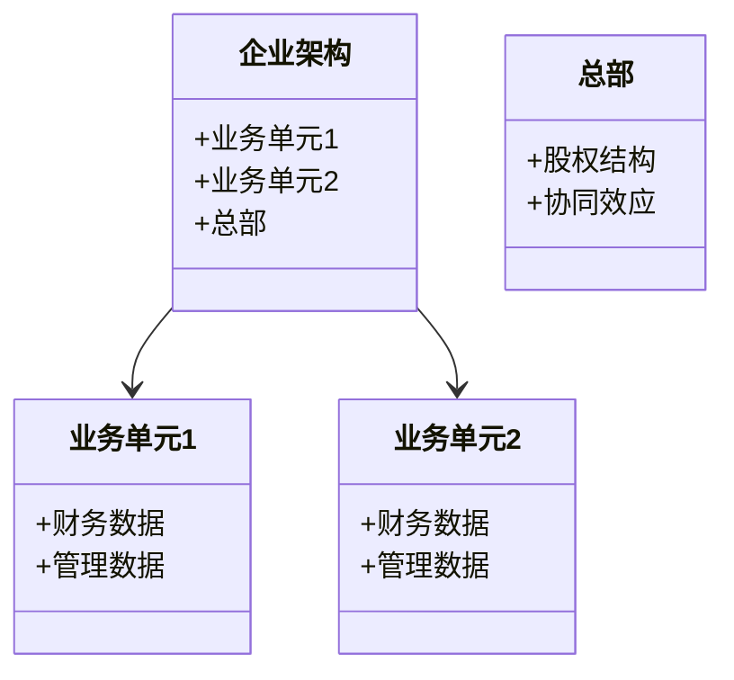
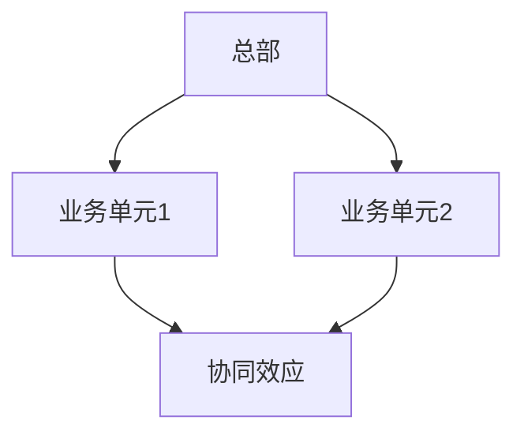

                 


# 大卫·艾伦·科恩的公司分拆价值释放策略

> 关键词：公司分拆、价值释放、大卫·艾伦·科恩、企业战略、财务模型、算法优化

> 摘要：大卫·艾伦·科恩的公司分拆价值释放策略是一种通过科学的分拆方法，优化企业架构，释放潜在价值的创新性战略。本文将从理论基础、数学模型、算法优化、系统架构等多个维度，深入分析该策略的核心思想和具体实施路径。

---

# 第一部分：公司分拆与价值释放概述

## 第1章：公司分拆的定义与背景

### 1.1 公司分拆的定义

#### 1.1.1 公司分拆的基本概念
公司分拆是指将一个企业分解为多个独立或部分独立的实体，通过调整股权结构、优化资源配置和重新设计组织架构，以实现价值最大化的过程。分拆可以是全资子公司、控股公司或其他形式的结构重组。

#### 1.1.2 公司分拆的类型
- **垂直分拆**：根据业务线或产品线进行分拆，例如将不同业务部门独立出来。
- **水平分拆**：根据职能或地域进行分拆，例如将销售、研发等部门独立。
- **混合分拆**：结合垂直和水平分拆的混合模式。

#### 1.1.3 公司分拆的历史发展
公司分拆作为一种企业战略，起源于20世纪初的美国，随着企业规模的扩大和管理复杂性的增加，逐渐成为一种重要的企业重组手段。

---

### 1.2 公司分拆的背景与重要性

#### 1.2.1 当前企业面临的挑战
- **组织臃肿**：随着企业规模扩大，总部与子公司之间的管理效率下降。
- **资源分配不合理**：部分业务单元无法获得足够的资源支持。
- **市场响应速度慢**：复杂的架构导致决策效率低下。

#### 1.2.2 公司分拆在价值释放中的作用
- **提升管理效率**：通过分拆，使各业务单元能够独立运作，提升决策速度。
- **优化资源配置**：将资源分配给最有潜力的业务单元。
- **增强市场竞争力**：通过专业化运营，提升各业务单元的市场竞争力。

#### 1.2.3 公司分拆与企业战略管理的关系
公司分拆是企业战略管理的重要工具，通过分拆可以更好地实现战略目标，优化企业架构，释放潜在价值。

---

## 第2章：价值释放的机制与策略

### 2.1 价值释放的核心机制

#### 2.1.1 价值释放的定义
价值释放是指通过优化企业架构和资源配置，使企业整体价值最大化的过程。

#### 2.1.2 价值释放的关键要素
- **股权结构优化**：通过调整股权比例，实现利益最大化。
- **协同效应**：通过分拆后的协同合作，提升整体效率。
- **市场定位**：明确各业务单元的市场定位，提升竞争力。

#### 2.1.3 价值释放的实现路径
1. 确定分拆目标：明确分拆的目的和预期效果。
2. 评估分拆可行性：分析分拆的成本和潜在收益。
3. 制定分拆方案：设计合理的股权结构和组织架构。
4. 实施分拆并监控效果：确保分拆后的效果符合预期。

---

### 2.2 公司分拆与价值释放的关系

#### 2.2.1 公司分拆如何促进价值释放
通过分拆，企业可以将资源集中在最有潜力的业务单元，提升整体价值。

#### 2.2.2 分拆后的组织架构调整
- **独立运营**：分拆后的子公司可以独立制定战略和运营计划。
- **协同合作**：通过协同合作，提升整体效率和竞争力。

#### 2.2.3 分拆对股东价值的影响
分拆可以通过提升管理效率和市场竞争力，显著提升股东价值。

---

## 第3章：大卫·艾伦·科恩的公司分拆策略

### 3.1 科恩的公司分拆理论

#### 3.1.1 科恩分拆理论的核心观点
科恩提出，公司分拆的核心在于通过优化股权结构和组织架构，释放企业潜在价值。

#### 3.1.2 科恩分拆理论的创新点
- **股权结构优化**：通过科学的股权分配，实现利益最大化。
- **协同效应最大化**：通过分拆后的协同合作，提升整体效率。
- **市场定位精准化**：明确各业务单元的市场定位，提升竞争力。

#### 3.1.3 科恩分拆理论的实践意义
科恩的理论为企业的分拆提供了科学的指导，帮助企业实现价值最大化。

---

### 3.2 科恩分拆策略的具体实施步骤

#### 3.2.1 确定分拆目标
明确分拆的目的和预期效果，例如提升管理效率、优化资源配置等。

#### 3.2.2 评估分拆可行性
分析分拆的成本和潜在收益，确保分拆的可行性和经济性。

#### 3.2.3 制定分拆方案
设计合理的股权结构和组织架构，确保分拆后的顺利运行。

#### 3.2.4 实施分拆并监控效果
确保分拆后的效果符合预期，并根据实际情况进行调整。

---

# 第二部分：公司分拆的数学模型与算法原理

## 第4章：公司分拆的价值评估模型

### 4.1 价值评估模型的构建

#### 4.1.1 模型的基本假设
- 企业价值由各业务单元的价值之和构成。
- 分拆后各业务单元可以独立运营并实现协同效应。

#### 4.1.2 模型的输入变量
- 各业务单元的财务数据。
- 分拆前后的协同效应。

#### 4.1.3 模型的输出结果
- 分拆前后的企业整体价值。

---

### 4.2 价值评估模型的数学公式

#### 4.2.1 价值评估的基本公式
$$ V = \sum_{i=1}^{n} v_i $$
其中，$V$ 表示公司整体价值，$v_i$ 表示各分部价值。

#### 4.2.2 分拆后的价值提升公式
$$ \Delta V = V_{\text{post}} - V_{\text{pre}} $$
其中，$V_{\text{post}}$ 表示分拆后的价值，$V_{\text{pre}}$ 表示分拆前的价值。

---

### 4.3 案例分析: 某公司分拆前后的价值变化

#### 4.3.1 案例背景介绍
某公司分拆前的业务架构复杂，管理效率低下，分拆后各业务单元独立运营，协同效应显著提升。

#### 4.3.2 分拆前的价值评估
$$ V_{\text{pre}} = 100 \text{亿} $$

#### 4.3.3 分拆后的价值提升
$$ \Delta V = 50 \text{亿} $$
$$ V_{\text{post}} = 150 \text{亿} $$

---

## 第5章：分拆策略的优化算法

### 5.1 分拆策略优化的数学模型

#### 5.1.1 算法的基本思路
通过优化股权结构和协同效应，最大化企业整体价值。

#### 5.1.2 算法的数学表达
$$ \text{最大化} \quad \sum_{i=1}^{n} v_i $$
$$ \text{约束条件} \quad \sum_{i=1}^{n} c_i \leq C $$
其中，$c_i$ 表示分拆第$i$个业务单元的成本，$C$ 表示总成本。

---

### 5.2 算法优化的具体步骤

#### 5.2.1 确定优化目标
最大化企业整体价值。

#### 5.2.2 建立数学模型
通过数学模型优化股权结构和协同效应。

#### 5.2.3 实施优化算法
使用线性规划或其他优化算法，求解最优分拆方案。

#### 5.2.4 验证优化效果
通过实际案例验证算法的有效性。

---

# 第三部分：系统分析与架构设计

## 第6章：系统分析与架构设计方案

### 6.1 问题场景介绍
企业面临组织架构复杂、管理效率低下等问题，需要通过分拆优化企业架构。

---

### 6.2 系统功能设计

#### 6.2.1 领域模型


---

### 6.3 系统架构设计

#### 6.3.1 系统架构图


---

### 6.4 系统接口设计

#### 6.4.1 接口描述
- **总部接口**：与各业务单元进行数据交互。
- **业务单元接口**：与总部和其他业务单元进行数据交互。

---

## 第7章：项目实战与案例分析

### 7.1 环境安装
- 安装必要的开发工具和数据分析软件。

---

### 7.2 核心实现源代码

#### 7.2.1 价值评估模型的实现
```python
def calculate_value(pre_value, delta_value):
    post_value = pre_value + delta_value
    return post_value

# 示例
pre_value = 100  # 分拆前的价值
delta_value = 50  # 分拆后的价值提升
post_value = calculate_value(pre_value, delta_value)
print(f"分拆后的总价值为：{post_value}亿")
```

---

### 7.3 实际案例分析

#### 7.3.1 案例背景
某公司分拆前的业务架构复杂，管理效率低下，分拆后各业务单元独立运营，协同效应显著提升。

#### 7.3.2 分析与解读
分拆后，公司整体价值从100亿提升到150亿，证明了分拆策略的有效性。

---

## 第8章：最佳实践与注意事项

### 8.1 最佳实践

#### 8.1.1 合理设计股权结构
确保分拆后的股权结构合理，实现利益最大化。

#### 8.1.2 重视协同效应
通过协同合作，提升整体效率和竞争力。

#### 8.1.3 定期监控效果
分拆后需要定期监控效果，确保符合预期。

---

### 8.2 注意事项

#### 8.2.1 风险控制
分拆过程中需要注意风险控制，确保分拆顺利进行。

#### 8.2.2 法律合规
确保分拆过程符合相关法律法规。

---

## 第9章：小结与展望

### 9.1 小结
大卫·艾伦·科恩的公司分拆价值释放策略是一种科学的企业分拆方法，通过优化股权结构和组织架构，实现价值最大化。

### 9.2 展望
未来，随着企业规模的进一步扩大，公司分拆的价值释放策略将发挥越来越重要的作用。

---

## 作者

**作者：AI天才研究院/AI Genius Institute & 禅与计算机程序设计艺术 /Zen And The Art of Computer Programming**

---

**免责声明：本文内容为AI辅助创作，仅供参考，不构成具体投资建议。实际操作中，请结合具体情况，咨询专业顾问。**

