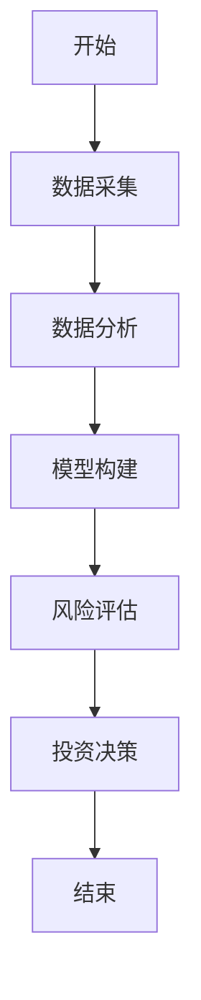

                 


# 大卫·艾伦·科恩的私募股权投资策略

## 关键词：
- 私募股权投资策略
- 大卫·艾伦·科恩
- 投资组合管理
- 风险管理
- 数学模型

## 摘要：
本文深入探讨了大卫·艾伦·科恩的私募股权投资策略，分析其核心概念、数学模型和系统架构，结合实际案例，总结最佳实践。

---

## 第一部分：私募股权投资策略的背景与核心概念

### 第1章：私募股权投资策略概述

#### 1.1 私募股权投资策略的定义与特点
私募股权投资策略是一种通过投资未上市企业股权，以实现资本增值的投资方式。其核心特点包括高风险、高收益、长期性和专业性。

- **1.1.1 私募股权投资的定义**：私募股权投资是指通过购买非公开公司的股权，参与其成长并期望在未来通过退出（如IPO或并购）实现收益。
- **1.1.2 私募股权投资的核心特点**：高风险、高收益、长期性和专业性。
- **1.1.3 私募股权投资与其他投资方式的区别**：不同于公开市场投资，私募股权投资更注重对企业的深度参与和长期价值创造。

#### 1.2 大卫·艾伦·科恩的投资理念
大卫·艾伦·科恩是一位著名的私募股权投资者，他的投资理念以稳健和价值为导向。

- **1.2.1 投资哲学与策略**：科恩注重企业的基本面分析，寻找具有持续竞争优势和管理团队的企业。
- **1.2.2 科恩的投资风格与成功案例**：科恩倾向于投资具有强大现金流和良好管理的企业，例如他的成功案例包括对某知名企业的投资。
- **1.2.3 科恩策略的边界与外延**：科恩的策略不仅限于私募股权，还延伸到并购和杠杆收购等领域。

#### 1.3 私募股权投资策略的核心要素
私募股权投资策略的核心要素包括投资目标、策略选择和风险管理。

- **1.3.1 投资目标与策略选择**：明确的投资目标和策略选择是私募股权投资成功的关键。
- **1.3.2 投资组合管理与风险控制**：通过投资组合管理和风险控制，降低投资风险。
- **1.3.3 科恩策略的数学模型与公式**：科恩策略中常用的数学模型，例如资本资产定价模型（CAPM）。

---

## 第二部分：私募股权投资策略的核心概念与联系

### 第2章：核心概念与联系分析

#### 2.1 私募股权投资策略的核心原理
私募股权投资策略的核心原理包括投资决策的数学模型、风险评估与收益预测。

- **2.1.1 投资决策的数学模型**：通过数学模型评估企业的内在价值。
- **2.1.2 私募股权的风险评估与预测**：通过数据分析和模型预测风险。
- **2.1.3 科恩策略的数学公式与应用**：科恩策略中常用的数学公式，例如CAPM。

#### 2.2 核心概念对比表格
下表对比了私募股权投资与其他投资方式的核心概念：

| 投资方式 | 核心概念 | 投资目标 | 风险特征 | 收益特征 |
|----------|----------|----------|----------|----------|
| 公开市场投资 | 股票、债券等 | 短期收益 | 中低风险 | 中低收益 |
| 私募股权投资 | 未上市企业股权 | 长期增值 | 高风险 | 高收益 |

#### 2.3 私募股权投资策略的ER实体关系图
使用Mermaid绘制的私募股权策略中的实体关系图如下：

```mermaid
erDiagram
    investor --> invests_in : "投资于"
    invests_in --> company : "企业"
    company --> has_assets : "资产"
    company --> has_liabilities : "负债"
    company --> has_shares : "股权"
```

---

## 第三部分：私募股权投资策略的算法原理

### 第3章：算法原理与数学模型

#### 3.1 私募股权投资策略的数学模型
私募股权投资策略的数学模型是其核心工具之一。

- **3.1.1 资本资产定价模型（CAPM）**：CAPM用于评估资产的预期收益，公式为：
  $$E(r_i) = r_f + β_i (E(r_m) - r_f)$$
- **3.1.2 私募股权价值评估公式**：通过DCF模型评估企业价值：
  $$\text{企业价值} = \text{净利润} \times \text{EV/EBITDA倍数}$$
- **3.1.3 风险调整后的收益模型**：考虑风险调整后的收益公式：
  $$\text{调整后收益} = \text{预期收益} - \text{风险溢价}$$

#### 3.2 私募股权投资策略的算法流程图
使用Mermaid绘制的私募股权策略算法流程图如下：



#### 3.3 算法实现的Python代码
以下是一个简单的私募股权价值评估的Python代码示例：

```python
def calculateenterprise_value(enterprise_value, net_profit, ev_ebitda):
    return enterprise_value == net_profit * ev_ebitda
```

---

## 第四部分：系统分析与架构设计方案

### 第4章：私募股权系统的功能与架构设计

#### 4.1 系统功能模块
私募股权系统的功能模块包括数据采集与处理、风险评估与预测、投资组合优化等。

- **4.1.1 数据采集与处理模块**：负责采集和处理企业数据。
- **4.1.2 风险评估与预测模块**：通过模型评估投资风险。
- **4.1.3 投资组合优化模块**：优化投资组合以实现收益最大化。

#### 4.2 系统架构设计
使用Mermaid绘制的系统架构图如下：


---

## 第五部分：项目实战

### 第5章：项目实战与案例分析

#### 5.1 项目环境与安装
需要安装Python和相关库，例如Pandas和NumPy。

#### 5.2 核心代码实现
以下是一个简单的Python代码示例：

```python
import pandas as pd
import numpy as np

def calculateenterprise_value(enterprise_value, net_profit, ev_ebitda):
    return enterprise_value == net_profit * ev_ebitda

# 示例数据
data = {
    '企业名称': ['企业A', '企业B'],
    '净利润': [100, 150],
    'EV/EBITDA': [5, 6]
}
df = pd.DataFrame(data)
```

#### 5.3 代码解读与分析
代码实现企业价值的计算，其中净利润和EV/EBITDA是关键因素。

#### 5.4 案例分析与详细讲解
通过具体案例分析，展示如何应用科恩策略进行投资决策。

#### 5.5 项目小结
总结项目实施的关键点和经验教训。

---

## 第六部分：最佳实践、小结、注意事项和拓展阅读

### 6.1 最佳实践
- **数据质量**：确保数据的准确性和完整性。
- **风险管理**：注重风险控制和多样化投资。
- **持续学习**：关注市场变化和新策略。

### 6.2 小结
本文深入探讨了大卫·艾伦·科恩的私募股权投资策略，从理论到实践，全面分析了其核心概念和实际应用。

### 6.3 注意事项
- 风险控制是私募股权投资的核心。
- 数据分析是投资决策的关键。

### 6.4 拓展阅读
推荐阅读相关书籍和文献，以进一步深入理解私募股权投资策略。

---

## 作者：AI天才研究院/AI Genius Institute & 禅与计算机程序设计艺术 /Zen And The Art of Computer Programming

