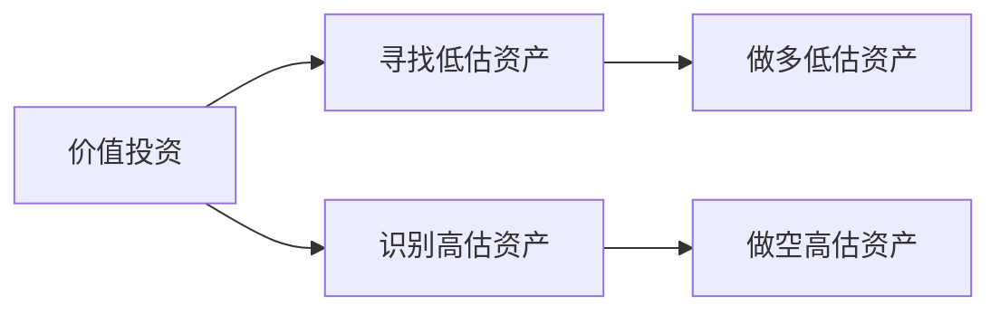
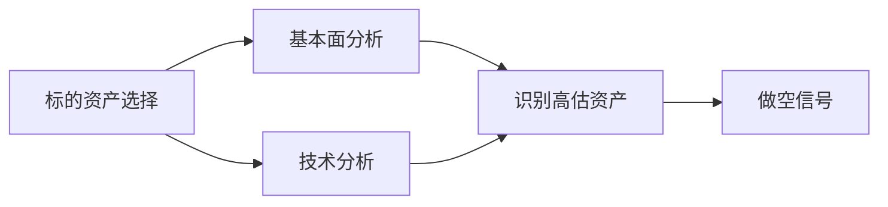
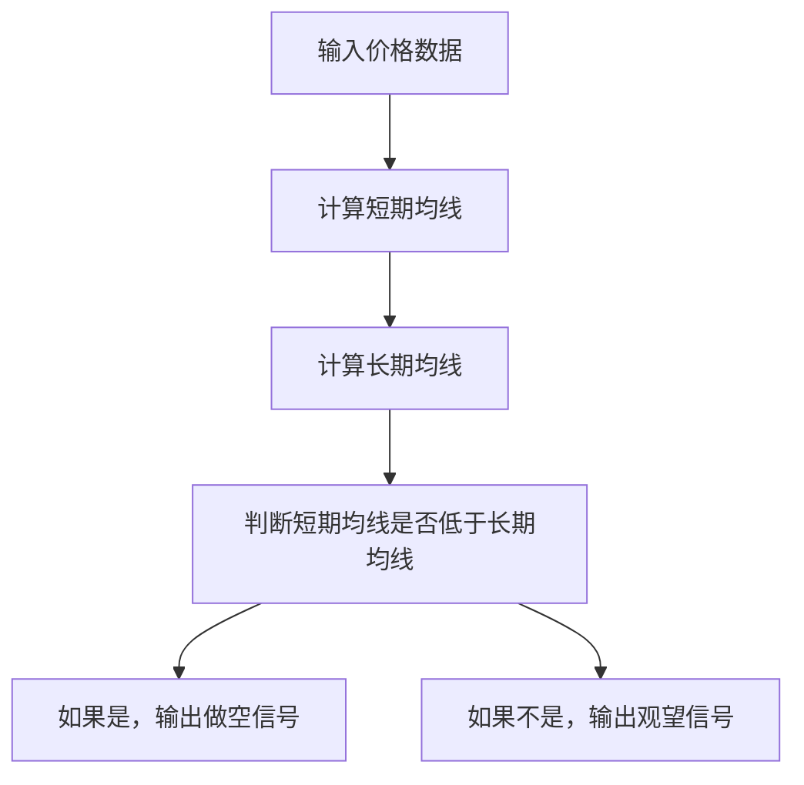

                 


# 大卫·艾因霍恩的做空策略：价值投资的另一面

> 关键词：大卫·艾因霍恩，做空策略，价值投资，风险管理，心理因素，资金管理

> 摘要：本文深入探讨了大卫·艾因霍恩的做空策略，分析了其在价值投资中的独特地位。通过系统的理论分析和实际案例，本文揭示了做空策略的核心概念、数学模型、系统架构以及在实际投资中的应用。文章还结合了大卫·艾因霍恩的经典投资理念，为读者提供了从理论到实践的全面解读。

---

## 第一部分：做空策略的背景与基础

### 第1章：做空策略的定义与历史

#### 1.1 做空的定义与基本原理

做空是一种金融交易策略，是指投资者借入标的资产（如股票、债券或商品）卖出，期望在价格下跌后以更低的价格买回，从而赚取差价。做空的核心逻辑在于通过价格下跌获利，而非依赖价格上涨。

图1.1 做空交易流程图  


做空与做多的对比分析如下表所示：

| 对比维度 | 做空 | 做多 |
|----------|------|------|
| 盈利逻辑 | 价格下跌 | 价格上涨 |
| 风险特征 | 无限亏损可能 | 有限亏损可能 |
| 资金需求 | 高（需借入资产） | 较低 |
| 适用场景 | 市场下跌预期 | 市场上扬预期 |

---

#### 1.2 大卫·艾因霍恩与价值投资

大卫·艾因霍恩是全球著名的价值投资者，以逆向思维和深度基本面分析闻名。他在做空策略上的独特之处在于，通过识别市场的非理性繁荣，寻找那些被市场过度估值的资产，进而通过做空获利。

图1.2 价值投资与做空的结合框架  


---

## 第2章：做空策略的核心概念与框架

### 2.1 做空策略的核心概念

做空策略的核心在于识别市场的拐点和结构性机会。以下是做空策略的三大核心要素：

1. **标的资产的选择**：选择那些基本面恶化、市场预期过度乐观的资产。
2. **价格波动分析**：通过技术分析和市场情绪分析，预测价格的短期波动。
3. **风险管理**：设定止损点和仓位规模，避免因市场波动导致的过度亏损。

图2.1 做空策略的核心要素构成  


### 2.2 做空策略的数学模型与算法原理

#### 2.2.1 做空策略的数学模型

做空策略的收益计算公式为：
$$ \text{收益} = \text{卖出价} - \text{买回价} $$

风险评估模型可以通过波动率和相关性分析来衡量：
$$ \text{风险} = \sigma \times \text{仓位规模} $$

#### 2.2.2 做空策略的算法实现

以下是一个简单的做空策略算法流程图：

图2.2 做空策略算法流程图  


---

## 第3章：做空策略的系统分析与架构设计

### 3.1 系统分析

#### 3.1.1 问题场景介绍

在金融市场中，做空策略需要结合基本面和技术面分析，同时考虑市场情绪和宏观经济因素。系统需要实时处理大量数据，并根据预设模型生成交易信号。

#### 3.1.2 系统功能设计

- 数据采集模块：收集标的资产的历史价格、市场情绪等数据。
- 数据分析模块：执行基本面和技术面分析。
- 交易信号生成模块：根据分析结果生成做空信号。
- 风险管理模块：实时监控仓位风险并调整策略。

图3.1 系统功能模块图  


---

## 第4章：做空策略的项目实战

### 4.1 环境安装与配置

#### 4.1.1 开发环境的选择

推荐使用Python作为开发语言，搭配以下工具：

- 数据分析：Pandas、NumPy
- 图表绘制：Matplotlib、Plotly
- 交易信号生成：TA-Lib（技术分析库）

#### 4.1.2 数据源的获取与处理

数据获取可以通过Yahoo Finance API实现。以下是Python代码示例：

```python
import pandas as pd
import numpy as np
import yfinance as yf

# 获取标的资产数据
data = yf.download(tickers='AAPL', start='2020-01-01', end='2023-12-31')
```

---

### 4.2 核心算法实现

#### 4.2.1 做空策略的核心代码

以下是一个简单的做空策略实现：

```python
import pandas as pd
import numpy as np

# 计算短期均线和长期均线
short_window = 20
long_window = 100

data['SMA_short'] = data['Close'].rolling(short_window).mean()
data['SMA_long'] = data['Close'].rolling(long_window).mean()

# 生成做空信号
data['Short_signal'] = data['SMA_short'] < data['SMA_long']
```

---

## 第5章：做空策略的最佳实践与小结

### 5.1 最佳实践

#### 5.1.1 做空策略的风险管理

- 设定止损点：当价格反弹超过一定幅度时，立即平仓。
- 分批建仓：避免一次性投入过多资金，降低风险。

#### 5.1.2 做空策略的心理因素

- 纪律性：严格执行交易信号，避免情绪化交易。
- 耐心：做空策略需要时间验证，不能急于求成。

#### 5.1.3 做空策略的资金管理

- 风险资产配置：将总资金分配到不同标的资产，分散风险。
- 动态调整：根据市场变化和模型表现，及时调整仓位。

---

## 小结与展望

大卫·艾因霍恩的做空策略为价值投资者提供了新的视角。通过系统的分析和实际案例，我们看到做空策略不仅是一种交易工具，更是一种识别市场风险的手段。未来，随着人工智能和大数据技术的发展，做空策略将更加精准和高效。

---

作者：AI天才研究院/AI Genius Institute & 禅与计算机程序设计艺术 /Zen And The Art of Computer Programming

