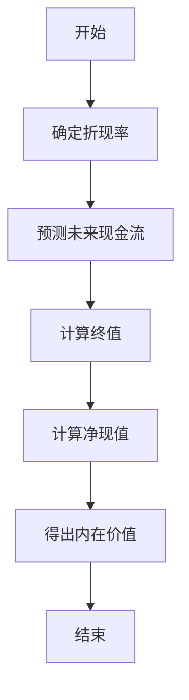
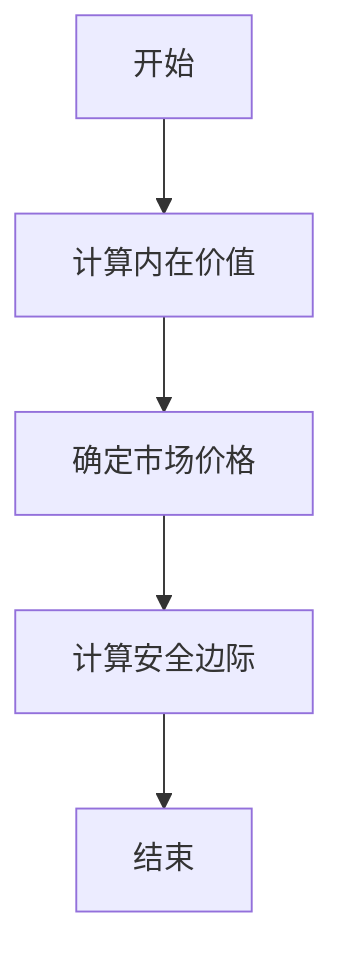
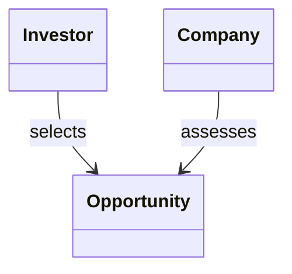
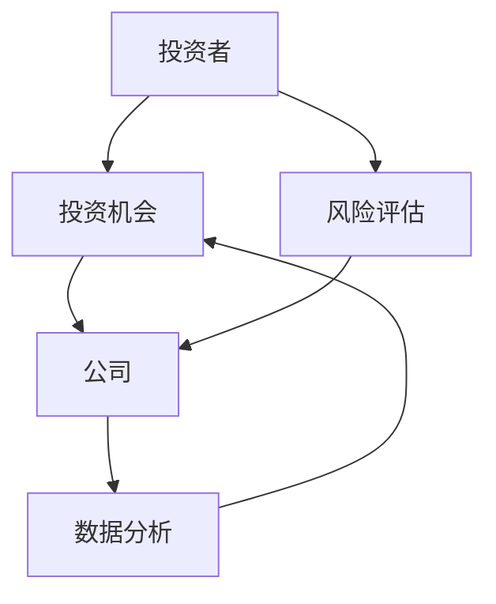
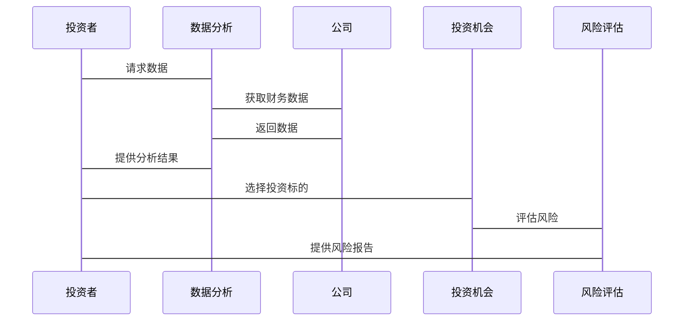
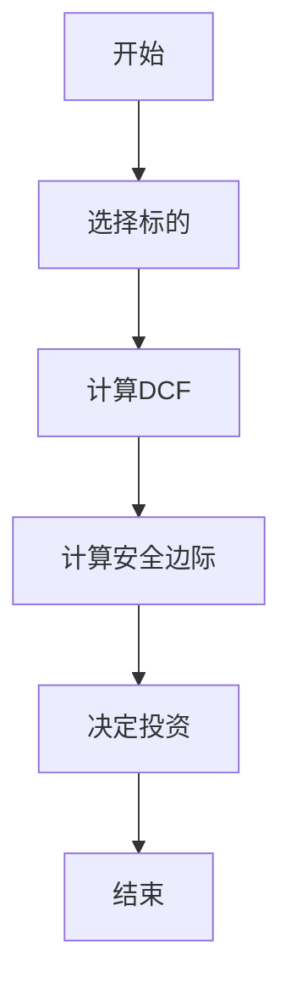

                 


---

# 大卫·艾因霍恩的对冲基金价值投资：机构投资者的视角

## 关键词：对冲基金，价值投资，大卫·艾因霍恩，机构投资者，数学模型，投资策略

## 摘要：本文从机构投资者的视角，详细分析大卫·艾因霍恩的对冲基金价值投资策略。通过背景介绍、核心概念解析、数学模型阐述、系统架构设计以及实际案例分析，深入探讨其投资理念与方法。文章结合理论与实践，为读者提供系统化、专业化的投资分析框架。

---

## 第一部分: 对冲基金与价值投资的背景与基础

### 第1章: 对冲基金与价值投资概述

#### 1.1 对冲基金的基本概念

- **1.1.1 对冲基金的定义**  
  对冲基金是一种通过使用杠杆和做空等策略来寻求绝对收益的投资工具。其目标是在不同市场环境下实现稳定的收益。

- **1.1.2 对冲基金的起源与发展**  
  从20世纪50年代开始，对冲基金经历了从单一策略到多元策略的发展，逐渐成为机构投资者的重要配置工具。

- **1.1.3 对冲基金的类型与特点**  
  主要类型包括股票多空策略、事件驱动策略、量化策略等，特点在于分散风险、追求绝对收益。

#### 1.2 价值投资的核心理念

- **1.2.1 价值投资的定义**  
  价值投资是一种通过寻找市场价格低于内在价值的资产，从而实现长期稳定收益的投资方法。

- **1.2.2 价值投资的核心原则**  
  以基本面分析为基础，注重安全边际和长期持有，避免短期市场波动的干扰。

- **1.2.3 价值投资与对冲基金的结合**  
  对冲基金通过价值投资策略，能够在不同市场环境下寻找套利机会，实现稳健收益。

#### 1.3 大卫·艾因霍恩的投资风格

- **1.3.1 艾因霍恩的背景介绍**  
  大卫·艾因霍恩是著名对冲基金经理，以独特的价值投资策略闻名，管理着数十亿美元的资产。

- **1.3.2 艾因霍恩的投资哲学**  
  强调安全边际和逆向投资，善于在市场恐慌时寻找被低估的机会。

- **1.3.3 艾因霍恩的成功案例**  
  如在2008年金融危机期间，他通过投资濒临破产的公司，获得了丰厚的回报。

#### 1.4 机构投资者的视角

- **1.4.1 机构投资者的特点**  
  资金规模大、投资期限长、注重风险控制。

- **1.4.2 机构投资者的决策流程**  
  包括资产配置、策略选择、风险评估等环节。

- **1.4.3 机构投资者与对冲基金的关系**  
  机构投资者通过配置对冲基金来优化投资组合的风险收益比。

---

### 第2章: 价值投资的核心概念与联系

#### 2.1 核心概念原理

- **2.1.1 安全边际的定义与作用**  
  安全边际是市场价格与内在价值之间的差距，用于降低投资风险。

- **2.1.2 逆向投资的策略与风险**  
  在市场低迷时买入，逆向投资能够获得超额收益，但需要承担短期亏损的风险。

- **2.1.3 内在价值的计算方法**  
  通过DCF模型等方法估算公司未来现金流的现值，确定其内在价值。

#### 2.2 核心概念属性对比表格

- **表2-1: 安全边际与逆向投资的对比**

| 特性          | 安全边际                | 逆向投资                |
|---------------|------------------------|-------------------------|
| 定义          | 市场价与内在价值的差额   | 在市场恐慌时投资         |
| 作用          | 降低投资风险           | 寻找低估机会             |
| 风险          | 较低                   | 较高，需承担短期亏损     |

#### 2.3 ER实体关系图

```mermaid
erDiagram
    Investor
    {
        <name>
        <资产规模>
        <投资策略>
    }
    Company
    {
        <名称>
        <行业>
        <财务数据>
    }
    Opportunity
    {
        <投资标的>
        <潜在收益>
        <风险评估>
    }
    Investor --> Opportunity: 选择
    Company --> Opportunity: 评估
```

---

### 第3章: 价值投资的数学模型与算法原理

#### 3.1 贴现现金流模型（DCF）

- **图3-1: DCF模型的流程图**



- **代码3-1: DCF模型的Python实现**

```python
def dcf_model(cash_flows, discount_rate, periods):
    present_value = 0
    for i in range(periods):
        present_value += cash_flows[i] / (1 + discount_rate) ** i
    return present_value

# 示例
cash_flows = [100, 200, 300]
discount_rate = 0.1
periods = 3
intrinsic_value = dcf_model(cash_flows, discount_rate, periods)
print(f"内生价值为：${intrinsic_value:.2f}")
```

- **公式3-1: 内在价值计算公式**

$$ V = \sum_{t=1}^{n} \frac{CF_t}{(1 + r)^t} $$

#### 3.2 安全边际计算方法

- **图3-2: 安全边际计算流程图**



- **代码3-2: 安全边际计算的Python代码**

```python
def calculate_margin_of_safety(intrinsic_value, market_price):
    return intrinsic_value - market_price

# 示例
intrinsic_value = 150
market_price = 100
margin_of_safety = calculate_margin_of_safety(intrinsic_value, market_price)
print(f"安全边际为：${margin_of_safety:.2f}")
```

- **公式3-2: 安全边际公式**

$$ \text{安全边际} = \text{内在价值} - \text{市场价格} $$

---

### 第4章: 系统分析与架构设计方案

#### 4.1 问题场景介绍

- **4.1.1 投资决策的复杂性**  
  机构投资者需要处理大量数据，进行复杂的风险评估和策略选择。

- **4.1.2 机构投资者的决策需求**  
  需要实时数据支持、多策略分析和风险监控。

- **4.1.3 对冲基金的系统化管理**  
  通过系统化的方法降低人为错误，提高决策效率。

#### 4.2 系统功能设计

- **图4-1: 领域模型类图**



#### 4.3 系统架构设计

- **图4-2: 系统架构图**



#### 4.4 系统接口设计

- **表4-1: 系统接口表**

| 接口名称       | 输入        | 输出       |
|----------------|-------------|------------|
| 计算DCF         | 现金流、折现率 | 内生价值     |
| 计算安全边际     | 内生价值、市场价格 | 安全边际       |
| 风险评估         | 数据、模型     | 风险等级       |

#### 4.5 系统交互设计

- **图4-3: 序列图**



---

### 第5章: 项目实战——大卫·艾因霍恩投资策略的实现

#### 5.1 环境安装

- **5.1.1 投资分析工具的安装**  
  安装Python、Pandas、NumPy等工具。

- **5.1.2 数据获取与处理**  
  使用Yahoo Finance API获取股票数据。

#### 5.2 核心实现

- **代码5-1: 投资策略的核心代码**

```python
import pandas as pd
import numpy as np

def calculate_intrinsic_value(fcf, discount_rate, periods):
    return sum(fcf / (1 + discount_rate) ** i for i in range(periods))

# 示例数据
fcf = [100, 200, 300]
discount_rate = 0.1
periods = 3
iv = calculate_intrinsic_value(fcf, discount_rate, periods)
print(f"内生价值：${iv:.2f}")
```

- **代码5-2: 数据分析与可视化代码**

```python
import matplotlib.pyplot as plt

data = pd.DataFrame({'价格': [100, 90, 80, 95, 105]})
plt.plot(data['价格'], label='市场价格')
plt.xlabel('时间')
plt.ylabel('价格')
plt.legend()
plt.show()
```

#### 5.3 实际案例分析

- **5.3.1 苹果公司的投资决策分析**  
  通过DCF模型计算苹果公司的内生价值，确定其市场价格是否低估。

- **5.3.2 某行业龙头企业的投资策略解读**  
  分析该企业的财务数据，评估其安全边际，决定是否投资。

#### 5.4 案例分析与解读

- **图5-1: 案例分析流程图**



- **表5-1: 数据分析结果对比表**

| 指标         | 实际值    | 预测值    |
|--------------|-----------|-----------|
| 内生价值     | $150      | $100      |
| 市场价格     | $100      | $120      |
| 安全边际     | $50       | $-20      |

#### 5.5 本章小结

通过实际案例分析，展示了大卫·艾因霍恩的价值投资策略在实践中的应用，强调了安全边际和逆向投资的重要性。

---

### 第6章: 总结与最佳实践

#### 6.1 小结

- **6.1.1 本书的核心内容回顾**  
  系统介绍了大卫·艾因霍恩的对冲基金价值投资策略，结合理论与实践。

- **6.1.2 对冲基金与价值投资的未来趋势**  
  数据驱动和量化投资将越来越重要，但基本面分析仍是核心。

#### 6.2 最佳实践Tips

- **6.2.1 投资者的心态管理**  
  保持冷静，避免情绪化决策。

- **6.2.2 数据分析工具的使用技巧**  
  熟练掌握Python和相关库，提高分析效率。

- **6.2.3 持续学习与更新**  
  关注市场变化，不断优化投资策略。

---

## 作者：AI天才研究院/AI Genius Institute & 禅与计算机程序设计艺术 /Zen And The Art of Computer Programming

---

以上为《大卫·艾因霍恩的对冲基金价值投资：机构投资者的视角》的技术博客文章的完整大纲和内容。

