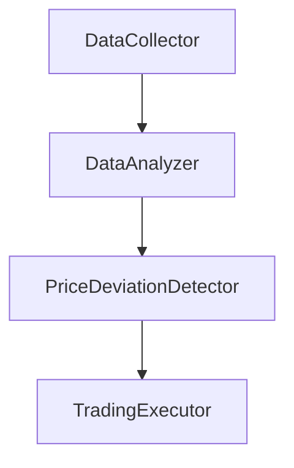

                 


# 大卫·艾因霍恩的短期价值投资：市场错误定价的套利

> 关键词：大卫·艾因霍恩，短期价值投资，市场错误定价，套利机会，投资策略，系统架构设计

> 摘要：本文详细探讨了大卫·艾因霍恩的短期价值投资理念，分析了市场错误定价的成因及其套利机会，提出了套利机会识别系统的数学模型与算法，并通过实际案例展示了系统设计与实现过程，最后给出了最佳实践建议。

---

# 第一部分：大卫·艾因霍恩的短期价值投资概述

## 第1章：短期价值投资的背景与概念

### 1.1 投资学概述

#### 1.1.1 投资学的基本概念

投资学是研究如何通过合理配置资金以实现财富增值的学科。其核心在于理解市场行为、资产定价和投资策略。投资学的研究对象包括股票、债券、基金等多种金融资产，研究方法涉及定量分析和定性分析。

#### 1.1.2 价值投资的定义与特点

价值投资是一种以低于资产内在价值的价格买入资产的投资策略。其核心在于寻找市场中被低估的资产，通过长期持有实现收益。价值投资的特点包括注重基本面分析、强调安全边际、长期持有等。

#### 1.1.3 短期价值投资的兴起

短期价值投资是价值投资的一种变体，强调在较短的时间内发现市场错误定价的机会并进行交易。随着市场的波动加剧和信息透明度提高，短期价值投资逐渐受到关注。

### 1.2 大卫·艾因霍恩与短期价值投资

#### 1.2.1 大卫·艾因霍恩的生平简介

大卫·艾因霍恩（David Einhorn）是一位著名的对冲基金经理，以成功预测并投资于2008年金融危机而闻名。他的投资策略以基本面分析和套利机会为核心，强调在市场错误定价时进行投资。

#### 1.2.2 艾因霍恩的投资理念

艾因霍恩的投资理念基于市场错误定价的存在。他认为，市场并非总是有效，投资者可以通过分析发现价格与价值的偏差，并从中获利。他的策略结合了基本面分析和量化分析，注重风险控制和收益最大化。

#### 1.2.3 艾因霍恩的成功案例分析

艾因霍恩的成功案例包括投资于 Lehman Brothers 的债券违约保险和投资于辉瑞制药的认股权证。这些案例展示了他在市场错误定价时的敏锐洞察力和策略实施能力。

---

## 第2章：市场错误定价的套利机会

### 2.1 错误定价的定义与类型

#### 2.1.1 市场错误定价的成因

市场错误定价的成因包括信息不对称、市场参与者情绪波动、市场结构缺陷等。这些因素可能导致资产价格偏离其内在价值。

#### 2.1.2 错误定价的类型：低估与高估

错误定价主要分为低估和高估两种类型。低估意味着市场价格低于内在价值，高估则反之。投资者需要识别这两种情况以寻找套利机会。

#### 2.1.3 错误定价的识别方法

错误定价的识别方法包括基本面分析、相对估值法、市场情绪分析等。通过综合运用这些方法，投资者可以发现市场中的错误定价资产。

### 2.2 套利机会的识别与分类

#### 2.2.1 套利的基本概念

套利是指在不同市场或资产之间利用价格差异进行无风险或低风险投资以获利的行为。套利的核心在于发现并利用价格差异。

#### 2.2.2 错误定价套利的机会类型

错误定价套利的机会类型包括单资产套利、跨市场套利、跨期套利等。每种类型都有其特定的实施条件和策略。

#### 2.2.3 套利风险的分析

套利风险包括市场风险、流动性风险、信用风险等。投资者需要全面评估套利机会的潜在风险，以制定有效的风险管理策略。

---

## 第3章：短期价值投资的核心策略

### 3.1 短期价值投资的策略框架

#### 3.1.1 短期价值投资的三要素：价格、价值、时间

短期价值投资的核心要素包括市场价格、资产内在价值和投资时间。投资者需要在短时间内发现价格与价值的偏差，并通过交易获利。

#### 3.1.2 艾因霍恩的投资策略模型

艾因霍恩的投资策略模型包括基本面分析、量化分析和风险管理。他通过综合分析发现套利机会，并通过严格的风险管理控制投资风险。

#### 3.1.3 短期价值投资的实施步骤

短期价值投资的实施步骤包括识别错误定价、评估套利机会、制定交易策略、执行交易并监控风险。每个步骤都需要细致分析和严格实施。

### 3.2 错误定价套利的实施策略

#### 3.2.1 错误定价套利的实施条件

套利实施的条件包括市场深度、流动性、交易成本等。投资者需要选择合适的市场环境和资产进行套利。

#### 3.2.2 套利机会的筛选与评估

套利机会的筛选与评估需要考虑资产的基本面、市场环境和风险因素。投资者需要通过多维度分析确定最佳套利机会。

#### 3.2.3 套利交易的执行与监控

套利交易的执行需要高效的交易系统和严格的交易纪律。同时，投资者需要持续监控市场变化和交易风险，及时调整投资策略。

---

## 第4章：短期价值投资的数学模型与公式

### 4.1 错误定价的数学模型

#### 4.1.1 资产的内在价值计算公式

资产的内在价值可以通过现金流贴现法计算。公式为：

$$ V = \frac{CF}{(1 + r)^n} $$

其中，$V$ 为内在价值，$CF$ 为未来现金流，$r$ 为折现率，$n$ 为时间跨度。

#### 4.1.2 市场价格与内在价值的偏差分析

市场价格与内在价值的偏差可以通过比较两者的差异来分析。如果市场价格低于内在价值，说明资产被低估。

#### 4.1.3 错误定价幅度的量化方法

错误定价幅度可以通过以下公式计算：

$$ \text{错误定价幅度} = \frac{\text{市场价格} - \text{内在价值}}{\text{内在价值}} $$

---

### 4.2 套利机会的数学分析

#### 4.2.1 套利收益的计算公式

套利收益可以通过以下公式计算：

$$ \text{套利收益} = \text{卖出价} - \text{买入价} $$

#### 4.2.2 套利风险的数学模型

套利风险可以通过波动率和相关性来衡量。波动率越低，套利风险越小。

#### 4.2.3 套利机会的可行性分析

套利机会的可行性分析需要考虑市场流动性、交易成本和时间跨度等因素。

---

## 第5章：系统分析与架构设计方案

### 5.1 系统分析

#### 5.1.1 错误定价套利系统的功能需求

错误定价套利系统的功能需求包括数据采集、数据分析、套利信号生成和交易执行。每个功能模块都需要协同工作以实现套利机会的识别和交易。

#### 5.1.2 系统的输入与输出分析

系统的输入包括市场数据、资产信息和交易策略。输出包括套利信号和交易指令。输入输出的分析需要确保系统的高效运行。

#### 5.1.3 系统的性能需求

系统的性能需求包括数据处理速度、算法效率和交易延迟。需要选择高效的算法和优化的系统架构来满足性能需求。

### 5.2 系统架构设计

#### 5.2.1 系统架构的模块划分

系统架构的模块划分为数据采集模块、数据分析模块、套利信号生成模块和交易执行模块。每个模块负责特定的功能。

#### 5.2.2 模块之间的关系与交互

模块之间的关系与交互需要通过接口进行。数据采集模块向数据分析模块提供数据，数据分析模块向套利信号生成模块提供分析结果，套利信号生成模块向交易执行模块提供交易信号。

#### 5.2.3 系统架构的 Mermaid 图



---

### 5.3 系统接口设计

系统接口设计需要定义模块之间的数据格式和交互方式。例如，数据采集模块需要提供标准化的数据格式，交易执行模块需要接收交易信号并执行交易。

---

### 5.4 系统交互设计

系统交互设计需要考虑用户与系统的互动。用户可以通过界面输入参数和监控系统运行状态。系统通过反馈机制向用户报告交易结果和系统状态。

---

## 第6章：项目实战

### 6.1 环境安装

项目实战需要安装必要的软件和工具。例如，安装 Python 环境，安装 Pandas、NumPy 等数据处理库，安装 Matplotlib 或 Seaborn 进行数据可视化。

### 6.2 核心实现源代码

以下是套利机会识别系统的 Python 实现代码：

```python
import pandas as pd
import numpy as np

# 数据采集模块
def collect_data(tickers):
    data = {}
    for ticker in tickers:
        # 假设从数据库获取数据
        data[ticker] = pd.DataFrame(...)
    return data

# 数据分析模块
def calculate_intrinsic_value(data):
    intrinsic_values = {}
    for ticker, df in data.items():
        # 假设计算内在价值的方法
        iv = df['现金流'].sum() / (1 + 0.05)**df.shape[0]
        intrinsic_values[ticker] = iv
    return intrinsic_values

# 套利信号生成模块
def generate_signals(intrinsic_values, market_prices):
    signals = {}
    for ticker in intrinsic_values.keys():
        iv = intrinsic_values[ticker]
        mp = market_prices[ticker]
        if mp < iv * 0.95:
            signals[ticker] = 'Buy'
        elif mp > iv * 1.05:
            signals[ticker] = 'Sell'
        else:
            signals[ticker] = 'Hold'
    return signals

# 交易执行模块
def execute_trades(signals):
    trades = []
    for ticker, signal in signals.items():
        if signal == 'Buy':
            trades.append((ticker, 'Buy'))
        elif signal == 'Sell':
            trades.append((ticker, 'Sell'))
    return trades
```

### 6.3 代码应用解读与分析

代码实现的解读与分析包括每个模块的功能、模块之间的数据流和系统的整体流程。例如，数据采集模块从数据库获取数据，分析模块计算内在价值，套利信号生成模块根据价格与价值的偏差生成交易信号，交易执行模块根据信号执行交易。

### 6.4 实际案例分析

实际案例分析以某行业为例，展示如何应用上述代码进行套利机会识别和交易。例如，选择科技行业，分析其市场价格与内在价值的偏差，生成套利信号，并执行交易。

### 6.5 项目小结

项目小结包括系统的实现效果、存在的问题和改进建议。例如，系统的实现能够有效识别套利机会，但需要进一步优化数据分析模块和交易执行模块，以提高系统的效率和准确性。

---

## 第7章：总结与展望

### 7.1 最佳实践 tips

最佳实践 tips 包括：

1. 严格遵守风险管理原则，控制套利交易的风险。
2. 持续关注市场变化，及时调整套利策略。
3. 结合技术分析和基本面分析，提高套利机会识别的准确性。

### 7.2 小结

大卫·艾因霍恩的短期价值投资是一种有效的投资策略，通过识别市场错误定价的机会进行套利交易，能够在较短时间内实现财富增值。本文详细介绍了其理论基础、策略实施和系统设计，并通过实际案例展示了套利机会识别和交易的实现过程。

### 7.3 注意事项

投资者在进行套利交易时需要注意以下几点：

1. 严格遵守法律法规，避免进行非法交易。
2. 注意市场流动性风险，避免在低流动性市场中进行大额交易。
3. 保持对市场的敏感性，及时调整投资策略。

### 7.4 拓展阅读

拓展阅读包括以下书籍和文章：

1. 《The Intelligent Investor》——本杰明·格雷厄姆
2. 《套利机会识别与交易策略》——约翰·威德曼
3. 《市场微观结构与套利》——罗伯特·洛

---

# 作者

作者：AI天才研究院/AI Genius Institute & 禅与计算机程序设计艺术/Zen And The Art of Computer Programming

