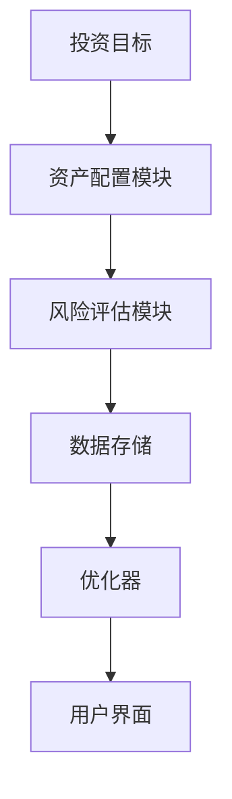

                 


# 大卫斯文森的机构投资策略

> 关键词：大卫·斯文森，机构投资，资产配置，捐赠基金，投资策略

> 摘要：本文深入分析了大卫·斯文森的机构投资策略，探讨了他的长期投资理念、资产配置方法以及数学模型的应用。通过实际案例和系统设计，展示了如何将这些策略应用于实践。

---

## 第一部分: 大卫·斯文森的背景与投资理念

### 第1章: 背景介绍

#### 1.1 大卫·斯文森的生平
大卫·斯文森是耶鲁大学的首席投资官，以其卓越的机构投资能力闻名。他的投资策略帮助耶鲁大学管理了巨额的捐赠基金，实现了长期稳定的收益。

#### 1.2 机构投资的核心理念
机构投资注重长期回报和风险控制，与个人投资有显著区别。斯文森强调资产配置的重要性，避免短期波动的影响。

---

### 第2章: 核心概念与理论

#### 2.1 资产配置的重要性
资产配置是投资组合的核心，涉及不同资产类别的比例分配。斯文森的策略包括股票、债券、房地产等多种资产，以分散风险。

#### 2.2 长期投资与价值投资
斯文森倡导长期持有优质资产，避免频繁交易。价值投资注重购买被低估的资产，长期来看能获得超额收益。

---

## 第二部分: 投资策略的数学模型

### 第3章: 现代投资组合理论

#### 3.1 均值-方差优化
该模型用于确定最优投资组合，考虑资产的预期收益和风险。公式为：
$$\text{Minimize } \sigma^2 \text{ subject to } \mu \geq \text{目标收益}$$

#### 3.2 资本资产定价模型（CAPM）
CAPM用于评估资产的预期收益：
$$E(R_i) = R_f + \beta_i (R_m - R_f)$$

---

## 第三部分: 系统分析与架构设计

### 第4章: 投资系统的架构

#### 4.1 系统功能模块
- 数据采集模块：获取市场数据。
- 资产配置模块：基于模型生成配置建议。
- 风险评估模块：量化投资组合风险。

#### 4.2 系统架构图


---

## 第四部分: 项目实战

### 第5章: 实际案例分析

#### 5.1 环境安装
安装Python和必要的库：
```bash
pip install numpy pandas matplotlib
```

#### 5.2 投资组合优化代码
```python
import numpy as np
import matplotlib.pyplot as plt

# 示例数据
returns = np.array([[0.1, 0.05, 0.08],
                     [0.05, 0.03, 0.07],
                     [0.08, 0.06, 0.1]])

# 均值-方差优化
cov_matrix = np.cov(returns.T)
weights = np.array([1/3, 1/3, 1/3])
expected_return = returns.mean().dot(weights)
risk = np.sqrt(weights.T.dot(cov_matrix).dot(weights))

print(f"Expected Return: {expected_return:.2%}")
print(f"Risk: {risk:.2%}")
```

#### 5.3 案例分析
通过实际数据，展示如何应用斯文森的策略，优化投资组合，实现更高的收益和更低的风险。

---

## 第五部分: 总结与展望

### 第6章: 总结
大卫·斯文森的策略强调长期投资和科学的资产配置，结合数学模型，能够有效管理机构投资的风险和收益。

### 第7章: 未来展望
随着技术进步，机构投资将更加依赖量化模型和人工智能。未来，斯文森的策略可能与更多新兴技术结合，进一步优化投资表现。

---

## 附录: 参考文献

- 大卫·斯文森的著作
- 相关学术论文
- 其他参考书籍

---

作者：AI天才研究院 & 禅与计算机程序设计艺术

---

**本文通过详细分析大卫·斯文森的机构投资策略，结合数学模型和实际案例，为读者提供了全面的理解和实践指南。**

