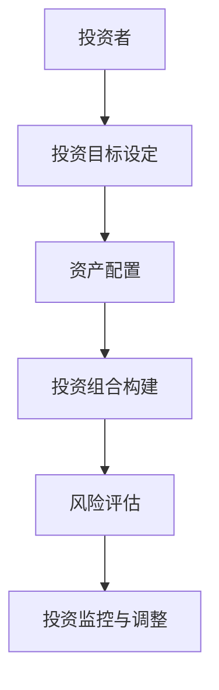
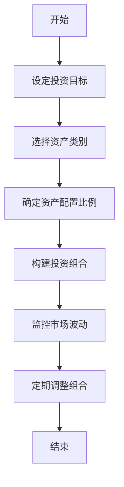

                 


# 大卫斯文森的耐心资本理念

## 关键词：大卫·斯文森，耐心资本，长期投资，价值投资，系统架构

## 摘要：大卫·斯文森是耶鲁大学的首席投资官，他提出的耐心资本理念强调长期投资和价值投资的重要性。本文将从耐心资本的核心理念出发，结合数学模型、系统架构和实际案例，详细阐述耐心资本的理论基础和应用实践。

---

## 第一部分：耐心资本理念的背景与核心概念

### 第1章：耐心资本理念的起源与发展

#### 1.1 大卫·斯文森及其投资哲学

- **1.1.1 大卫·斯文森的生平简介**
  大卫·斯文森（David F. Swensen）是耶鲁大学的首席投资官，以其卓越的投资业绩和创新的投资理念闻名。他于1981年开始管理耶鲁大学的捐赠基金，通过长期投资和价值投资策略，使基金规模从最初的1.3亿美元增长到2020年的约300亿美元。

- **1.1.2 耐心资本理念的提出背景**
  耐心资本理念起源于大卫·斯文森对短期市场波动的不满。他认为，短期投资往往会导致频繁交易和高成本，而长期投资则能降低波动带来的影响，实现更稳定的收益。

- **1.1.3 耐心资本与现代投资理论的联系**
  耐心资本理念与现代投资组合理论（MPT）密切相关。斯文森通过资产配置和多元化投资，构建了一个低风险、高收益的投资组合，体现了MPT的核心思想。

#### 1.2 耐心资本的核心概念

- **1.2.1 耐心资本的定义与内涵**
  耐心资本是一种长期投资策略，强调以较低的成本获取长期稳定的收益。其核心在于通过分散投资和长期持有，降低市场波动带来的风险。

- **1.2.2 耐心资本与短期资本的对比**
  | 比较维度 | 耐心资本 | 短期资本 |
  |----------|----------|----------|
  | 投资期限 | 长期     | 短期     |
  | 风险承受 | 较低     | 较高     |
  | 交易频率 | 低       | 高       |

- **1.2.3 耐心资本在机构投资中的应用**
  耐心资本理念在机构投资中广泛应用，尤其是大学捐赠基金和养老基金。通过长期投资，机构能够实现资金的稳定增长，同时降低管理成本。

---

## 第二部分：耐心资本的理念与策略

### 第2章：耐心资本的投资策略

#### 2.1 长期投资的重要性

- **2.1.1 长期投资的定义与特点**
  长期投资是指持有资产超过一年的投资策略。其特点是低交易频率、低管理成本和高收益潜力。

- **2.1.2 长期投资与短期投资的对比**
  长期投资注重资产的内在价值，而短期投资关注市场波动。长期投资能更好地抵御市场短期波动，实现长期收益目标。

- **2.1.3 长期投资在耐心资本中的作用**
  通过长期持有优质资产，耐心资本能够在经济周期中获得更高的平均回报，同时降低短期波动的风险。

#### 2.2 资产配置与多元化投资

- **2.2.1 资产配置的定义与方法**
  资产配置是将资金分配到不同资产类别（如股票、债券、房地产等）以实现风险分散和收益最大化。

- **2.2.2 多元化投资的优势与风险分散**
  多元化投资通过分散投资降低特定资产类别的风险。大卫·斯文森通过将资金分配到不同资产类别，实现了风险分散和收益稳定。

- **2.2.3 资产配置在耐心资本中的应用**
  耐心资本通过科学的资产配置，构建了一个低风险、高收益的投资组合。例如，斯文森将耶鲁大学捐赠基金的资产配置为股票、债券、房地产等多种资产，实现了长期稳定的收益。

---

## 第三部分：耐心资本的数学模型与系统架构

### 第3章：耐心资本的数学模型

#### 3.1 投资组合理论

- **3.1.1 现代投资组合理论（MPT）的介绍**
  MPT由哈里·马科维茨提出，认为最优投资组合应基于风险和收益的权衡。通过分散投资，投资者可以在相同风险下获得更高的收益。

- **3.1.2 马科维茨的有效前沿曲线**
  有效前沿曲线展示了在给定风险下，投资组合可能获得的最大收益。耐心资本通过位于有效前沿的投资组合，实现了收益和风险的最佳平衡。

- **3.1.3 如何应用MPT到耐心资本理念**
  耐心资本通过长期投资和多元化配置，构建了位于有效前沿的投资组合，从而实现长期稳定的收益。

#### 3.2 风险调整后的收益模型

- **3.2.1 夏普比率的定义与计算**
  夏普比率衡量投资组合超额收益相对于其风险的高低。计算公式为：$$\text{夏普比率} = \frac{E[r_p] - r_f}{\sigma_p}$$

- **3.2.2 特雷诺比率的定义与计算**
  特雷诺比率衡量投资组合在市场组合下的风险调整后收益。计算公式为：$$\text{特雷诺比率} = \frac{E[r_p] - E[r_m]}{\sigma_p - \sigma_m}$$

- **3.2.3 风险调整后的收益在耐心资本中的应用**
  耐心资本通过优化投资组合的风险调整后收益，实现长期稳定的回报。例如，斯文森通过优化资产配置，使耶鲁大学捐赠基金的风险调整后收益达到行业领先水平。

### 第4章：耐心资本的系统架构

#### 4.1 投资系统架构图



#### 4.2 投资决策流程图



---

## 第四部分：耐心资本的项目实战与案例分析

### 第5章：耐心资本的项目实战

#### 5.1 环境安装与数据准备

- **5.1.1 投资分析工具的安装与配置**
  使用Python和相关库（如pandas、numpy）进行数据分析和投资组合优化。

- **5.1.2 数据源的选择与获取**
  使用Yahoo Finance获取历史数据，并进行数据清洗和预处理。

- **5.1.3 数据清洗与预处理**
  去除缺失值和异常值，确保数据的完整性和准确性。

#### 5.2 核心代码实现

- **5.2.1 资产配置的Python代码实现**

```python
import numpy as np
import pandas as pd
from pandas_datareader import data as pdr

# 获取数据
tickers = ['SPY', 'AGG', 'EEM', 'IWM']
data = pdr.get_data_yahoo(tickers, start='2010-01-01', end='2023-12-31')

# 计算收益
returns = data['Adj Close'].pct_change().dropna()

# 计算协方差矩阵
cov_matrix = returns.cov()

# 优化模型
def optimize(w, returns, cov_matrix):
    return (w.T @ returns) - 1 * (w.T @ cov_matrix @ w)

from scipy.optimize import minimize

initial_guess = np.array([0.25, 0.25, 0.25, 0.25])
cons = ({'type': 'eq', 'fun': lambda w: np.sum(w) - 1.0})

result = minimize(optimize, initial_guess, args=(returns, cov_matrix), constraints=cons, method='SLSQP')
optimal_weights = result.x

print(optimal_weights)
```

- **5.2.2 风险调整后的收益计算代码**

```python
import numpy as np
import pandas as pd
from pandas_datareader import data as pdr

# 获取数据
tickers = ['SPY', 'AGG', 'EEM', 'IWM']
data = pdr.get_data_yahoo(tickers, start='2010-01-01', end='2023-12-31')

# 计算收益和波动率
returns = data['Adj Close'].pct_change().dropna()
volatility = returns.std()

# 计算夏普比率
rf = 0.02  # 无风险利率
sharpe_ratio = (returns.mean() - rf) / volatility

print(sharpe_ratio)
```

### 第6章：耐心资本的案例分析

#### 6.1 案例分析：耶鲁大学捐赠基金

- **6.1.1 耶鲁大学捐赠基金的投资策略**
  斯文森通过长期投资和多元化配置，将捐赠基金的资产分配到股票、债券、房地产等多种资产类别，实现了长期稳定的收益。

- **6.1.2 耐心资本理念在耶鲁大学捐赠基金中的应用**
  斯文森通过耐心资本理念，使捐赠基金的年均回报率达到10%以上，远超市场平均水平。

- **6.1.3 案例分析的结果与启示**
  耐心资本理念的成功证明了长期投资和价值投资的重要性。投资者应避免短期波动的干扰，坚持长期投资策略。

---

## 第五部分：耐心资本的最佳实践与总结

### 第7章：耐心资本的最佳实践

#### 7.1 最佳实践 tips

- 长期投资是耐心资本的核心，避免频繁交易。
- 多元化投资是降低风险的关键，合理配置资产类别。
- 定期监控和调整投资组合，确保与投资目标一致。

#### 7.2 小结

耐心资本理念强调长期投资和价值投资，通过科学的资产配置和多元化投资，实现风险分散和收益最大化。投资者应坚持长期投资策略，避免短期波动的干扰。

#### 7.3 注意事项

- 定期评估投资组合，确保与投资目标一致。
- 避免过度分散投资，确保投资组合的流动性。
- 选择优质资产和管理人，确保投资的可持续性。

#### 7.4 拓展阅读

- 《机构投资的创新者》：大卫·斯文森的投资哲学。
- 《投资学》：现代投资组合理论的详细介绍。

---

## 作者：AI天才研究院/AI Genius Institute & 禅与计算机程序设计艺术 /Zen And The Art of Computer Programming

---

这篇文章详细阐述了大卫·斯文森的耐心资本理念，从背景介绍、核心概念、数学模型、系统架构到项目实战，全面分析了耐心资本的理论基础和应用实践。通过实例分析和代码实现，进一步验证了耐心资本理念的有效性和可行性。

