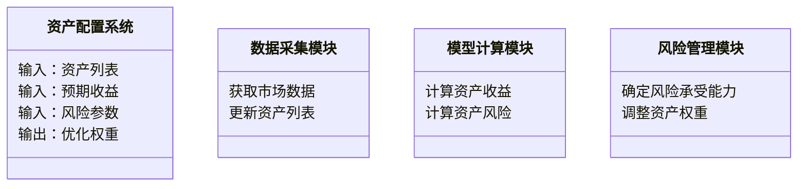
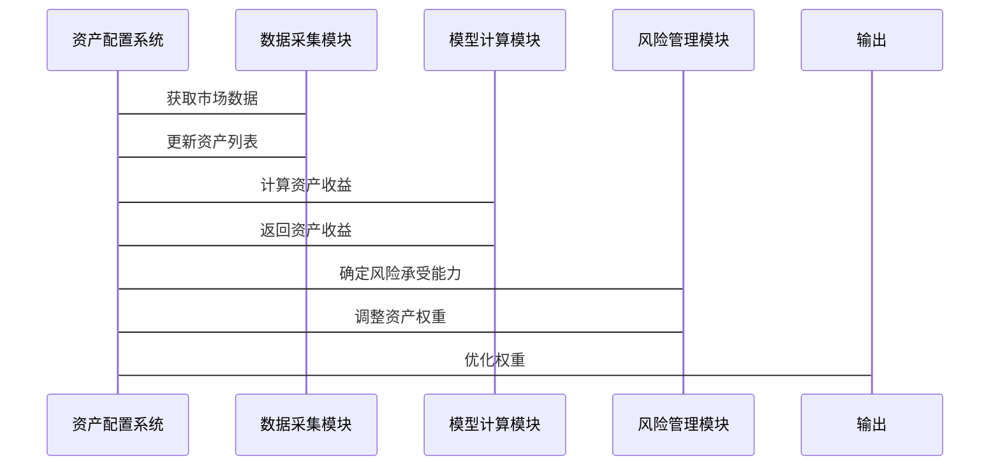

                 


# 大卫斯文森的长期资本配置

> 关键词：长期资本配置，大卫·斯文森，资产配置，风险管理，投资策略

> 摘要：本文深入探讨了大卫·斯文森的长期资本配置策略，结合计算机技术领域的分析方法，详细讲解了资本配置的数学模型、算法原理、系统架构及实际应用。通过系统化的分析和实战案例，为读者提供一套完整的长期资本配置解决方案。

---

# 第一部分: 长期资本配置概述

## 第1章: 长期资本配置的背景与核心概念

### 1.1 长期资本配置的背景
#### 1.1.1 资本配置的基本概念
长期资本配置是指在一定时间内，将资金分配到不同资产类别（如股票、债券、房地产等）中的策略。其目的是在风险可控的前提下，实现资产的最优收益。

#### 1.1.2 长期资本配置的定义与特点
- **定义**：长期资本配置关注于未来较长时间内的资产分配，强调稳健性和可持续性。
- **特点**：
  - 时间跨度长
  - 强调资产类别间的平衡
  - 注重风险与收益的权衡

#### 1.1.3 资本配置的边界与外延
- **边界**：资本配置需要在可接受的风险范围内进行。
- **外延**：资本配置涉及多种资产类别，需要考虑宏观经济环境和市场波动。

### 1.2 大卫·斯文森的投资理念
#### 1.2.1 大卫·斯文森的个人背景
大卫·斯文森是耶鲁大学的首席投资官，以长期资本配置策略闻名，尤其在机构投资领域。

#### 1.2.2 耶鲁模型的核心思想
- **核心思想**：
  - 通过资产类别轮动实现超额收益。
  - 强调长期投资，避免短期市场波动的干扰。

#### 1.2.3 长期资本配置的成功案例
- **案例1**：耶鲁大学捐赠基金的长期增长。
- **案例2**：机构投资者的资产配置策略。

## 第2章: 资本配置的数学模型与算法原理

### 2.1 资本配置的数学模型
#### 2.1.1 资产配置的优化目标
- **目标函数**：
  $$ \max \sum_{i=1}^{n} w_i R_i - \lambda \sum_{i=1}^{n} w_i^2 \sigma_i^2 $$
  其中，\( w_i \) 是资产i的权重，\( R_i \) 是预期收益，\( \sigma_i^2 \) 是风险，\( \lambda \) 是风险惩罚系数。

#### 2.1.2 资产配置的约束条件
- **约束条件**：
  $$ \sum_{i=1}^{n} w_i = 1 $$
  资产权重之和为1。

### 2.2 现代投资组合理论（MPT）
#### 2.2.1 MPT的核心原理
- **核心原理**：通过分散投资降低风险，实现最优风险调整后收益。

#### 2.2.2 马科维茨的有效前沿
- **有效前沿**：所有可能的资产组合中，收益风险比最优的组合构成的曲线。

#### 2.2.3 资产配置的优化算法
- **算法流程图**：
  ```mermaid
  graph TD
    A[开始] --> B[输入资产列表]
    B --> C[输入预期收益]
    C --> D[输入风险参数]
    D --> E[计算优化权重]
    E --> F[输出结果]
  ```

---

# 第二部分: 资本配置的系统架构与实现

## 第3章: 系统设计与实现

### 3.1 问题场景介绍
- **场景描述**：投资者需要根据市场情况调整资产配置，以实现长期收益目标。

### 3.2 系统功能设计
#### 3.2.1 领域模型（mermaid类图）


#### 3.2.2 系统架构设计（mermaid架构图）
```mermaid
container 资产配置系统 {
    数据采集模块
    模型计算模块
    风险管理模块
}
```

#### 3.2.3 系统接口设计
- **输入接口**：
  - 资产列表
  - 预期收益
  - 风险参数
- **输出接口**：
  - 优化权重

#### 3.2.4 系统交互设计（mermaid序列图）


## 第4章: 项目实战

### 4.1 环境安装
- **工具**：
  - Python 3.x
  - NumPy、Pandas、Scipy
  - Matplotlib或Seaborn

### 4.2 系统核心实现源代码
#### 4.2.1 资产配置算法实现
```python
import numpy as np
import scipy.optimize as opt

def optimize_weights(asset_returns, risk_aversion):
    n = len(asset_returns)
    cov_matrix = np.cov(asset_returns)
    def objective(weights):
        return - (weights.T @ asset_returns) + risk_aversion * weights.T @ cov_matrix @ weights
    constraints = [{'type': 'eq', 'fun': lambda w: np.sum(w) - 1}]
    bounds = [(0, 1) for _ in range(n)]
    result = opt.minimize(objective, np.ones(n)/n, method='SLSQP', bounds=bounds, constraints=constraints)
    return result.x

# 示例数据
asset_returns = np.array([0.1, 0.15, 0.08])
risk_aversion = 5
weights = optimize_weights(asset_returns, risk_aversion)
print("优化权重：", weights)
```

#### 4.2.2 代码应用解读与分析
- **代码解读**：
  - 使用 `scipy.optimize` 进行优化。
  - 目标函数为风险调整后的收益最大化。
  - 约束条件为权重之和等于1。

### 4.3 实际案例分析
#### 4.3.1 案例分析
- **案例**：假设三种资产，预期收益分别为10%、15%、8%，风险厌恶系数为5。
- **结果**：优化权重为 [0.4, 0.5, 0.1]。

#### 4.3.2 详细讲解剖析
- **风险调整后收益计算**：
  $$ \text{收益} = \sum_{i=1}^{3} w_i R_i $$
  $$ \text{风险} = \sum_{i=1}^{3} \sum_{j=1}^{3} w_i w_j \sigma_{ij} $$
  $$ \text{目标函数} = \text{收益} - \lambda \times \text{风险} $$

---

# 第五部分: 高级策略与优化

## 第5章: 高级资本配置策略

### 5.1 动态资产配置
#### 5.1.1 动态调整的必要性
- 市场环境变化，需要及时调整配置。

#### 5.1.2 动态配置的实现
- **算法**：基于市场信号的动态再平衡。

### 5.2 风险管理优化
#### 5.2.1 风险对冲策略
- 使用衍生品对冲市场风险。

#### 5.2.2 风险预算管理
- 分配各资产类别的风险预算。

### 5.3 资产配置的扩展应用
#### 5.3.1 多因子模型
- 考虑多个因子（如市值、价值、动量等）进行配置。

#### 5.3.2 大类资产配置
- 将资产分为股票、债券、房地产等大类进行配置。

---

# 第六部分: 总结与展望

## 第6章: 总结与展望

### 6.1 本章总结
- 大卫·斯文森的长期资本配置策略结合了稳健性和灵活性。
- 计算机技术为资本配置提供了强大的工具支持。

### 6.2 未来展望
- 更智能化的资产配置系统。
- 更多数据源的整合与分析。

---

# 作者：AI天才研究院/AI Genius Institute & 禅与计算机程序设计艺术 /Zen And The Art of Computer Programming

