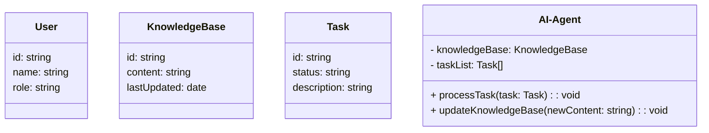
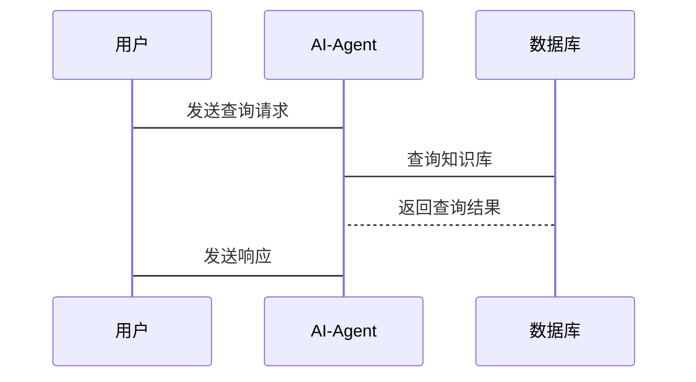

                 


# 大规模AI Agent系统的部署与维护

> 关键词：大规模AI Agent系统、部署、维护、系统架构、通信机制、算法优化、监控

> 摘要：本文深入探讨了大规模AI Agent系统的部署与维护的关键技术与实践。从系统背景与概念、技术基础、部署与实施、维护与优化，到高级主题与未来趋势，系统性地分析了大规模AI Agent系统的各个方面。文章结合实际案例，详细讲解了系统架构设计、通信机制、算法原理、监控体系等核心内容，并提出了最佳实践建议，帮助读者全面理解和掌握大规模AI Agent系统的部署与维护。

---

# 第一部分: 大规模AI Agent系统的背景与概念

## 第1章: 大规模AI Agent系统概述

### 1.1 AI Agent的基本概念

#### 1.1.1 AI Agent的定义与特点
AI Agent（人工智能代理）是指能够感知环境、自主决策并执行任务的智能实体。大规模AI Agent系统由多个AI Agent组成，通过协同工作完成复杂任务。

#### 1.1.2 大规模AI Agent系统的定义
大规模AI Agent系统是指包含数百或数千个AI Agent的系统，这些AI Agent分布在不同的节点或设备上，通过高效的通信和协作完成复杂的任务。

#### 1.1.3 大规模AI Agent系统的应用场景
- 智能客服系统：通过多个AI Agent协调处理用户的咨询和问题。
- 自动交易系统：多个AI Agent实时分析市场数据并执行交易。
- 智能交通系统：通过AI Agent协调交通信号和车辆调度。

### 1.2 大规模AI Agent系统的架构

#### 1.2.1 分层架构
分层架构将系统分为感知层、决策层和执行层，每一层负责不同的功能。

#### 1.2.2 分布式架构
分布式架构通过将AI Agent部署在不同的节点上，利用分布式计算技术实现任务的高效处理。

#### 1.2.3 微服务架构
微服务架构将AI Agent的功能模块化，每个服务独立运行，通过API进行通信。

### 1.3 大规模AI Agent系统的通信机制

#### 1.3.1 Agent间的通信协议
常用的通信协议包括HTTP、WebSocket和gRPC。

#### 1.3.2 通信机制的设计原则
通信机制需要考虑实时性、可靠性和安全性。

#### 1.3.3 通信中的安全性问题
包括数据加密、身份认证和访问控制。

### 1.4 大规模AI Agent系统的设计原则

#### 1.4.1 可扩展性
系统应支持动态增加或减少AI Agent的数量。

#### 1.4.2 可靠性
系统应具备容错和故障恢复能力，确保任务能够顺利完成。

#### 1.4.3 可维护性
系统设计应便于维护和升级，减少维护成本。

### 1.5 本章小结

---

# 第二部分: 大规模AI Agent系统的技术基础

## 第2章: AI Agent的架构与实现

### 2.1 AI Agent的核心组件

#### 2.1.1 知识库
知识库存储AI Agent所需的知识和数据，支持快速查询和推理。

#### 2.1.2 行为决策模块
行为决策模块根据当前状态和环境信息，生成决策和行动计划。

#### 2.1.3 交互接口
交互接口负责与外部系统或用户进行信息交换，支持多种通信方式。

### 2.2 AI Agent的实现技术

#### 2.2.1 机器学习模型
常用的机器学习模型包括监督学习、无监督学习和强化学习。

#### 2.2.2 自然语言处理技术
自然语言处理技术用于理解和生成人类语言，支持文本和语音交互。

#### 2.2.3 规则引擎
规则引擎通过预定义的规则进行推理和决策，适用于确定性任务。

---

## 第3章: 大规模AI Agent系统的通信机制

### 3.1 通信协议的选择

#### 3.1.1 HTTP
HTTP是一种常用的Web通信协议，适用于非实时任务。

#### 3.1.2 WebSocket
WebSocket适用于实时通信，支持双向数据传输。

#### 3.1.3 gRPC
gRPC是基于HTTP/2的高性能RPC框架，适用于分布式系统。

### 3.2 通信机制的实现

#### 3.2.1 消息队列
消息队列（如Kafka和RabbitMQ）用于处理异步任务，确保消息可靠传输。

#### 3.2.2 事件驱动
事件驱动架构通过异步处理提高系统的响应速度和吞吐量。

#### 3.2.3 请求-响应模式
请求-响应模式适用于点对点通信，确保请求和响应一一对应。

### 3.3 通信中的安全性问题

#### 3.3.1 加密通信
通过SSL/TLS加密通信数据，防止数据被窃听或篡改。

#### 3.3.2 认证与授权
使用JWT或OAuth进行身份认证和权限管理，确保只有合法用户能够访问系统。

#### 3.3.3 消息签名
通过数字签名验证消息的完整性和真实性，防止消息被篡改。

---

## 第4章: 大规模AI Agent系统的算法原理

### 4.1 机器学习算法

#### 4.1.1 监督学习
监督学习通过训练数据学习输入与输出的映射关系，适用于分类和回归任务。

#### 4.1.2 无监督学习
无监督学习通过发现数据中的模式和结构，适用于聚类和降维任务。

#### 4.1.3 强化学习
强化学习通过试错机制学习策略，适用于游戏和机器人控制等任务。

### 4.2 自然语言处理算法

#### 4.2.1 Transformer模型
Transformer模型通过自注意力机制实现高效的文本处理，广泛应用于NLP任务。

#### 4.2.2 BERT模型
BERT模型通过预训练技术提升模型的上下文理解能力，适用于问答和文本摘要任务。

#### 4.2.3 GPT模型
GPT模型通过生成式语言模型实现自然语言生成，适用于文本生成和对话系统。

### 4.3 算法的优化与调优

#### 4.3.1 参数调整
通过调整学习率、批量大小和正则化参数优化模型性能。

#### 4.3.2 模型压缩
通过剪枝和量化技术减少模型大小，提高推理速度。

#### 4.3.3 并行计算
通过多线程和分布式计算加速模型训练和推理过程。

---

## 第5章: 大规模AI Agent系统的数学模型

### 5.1 机器学习模型的数学表示

#### 5.1.1 线性回归
线性回归模型用于预测目标变量与特征变量之间的线性关系。

$$ y = \beta_0 + \beta_1 x_1 + \beta_2 x_2 + \dots + \beta_n x_n $$

#### 5.1.2 支持向量机
支持向量机通过构建超平面实现数据分类，适用于高维数据。

$$ \text{最大化} \quad \frac{1}{2} \|\mathbf{w}\|^2 $$
$$ \text{满足} \quad y_i (\mathbf{w} \cdot \mathbf{x}_i + b) \geq 1, \quad i=1,2,\dots,n $$

#### 5.1.3 神经网络
神经网络通过多层感知机模拟人脑神经网络，适用于复杂的非线性任务。

$$ f(x) = \sigma(w x + b) $$

### 5.2 自然语言处理模型的数学表示

#### 5.2.1 Transformer的数学

Transformer模型通过自注意力机制实现全局上下文理解。

$$ \text{Attention}(Q, K, V) = \text{softmax}\left(\frac{QK^T}{\sqrt{d_k}}\right)V $$

---

## 第6章: 系统分析与架构设计方案

### 6.1 问题场景介绍

#### 6.1.1 问题背景
大规模AI Agent系统需要处理复杂的任务，如实时数据分析、多 Agent 协作和分布式计算。

#### 6.1.2 项目介绍
以智能客服系统为例，展示如何通过多个AI Agent协同工作，实现高效的客户支持。

### 6.2 系统功能设计

#### 6.2.1 领域模型
领域模型通过类图展示系统的核心功能模块，包括用户管理、知识库管理和任务管理。



### 6.3 系统架构设计

#### 6.3.1 分层架构
分层架构将系统划分为数据层、业务逻辑层和表现层，便于模块化开发和维护。


#### 6.3.2 系统接口设计
系统接口设计通过RESTful API定义接口规范，确保各模块之间通信流畅。

#### 6.3.3 系统交互设计
系统交互设计通过序列图展示用户与AI-Agent之间的交互流程。



---

## 第7章: 项目实战

### 7.1 环境安装

#### 7.1.1 安装Python
安装Python 3.8或更高版本，确保环境兼容性。

#### 7.1.2 安装依赖库
安装所需的第三方库，如Flask、TensorFlow和Kafka。

### 7.2 系统核心实现

#### 7.2.1 AI-Agent实现
实现AI-Agent的核心功能，包括知识库管理、任务处理和通信接口。

```python
class AI-Agent:
    def __init__(self, knowledge_base):
        self.knowledge_base = knowledge_base

    def process_task(self, task):
        # 处理任务逻辑
        pass

    def update_knowledge_base(self, new_content):
        # 更新知识库
        pass
```

#### 7.2.2 通信接口实现
实现基于WebSocket的通信接口，支持实时数据传输。

```python
from flask import Flask, request
from flask_sockets import Sockets

app = Flask(__name__)
app.config['JSON_AS_ASCII'] = False
sockets = Sockets(app)

@sockets.route('/ws')
def ws_route(ws):
    while not ws.closed:
        message = ws.receive()
        if message:
            # 处理消息
            pass

if __name__ == '__main__':
    app.run()
```

### 7.3 代码应用解读与分析

#### 7.3.1 代码结构
展示代码的模块结构和功能划分，确保代码可读性和可维护性。

#### 7.3.2 系统功能分析
通过代码分析系统功能的实现细节，包括任务处理、知识库更新和通信接口。

### 7.4 实际案例分析

#### 7.4.1 案例介绍
以智能客服系统为例，展示如何通过大规模AI Agent系统实现高效的客户支持。

#### 7.4.2 系统小结
总结项目的实现过程和经验教训，提出改进建议。

---

## 第8章: 最佳实践与小结

### 8.1 最佳实践

#### 8.1.1 系统设计
- 使用分层架构和微服务架构提高系统的可扩展性和可维护性。
- 采用高效的通信机制确保系统的实时性和可靠性。

#### 8.1.2 算法优化
- 通过模型压缩和并行计算优化模型性能。
- 使用分布式训练和推理加速大规模部署。

#### 8.1.3 监控与维护
- 建立完善的监控体系，实时监控系统运行状态。
- 定期进行系统维护和升级，确保系统的稳定性和安全性。

### 8.2 注意事项

#### 8.2.1 系统安全
- 加强数据加密和身份认证，防止数据泄露和未授权访问。
- 定期进行安全审计和漏洞修复，确保系统的安全性。

#### 8.2.2 性能优化
- 通过缓存和优化数据库查询提高系统的响应速度。
- 使用负载均衡和集群部署提高系统的可用性和扩展性。

### 8.3 拓展阅读

#### 8.3.1 高可用性设计
学习高可用性设计的相关知识，提升系统的容错能力和故障恢复能力。

#### 8.3.2 分布式系统
深入学习分布式系统的设计与实现，掌握分布式计算和一致性算法的核心原理。

---

# 作者：AI天才研究院/AI Genius Institute & 禅与计算机程序设计艺术 /Zen And The Art of Computer Programming

