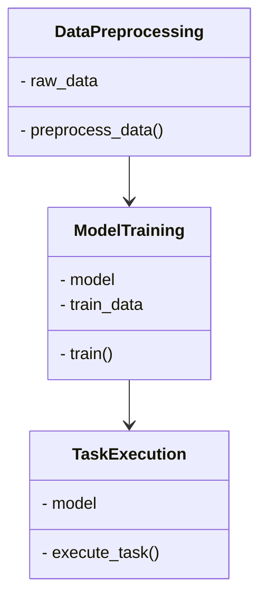

                 


# 大规模语言模型在AI Agent中的微调技巧

---

## 关键词

- 大规模语言模型
- AI Agent
- 微调技巧
- 机器学习
- 自然语言处理

---

## 摘要

本文深入探讨了大规模语言模型在AI Agent中的应用，重点分析了微调技巧的重要性及其具体实现方法。通过系统化的背景介绍、算法原理、系统架构设计和项目实战，本文详细阐述了如何优化AI Agent的性能，确保其在实际应用中展现出色的效果。文章最后总结了当前的研究成果，并展望了未来的发展方向。

---

# 第1章 大规模语言模型概述

## 1.1 大规模语言模型的定义与特点

大规模语言模型（如GPT系列）通过预训练海量数据，具备强大的自然语言处理能力。其特点包括：

1. **参数规模大**：通常拥有 billions级别的参数。
2. **预训练机制**：采用自监督学习，从大量未标注数据中学习语言规律。
3. **多任务适应性**：经过广泛训练，适用于多种NLP任务。

| 模型 | 参数量 | 主要特点 |
|------|--------|----------|
| GPT-3 | 175B   | 多任务通用性 |
| T5    | 220M   | 文本到文本的框架 |

## 1.2 AI Agent的基本概念

AI Agent是一种智能体，能够感知环境、执行任务并做出决策。其核心功能包括：

1. **感知环境**：通过传感器或API获取数据。
2. **决策与推理**：基于模型和数据做出最优选择。
3. **执行操作**：通过动作影响环境或与用户交互。

## 1.3 微调技巧的重要性

微调是将预训练模型适应特定任务的关键步骤。通过调整模型参数，可以提升其在特定领域的表现。

---

# 第2章 微调技巧的背景与原理

## 2.1 微调技巧的背景

预训练模型虽然强大，但通常无法直接应用于特定任务。微调通过在目标任务数据上进行Fine-tuning，优化模型性能。

## 2.2 微调技巧的核心原理

微调涉及以下步骤：

1. **数据预处理**：清理和标注数据。
2. **模型加载**：加载预训练模型。
3. **微调训练**：在特定任务数据上进行训练。

---

# 第3章 微调技巧的算法原理

## 3.1 微调技巧的步骤

### 数据预处理

```python
def preprocess_data(data):
    processed = []
    for text in data:
        # 分词
        tokens = tokenizer(text)
        processed.append(tokens)
    return processed
```

### 模型加载与微调

```python
model = AutoModelForMaskedLM.from_pretrained('bert-base-uncased')
tokenizer = AutoTokenizer.from_pretrained('bert-base-uncased')
```

### 损失函数与优化

$$\text{损失函数} = \text{交叉熵损失}$$

---

# 第4章 系统架构与设计

## 4.1 系统模块划分

### 类图



---

# 第5章 项目实战

## 5.1 项目环境搭建

安装必要的库：

```bash
pip install torch transformers
```

---

# 第6章 总结与展望

## 6.1 总结

微调技巧是提升AI Agent性能的关键，通过优化模型参数，使其更好地适应特定任务。

## 6.2 未来方向

1. **高效微调方法**：探索更有效的微调策略。
2. **多模态整合**：结合视觉、听觉等信息，提升AI Agent的感知能力。

---

作者：AI天才研究院/AI Genius Institute & 禅与计算机程序设计艺术 /Zen And The Art of Computer Programming

