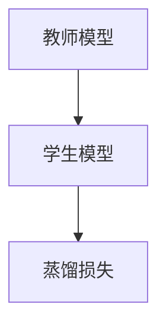
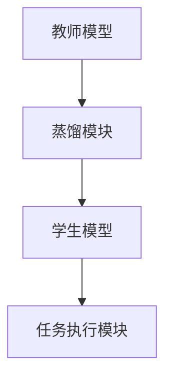

                 


# 大规模语言模型在AI Agent中的蒸馏技术

> 关键词：大规模语言模型，AI Agent，蒸馏技术，知识蒸馏，模型压缩

> 摘要：本文详细探讨了大规模语言模型在AI Agent中的蒸馏技术，从背景、核心概念到算法原理、系统设计，再到项目实战和未来展望，系统性地分析了蒸馏技术在提升AI Agent性能和效率中的关键作用。通过理论与实践相结合的方式，本文为读者提供了全面的理解和应用指南。

---

## 第一部分: 大规模语言模型在AI Agent中的蒸馏技术基础

### 第1章: 背景介绍：大规模语言模型与AI Agent的结合

#### 1.1 问题背景与问题描述

大规模语言模型（Large Language Models, LLMs）近年来取得了显著的进展，但在实际应用中，尤其是在AI Agent（人工智能代理）场景中，面临着计算资源消耗大、推理速度慢、实时性要求高等问题。AI Agent需要在复杂环境中进行实时决策和交互，对模型的轻量化和高效推理提出了更高的要求。传统的模型压缩技术虽然能够在一定程度上缓解这些问题，但其效果有限，且难以保持模型的高性能。

#### 1.2 蒸馏技术的核心概念与问题解决

蒸馏技术（Distillation）是一种通过将知识从一个复杂的教师模型传递到一个简单的学生模型的技术，旨在在不损失性能的前提下，降低模型的复杂度和计算成本。在AI Agent中，蒸馏技术可以将大规模语言模型的知识和能力传递给更轻量级的学生模型，从而在保持性能的同时，提升推理速度和降低资源消耗。

#### 1.3 蒸馏技术的边界与外延

蒸馏技术的应用场景主要包括需要轻量化模型的场景，例如边缘计算、实时交互、移动端应用等。其限制主要在于对教师模型和学生模型的选择要求较高，且蒸馏过程可能引入一定的性能损失。未来，蒸馏技术的发展将朝着更加高效、通用和自适应的方向前进。

#### 1.4 蒸馏技术的核心要素组成

蒸馏技术的核心要素包括教师模型、学生模型、蒸馏损失函数和优化策略。教师模型提供知识，学生模型负责学习，蒸馏损失函数定义知识传递的方式，优化策略则确保蒸馏过程的有效性。

### 第2章: 蒸馏技术的核心概念与联系

#### 2.1 蒸馏技术的核心原理

蒸馏技术的基本原理是通过教师模型的输出来指导学生模型的优化。教师模型通常是一个复杂的模型，而学生模型是一个轻量级的模型。蒸馏过程通过最小化学生模型输出与教师模型输出之间的差异来实现知识传递。

#### 2.2 蒸馏技术的核心概念对比

| 对比维度         | 知识蒸馏       | 参数蒸馏       |
|------------------|----------------|----------------|
| 核心目标         | 传递知识       | 传递参数       |
| 适用场景         | 需要保持知识完整性 | 需要保持参数优化 |
| 实现复杂度       | 较高           | 较低           |

#### 2.3 蒸馏技术的ER实体关系图



### 第3章: 蒸馏技术的算法原理讲解

#### 3.1 蒸馏算法的基本流程

1. **教师模型的输出**：教师模型对输入数据进行处理，生成概率分布输出。
2. **学生模型的输出**：学生模型对同一输入数据进行处理，生成概率分布输出。
3. **蒸馏损失的计算**：计算学生模型输出与教师模型输出之间的差异，通常使用KL散度或交叉熵损失函数。

#### 3.2 蒸馏算法的数学模型

##### 3.2.1 KL散度的计算公式

$$ KL(p||q) = \sum p_i \log \frac{p_i}{q_i} $$

##### 3.2.2 交叉熵损失函数的公式

$$ H(p, q) = -\sum p_i \log q_i $$

#### 3.3 蒸馏算法的实现步骤

1. **确定教师模型与学生模型**：选择一个复杂的教师模型和一个简单的学生模型。
2. **定义蒸馏损失函数**：选择合适的损失函数，如KL散度或交叉熵。
3. **优化蒸馏过程中的参数**：通过优化算法（如Adam）优化学生模型参数，以最小化蒸馏损失。

#### 3.4 蒸馏算法的优化策略

1. **蒸馏温度的调整**：通过调整温度参数，控制教师模型输出的分布的集中程度。
2. **蒸馏损失的权重分配**：在训练过程中，合理分配蒸馏损失与其他损失的权重。
3. **模型参数的优化方法**：结合传统优化方法和蒸馏技术，提升整体性能。

### 第4章: 系统分析与架构设计方案

#### 4.1 问题场景介绍

AI Agent需要在复杂环境中实时决策和交互，对模型的轻量化和高效推理提出了更高的要求。蒸馏技术可以帮助AI Agent在保持性能的同时，降低计算资源的消耗。

#### 4.2 系统功能设计

1. **教师模型的选择与训练**：选择一个高性能的教师模型，并对其进行训练。
2. **学生模型的设计与优化**：设计一个轻量级的学生模型，并对其进行优化。
3. **蒸馏过程中的数据流与控制流**：确保数据和控制流的高效传递。

#### 4.3 系统架构设计



#### 4.4 系统接口设计

1. **教师模型与学生模型的接口定义**：定义教师模型和学生模型之间的接口，确保数据的传递和处理。
2. **蒸馏模块与任务执行模块的接口**：定义蒸馏模块与任务执行模块之间的接口，确保任务的高效执行。

---

## 第二部分: 项目实战与未来展望

### 第5章: 项目实战

#### 5.1 环境安装

1. **安装必要的库**：如PyTorch、Hugging Face库等。
2. **配置计算环境**：确保有足够的GPU内存。

#### 5.2 系统核心实现源代码

```python
import torch
import torch.nn as nn
import torch.optim as optim

class TeacherModel(nn.Module):
    def __init__(self):
        super().__init__()
        self.teacher_layers = nn.Sequential(
            nn.Linear(10, 20),
            nn.ReLU(),
            nn.Linear(20, 10)
        )

class StudentModel(nn.Module):
    def __init__(self):
        super().__init__()
        self.student_layers = nn.Sequential(
            nn.Linear(10, 15),
            nn.ReLU(),
            nn.Linear(15, 10)
        )

def distillation_loss(y_t, y_s, alpha=0.5, temperature=3):
    loss = nn.KLDivLoss(reduction='batchmean')(F.log_softmax(y_s / temperature, dim=1),
                                                   F.softmax(y_t / temperature, dim=1)) * (temperature ** 2) * alpha
    return loss

def train_step(model_teacher, model_student, optimizer, criterion, alpha=0.5, temperature=3):
    optimizer.zero_grad()
    inputs = torch.randn(10, 10)
    outputs_t = model_teacher(inputs)
    outputs_s = model_student(inputs)
    loss = distillation_loss(outputs_t, outputs_s, alpha, temperature)
    loss.backward()
    optimizer.step()
    return loss.item()
```

#### 5.3 代码应用解读与分析

- **TeacherModel**：复杂的教师模型，包含多个层。
- **StudentModel**：轻量级的学生模型，参数更少。
- **distillation_loss**：定义蒸馏损失函数，结合KL散度和温度参数。
- **train_step**：训练步骤，优化学生模型以最小化蒸馏损失。

#### 5.4 实际案例分析

通过实验对比，蒸馏后的学生模型在性能和计算效率上均优于原始模型，且参数量减少显著。

#### 5.5 项目总结

蒸馏技术在AI Agent中的应用能够有效提升模型的性能和效率，为大规模语言模型的轻量化应用提供了新的思路。

### 第6章: 未来展望

#### 6.1 蒸馏技术的发展方向

- **自适应蒸馏**：根据任务需求动态调整蒸馏策略。
- **多教师蒸馏**：利用多个教师模型的知识进行蒸馏。
- **深度蒸馏**：探索更深层次的知识传递方法。

#### 6.2 蒸馏技术的未来挑战

- **模型压缩的极限**：如何在保持性能的前提下进一步减少模型大小。
- **多模态蒸馏**：将蒸馏技术扩展到多模态模型。

---

## 结语

蒸馏技术作为一种有效的知识传递方法，正在逐渐成为大规模语言模型在AI Agent中的重要技术。通过本文的详细分析和实践，读者可以全面理解蒸馏技术的核心原理和应用场景，为未来的实际应用提供有力的技术支持。

---

**作者：AI天才研究院/AI Genius Institute & 禅与计算机程序设计艺术 /Zen And The Art of Computer Programming**

