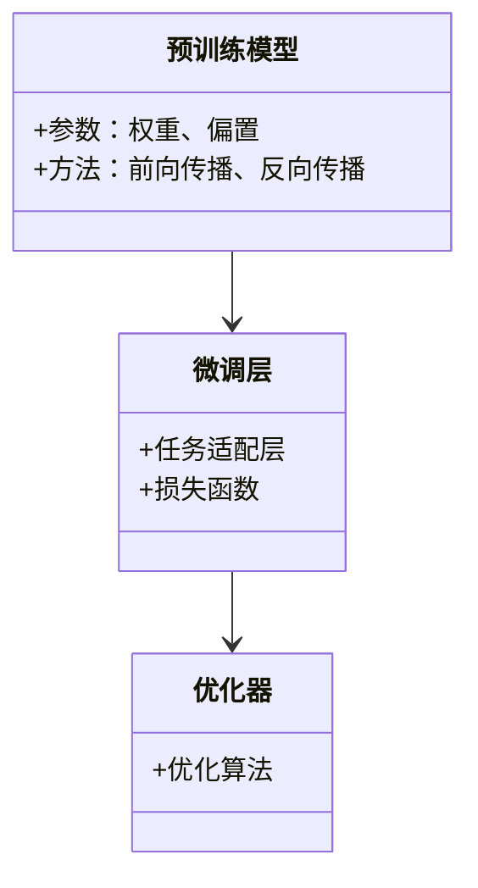
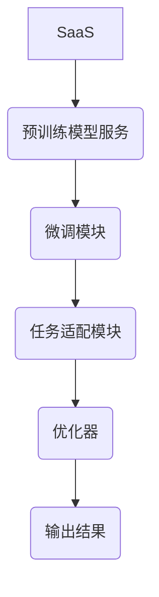

                 


# 大规模预训练模型在金融场景中的迁移学习实践

> 关键词：大规模预训练模型，迁移学习，金融场景，文本分类，风险评估，自然语言处理

> 摘要：本文深入探讨了大规模预训练模型在金融场景中的迁移学习实践，分析了迁移学习在金融数据稀缺性和领域适应性中的重要性，结合实际案例详细讲解了预训练模型的数学模型、算法原理、系统架构设计和项目实现。通过本文，读者可以掌握如何在金融领域中有效应用迁移学习技术，提升模型的性能和泛化能力。

---

## 第一部分: 大规模预训练模型与迁移学习背景

### 第1章: 大规模预训练模型概述

#### 1.1 大规模预训练模型的定义与特点
大规模预训练模型（如BERT、GPT等）是一种基于深度学习的自然语言处理模型，通过在大规模通用文本数据上进行无监督预训练，学习语言的语法、语义和上下文关系。其特点包括：
1. **参数规模大**：通常包含数亿个参数，能够捕捉复杂的语言特征。
2. **通用性强**：预训练模型在多种任务上表现出色，适用于多种场景。
3. **可迁移性高**：通过微调等方法，可以在特定领域任务中取得优异性能。

#### 1.2 迁移学习的背景与意义
迁移学习是一种机器学习技术，通过将已学习的知识迁移到新的任务或领域，以提高模型在目标领域的性能。在金融场景中，数据稀缺性和领域特殊性使得迁移学习尤为重要：
1. **数据稀缺性**：金融领域的标注数据通常有限，难以直接训练专用模型。
2. **领域特殊性**：金融文本（如财务报告、新闻）具有专业术语和特定语义，需要模型具备领域适应性。

### 第2章: 金融场景中的数据挑战

#### 2.1 金融数据的特点
1. **数据的稀缺性**：金融领域的高质量标注数据较少，尤其是在某些细分领域。
2. **数据的敏感性**：金融数据往往涉及隐私和商业机密，获取和处理需谨慎。
3. **数据的多样性**：金融场景涉及多种类型的数据（文本、结构化数据等），模型需要具备多模态处理能力。

#### 2.2 金融场景中的迁移学习需求
1. **数据不足的问题**：通过迁移学习，利用通用预训练模型的知识弥补数据不足。
2. **领域适应的需求**：预训练模型在金融领域的任务中进行微调，以适应特定领域的需求。
3. **迁移学习的优势**：降低从头训练专用模型的成本，提升模型的泛化能力。

---

## 第二部分: 大规模预训练模型与迁移学习的核心概念

### 第3章: 大规模预训练模型的原理

#### 3.1 预训练模型的训练流程
1. **无监督预训练**：通过自监督学习（如Masked Language Model）在大规模通用数据上预训练模型。
2. **有监督微调**：在特定任务（如文本分类）上，使用目标领域的数据对模型进行微调。
3. **适应性优化**：通过调整模型的参数或架构，提升模型在目标领域的表现。

#### 3.2 迁移学习的基本原理
1. **知识迁移的机制**：通过共享特征提取层，将源任务的知识迁移到目标任务。
2. **特征提取与任务适配**：预训练模型的特征提取能力强，适用于多种任务。
3. **预训练模型的可迁移性**：预训练模型的通用性使其在迁移学习中具有优势。

### 第4章: 大规模预训练模型与迁移学习的关系

#### 4.1 预训练模型的迁移能力
1. **预训练模型的通用性**：能够捕捉语言的通用特征，适用于多种任务。
2. **预训练模型的领域适应性**：通过微调，模型可以在特定领域中表现出色。
3. **预训练模型的可解释性**：部分模型（如BERT）具有可解释性，便于分析迁移过程。

#### 4.2 迁移学习在预训练模型中的应用
1. **参数微调**：调整预训练模型的部分参数，使其适应目标任务。
2. **任务适配**：设计适配目标任务的网络结构或损失函数。
3. **知识蒸馏**：通过教师模型将知识迁移到学生模型，减少计算成本。

---

## 第三部分: 大规模预训练模型的算法原理

### 第5章: 预训练模型的数学模型与公式

#### 5.1 预训练模型的损失函数
**交叉熵损失函数**：
$$ \text{Loss} = -\sum_{i=1}^{n} y_i \log p_i + (1-y_i)\log(1-p_i) $$

其中，$y_i$ 是真实标签，$p_i$ 是模型预测的概率。

#### 5.2 迁移学习的优化算法
**梯度下降法**：
$$ x_{n+1} = x_n - \eta \cdot \nabla J(x_n) $$

其中，$\eta$ 是学习率，$J(x_n)$ 是损失函数。

### 第6章: 预训练模型的算法流程

#### 6.1 预训练模型的流程图


#### 6.2 迁移学习的流程图


---

## 第四部分: 系统分析与架构设计

### 第7章: 系统功能设计

#### 7.1 领域模型设计


#### 7.2 系统架构设计


---

## 第五部分: 项目实战

### 第8章: 环境安装与核心代码实现

#### 8.1 环境安装
```bash
pip install transformers torch
```

#### 8.2 核心代码实现
```python
from transformers import BertModel, BertTokenizer
import torch

class FinancialModel(torch.nn.Module):
    def __init__(self, bert_model):
        super().__init__()
        self.bert = bert_model
        self.dropout = torch.nn.Dropout(0.1)
        self.classifier = torch.nn.Linear(768, num_labels)

    def forward(self, input_ids, attention_mask):
        outputs = self.bert(input_ids=input_ids, attention_mask=attention_mask)
        pooled_output = outputs.last_hidden_state[:, 0, :]
        pooled_output = self.dropout(pooled_output)
        logits = self.classifier(pooled_output)
        return logits

# 示例训练代码
model = FinancialModel(BertModel.from_pretrained('bert-base-uncased'))
optimizer = torch.optim.Adam(model.parameters(), lr=1e-5)
criterion = torch.nn.CrossEntropyLoss()
```

---

## 第六部分: 最佳实践与总结

### 第9章: 最佳实践

#### 9.1 小贴士
1. **数据预处理**：在金融场景中，文本清洗和特征提取尤为重要。
2. **模型调优**：通过网格搜索或自动调优工具优化模型参数。
3. **结果验证**：使用交叉验证和领域内指标（如AUC）评估模型性能。

#### 9.2 注意事项
1. **数据隐私**：处理金融数据时，需遵守相关法律法规。
2. **模型解释性**：在金融应用中，模型的可解释性至关重要。
3. **计算资源**：大规模预训练模型的训练和推理需要充足的计算资源。

#### 9.3 拓展阅读
1. [《迁移学习实战》](#)
2. [《预训练模型在金融中的应用》](#)
3. [《深度学习与自然语言处理》](#)

---

## 作者信息

作者：AI天才研究院 & 禅与计算机程序设计艺术

---

以上是《大规模预训练模型在金融场景中的迁移学习实践》的完整大纲和内容。

