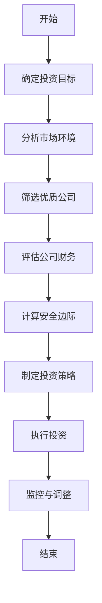
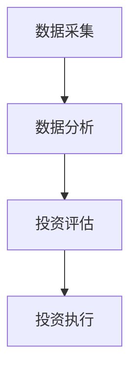

                 


# 如何像巴菲特和芒格一样选择好公司

## 关键词：价值投资、巴菲特、芒格、投资策略、企业分析、安全边际

## 摘要：本文详细介绍了如何像巴菲特和芒格一样选择好公司。通过分析价值投资的核心理念、企业竞争优势、财务健康状况和行业地位等关键因素，结合数学模型和实际案例，帮助读者制定科学的投资策略，实现长期稳健的收益。

---

## 第1章 价值投资的背景与核心概念

### 1.1 价值投资的定义与背景

#### 1.1.1 价值投资的起源与发展
- 价值投资的起源可以追溯到20世纪初，本杰明·格雷厄姆和戴维·多德是这一投资理念的奠基人。
- 巴菲特从格雷厄姆和多德的价值投资理论中汲取了灵感，并加以发展和创新。

#### 1.1.2 价值投资的核心理念
- 价值投资的核心理念是寻找市场低估的优秀企业，长期持有，等待其价值回归。
- 强调安全边际，即买入价格远低于企业内在价值，以降低投资风险。

#### 1.1.3 价值投资与其它投资策略的对比
- 成长型投资：侧重于寻找高成长性的企业，但风险较高。
- 价值型投资：侧重于寻找被市场低估的企业，注重安全边际。
- 趋势投资：侧重于跟随市场趋势，但需要精准判断市场走向。

### 1.2 巴菲特与芒格的投资哲学

#### 1.2.1 巴菲特的投资理念
- 巴菲特强调企业内在价值和长期盈利能力。
- 他偏好具有强大竞争优势、稳定的财务状况和良好治理的企业。

#### 1.2.2 芒格的多元思维模型
- 芒格强调通过跨学科的思维模型来分析问题。
- 他主张通过多个角度审视企业，避免单一思维的局限性。

#### 1.2.3 巴菲特与芒格投资理念的异同
- 巴菲特更注重企业的财务数据和内在价值。
- 芒格更注重多元思维和长期视角。

### 1.3 选择好公司的核心要素

#### 1.3.1 企业的竞争优势
- 具备独特的产品、技术或市场地位，能够在竞争中占据优势。
- 例如，苹果公司凭借其品牌和技术优势，形成了强大的市场壁垒。

#### 1.3.2 财务健康状况
- 企业具有稳定的盈利能力和健康的财务状况。
- 例如，亚马逊尽管早期盈利较少，但其持续的高增长和强大的现金流为其赢得了投资者的信任。

#### 1.3.3 行业地位与前景
- 企业所处行业的前景和企业的市场地位。
- 例如，谷歌在搜索引擎市场的主导地位，使其具备长期竞争优势。

---

## 第2章 价值投资的核心概念与联系

### 2.1 价值投资的原理

#### 2.1.1 安全边际的概念
- 安全边际是买入价格与企业内在价值之间的差距。
- 例如，如果一只股票的内在价值为100元，而买入价格为80元，那么安全边际为20元。

#### 2.1.2 股票的内在价值计算
- 内在价值是未来现金流的现值。
- 使用DCF模型（现金流折现法）计算企业的内在价值。

#### 2.1.3 市场先生与投资者的角色
- 市场先生比喻市场情绪的波动，投资者应避免被市场情绪左右。

### 2.2 核心概念对比表格

| 投资策略   | 核心目标               | 风险特点             | 适用场景             |
|------------|------------------------|----------------------|----------------------|
| 成长型     | 寻找高成长企业           | 高                  | 高成长行业           |
| 价值型     | 寻找被低估企业           | 中                  | 市场低估时期           |
| 趋势型     | 跟随市场趋势             | 中                  | 市场趋势明显           |

### 2.3 投资决策流程图


---

## 第3章 投资组合优化的算法原理

### 3.1 投资组合优化的数学模型

#### 3.1.1 均值-方差模型
- 均值-方差模型用于优化投资组合的风险和收益。
- 目标是最小化风险（方差）的同时最大化收益。

#### 3.1.2 拉格朗日乘数法
- 通过拉格朗日乘数法求解优化问题。
- 优化问题：minimize方差，subject to收益和约束条件。

### 3.2 投资组合优化的Python实现

```python
import numpy as np
from scipy.optimize import minimize

# 示例数据
returns = np.array([0.1, 0.2, 0.15])
weights = np.array([0.3, 0.4, 0.3])

# 目标函数
def objective(weights):
    return np.dot(weights.T, np.dot(cov_matrix, weights))

# 约束条件
constraints = [
    {'type': 'eq', 'fun': lambda w: sum(w) - 1}
]

# 优化
result = minimize(objective, weights, constraints=constraints)
print(result)
```

---

## 第4章 投资决策系统的架构设计

### 4.1 系统功能设计

#### 4.1.1 数据采集模块
- 采集企业财务数据、市场数据等。

#### 4.1.2 数据分析模块
- 分析企业的财务状况、竞争优势等。

#### 4.1.3 投资评估模块
- 评估企业的内在价值和安全边际。

#### 4.1.4 投资执行模块
- 执行投资策略，调整投资组合。

### 4.2 系统架构设计


---

## 第5章 项目实战

### 5.1 环境安装

#### 5.1.1 安装Python和相关库
```bash
pip install numpy pandas matplotlib
```

### 5.2 核心代码实现

#### 5.2.1 计算企业内在价值
```python
def calculate_intrinsic_value(revenue, expenses, growth_rate, discount_rate):
    free_cash_flow = revenue - expenses
    intrinsic_value = free_cash_flow / (discount_rate - growth_rate)
    return intrinsic_value
```

### 5.3 实际案例分析
- 以苹果公司为例，分析其财务状况、竞争优势和市场地位。

---

## 第6章 最佳实践与小结

### 6.1 投资策略的技巧
- 长期持有优质企业。
- 分散投资，降低风险。
- 避免情绪化决策。

### 6.2 小结
- 通过系统的分析和科学的决策，投资者可以像巴菲特和芒格一样选择好公司，实现长期稳健的收益。

---

## 作者：AI天才研究院 & 禅与计算机程序设计艺术

---

通过以上结构，您可以逐步撰写文章，确保每个部分都详细且具有深度，帮助读者理解如何像巴菲特和芒格一样选择好公司。

