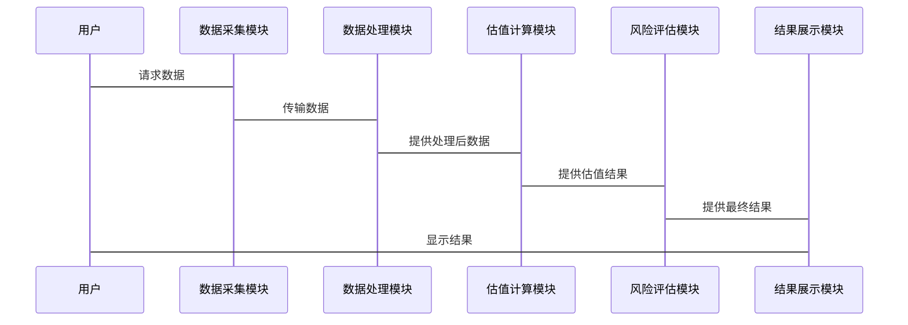

                 


# 如何判断股价是否具有吸引力：巴菲特的视角

> 关键词：巴菲特，股票估值，价值投资，内在价值，安全边际，股息率，市盈率，市净率

> 摘要：本文从巴菲特的价值投资理念出发，详细讲解如何判断股价是否具有吸引力。通过分析股票估值的基本概念、内在价值的计算方法以及多维度的股票分析，帮助读者掌握巴菲特的投资策略，做出明智的投资决策。

---

## 第三章: 股票估值的多维度分析

### 3.1 财务报表分析

#### 3.1.1 财务报表的重要性
- 财务报表是评估公司财务健康状况的核心工具。
- 主要包括资产负债表、利润表和现金流量表。

#### 3.1.2 资产负债表分析
- 总资产、总负债和所有者权益的构成。
- 重点分析流动资产和流动负债，评估公司的短期偿债能力。

#### 3.1.3 利润表分析
- 收入、成本和利润的构成。
- 净利润是衡量公司盈利能力的关键指标。

#### 3.1.4 现金流量表分析
- 经营活动、投资活动和筹资活动的现金流。
- 现金流健康是公司持续经营的重要保障。

### 3.2 行业分析与宏观经济因素

#### 3.2.1 行业分析的重要性
- 行业生命周期阶段对股价的影响。
- 行业竞争结构和市场集中度。

#### 3.2.2 宏观经济因素
- 利率、通货膨胀和经济周期对股价的影响。
- 政治和政策环境对行业的影响。

### 3.3 股票估值的多指标分析

#### 3.3.1 常用估值指标
- 市盈率（P/E）、市净率（P/B）、股息率等。

#### 3.3.2 相关性分析
- 使用相关系数分析不同指标之间的关系。

### 3.4 风险评估与投资决策

#### 3.4.1 风险类型
- 系统性风险与非系统性风险。
- 财务风险与市场风险。

#### 3.4.2 风险调整后的估值
- 使用波动率和风险溢价调整估值模型。

## 第四章: 股票估值系统架构设计

### 4.1 系统功能设计

#### 4.1.1 数据采集模块
- 数据来源：股票数据接口、财务报表等。
- 数据清洗与预处理。

#### 4.1.2 估值计算模块
- 多种估值方法的实现，如DDM模型、DCF模型。
- 计算内在价值和市场价值。

#### 4.1.3 风险评估模块
- 计算VaR等风险指标。
- 确定风险调整后的估值。

### 4.2 系统架构设计

#### 4.2.1 系统架构图


#### 4.2.2 接口设计
- 数据接口：RESTful API。
- 模块间接口：定义数据格式和交互方式。

### 4.3 系统交互流程

#### 4.3.1 交互流程图


## 第五章: 项目实战

### 5.1 环境安装与数据获取

#### 5.1.1 环境搭建
- Python编程环境的安装。
- 安装必要的库：pandas、numpy、scikit-learn。

#### 5.1.2 数据获取
- 从Yahoo Finance获取股票数据。
- 下载财务报表数据。

### 5.2 核心代码实现

#### 5.2.1 数据清洗代码
```python
import pandas as pd

# 读取数据
df = pd.read_csv('stock_data.csv')

# 删除缺失值
df.dropna(inplace=True)

# 处理异常值
df = df[df['Revenue'] > 0]
```

#### 5.2.2 估值计算代码
```python
def calculate_intrinsic_value(eps, growth_rate, required_return):
    return eps * (1 + growth_rate) / (required_return - growth_rate)
```

### 5.3 案例分析

#### 5.3.1 案例选择
- 分析苹果公司的股票。

#### 5.3.2 数据分析与结果解读
- 计算苹果公司的内在价值。
- 对比市场价与内在价值，判断股价是否具有吸引力。

## 第六章: 最佳实践与小结

### 6.1 小结
- 总结巴菲特的价值投资理念。
- 强调内在价值计算和多指标分析的重要性。

### 6.2 注意事项
- 避免过度依赖单一指标。
- 考虑宏观经济和行业因素的影响。

### 6.3 拓展阅读
- 推荐相关书籍和文章。
- 提供进一步学习的资源。

---

# 作者：AI天才研究院 & 禅与计算机程序设计艺术

通过本文，读者可以系统地学习如何从巴菲特的视角判断股价的吸引力，掌握股票估值的核心方法和技巧，从而做出更明智的投资决策。

