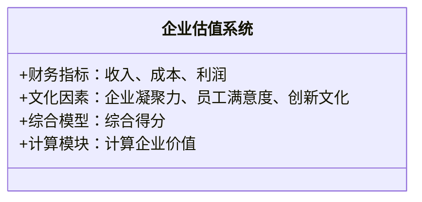
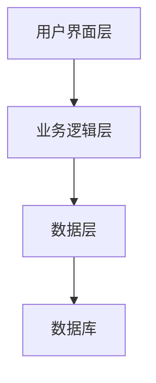
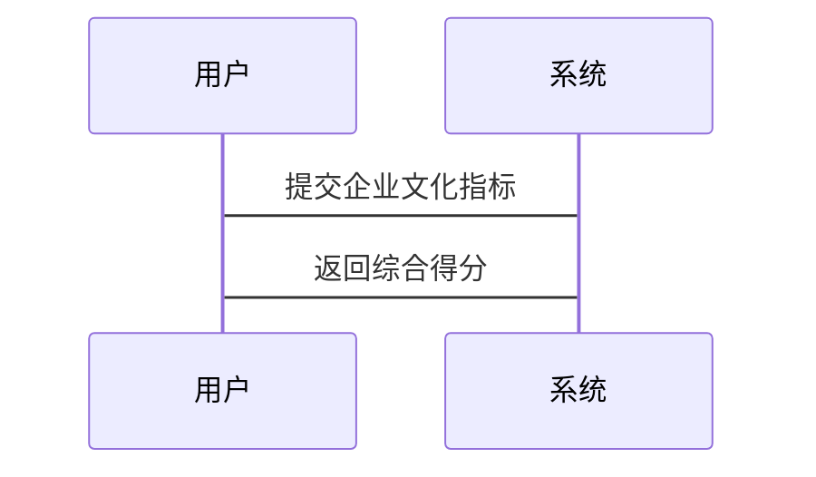

                 


# 如何在估值中考虑企业的文化因素

---

## 关键词：企业估值、文化因素、企业文化、企业价值、文化评估、文化量化

---

## 摘要：  
企业在传统估值中往往更关注财务指标，而忽略了企业文化因素对企业价值的影响。本文从企业文化的核心概念出发，详细分析了文化因素如何影响企业绩效、员工生产力和客户忠诚度。通过构建企业文化量化方法和文化因素与企业价值的关系模型，提出了将文化因素纳入企业估值的具体步骤。文章还结合实际案例，展示了如何通过系统架构设计和项目实战将文化因素转化为可量化的指标，从而帮助企业更全面地进行估值。

---

# 第一部分: 企业文化因素在估值中的背景与重要性

## 第1章: 企业文化因素在企业估值中的背景与重要性

### 1.1 企业估值的传统方法与局限性

#### 1.1.1 传统企业估值方法概述  
传统的企业估值方法主要依赖于财务指标，如净利润、现金流、市盈率等。这些方法通过对企业财务数据的分析，预测企业的未来价值。然而，这些方法忽略了企业内部文化因素对企业绩效和长期发展的深远影响。

#### 1.1.2 传统估值方法的局限性  
传统估值方法往往无法捕捉到企业文化的无形价值。例如，一个拥有强大凝聚力和创新文化的团队可能在财务数据上暂时表现不佳，但其长期发展潜力远超竞争对手。忽视文化因素可能导致估值结果偏离实际。

#### 1.1.3 引入文化因素的必要性  
企业文化是企业的灵魂，它决定了企业的战略执行能力、员工创造力和客户忠诚度。将文化因素纳入估值体系，能够更全面地反映企业的潜在价值。

### 1.2 企业文化因素的定义与特征

#### 1.2.1 企业文化的基本定义  
企业文化是企业在长期经营中形成的共同价值观、行为规范和思维方式的总和。它是企业战略执行和创新发展的内在驱动力。

#### 1.2.2 企业文化的核心特征  
- **凝聚力**：企业文化能够将员工团结在一起，形成共同的目标。
- **创新性**：企业文化鼓励员工创新，推动企业不断进步。
- **适应性**：企业文化能够快速适应外部环境的变化，保持企业的竞争力。

#### 1.2.3 企业文化与企业价值的关系  
企业文化不仅影响员工的工作态度，还影响客户对企业产品的认知和忠诚度。强大的企业文化能够显著提升企业的市场竞争力和长期价值。

### 1.3 企业文化因素在估值中的作用

#### 1.3.1 企业文化对企业绩效的影响  
企业文化通过提升员工的工作积极性和创造力，显著提高企业的运营效率和盈利能力。

#### 1.3.2 企业文化对员工生产力的提升  
良好的企业文化能够增强员工的归属感和责任感，从而提高员工的工作效率和质量。

#### 1.3.3 企业文化对客户忠诚度的增强  
企业文化通过塑造企业品牌形象，增强客户对企业产品的信任和忠诚，从而提高客户粘性和市场份额。

### 1.4 本章小结  
本章从传统企业估值方法的局限性出发，详细阐述了企业文化因素的定义、特征及其在企业估值中的重要性。企业文化的无形价值往往被传统估值方法忽视，但其对企业的长期发展和价值提升具有不可忽视的影响。

---

## 第2章: 企业文化因素的量化方法

### 2.1 企业文化评估的核心指标

#### 2.1.1 企业凝聚力指标  
企业凝聚力可以通过员工满意度、团队合作能力和企业归属感等指标来衡量。

#### 2.1.2 员工满意度指标  
员工满意度是企业文化的重要体现，可以通过定期的员工满意度调查来评估。

#### 2.1.3 创新文化指标  
创新文化可以通过企业的研发投入占比、员工创新意识和新产品推出频率等指标来衡量。

### 2.2 企业文化因素的权重分配

#### 2.2.1 权重分配的基本原则  
权重分配应根据企业的行业特点和文化因素的重要性来确定。例如，科技企业的创新文化权重应高于传统制造业。

#### 2.2.2 不同行业权重的差异性  
不同行业的企业文化因素权重差异较大。例如，科技行业更注重创新文化，而制造业更注重企业凝聚力。

#### 2.2.3 权重分配的数学模型  
权重分配可以通过层次分析法（AHP）来确定。  
公式：  
$$ w_i = \frac{\sum_{j} a_{ij}}{\sum_{j} \sum_{k} a_{kj}}} $$  
其中，$w_i$ 表示第 $i$ 个因素的权重，$a_{ij}$ 表示第 $i$ 个因素对第 $j$ 个因素的影响程度。

### 2.3 企业文化因素的评分体系

#### 2.3.1 评分体系的设计原则  
评分体系应简单易懂，同时能够准确反映企业文化的真实情况。通常采用 1-5 分的评分标准。

#### 2.3.2 评分体系的具体实施步骤  
1. 确定企业文化评估的核心指标。  
2. 根据权重分配对每个指标进行评分。  
3. 计算综合得分，公式：  
$$ \text{综合得分} = \sum_{i=1}^{n} w_i \times \text{评分}_i $$  

#### 2.3.3 评分体系的验证与优化  
通过对比实际案例验证评分体系的准确性，并根据反馈不断优化评分体系。

### 2.4 本章小结  
本章详细介绍了企业文化因素的量化方法，包括核心指标、权重分配和评分体系的设计。通过科学的量化方法，可以将企业文化因素转化为可量化的指标，为后续的估值提供依据。

---

## 第3章: 企业文化因素与企业价值的关系模型

### 3.1 企业文化因素对财务指标的影响

#### 3.1.1 企业文化对企业收入的影响  
企业文化通过提升员工生产力和客户忠诚度，间接影响企业的收入水平。  
公式：  
$$ \text{收入} = \text{价格} \times \text{销量} $$  

#### 3.1.2 企业文化对企业成本的影响  
良好的企业文化可以降低管理成本和员工流失率，从而降低成本。

#### 3.1.3 企业文化对企业利润的影响  
企业文化通过提高收入和降低成本，最终提升企业的利润水平。

### 3.2 企业文化因素对非财务指标的影响

#### 3.2.1 企业文化对客户满意度的影响  
企业文化通过提升产品质量和服务水平，增强客户的满意度和忠诚度。

#### 3.2.2 企业文化对员工忠诚度的影响  
企业文化通过增强员工的归属感和责任感，降低员工流失率，提高员工忠诚度。

#### 3.2.3 企业文化对品牌价值的影响  
企业文化通过塑造企业品牌形象，提升品牌知名度和美誉度，从而增强品牌价值。

### 3.3 企业文化因素与企业价值的综合模型

#### 3.3.1 综合模型的设计思路  
综合模型将企业文化因素与财务指标和非财务指标相结合，构建一个全面的企业估值模型。  
公式：  
$$ \text{企业价值} = \alpha \times \text{财务指标} + \beta \times \text{文化因素} $$  
其中，$\alpha$ 和 $\beta$ 分别为财务指标和文化因素的权重。

#### 3.3.2 模型的具体实现步骤  
1. 确定财务指标和文化因素的具体指标。  
2. 根据权重分配对每个指标进行评分。  
3. 计算综合得分，公式：  
$$ \text{综合得分} = \alpha \times \text{财务指标得分} + \beta \times \text{文化因素得分} $$  

### 3.4 本章小结  
本章构建了企业文化因素与企业价值的关系模型，详细阐述了企业文化因素对财务指标和非财务指标的影响，并提出了综合模型的设计思路和具体实现步骤。

---

## 第4章: 系统分析与架构设计方案

### 4.1 问题场景介绍  
本文将企业文化因素纳入企业估值系统，构建一个综合考虑财务和文化因素的估值模型。

### 4.2 系统功能设计

#### 4.2.1 领域模型设计  
领域模型通过UML类图展示系统的功能模块。  


#### 4.2.2 系统架构设计  
系统架构通过分层设计，将功能模块划分为数据层、业务逻辑层和用户界面层。  


### 4.3 系统接口设计  
系统接口通过RESTful API实现模块之间的通信。  
接口示例：  
```json
POST /api/cultural_factors  
{
    "企业文化指标": {
        "企业凝聚力": 4,
        "员工满意度": 4,
        "创新文化": 5
    }
}
```

### 4.4 系统交互设计  
系统交互通过序列图展示用户与系统之间的交互流程。  


### 4.5 本章小结  
本章从系统架构设计的角度，详细介绍了企业文化因素纳入企业估值系统的具体实现方法，包括领域模型设计、系统架构设计、接口设计和交互设计。

---

## 第5章: 项目实战

### 5.1 环境安装  
需要安装Python和相关库（如pandas、numpy、scikit-learn）。

### 5.2 系统核心实现源代码  
以下是一个简单的文化因素量化模型的Python代码示例：

```python
import pandas as pd
import numpy as np

# 定义文化因素权重
weights = {
    '企业凝聚力': 0.3,
    '员工满意度': 0.3,
    '创新文化': 0.4
}

# 定义文化因素评分
scores = {
    '企业凝聚力': 4,
    '员工满意度': 4,
    '创新文化': 5
}

# 计算文化因素综合得分
def calculate_cultural_score(weights, scores):
    return np.sum(weights[i] * scores[i] for i in weights)

# 示例计算
cultural_score = calculate_cultural_score(weights, scores)
print(f"文化因素综合得分：{cultural_score}")
```

### 5.3 代码应用解读与分析  
上述代码通过定义文化因素的权重和评分，计算出文化因素的综合得分。该得分可以作为企业估值的重要参考。

### 5.4 实际案例分析  
以某互联网公司为例，假设其文化因素评分为：企业凝聚力4分，员工满意度4分，创新文化5分。计算其文化因素综合得分为：  
$$ \text{文化因素综合得分} = 0.3 \times 4 + 0.3 \times 4 + 0.4 \times 5 = 4.7 $$  

### 5.5 项目小结  
本章通过实际案例展示了如何将文化因素量化，并纳入企业估值模型中。通过代码实现，验证了文化因素对估值的重要影响。

---

## 第6章: 最佳实践、小结、注意事项与拓展阅读

### 6.1 最佳实践  
在进行企业估值时，建议结合企业的行业特点，灵活调整文化因素的权重和评分标准。

### 6.2 小结  
本文从企业文化因素的定义、量化方法、关系模型和系统设计等多个角度，详细探讨了如何在估值中考虑企业的文化因素。通过理论分析和实际案例，证明了文化因素对企业价值的重要影响。

### 6.3 注意事项  
- 文化因素的量化需要结合企业的实际情况，避免过于主观。  
- 文化因素的权重应根据行业特点和企业战略目标进行调整。  
- 在实际应用中，文化因素的评估需要结合定量和定性分析，确保结果的准确性。

### 6.4 拓展阅读  
- 《企业价值评估：方法与实践》  
- 《企业文化管理：理论与应用》  
- 《企业创新管理：策略与案例》

---

## 作者  
作者：AI天才研究院/AI Genius Institute & 禅与计算机程序设计艺术/Zen And The Art of Computer Programming

