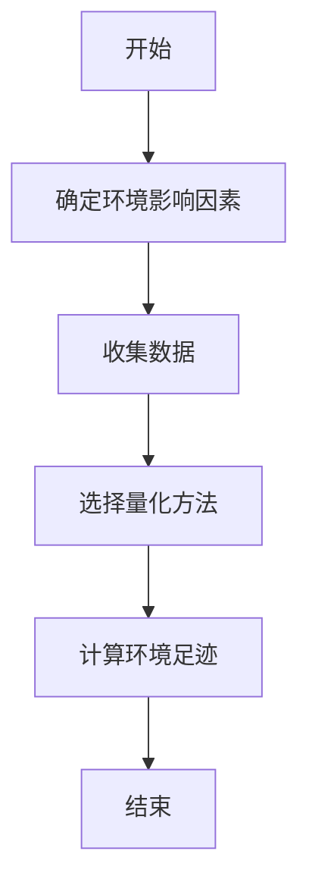
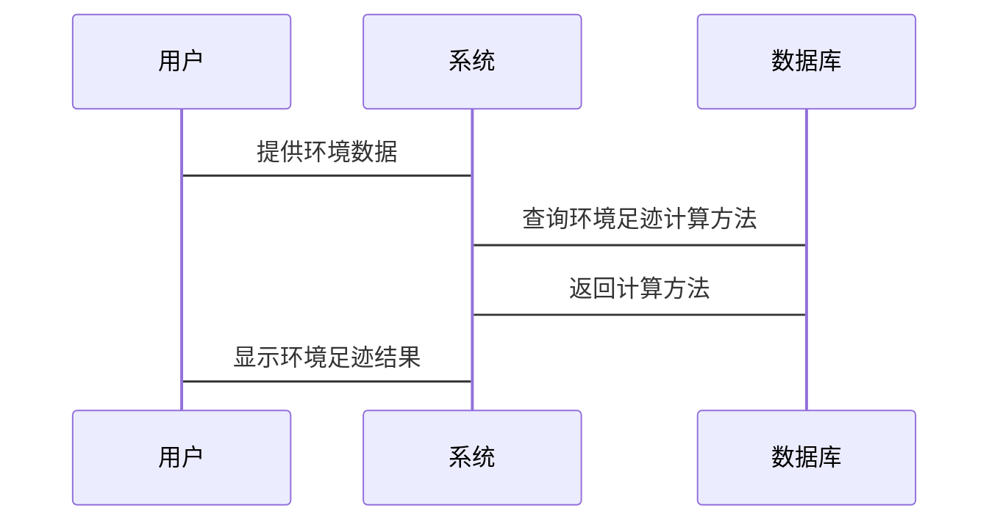

                 


# 如何在估值中考虑企业的环境足迹

## 关键词：企业估值、环境足迹、环境成本、环境风险、可持续发展

## 摘要：  
在当今全球化和可持续发展的背景下，企业的环境足迹已成为影响企业价值的重要因素。本篇文章将从环境足迹的基本概念入手，深入分析其对企业估值的核心影响，探讨环境足迹量化的方法和算法原理，结合实际案例，系统地讲解如何将环境足迹纳入企业估值体系中。通过本文的分析，读者将能够全面理解环境足迹与企业价值之间的关系，并掌握实际操作的方法。

---

# 目录

## 第一部分: 环境足迹与企业估值的背景与概念

### 第1章: 环境足迹的基本概念

#### 1.1 环境足迹的定义与内涵  
- **1.1.1 环境足迹的定义**  
  环境足迹是指企业在生产、运营和产品生命周期中对环境造成的影响，包括碳排放、资源消耗、污染排放等。  

- **1.1.2 环境足迹的核心要素**  
  - **生产过程中的环境影响**：包括原材料获取、生产过程中的能源消耗和废弃物排放。  
  - **供应链的环境足迹**：供应商的环境表现直接影响企业的整体环境足迹。  
  - **产品生命周期的环境影响**：从原材料到产品报废的全生命周期中的环境影响。  

- **1.1.3 环境足迹与企业价值的关系**  
  环境足迹通过影响企业的运营成本、法律责任和声誉风险，间接影响企业价值。  

#### 1.2 企业环境足迹的影响因素  
- **1.2.1 企业生产过程中的环境影响**  
  包括能源消耗、水资源使用和废弃物排放等。  

- **1.2.2 供应链的环境足迹**  
  供应商的环境表现对企业整体环境足迹的影响不容忽视。  

- **1.2.3 产品生命周期的环境影响**  
  产品设计、生产和使用阶段的环境影响需综合考虑。  

#### 1.3 环境足迹与企业估值的关联  
- **1.3.1 环境足迹对企业财务状况的影响**  
  环境成本的增加可能影响企业的利润和资产价值。  

- **1.3.2 环境风险对企业估值的潜在影响**  
  环境法规的不确定性可能导致企业的法律风险和财务损失。  

- **1.3.3 环境足迹与企业社会责任的关系**  
  企业积极减少环境足迹可以提升品牌形象和市场竞争力。  

---

## 第二部分: 环境足迹对企业估值的核心影响

### 第2章: 环境足迹的量化方法

#### 2.1 环境足迹的测量指标  
- **2.1.1 环境足迹的测量指标**  
  - **碳足迹**：企业整个生命周期内温室气体的排放量。  
  - **水足迹**：企业生产过程中消耗的水资源量。  
  - **生态足迹**：企业对自然资源的需求与地球承载能力的对比。  

- **2.1.2 环境足迹的评估标准**  
  国际标准如ISO 14040和ISO 14067为环境足迹的量化提供了参考。  

- **2.1.3 环境足迹的计算模型**  
  生命周期评估（LCA）是常用的方法，包括输入-输出分析和过程分析。  

#### 2.2 环境足迹与企业价值的数学模型  
- **2.2.1 环境足迹对企业利润的影响**  
  环境成本的增加可能导致企业利润下降。  

- **2.2.2 环境足迹对资产价值的影响**  
  高环境足迹可能影响企业的资产减值。  

- **2.2.3 环境足迹与企业风险溢价的关系**  
  高环境风险可能导致企业融资成本增加。  

---

## 第三部分: 环境足迹的核心概念与联系

### 第3章: 环境足迹的核心概念原理

#### 3.1 环境足迹的系统性分析  
- **3.1.1 环境足迹的系统性分析**  
  企业环境足迹是一个复杂的系统，涉及多个环节和因素。  

- **3.1.2 环境足迹的动态性特征**  
  环境足迹随企业经营策略和外部环境变化而变化。  

- **3.1.3 环境足迹的可量化性**  
  通过科学的方法可以将环境足迹转化为可量化的指标。  

#### 3.2 环境足迹与企业价值的对比分析  
- **3.2.1 环境足迹的属性特征**  
  - **可测量性**：环境足迹可以通过具体指标量化。  
  - **动态性**：环境足迹随时间和策略变化。  

- **3.2.2 企业价值的评估维度**  
  - **财务指标**：如净利润、资产回报率等。  
  - **市场价值**：如市盈率、市净率等。  

- **3.2.3 环境足迹与企业价值的对比表格**  
  | 指标类型 | 环境足迹 | 企业价值 |  
  |----------|----------|----------|  
  | 可测量性 | 是       | 是       |  
  | 动态性   | 是       | 是       |  
  | 影响因素 | 环境因素 | 财务、市场因素 |  

#### 3.3 环境足迹与企业价值的ER实体关系图  
- **3.3.1 实体关系图的构建**  
  通过Mermaid图展示环境足迹与企业价值之间的关系。  

- **3.3.2 实体关系图的解释**  
  环境足迹是影响企业价值的间接因素，通过环境成本、法律风险和声誉风险传递影响。  

- **3.3.3 实体关系图的优化**  
  添加中间变量（如环境成本）以更清晰地展示关系。  

---

## 第四部分: 环境足迹的算法原理与实现

### 第4章: 环境足迹量化算法的原理

#### 4.1 环境足迹量化算法的原理  
- **4.1.1 算法的基本思路**  
  通过生命周期评估方法，量化企业各环节的环境影响。  

- **4.1.2 算法的核心步骤**  
  1. 确定企业各环节的环境影响因素。  
  2. 收集相关数据，包括能源消耗、资源使用和排放数据。  
  3. 使用数学模型计算环境足迹。  

#### 4.2 环境足迹量化算法的Mermaid流程图  


#### 4.3 环境足迹量化算法的Python实现  
```python
import numpy as np
import pandas as pd

def calculate_carbon_footprint(energy_usage, emissions_factor):
    return np.dot(energy_usage, emissions_factor)

data = pd.read_csv('energy_consumption.csv')
emissions_factor = pd.read_csv('emissions_factors.csv')
carbon_footprint = calculate_carbon_footprint(data['energy_usage'], emissions_factor['emissions_factor'])
print("碳足迹：", carbon_footprint.sum())
```

#### 4.4 环境足迹量化算法的数学模型  
- **碳足迹计算公式**：  
  $$ \text{碳足迹} = \sum_{i=1}^{n} \text{能源消耗}_i \times \text{排放因子}_i $$  

- **水足迹计算公式**：  
  $$ \text{水足迹} = \sum_{j=1}^{m} \text{水资源使用}_j \times \text{水足迹因子}_j $$  

---

## 第五部分: 环境足迹与企业估值的系统分析与架构设计

### 第5章: 环境足迹的系统分析

#### 5.1 问题场景介绍  
- **企业环境数据收集与分析**：如何高效收集和分析企业各环节的环境数据。  

#### 5.2 系统功能设计  
- **领域模型Mermaid类图**  
  ```mermaid
  classDiagram
  class 环境数据收集 {
      原材料数据
      能源消耗数据
      废弃物排放数据
  }
  class 环境足迹计算 {
      计算碳足迹
      计算水足迹
  }
  class 环境评估报告 {
      环境表现分析
      改进建议
  }
  环境数据收集 --> 环境足迹计算
  环境足迹计算 --> 环境评估报告
  ```

#### 5.3 系统架构设计  
- **系统架构Mermaid架构图**  
  ```mermaid
  architecture
  Client
  ----> Server
  Server
  ----> 数据库
  ```

#### 5.4 系统接口设计  
- **环境数据接口**：提供环境数据的输入和查询功能。  

#### 5.5 系统交互Mermaid序列图  


---

## 第六部分: 环境足迹的项目实战

### 第6章: 项目实战

#### 6.1 环境数据收集与分析工具安装  
- **安装Python和相关库**：  
  ```bash
  pip install numpy pandas matplotlib
  ```

#### 6.2 环境足迹计算的核心代码  
```python
import numpy as np
import pandas as pd

def calculate_footprint(data, factor):
    return np.dot(data, factor)

data = pd.read_csv('environmental_data.csv')
factor = pd.read_csv('footprint_factors.csv')
result = calculate_footprint(data.values, factor.values)
print(result)
```

#### 6.3 环境足迹的实际案例分析  
- **案例分析**：某制造企业通过减少能源消耗，显著降低了碳足迹，提升了企业价值。  

#### 6.4 项目小结  
- 通过实际操作，读者可以掌握环境足迹量化的基本方法和工具。  

---

## 第七部分: 最佳实践与小结

### 第7章: 最佳实践

#### 7.1 小结  
- 环境足迹是影响企业估值的重要因素，量化环境足迹是企业实现可持续发展的关键步骤。  

#### 7.2 注意事项  
- 数据收集的准确性和完整性直接影响计算结果。  
- 环境足迹的量化需要结合企业的实际情况。  

#### 7.3 拓展阅读  
- 推荐阅读《可持续发展与企业价值》和《环境管理与企业战略》。  

---

## 作者：AI天才研究院/AI Genius Institute & 禅与计算机程序设计艺术 /Zen And The Art of Computer Programming

---

通过以上目录，读者可以系统地了解环境足迹与企业估值的关系，并掌握实际操作的方法。

