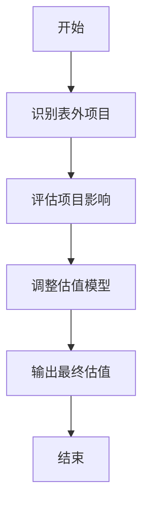
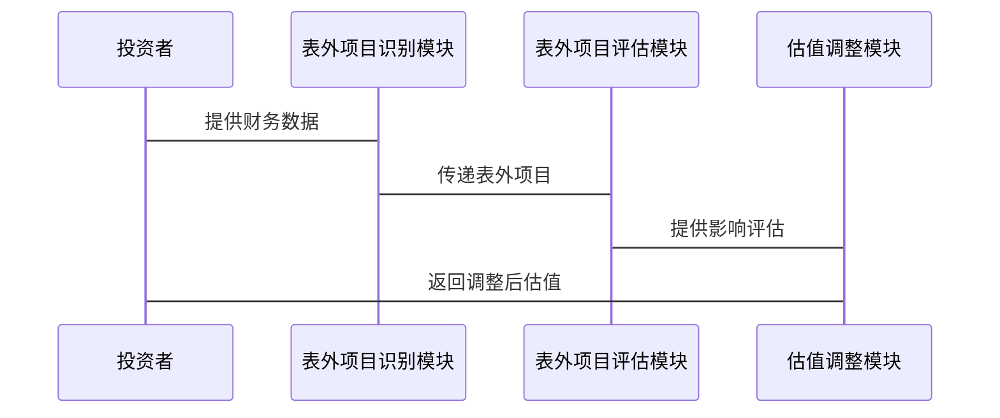

                 


# 如何处理企业估值中的资产负债表外项目

## 关键词：企业估值，资产负债表外项目，财务报表分析，风险评估，价值调整

## 摘要：  
在企业估值过程中，资产负债表外项目（off-balance sheet items）往往被忽视或低估，但它们对企业价值的影响不容小觑。本文将详细探讨如何识别、评估和处理这些项目，以确保企业估值的准确性和全面性。通过案例分析、算法设计和系统架构的构建，本文为企业估值提供了实用的解决方案。

---

## 第1章: 背景介绍

### 1.1 问题背景

#### 1.1.1 表外项目的定义与范围
资产负债表外项目是指那些不在企业正式财务报表中列示，但可能对企业财务状况、经营风险或价值产生重大影响的事项。常见的表外项目包括：
- 或有负债（如担保、未决诉讼）
- 潜在的资产或负债（如未报告的应收账款、无形资产）
- 经营租赁、售后回租等表外融资活动
- 未记录的关联交易

#### 1.1.2 表外项目对企业估值的影响
表外项目可能隐藏着重大风险或价值提升的机会。例如，未披露的或有负债可能增加企业的债务负担，而未记录的无形资产（如专利、品牌价值）可能低估了企业的实际价值。忽视这些项目可能导致估值偏差，影响投资决策。

#### 1.1.3 当前企业估值中的主要挑战
- 表外项目识别困难，容易被忽视或低估
- 缺乏统一的估值标准和方法
- 表外项目的风险传递机制复杂，影响估值模型的准确性

### 1.2 问题描述

#### 1.2.1 表外项目对企业估值的重要性
表外项目是企业价值的重要组成部分，尤其是在高科技企业或创新型行业，无形资产和潜在风险往往决定了企业的长期价值。

#### 1.2.2 未披露表外项目的风险
未披露的表外项目可能引发以下风险：
- 财务状况恶化，增加债务负担
- 法律纠纷，影响企业声誉
- 估值偏差，导致投资决策失误

#### 1.2.3 企业估值中的常见误区
- 忽视表外项目的重要性
- 仅依赖财务报表数据进行估值
- 缺乏对潜在风险的敏感性分析

---

## 第2章: 核心概念与联系

### 2.1 核心概念原理

#### 2.1.1 表外项目的分类与特征
表外项目可以分为以下几类：
1. **或有负债**：包括担保、未决诉讼、产品质量保证等。
2. **潜在资产**：包括未记录的无形资产、未来合同权益等。
3. **表外融资**：如经营租赁、售后回租等。
4. **其他事项**：如未报告的关联交易、员工福利计划等。

表外项目的特征包括：
- 隐含性：未在财务报表中明确列示
- 不确定性：可能对企业财务状况产生重大影响
- 时间性：部分项目可能在未来某个时间点显现

#### 2.1.2 表外项目与企业价值的关系
表外项目可能通过以下方式影响企业价值：
- 增加或减少企业的债务负担
- 影响企业的现金流和盈利能力
- 影响企业的市场声誉和融资能力

#### 2.1.3 表外项目的识别方法
识别表外项目的方法包括：
1. **审阅财务报表附注**：检查企业是否披露了潜在的负债或资产。
2. **分析行业特点**：不同行业可能存在不同的表外项目。
3. **访谈管理层**：了解企业的潜在风险和机会。
4. **审查关联交易**：检查是否存在未披露的关联交易。

### 2.2 概念属性特征对比表格

| 表外项目类型       | 特征描述                                                                 |
|--------------------|--------------------------------------------------------------------------|
| 或有负债           | 隐含性高，可能对企业财务状况产生重大影响                                   |
| 潜在资产           | 可能提升企业价值，但未在财务报表中列示                                     |
| 表外融资           | 通过表外融资活动增加企业负债或资产，影响财务杠杆                           |
| 其他事项           | 包括未报告的关联交易、员工福利计划等，可能影响企业声誉或财务状况           |

### 2.3 ER实体关系图

```mermaid
erDiagram
    actor 投资者 {
        [ID]
        [公司名称]
        [行业]
        [财务报表]
    }
    actor 管理层 {
        [ID]
        [公司名称]
        [行业]
        [潜在项目]
    }
    entity 表外项目 {
        [项目ID]
        [项目类型]
        [金额]
        [时间范围]
        [影响程度]
    }
    entity 企业价值 {
        [企业ID]
        [估值金额]
        [估值日期]
        [估值方法]
    }
    investors --> 表外项目 : 需要评估的项目
    管理层 --> 表外项目 : 披露潜在项目
    表外项目 --> 企业价值 : 影响企业价值
```

---

## 第3章: 处理表外项目的算法原理

### 3.1 算法原理概述



### 3.2 算法实现

```python
def process_off_balance_sheet_items(company_data):
    # 1. 识别表外项目
    off_balance_items = identify_off_balance_items(company_data)
    
    # 2. 评估项目影响
    impact_assessment = assess_impact(off_balance_items)
    
    # 3. 调整估值模型
    adjusted_valuation = adjust_valuation_model(company_data, impact_assessment)
    
    return adjusted_valuation

def identify_off_balance_items(company_data):
    # 示例：识别或有负债
    or_liabilities = []
    for item in company_data['财务报表附注']:
        if '担保' in item or '诉讼' in item:
            or_liabilities.append(item)
    return or_liabilities

def assess_impact(off_balance_items):
    # 示例：评估或有负债对现金流的影响
    impact = {}
    for item in off_balance_items:
        amount = parse_amount(item)
        impact[item] = -amount  # 假设或有负债会减少现金流
    return impact

def adjust_valuation_model(company_data, impact_assessment):
    # 示例：调整企业价值公式
    original_valuation = company_data['企业价值']
    adjusted_valuation = original_valuation + sum(impact_assessment.values())
    return adjusted_valuation
```

### 3.3 数学模型与公式

#### 表外项目影响的企业价值调整公式：
$$
\text{调整后企业价值} = \text{原企业价值} + \sum (\text{表外项目影响})
$$

#### 表外项目影响的评估公式：
$$
\text{影响程度} = \frac{\text{表外项目金额}}{\text{企业总资产}} \times 100\%
$$

---

## 第4章: 系统分析与架构设计

### 4.1 系统分析

#### 4.1.1 问题场景介绍
系统需要处理企业估值中的表外项目，包括识别、评估和调整。

### 4.2 系统架构设计


#### 系统功能设计

- **表外项目识别模块**：识别或有负债、潜在资产等表外项目。
- **表外项目评估模块**：评估每个项目对企业价值的影响。
- **估值调整模块**：根据评估结果调整企业价值。

### 4.3 接口与交互设计



---

## 第5章: 项目实战

### 5.1 环境安装与配置

```bash
pip install pandas numpy matplotlib
```

### 5.2 核心实现

```python
import pandas as pd
import numpy as np

def main():
    # 示例数据
    company_data = {
        '企业价值': 100000000,
        '财务报表附注': ['担保1000万', '未决诉讼500万']
    }
    
    # 识别表外项目
    off_balance_items = identify_off_balance_items(company_data)
    
    # 评估影响
    impact_assessment = assess_impact(off_balance_items)
    
    # 调整估值
    adjusted_valuation = adjust_valuation_model(company_data, impact_assessment)
    
    print(f"调整后企业价值：{adjusted_valuation}")

if __name__ == "__main__":
    main()
```

### 5.3 案例分析

假设一家公司有未披露的或有负债1000万元，可能影响其估值。通过算法识别和调整，企业价值从1亿元调整为9000万元。

---

## 第6章: 总结与最佳实践

### 6.1 小结
处理表外项目是企业估值的关键步骤，忽视它们可能导致估值偏差。本文通过算法设计和系统架构，提供了一种全面的解决方案。

### 6.2 注意事项
- 确保数据来源的准确性和完整性
- 定期更新估值模型，考虑市场变化
- 与行业专家合作，识别潜在风险

### 6.3 拓展阅读
- 《企业估值与财务分析》
- 《资产负债表外项目的风险管理》
- 《Python在金融数据分析中的应用》

---

## 作者：AI天才研究院 & 禅与计算机程序设计艺术

---

以上是完整的文章目录和内容框架，您可以根据需要进一步扩展每个部分的具体内容。

