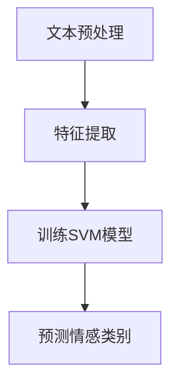
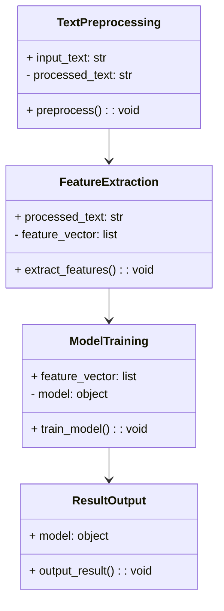
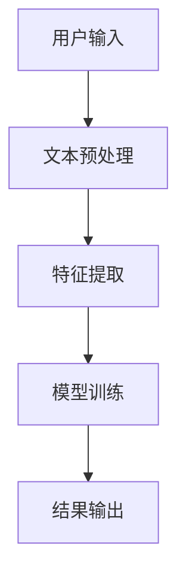

                 


# 如何评估企业的AI驱动的情感识别技术

> 关键词：AI情感识别，自然语言处理，文本分析，机器学习，深度学习，企业应用

> 摘要：本文详细探讨了如何评估企业在AI驱动的情感识别技术中的应用，从技术原理到系统架构，再到实际案例，系统地分析了情感识别技术的核心要素和评估方法，帮助读者全面理解如何在企业中有效评估和应用这项技术。

---

## 第一部分: 企业AI情感识别技术的背景与核心概念

### 第1章: AI情感识别技术的背景与问题描述

#### 1.1 情感识别技术的定义与核心概念

情感识别技术是一种利用人工智能（AI）技术分析和识别文本、语音或图像中所表达的情感状态的技术。其核心目标是将非结构化的数据（如文本、语音）转化为可量化的指标（如情感评分、情感类别）。

#### 1.2 企业AI情感识别技术的应用场景

企业中的情感识别技术可以应用于多个场景，例如客户反馈分析、员工情绪监测和产品推荐系统等。这些场景帮助企业更好地理解客户和员工的需求，从而提升整体业务效率。

#### 1.3 企业采用AI情感识别技术的意义

通过情感识别技术，企业可以更准确地捕捉客户和员工的情感反馈，从而优化服务流程，提升客户满意度和员工工作效率。

---

## 第2章: 情感识别技术的核心概念与联系

### 2.1 情感识别技术的核心原理

情感识别技术的核心原理包括文本预处理、特征提取和分类模型训练。预处理步骤通常包括分词、去停用词和词干提取。特征提取则涉及将文本转化为向量表示，常用的方法有TF-IDF和词嵌入技术。分类模型则通过机器学习算法（如SVM和随机森林）对情感类别进行预测。

### 2.2 情感识别技术与其他技术的联系

情感识别技术与自然语言处理（NLP）、文本挖掘和数据挖掘等技术密切相关。以下是一个对比表格：

| **技术**       | **描述**                                                                 |
|----------------|--------------------------------------------------------------------------|
| 自然语言处理    | 研究如何处理和分析人类语言的技术，是情感识别的基础。                   |
| 文本挖掘        | 从大量文本数据中提取有用信息的技术，情感识别是其中的一种应用。        |
| 数据挖掘        | 从数据中发现模式的技术，情感识别可以作为数据挖掘中的一个分析维度。     |

---

## 第3章: 情感识别技术的算法原理

### 3.1 常见的分类算法

情感识别中常用的分类算法包括支持向量机（SVM）和随机森林。以下是SVM的流程图：



### 3.2 深度学习模型

深度学习模型如LSTM在情感识别中表现优异。以下是LSTM的结构方程：

$$
f(x_t) = \tanh(W_f x_t + U_f h_{t-1} + b_f)
$$

### 3.3 算法实现示例

以下是基于SVM的Python实现代码：

```python
from sklearn.feature_extraction.text import TfidfVectorizer
from sklearn.svm import SVC

# 文本预处理
corpus = ["This is a good day", "I hate this"]

# 特征提取
vectorizer = TfidfVectorizer()
X = vectorizer.fit_transform(corpus)

# 训练SVM模型
model = SVC()
model.fit(X, ["positive", "negative"])

# 预测
print(model.predict(vectorizer.transform(["This is great"])))
```

---

## 第4章: 情感识别系统的数学模型与公式

### 4.1 支持向量机（SVM）

SVM的目标是最小化以下损失函数：

$$
\text{min} \quad \frac{1}{2} \|w\|^2 + C \sum_{i=1}^n \xi_i
$$

其中，$w$ 是权重向量，$C$ 是惩罚参数，$\xi_i$ 是松弛变量。

### 4.2 长短期记忆网络（LSTM）

LSTM的单元状态更新方程：

$$
c_t = f_{\text{gate}}(c_{t-1}, x_t) \cdot c_{t-1} + i_{\text{gate}}(c_{t-1}, x_t) \cdot x_t
$$

其中，$f_{\text{gate}}$ 和 $i_{\text{gate}}$ 是sigmoid函数。

---

## 第5章: 企业情感识别系统的架构设计

### 5.1 系统功能设计

系统功能模块包括文本输入、特征提取、模型训练和结果输出。以下是一个类图：



### 5.2 系统架构设计

以下是系统的整体架构图：



---

## 第6章: 情感识别技术的项目实战

### 6.1 项目环境安装

需要安装以下Python库：

- `scikit-learn`
- `nltk`
- `tensorflow`

### 6.2 核心代码实现

以下是情感识别系统的Python代码：

```python
import numpy as np
from sklearn.feature_extraction.text import TfidfVectorizer
from sklearn.svm import SVC
from tensorflow.keras.models import Sequential
from tensorflow.keras.layers import LSTM, Dense, Dropout

# 文本预处理
corpus = ["This is a good day", "I hate this"]

vectorizer = TfidfVectorizer()
X = vectorizer.fit_transform(corpus)

# SVM模型训练
model_svm = SVC()
model_svm.fit(X, ["positive", "negative"])

# LSTM模型训练
model_lstm = Sequential()
model_lstm.add(LSTM(64, input_shape=(None, 1), return_sequences=True))
model_lstm.add(Dropout(0.5))
model_lstm.add(LSTM(32, return_sequences=False))
model_lstm.add(Dense(2, activation='softmax'))

model_lstm.compile(loss='sparse_categorical_crossentropy', optimizer='adam', metrics=['accuracy'])
model_lstm.fit(X.toarray(), np.array(["positive", "negative"]), epochs=10)
```

### 6.3 项目小结

通过实际案例分析，我们可以看到情感识别技术在企业中的应用潜力。SVM和LSTM模型各有优劣，选择合适的模型取决于具体应用场景和数据特性。

---

## 第7章: 情感识别技术的最佳实践

### 7.1 评估指标

评估情感识别技术的主要指标包括准确率、召回率和F1分数。这些指标可以通过混淆矩阵计算得到。

### 7.2 注意事项

在实际应用中，需要注意数据质量和模型泛化能力。确保数据的多样性和代表性，避免过拟合。

### 7.3 拓展阅读

推荐阅读《自然语言处理入门》和《深度学习实战》等书籍，进一步深入理解情感识别技术。

---

## 作者：AI天才研究院/Zen And The Art of Computer Programming

---

**总结**：本文系统地介绍了如何评估企业的AI情感识别技术，从背景介绍到算法实现，再到系统设计和项目实战，为读者提供了全面的知识体系。希望读者能通过本文，深入了解情感识别技术的核心原理和实际应用，为企业的发展提供有力的技术支持。

