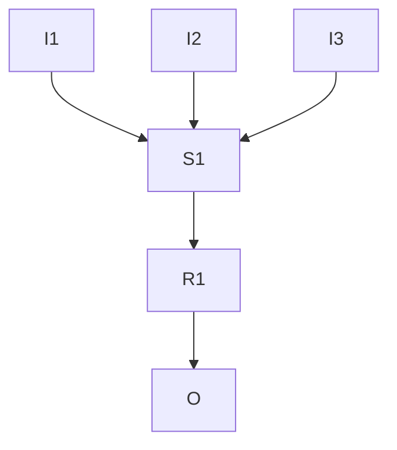

                 


# 如何评估企业的创新文化

## 关键词

- 企业创新文化
- 创新文化评估
- 企业创新机制
- 创新激励
- 创新氛围

## 摘要

企业的创新文化是企业在竞争激烈的市场中保持活力和持续发展的关键。本文将详细探讨如何评估企业的创新文化，涵盖创新文化的核心概念、评估模型、系统架构、项目实战以及最佳实践等方面，帮助企业在实际操作中识别和改进创新文化，从而提升企业的创新能力。

---

## 正文

### 第1章：创新文化概述

#### 1.1 创新文化的核心概念

创新文化是指企业在组织内部营造的一种鼓励创新、容忍失败、重视学习和适应变化的工作氛围。它不仅包括员工的创新意识和行为，还包括企业内部的支持机制和创新生态系统。

##### 1.1.1 创新文化的定义

创新文化是一个组织中支持和促进员工创新的综合环境，包括企业战略、组织结构、管理制度、激励机制、员工价值观等多个方面。

##### 1.1.2 创新文化的重要性

创新文化是企业在竞争中保持优势的关键。它能够激发员工的创造力，促进技术进步，增强企业的市场竞争力，提升企业的适应能力和应变能力。

##### 1.1.3 创新文化的影响因素

创新文化的影响因素包括领导风格、员工参与度、资源配置、信息共享、激励机制、风险容忍度等。

#### 1.2 企业创新文化评估的必要性

##### 1.2.1 企业创新文化评估的意义

评估创新文化有助于企业识别现有问题，优化创新机制，提升创新效率，增强企业的整体竞争力。

##### 1.2.2 企业创新文化评估的常见问题

企业在创新文化评估中可能面临的问题包括评估标准不明确、评估方法不科学、数据收集困难、结果应用不足等。

##### 1.2.3 企业创新文化评估的边界与外延

创新文化评估的边界包括企业内部的创新氛围、创新机制和创新激励；外延则涉及外部环境对企业创新文化的影响。

#### 1.3 企业创新文化的结构与核心要素

##### 1.3.1 创新文化的结构

创新文化通常包括创新意识、创新能力和创新行为三个维度。

##### 1.3.2 创新文化的核心要素

- **创新意识**：员工对创新的认同和主动寻求改进的意识。
- **创新机制**：企业内部支持创新的组织结构和流程。
- **创新激励**：激励员工参与创新的奖励机制和文化氛围。

##### 1.3.3 创新文化与其他管理概念的联系

创新文化与企业战略、组织管理、风险管理等密切相关，是企业整体管理体系的重要组成部分。

---

### 第2章：创新文化的核心要素分析

#### 2.1 创新文化的核心要素

##### 2.1.1 创新氛围

创新氛围是指企业内部员工感受到的创新环境，包括开放的沟通、支持性的领导风格和包容失败的文化。

##### 2.1.2 创新机制

创新机制是指企业内部支持创新的具体流程和制度，包括项目管理、资源分配、知识共享等。

##### 2.1.3 创新激励

创新激励是指企业通过奖励、认可等方式激励员工提出创新想法和解决方案。

#### 2.2 创新文化要素的对比分析

##### 2.2.1 创新氛围与创新机制的对比

- 创新氛围是员工感知到的环境氛围，而创新机制是具体的制度安排。
- 创新氛围影响员工的创新意愿，而创新机制影响创新的实际效果。

##### 2.2.2 创新机制与创新激励的对比

- 创新机制关注创新流程和制度，而创新激励关注激励措施和奖励机制。
- 创新机制是实现创新激励的基础，而创新激励是创新机制的重要组成部分。

#### 2.3 创新文化的ER实体关系图

```mermaid
er
  %% 创新文化ER实体关系图
  矩形 表示创新文化核心要素
  矩形 创新氛围
  矩形 创新机制
  矩形 创新激励
  矩形 创新意识
  矩形 创新能力
  矩形 创新行为
  创新氛围 --> 创新意识
  创新机制 --> 创新能力
  创新激励 --> 创新行为
  创新意识 --> 创新行为
```

---

### 第3章：创新文化评估的模型与方法

#### 3.1 创新文化评估的理论基础

##### 3.1.1 创新文化评估的基本原理

创新文化评估通常基于系统性、全面性的原则，通过定性与定量相结合的方法进行。

##### 3.1.2 创新文化评估的核心模型

常用模型包括360度评估模型、创新指数模型、成熟度模型等。

##### 3.1.3 创新文化评估的数学模型

创新文化评估指数（ICE）可以通过以下公式计算：

$$ ICE = \frac{\sum_{i=1}^{n} (w_i \times s_i)}{n} $$

其中，$w_i$ 是评估指标的权重，$s_i$ 是评估指标的得分，$n$ 是指标数量。

#### 3.2 创新文化评估的算法原理

##### 3.2.1 算法原理的详细讲解

创新文化评估通常采用层次分析法（AHP）或模糊综合评价法，通过多指标权重计算得出综合评估结果。

##### 3.2.2 算法原理的数学公式

层次分析法的计算步骤如下：

1. 构造比较矩阵：
   $$ A = [a_{ij}] $$
   其中$a_{ij}$表示指标$i$相对于指标$j$的重要性。

2. 计算权重向量：
   $$ W = \frac{A}{\sum_{j} A[:, j]} $$

3. 计算一致性检验：
   $$ CR = \frac{CI}{CRITIC} $$

4. 计算最终得分：
   $$ Score_i = \sum_{j} w_j \times s_{ij} $$

##### 3.2.3 算法原理的举例说明

假设我们有三个创新文化评估指标：创新氛围（权重0.4）、创新机制（权重0.3）、创新激励（权重0.3）。评估结果分别为：创新氛围得分0.8，创新机制得分0.7，创新激励得分0.6。则创新文化评估指数为：

$$ ICE = 0.4 \times 0.8 + 0.3 \times 0.7 + 0.3 \times 0.6 = 0.32 + 0.21 + 0.18 = 0.71 $$

---

### 第4章：系统分析与架构设计

#### 4.1 创新文化评估系统的构建

##### 4.1.1 项目介绍

创新文化评估系统旨在为企业提供一个系统化的工具，帮助企业识别创新文化中的问题并提出改进建议。

##### 4.1.2 系统功能设计

系统功能包括数据采集、数据分析、结果展示、报告生成等。

##### 4.1.3 系统架构设计



其中，I1、I2、I3分别为创新氛围、创新机制、创新激励的输入模块，S1为数据分析模块，R1为结果生成模块，O为输出模块。

---

### 第5章：项目实战

#### 5.1 创新文化评估系统的实现

##### 5.1.1 环境安装

需要安装Python、Pandas、Scikit-learn等库。

##### 5.1.2 系统核心实现

以下是创新文化评估系统的Python代码示例：

```python
import pandas as pd
from sklearn.metrics import accuracy_score

# 数据加载
data = pd.read_csv('创新文化数据.csv')

# 特征选择
X = data[['创新氛围', '创新机制', '创新激励']]
y = data['创新文化评分']

# 模型训练
from sklearn.tree import DecisionTreeClassifier
model = DecisionTreeClassifier()
model.fit(X, y)

# 模型预测
y_pred = model.predict(X)

# 模型评估
print('准确率:', accuracy_score(y, y_pred))
```

##### 5.1.3 代码应用解读

上述代码展示了如何使用决策树模型对创新文化进行评估，数据加载、特征选择、模型训练和评估是实现创新文化评估的关键步骤。

##### 5.1.4 实际案例分析

以某科技公司为例，通过数据分析识别其创新文化中的薄弱环节，并提出改进建议。

---

### 第6章：最佳实践与总结

#### 6.1 最佳实践

- 定期进行创新文化评估，及时发现问题。
- 建立创新激励机制，鼓励员工参与创新。
- 加强领导层对创新文化的重视，营造支持创新的氛围。

#### 6.2 小结

创新文化评估是企业持续创新的重要工具。通过系统化的评估和改进，企业可以不断提升其创新能力，增强市场竞争力。

#### 6.3 注意事项

- 创新文化评估需要结合企业的实际情况，避免形式主义。
- 数据收集和分析需要科学严谨，确保评估结果的准确性。
- 创新文化评估是一个持续的过程，需要长期关注和改进。

#### 6.4 拓展阅读

推荐阅读《创新领导力》、《创新管理》等书籍，深入理解创新文化的核心和实践。

---

## 作者信息

作者：AI天才研究院/AI Genius Institute & 禅与计算机程序设计艺术 /Zen And The Art of Computer Programming

---

以上是《如何评估企业的创新文化》的完整目录和内容概述，涵盖了从理论到实践的各个方面，为企业提供了系统化的创新文化评估方法和工具。

