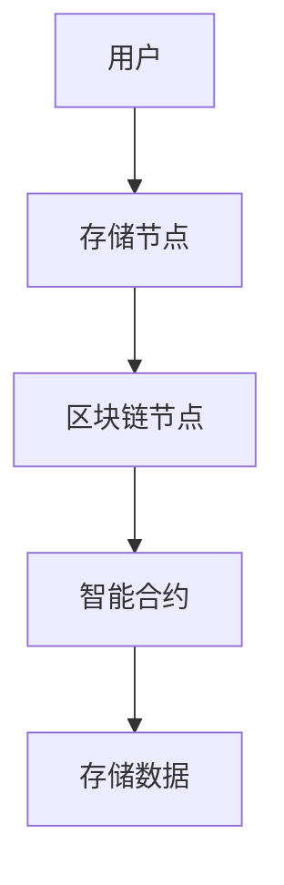
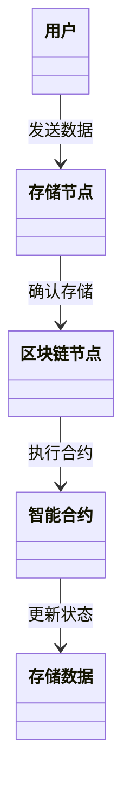
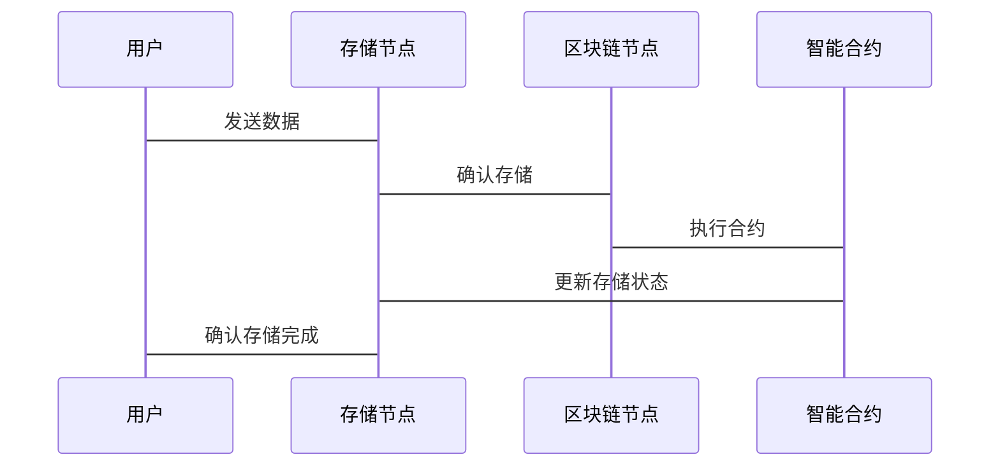

                 


# 如何评估企业的区块链去中心化云存储平台

> 关键词：区块链去中心化云存储、分布式存储、智能合约、数据隐私、安全性评估

> 摘要：本文详细探讨了如何系统性地评估企业区块链去中心化云存储平台，从核心概念、评估标准、系统架构到实际案例分析，结合理论与实践，为企业选择和优化区块链去中心化云存储提供全面指导。

---

## 第一部分: 区块链去中心化云存储平台概述

### 第1章: 区块链与去中心化存储的基本概念

#### 1.1 区块链技术基础

区块链是一种分布式账本技术，通过去中心化的节点网络记录和验证交易，确保数据不可篡改和可追溯。区块链的核心原理包括：

1. **分布式账本**：数据分散存储在多个节点，确保数据一致性和完整性。
2. **共识机制**：通过算法（如PoW、PoS）达成节点间的共识，确保数据准确。
3. **智能合约**：自动执行预定义的合同条款，简化信任中介。

#### 1.2 去中心化存储的概念

去中心化存储通过将数据分散存储在多个节点，避免单点故障和数据集中控制。其核心优势包括：

1. **数据主权**：用户完全控制自己的数据，避免第三方干预。
2. **隐私保护**：数据加密存储，防止未经授权的访问。
3. **抗审查性**：无法通过单一节点进行数据删除或修改。

#### 1.3 区块链去中心化云存储的结合

区块链与去中心化存储的结合，不仅增强了数据的安全性和隐私性，还通过智能合约实现了自动化存储管理。典型应用场景包括：

1. **数据存证**：通过区块链记录数据存储状态，确保数据真实性和不可篡改性。
2. **隐私保护**：利用加密技术确保数据在存储和传输过程中的安全性。
3. **去中心化文件存储**：通过分布式节点存储文件片段，提高数据冗余性和可用性。

### 第2章: 区块链去中心化云存储的核心概念与联系

#### 2.1 核心概念原理

区块链去中心化云存储结合了区块链的分布式账本技术和去中心化存储的文件分片技术。数据被分割成多个片段，加密后存储在不同的节点上，确保数据完整性和隐私性。智能合约用于管理存储权限和数据访问，实现自动化的存储流程。

#### 2.2 核心概念属性特征对比表格

| 概念         | 特性               | 优势                           | 劣势                           |
|--------------|--------------------|--------------------------------|--------------------------------|
| 区块链       | 分布式、不可篡改    | 高度信任、抗审查               | 网络依赖性高、性能受限         |
| 去中心化存储 | 数据主权、隐私保护 | 数据控制权归用户               | 存储成本高、管理复杂           |
| 智能合约     | 可编程、自动化     | 提高效率、降低人为干预         | 代码复杂性高、存在漏洞风险     |

#### 2.3 ER实体关系图架构（Mermaid流程图）



## 第二部分: 区块链去中心化云存储的评估标准

### 第3章: 技术评估标准

#### 3.1 技术成熟度

评估区块链平台的成熟度，包括节点数量、网络稳定性、共识机制的效率等。成熟度高的平台能够支持大规模数据存储和高频交易。

#### 3.2 可扩展性

平台的扩展能力是关键，包括存储容量、节点扩展性、网络带宽等。可扩展性强的平台能够适应企业数据增长需求。

#### 3.3 网络性能

包括延迟、带宽和节点分布。网络性能好的平台能够保证数据存储和访问的速度，减少用户等待时间。

### 第4章: 安全性评估标准

#### 4.1 数据加密与隐私保护

数据在存储和传输过程中必须加密，防止未经授权的访问。加密算法的选择和实现必须经过严格测试，确保安全性。

#### 4.2 系统抗攻击能力

评估平台的抗DDoS攻击、51%攻击等能力。系统必须具备多层次的安全防护机制，确保数据安全。

#### 4.3 智能合约安全审计

智能合约是区块链平台的核心，必须经过第三方安全审计，发现潜在漏洞，确保合约逻辑正确无误。

### 第5章: 可用性与可靠性评估

#### 5.1 系统容错能力

系统在部分节点故障时，仍能正常运行，确保数据的可用性和完整性。

#### 5.2 数据冗余与备份机制

数据存储在多个节点，具备冗余备份，防止数据丢失。冗余机制需要合理设计，平衡存储成本和数据冗余度。

#### 5.3 系统故障恢复能力

系统具备快速恢复机制，能够在节点故障后短时间内恢复正常运行，减少停机时间。

## 第三部分: 区块链去中心化云存储的评估流程

### 第6章: 评估前的需求分析

#### 6.1 企业需求分析

- **存储规模**：企业的数据量决定了需要的存储容量和节点数量。
- **数据类型**：不同数据类型（结构化、非结构化）对存储和查询的要求不同。
- **访问频率**：高频访问需要高性能存储，低频访问则对成本更敏感。

#### 6.2 业务场景分析

- **数据敏感性**：高敏感数据需要更高的安全性和隐私保护措施。
- **合规要求**：遵守数据存储相关的法律法规，如GDPR。
- **成本预算**：评估平台的成本结构，包括存储费用、带宽费用、节点维护费用等。

### 第7章: 技术评估步骤

#### 7.1 选择合适的评估工具

使用专业的区块链分析工具（如Blockchair、Etherscan）和去中心化存储测试工具（如IPFS测试工具）进行技术评估。

#### 7.2 技术参数测试

- **网络性能测试**：测量存储和检索数据的延迟和带宽。
- **存储效率测试**：评估数据分片和加密的效率，确保数据存储和检索的速度。
- **智能合约执行效率**：测试智能合约的执行速度和响应时间，确保其在高频操作下的稳定性。

---

## 第四部分: 系统分析与架构设计方案

### 第8章: 系统功能设计

#### 8.1 领域模型设计（Mermaid类图）



#### 8.2 系统架构设计（Mermaid架构图）


### 第9章: 系统接口设计与交互

#### 9.1 接口设计

- **数据存储接口**：定义数据存储的API，包括数据分片、加密、存储位置选择等。
- **数据检索接口**：定义数据检索的API，包括数据位置查询、数据解密、数据合并等。

#### 9.2 交互设计（Mermaid序列图）



## 第五部分: 项目实战

### 第10章: 环境安装与核心实现

#### 10.1 环境安装

- **区块链平台选择**：如Ethereum、IPFS。
- **存储节点部署**：安装必要的软件和配置节点。
- **智能合约开发**：使用Solidity语言编写智能合约，并部署到区块链平台。

#### 10.2 核心代码实现

```python
# 智能合约示例
def store_data(data):
    hashed_data = hash(data)
    data_fragments = split_data(data)
    for fragment in data_fragments:
        encrypt_fragment(fragment)
        send_to_storage_node(fragment)
    return hashed_data

def retrieve_data(hash):
    data_fragments = get_from_storage_node(hash)
    decrypted_data = decrypt_fragments(data_fragments)
    merge_fragments(decrypted_data)
    return merged_data
```

### 第11章: 案例分析与小结

#### 11.1 案例分析

某企业选择IPFS作为去中心化存储平台，通过智能合约管理数据访问权限。在测试过程中，发现数据检索延迟较高，通过优化节点分布和增加带宽，显著提升了性能。

#### 11.2 项目小结

通过实际案例分析，验证了区块链去中心化云存储平台的可行性和优势，同时也发现了在实际应用中需要关注的问题，如网络性能优化和智能合约的安全性。

---

## 第六部分: 结论

### 第12章: 结论与展望

区块链去中心化云存储平台为企业提供了高效、安全、隐私的存储解决方案。通过系统的评估和优化，企业可以充分发挥区块链技术的优势，提升数据管理能力。未来，随着技术的成熟，区块链去中心化云存储将在更多领域得到广泛应用。

---

## 作者

作者：AI天才研究院/AI Genius Institute  
联系：[禅与计算机程序设计艺术](https://github.com/Zen-Art-of-Programming)  
邮箱：contact@zen-art.com  

---

通过以上结构化和详细的内容，这篇文章将为企业提供全面的指导，帮助其评估和选择适合的区块链去中心化云存储平台，确保数据的安全、隐私和高效管理。

