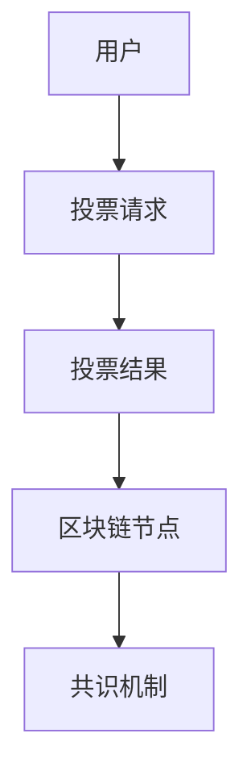
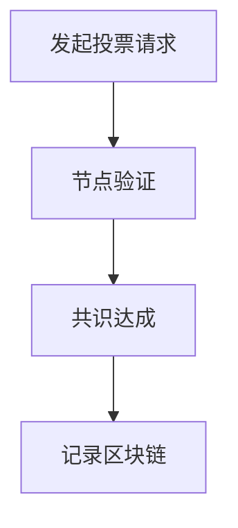
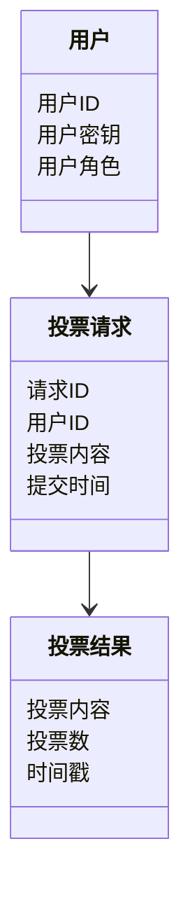
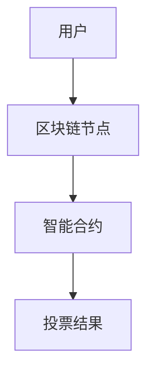
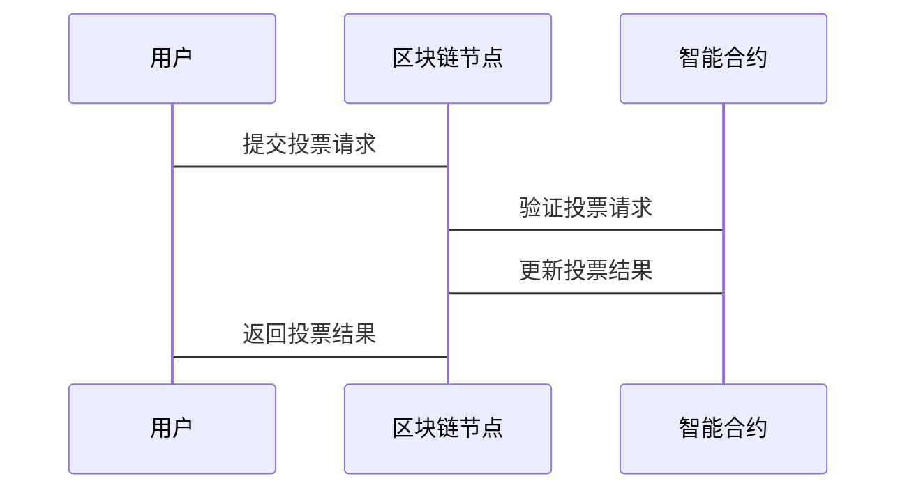

                 


# 如何评估企业的区块链投票系统应用

## 关键词：区块链、投票系统、评估方法、企业应用、安全性、可扩展性

## 摘要：本文将详细探讨如何评估企业级区块链投票系统的应用，从技术原理、系统架构到实际案例分析，逐步解析评估的关键点，包括安全性、效率、透明性等核心维度，为企业选择和优化区块链投票系统提供指导。

---

# 目录

## 第一部分: 区块链投票系统概述

### 第1章: 区块链投票系统背景与概念

#### 1.1 区块链技术基础
- 1.1.1 区块链的基本概念
- 1.1.2 区块链的核心特性
- 1.1.3 区块链的共识机制

#### 1.2 投票系统的基本概念
- 1.2.1 投票系统的定义
- 1.2.2 投票系统的应用场景
- 1.2.3 投票系统的优缺点

#### 1.3 区块链与投票系统的结合
- 1.3.1 区块链投票系统的定义
- 1.3.2 区块链投票系统的应用场景
- 1.3.3 区块链投票系统的优缺点

### 第2章: 区块链投票系统的核心概念

#### 2.1 区块链投票系统的组成
- 2.1.1 用户身份验证
- 2.1.2 投票请求的提交
- 2.1.3 投票结果的记录与验证

#### 2.2 区块链投票系统的属性特征对比
- 2.2.1 安全性对比
- 2.2.2 可扩展性对比
- 2.2.3 透明性对比

#### 2.3 区块链投票系统的ER实体关系图


### 第3章: 区块链投票系统的算法原理

#### 3.1 共识机制的流程


#### 3.2 智能合约的实现
```mermaid
graph TD
    A[用户提交投票] --> B[智能合约触发]
    B --> C[合约执行]
    C -
```

---

## 第二部分: 区块链投票系统的系统分析与架构设计

### 第4章: 系统分析与架构设计

#### 4.1 问题场景介绍
- 投票系统中的身份验证问题
- 投票数据的安全性问题
- 投票结果的透明性问题

#### 4.2 项目介绍
- 项目目标：实现一个安全、透明、可扩展的区块链投票系统
- 项目范围：企业内部投票、股东大会投票
- 项目需求：支持多用户投票、实时结果查询、数据不可篡改

#### 4.3 系统功能设计


#### 4.4 系统架构设计


#### 4.5 系统接口设计
- 用户接口：提交投票请求、查询投票结果
- 区块链节点接口：验证投票请求、执行共识机制
- 智能合约接口：处理投票请求、更新投票结果

#### 4.6 系统交互流程


---

## 第三部分: 区块链投票系统的评估方法

### 第5章: 评估方法与指标

#### 5.1 评估维度
- 安全性：防止投票篡改和身份验证漏洞
- 效率：投票请求的处理速度和区块链的可扩展性
- 透明性：投票结果的可查性和追溯性

#### 5.2 评估框架
- 安全性评估：检查智能合约漏洞、节点的安全性
- 效率评估：测量投票请求的处理时间、区块链的吞吐量
- 透明性评估：检查投票结果的记录和查询功能

#### 5.3 评估指标
| 指标 | 描述 |
|------|------|
| 安全性 | 系统是否能防止投票篡改和身份验证漏洞 |
| 效率 | 系统处理投票请求的速度和区块链的可扩展性 |
| 透明性 | 系统是否能提供投票结果的可查性和追溯性 |

### 第6章: 实际案例分析

#### 6.1 案例背景
- 某企业股东大会的投票系统

#### 6.2 评估过程
- 系统安全性评估：检查智能合约漏洞
- 系统效率评估：测量投票请求的处理时间
- 系统透明性评估：检查投票结果的记录和查询功能

#### 6.3 评估结果
- 安全性：高
- 效率：中
- 透明性：高

---

## 第四部分: 区块链投票系统的项目实战

### 第7章: 项目实战

#### 7.1 环境搭建
- 安装区块链平台：以太坊、Hyperledger Fabric
- 安装智能合约开发工具：Solidity、Web3.js

#### 7.2 核心代码实现
```javascript
// 智能合约代码
contract VotingSystem {
    mapping(address => uint) public votes;
    function vote(uint voteId, address voter) {
        votes[voter]++;
    }
    function getResult() view returns (uint) {
        return votes[msg.sender];
    }
}
```

#### 7.3 功能测试
- 测试投票请求提交功能
- 测试投票结果查询功能
- 测试系统安全性

---

## 第五部分: 区块链投票系统的最佳实践与总结

### 第8章: 最佳实践

#### 8.1 选择合适的区块链平台
- 根据企业需求选择公有链或私有链
- 考虑链的可扩展性和安全性

#### 8.2 系统安全性测试
- 定期进行漏洞扫描
- 进行渗透测试

#### 8.3 系统优化
- 优化智能合约的效率
- 优化区块链节点的性能

### 第9章: 总结与未来展望

#### 9.1 总结
- 区块链投票系统的优势：安全性高、透明性强
- 评估的关键点：安全性、效率、透明性

#### 9.2 未来展望
- 区块链技术的进一步发展
- 投票系统的智能化和自动化

---

## 作者：AI天才研究院/AI Genius Institute & 禅与计算机程序设计艺术 /Zen And The Art of Computer Programming

