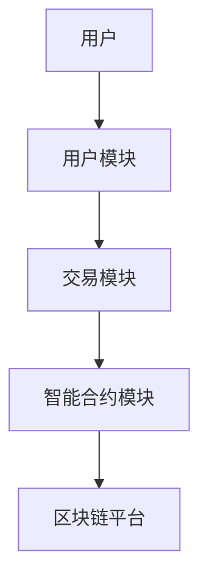

                 


# 如何评估企业的区块链数字版权交易平台

## 关键词：区块链，数字版权，交易平台，评估，企业应用，系统设计

## 摘要：本文详细探讨了如何评估企业的区块链数字版权交易平台，从核心概念到系统架构，再到实际实现，系统地分析了评估的关键点。文章通过具体的技术细节和案例分析，为读者提供了全面的评估方法和实现方案，帮助企业在数字化转型中更好地应用区块链技术。

---

## 第1章：区块链与数字版权概述

### 1.1 区块链的基本概念

#### 1.1.1 区块链的定义与特点

区块链是一种分布式账本技术，通过去中心化的记录方式确保数据的安全性和不可篡改性。其特点包括去中心化、透明性、不可篡改性和匿名性。区块链通过密码学算法保证数据的安全性，通过共识机制确保所有节点达成一致。

#### 1.1.2 区块链的核心技术原理

区块链的核心技术包括：

- **分布式账本**：数据分布在多个节点上，确保数据的冗余和安全性。
- **共识机制**：如PoW、PoS等，确保所有节点达成一致。
- **智能合约**：自动执行的代码，用于自动化业务流程。

#### 1.1.3 区块链在数字版权中的应用

区块链在数字版权中的应用主要体现在确权、交易和保护方面。通过区块链技术，可以确保数字内容的版权归属明确，防止盗版和非法复制。

### 1.2 数字版权的挑战与解决方案

#### 1.2.1 数字版权的定义与现状

数字版权是指数字内容的创作者对其作品享有的权利。然而，数字内容的易复制性和传播速度快，导致版权保护困难。

#### 1.2.2 数字版权交易中的痛点

- **版权归属不清**：难以证明作品的原创性和所有权。
- **交易中间环节多**：交易效率低，成本高。
- **盗版问题严重**：难以有效防止和追踪盗版行为。

#### 1.2.3 区块链如何解决数字版权问题

通过区块链技术，可以实现版权的确权、登记、交易和保护，确保数字内容的版权归属清晰，交易过程透明且高效。

### 1.3 区块链数字版权交易平台的必要性

#### 1.3.1 企业数字化转型的需求

随着数字化转型的推进，企业需要高效、安全的数字版权交易平台来支持其业务。

#### 1.3.2 区块链在企业中的应用前景

区块链技术在企业中的应用前景广阔，尤其是在数据安全和信任建立方面。

#### 1.3.3 数字版权交易平台对企业的重要性

数字版权交易平台帮助企业实现数字内容的高效交易，保护创作者的权益，促进数字内容产业的发展。

---

## 第2章：区块链的核心技术

### 2.1 分布式账本

#### 2.1.1 分布式账本的定义

分布式账本是一种数据分布技术，数据分布在多个节点上，确保数据的冗余和安全性。

#### 2.1.2 分布式账本的特点

- 数据冗余：确保数据的高可用性。
- 分布式存储：避免单点故障。
- 透明性：所有节点都可以查看数据。

#### 2.1.3 分布式账本在数字版权中的应用

通过分布式账本技术，可以确保数字版权信息的透明性和不可篡改性，为版权交易提供信任基础。

### 2.2 共识机制

#### 2.2.1 共识机制的定义

共识机制是区块链中用于确保所有节点达成一致的机制。

#### 2.2.2 常见共识机制对比

- **PoW（工作量证明）**：通过计算哈希值来证明工作量，确保网络安全。
- **PoS（权益证明）**：通过持有代币的数量来决定记账权，节省能源。
- **Dpos（ delegated Proof of Stake）**：通过选举代表来进行记账，提高效率。

#### 2.2.3 共识机制在数字版权交易中的作用

共识机制确保数字版权交易的透明性和安全性，防止欺诈和篡改。

### 2.3 智能合约

#### 2.3.1 智能合约的定义

智能合约是运行在区块链上的自动执行代码，用于实现预设的业务逻辑。

#### 2.3.2 智能合约的工作原理

智能合约通过预设的条件触发执行，自动完成交易或操作。

#### 2.3.3 智能合约在数字版权交易中的应用

智能合约可以用于自动执行版权交易的条件，如自动支付版权费，确保交易的透明和高效。

---

## 第3章：数字版权的确权与登记

### 3.1 数字版权的确权过程

#### 3.1.1 数字版权的确权定义

确权是指通过技术手段证明数字内容的原创性和所有权。

#### 3.1.2 区块链确权的流程

1. 创作者将作品上传至区块链平台。
2. 区块链系统生成哈希值，记录作品的详细信息。
3. 系统通过共识机制确认作品的归属。

#### 3.1.3 确权的关键技术点

- **哈希函数**：用于生成作品的唯一标识。
- **数字签名**：用于验证作品的来源和真实性。

### 3.2 数字版权的登记系统

#### 3.2.1 登记系统的功能模块

- **用户管理**：管理用户信息和权限。
- **作品登记**：接收和处理作品的登记请求。
- **版权查询**：提供版权信息的查询服务。

#### 3.2.2 登记系统的技术实现

- **区块链API**：用于与区块链平台进行交互。
- **前端界面**：提供用户友好的操作界面。

#### 3.2.3 登记系统的安全性保障

- **访问控制**：确保只有授权用户可以访问敏感信息。
- **加密技术**：保护用户数据的安全。

---

## 第4章：交易平台系统设计

### 4.1 用户模块

#### 4.1.1 用户注册与登录

- **注册**：用户提交基本信息，系统生成账户。
- **登录**：用户通过账户和密码登录系统。

#### 4.1.2 用户信息管理

- **信息修改**：用户可以修改个人信息和联系方式。
- **数字版权管理**：用户可以查看和管理自己的数字版权。

#### 4.1.3 用户数字版权管理

- **版权上传**：用户上传数字内容，系统生成哈希值。
- **版权交易**：用户可以在平台上进行版权交易。

### 4.2 交易模块

#### 4.2.1 交易撮合

- **智能合约**：自动匹配买卖双方，撮合交易。
- **价格协商**：用户可以自行协商交易价格。

#### 4.2.2 交易结算

- **支付系统**：通过智能合约自动完成支付。
- **版权转移**：系统自动更新版权信息，完成转移。

#### 4.2.3 交易记录

- **交易历史**：用户可以查看过去的交易记录。
- **版权状态**：显示当前版权的持有者和状态。

---

## 第5章：系统实现

### 5.1 系统架构设计

#### 5.1.1 系统功能模块

- **用户模块**：用户注册、登录、信息管理。
- **交易模块**：版权登记、交易撮合、结算。
- **智能合约模块**：自动执行交易逻辑。

#### 5.1.2 系统架构图



#### 5.1.3 系统接口设计

- **用户API**：用于用户模块的接口调用。
- **交易API**：用于交易模块的接口调用。

### 5.2 核心代码实现

#### 5.2.1 智能合约实现

```solidity
pragma solidity ^0.8.0;

contract Copyright {
    struct CopyrightInfo {
        address owner;
        uint256 timestamp;
        string hash;
    }

    mapping(string => CopyrightInfo) public版权信息;

    function register(string memory _hash) public {
        CopyrightInfo memory info = 版权信息[_hash];
        if (info.owner == address(0)) {
            info.owner = msg.sender;
            info.timestamp = block.timestamp;
            版权信息[_hash] = info;
        }
    }

    function transfer(string memory _hash, address _newOwner) public {
        CopyrightInfo storage info = 版权信息[_hash];
        require(info.owner == msg.sender, "无权转移");
        info.owner = _newOwner;
        info.timestamp = block.timestamp;
    }
}
```

#### 5.2.2 交易平台后端实现

```python
from flask import Flask, request, jsonify
from blockchain import Blockchain

app = Flask(__name__)
chain = Blockchain()

@app.route('/register', methods=['POST'])
def register():
    data = request.json
    hash_value = data.get('hash')
    # 调用区块链的注册方法
    chain.register(hash_value)
    return jsonify({'status': 'success'})

@app.route('/transfer', methods=['POST'])
def transfer():
    data = request.json
    hash_value = data.get('hash')
    new_owner = data.get('new_owner')
    # 调用区块链的转移方法
    chain.transfer(hash_value, new_owner)
    return jsonify({'status': 'success'})
```

### 5.3 项目实战

#### 5.3.1 环境安装

- **区块链框架**：安装Solidity编译器和以太坊节点。
- **交易平台**：安装Flask框架和必要的依赖库。

#### 5.3.2 核心代码实现

- **智能合约**：实现版权登记和转移功能。
- **交易平台**：实现用户接口和交易逻辑。

#### 5.3.3 案例分析

- **案例1**：用户A上传作品，系统生成哈希值并记录。
- **案例2**：用户A将版权转移给用户B，系统自动更新版权信息。

---

## 第6章：总结与展望

### 6.1 最佳实践 tips

- **安全性**：确保系统的安全性，防止数据泄露和攻击。
- **用户体验**：优化交易平台的用户界面，提升用户体验。
- **性能优化**：通过技术手段优化系统性能，提高交易效率。

### 6.2 小结

本文详细探讨了如何评估企业的区块链数字版权交易平台，从核心概念到系统架构，再到实际实现，系统地分析了评估的关键点。

### 6.3 注意事项

- 在实际应用中，需注意系统的可扩展性和维护性。
- 确保系统的安全性和合规性，遵守相关法律法规。

### 6.4 拓展阅读

- 深入研究区块链的其他应用，如供应链管理和智能合约的优化。
- 关注行业动态，了解最新的技术发展和趋势。

---

## 作者：AI天才研究院 & 禅与计算机程序设计艺术

本文作者是AI天才研究院及禅与计算机程序设计艺术，专注于区块链技术研究与应用，致力于为企业提供高效的数字版权交易平台解决方案。

