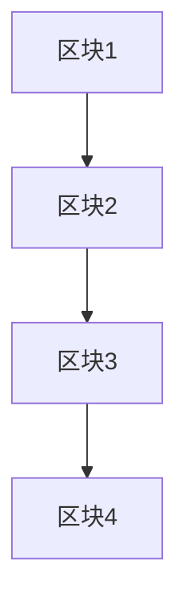
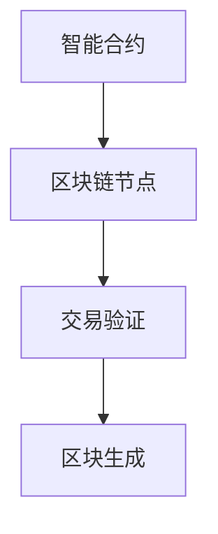
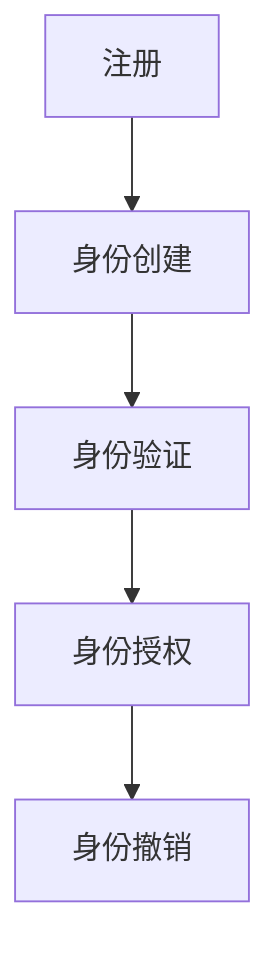
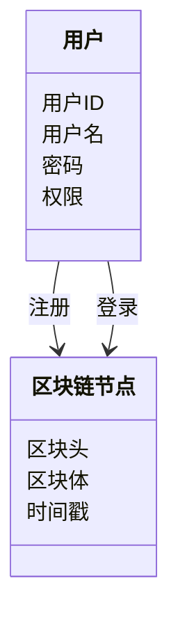
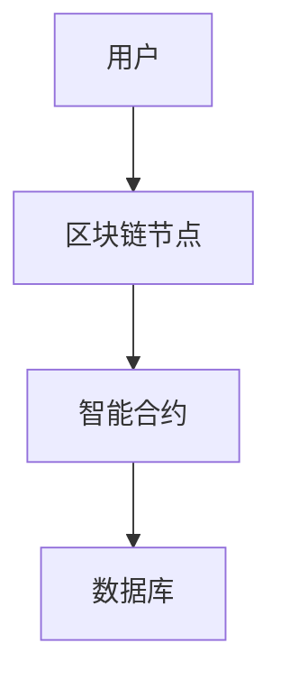

                 


# 如何评估企业的区块链数字身份认证应用

## 关键词：区块链，数字身份认证，评估方法，系统架构，项目实战，安全性能

## 摘要：区块链技术作为一种分布式账本技术，正在改变数字身份认证的实现方式。本文将详细探讨如何评估企业中的区块链数字身份认证应用，包括技术原理、系统架构、评估指标、安全性能、项目实现等关键内容，帮助读者全面了解并有效实施区块链数字身份认证解决方案。

---

## 第1章 区块链与数字身份认证概述

### 1.1 区块链技术基础

#### 1.1.1 区块链的基本概念

区块链是一种分布式账本技术，通过去中心化的方式记录数据，具有不可篡改和可追溯的特性。它由多个区块组成，每个区块包含一定的交易数据，并通过链式结构相互连接。



区块链的核心特征包括：

1. **去中心化**：没有单一的控制中心，数据由网络中的多个节点共同维护。
2. **不可篡改**：通过加密算法和共识机制确保数据的安全性和一致性。
3. **可追溯**：每个交易都可以追溯到原始来源，便于追踪和审计。

#### 1.1.2 区块链的核心特点

| 特性 | 描述 |
|------|------|
| 分布式 | 数据存储在多个节点上，避免单点故障 |
| 去中心化 | 没有中心控制机构，减少被攻击风险 |
| 可追溯 | 每个交易都有时间戳，便于追踪 |
| 安全性 | 使用加密算法确保数据完整性 |

#### 1.1.3 区块链在企业中的应用

区块链在企业中的应用领域包括供应链管理、金融支付、版权保护、身份认证等。其中，数字身份认证是区块链技术的重要应用场景之一。

---

### 1.2 数字身份认证的概念

#### 1.2.1 数字身份的定义

数字身份是指在数字世界中，用于标识用户身份的一组信息，包括用户名、密码、数字证书等。

#### 1.2.2 数字身份认证的类型

数字身份认证主要分为以下几种类型：

1. **基于密码的身份认证**：使用用户名和密码进行验证。
2. **基于证书的身份认证**：使用数字证书进行验证。
3. **基于生物特征的身份认证**：使用指纹、面部识别等生物特征进行验证。

#### 1.2.3 数字身份认证的重要性

在企业中，数字身份认证是保障系统安全的重要手段，能够防止未经授权的访问，保护用户数据的安全性。

---

### 1.3 区块链与数字身份认证的结合

#### 1.3.1 区块链在数字身份认证中的优势

区块链技术在数字身份认证中的优势主要体现在以下几个方面：

1. **去中心化**：避免了传统中心化身份认证系统可能存在的单点故障问题。
2. **不可篡改**：区块链上的数据难以被篡改，确保身份信息的真实性。
3. **可追溯**：可以通过区块链记录用户的操作历史，便于审计和追踪。

#### 1.3.2 区块链数字身份认证的典型应用场景

1. **企业内部身份认证**：员工登录系统时的身份验证。
2. **供应链管理**：供应商的身份认证和权限管理。
3. **金融支付**：用户身份认证和交易授权。

#### 1.3.3 区块链数字身份认证的挑战

1. **技术复杂性**：区块链技术的实现相对复杂，需要较高的技术门槛。
2. **性能瓶颈**：大规模数据量下，区块链的处理速度可能成为瓶颈。
3. **法律与合规**：不同国家和地区对区块链技术的法律监管可能存在差异。

---

## 第2章 区块链技术的核心原理

### 2.1 区块链的共识机制

#### 2.1.1 共识机制的定义

共识机制是区块链中用于达成分布式系统中节点一致性的算法。

#### 2.1.2 常见的共识机制

| 共识机制 | 描述 | 优点 | 缺点 |
|----------|------|------|------|
| PoW（工作量证明） | 通过计算哈希值来验证区块的有效性 | 安全性高 | 资源消耗大 |
| PoS（权益证明） | 根据持币数量来决定记账权 | 资源消耗低 | 安全性较低 |
| BFT（拜占庭容错） | 通过投票机制达成共识 | 适用于小型网络 | 适用于大型网络时性能下降 |

### 2.2 区块链的智能合约

#### 2.2.1 智能合约的定义

智能合约是区块链上运行的自动执行程序，用于实现特定的业务逻辑。

#### 2.2.2 智能合约的工作原理



---

## 第3章 数字身份认证的核心概念与技术

### 3.1 数字身份认证的实现方式

#### 3.1.1 基于密码学的身份认证

基于密码学的身份认证通过加密算法实现数据的安全传输和存储。

### 3.1.2 基于证书的身份认证

数字证书通过公钥基础设施（PKI）实现身份认证。

### 3.2 数字身份认证的生命周期



### 3.3 数字身份认证的属性与特征对比

| 属性 | 描述 |
|------|------|
| 安全性 | 身份认证的安全性保障 |
| 可扩展性 | 系统能否支持用户数量的增长 |
| 可维护性 | 系统维护的难易程度 |

---

## 第4章 区块链数字身份认证的评估方法

### 4.1 评估指标的分类

#### 4.1.1 技术指标

| 指标 | 描述 |
|------|------|
| 安全性 | 系统防止未授权访问的能力 |
| 性能 | 系统处理交易的速度 |

#### 4.1.2 业务指标

| 指标 | 描述 |
|------|------|
| 可扩展性 | 系统支持用户数量增长的能力 |
| 可维护性 | 系统维护的难易程度 |

### 4.2 评估指标的权重分配

评估指标的权重分配需要根据具体应用场景的需求来确定。例如，在金融领域，安全性可能比性能更重要。

### 4.3 评估方法论

#### 4.3.1 定性评估

定性评估主要通过专家评审和案例分析来评估系统的设计合理性。

#### 4.3.2 定量评估

定量评估主要通过数学模型和实际测试数据来评估系统的性能和安全性。

---

## 第5章 区块链数字身份认证系统的架构设计

### 5.1 问题场景介绍

假设我们正在设计一个基于区块链的企业员工身份认证系统，需要实现员工的注册、登录、权限管理等功能。

### 5.2 系统功能设计

#### 5.2.1 领域模型设计



#### 5.2.2 系统架构设计



### 5.3 系统接口设计

系统接口设计主要包括用户与区块链节点之间的交互接口，区块链节点与智能合约之间的调用接口等。

### 5.4 系统交互设计

```mermaid
graph TD
    A[用户] --> B[区块链节点]: 注册请求
    B --> C[智能合约]: 验证用户信息
    C --> D[数据库]: 存储用户信息
```

---

## 第6章 区块链数字身份认证项目的实战

### 6.1 环境配置

假设我们使用以太坊平台进行开发，需要安装以太坊节点、Solidity编译器、以及相关的开发工具。

### 6.2 核心代码实现

#### 6.2.1 智能合约实现

```solidity
// SPDX-License-Identifier: MIT
pragma solidity ^0.8.0;

contract IdentityAuthentication {
    struct User {
        bytes32 userId;
        bytes32 username;
        bytes32 passwordHash;
        uint256 timestamp;
    }

    mapping(bytes32 => User) private users;

    function register(bytes32 userId, bytes32 username, bytes32 passwordHash) public {
        users[userId] = User(userId, username, passwordHash, block.timestamp);
    }

    function login(bytes32 userId, bytes32 passwordHash) public view returns (bool) {
        User memory user = users[userId];
        return user.passwordHash == passwordHash;
    }
}
```

#### 6.2.2 后端代码实现

```python
from web3 import Web3

# 初始化以太坊节点
web3 = Web3(Web3.HTTPProvider('http://localhost:8545'))

# 定义智能合约地址和ABI
contract_address = '0x...'
contract_abi = [...]  # 智能合约的ABI

# 创建合约实例
contract = web3.eth.contract(contract_address, abi=contract_abi)

# 用户注册
def register(user_id, username, password_hash):
    transaction = contract.functions.register(user_id, username, password_hash).transact()
    receipt = web3.eth.wait_for_transaction_receipt(transaction)
    return receipt.status == '成功'

# 用户登录
def login(user_id, password_hash):
    result = contract.functions.login(user_id, password_hash).call()
    return result
```

### 6.3 项目小结

通过以上步骤，我们成功实现了一个基于区块链的数字身份认证系统，能够支持用户的注册、登录和权限管理功能。

---

## 第7章 总结与展望

### 7.1 本章小结

本文详细探讨了如何评估企业的区块链数字身份认证应用，从技术原理、系统架构到项目实现，全面覆盖了区块链数字身份认证的核心内容。

### 7.2 未来展望

随着区块链技术的不断发展，数字身份认证的应用场景将更加广泛。未来的研究方向可以包括提高系统的性能、优化共识机制、加强系统的安全性等。

### 7.3 最佳实践 Tips

1. 在实际应用中，需要根据具体需求选择合适的区块链平台和共识机制。
2. 定期进行安全测试，确保系统的安全性。
3. 注重系统的可扩展性和可维护性设计。

---

## 作者：AI天才研究院 & 禅与计算机程序设计艺术

---

以上内容为基于区块链数字身份认证应用的详细评估方法和实现步骤。

