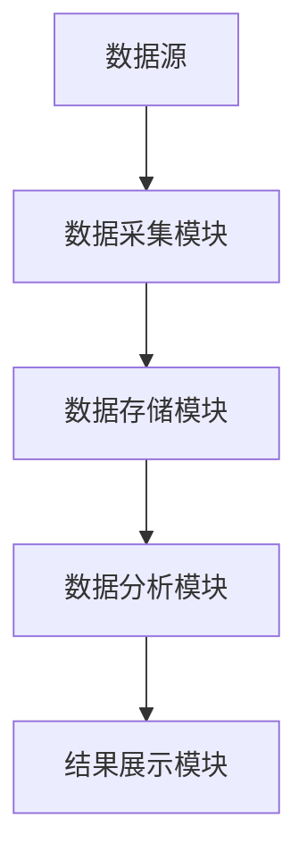
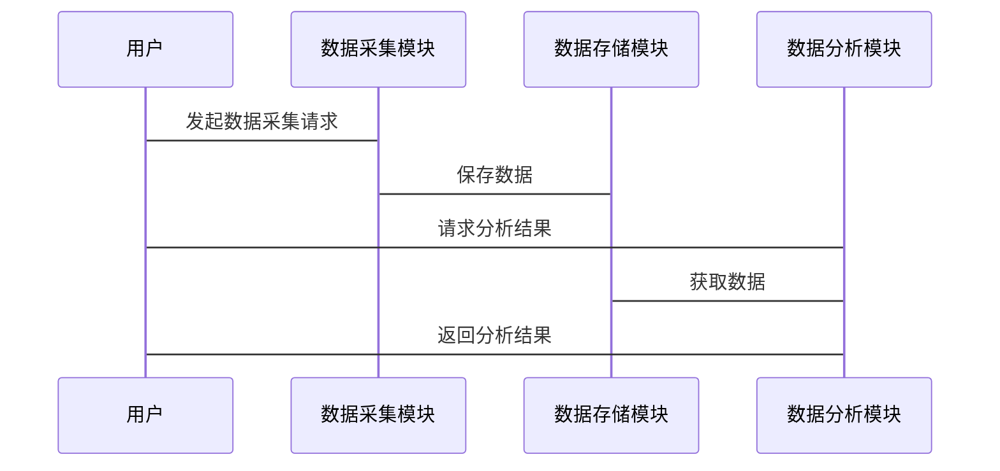

                 


# 如何评估企业的数字化营销效果

## 关键词

- 数字化营销
- 效果评估
- 数据分析
- 营销策略
- KPI指标
- 机器学习

## 摘要

数字化营销已成为现代企业不可或缺的营销手段。然而，如何准确评估数字化营销的效果，以优化策略、提升投资回报率，是每个企业面临的重要挑战。本文将系统地介绍数字化营销效果评估的核心概念、算法原理、系统架构以及项目实战，为您提供从理论到实践的全面指导。通过数据分析和机器学习模型的应用，帮助您科学评估营销效果，优化营销策略，提升企业在数字化时代的竞争力。

---

## 正文

### 第一部分：背景与概述

#### 第1章：数字化营销效果评估的背景与重要性

##### 1.1 数字化营销的定义与特点

数字化营销是指通过数字化渠道和工具进行产品或服务推广的营销方式。其特点包括：

- **数据驱动**：依赖数据分析优化营销策略。
- **精准定位**：利用大数据技术精准触达目标客户。
- **实时互动**：通过社交媒体等渠道与客户实时互动。
- **多渠道整合**：整合线上线下的营销渠道，提升客户体验。

##### 1.2 数字化营销效果评估的必要性

数字化营销的成功与否直接影响企业的收入和品牌形象。科学的评估方法能够帮助企业：

- **优化营销策略**：根据数据反馈调整营销方案。
- **提升投资回报率**：通过数据分析降低营销成本，提高 ROI。
- **增强客户体验**：通过精准营销提升客户满意度和忠诚度。

##### 1.3 数字化营销效果评估的现状与挑战

尽管数字化营销的应用越来越广泛，但其效果评估仍面临诸多挑战：

- **数据繁杂**：需要整合来自多个渠道的大量数据。
- **模型复杂**：评估需要结合统计学和机器学习模型。
- **实时性要求高**：要求快速反馈以支持实时决策。

---

### 第二部分：核心概念与联系

#### 第2章：数字化营销效果评估的核心概念

##### 2.1 数字化营销效果的定义

数字化营销效果是指企业在数字化营销活动中的表现，包括客户互动、转化率、收入增长等多个维度。

##### 2.2 数字化营销效果评估的关键指标

评估数字化营销效果的关键指标包括：

- **流量指标**：PV（页面浏览量）、UV（独立访问者）、IP（独立IP）。
- **转化指标**：转化率、点击率、订单转化率。
- **用户行为指标**：跳出率、停留时间、用户路径。
- **收入相关指标**：ROI（投资回报率）、CAC（客户获取成本）。

##### 2.3 数字化营销效果评估的核心流程

评估流程包括：

1. **数据收集**：通过网站 analytics、社交媒体、CRM 等工具收集数据。
2. **数据分析**：使用统计学方法和机器学习模型对数据进行分析。
3. **结果解读**：根据分析结果提出优化建议。

---

### 第三部分：算法原理讲解

#### 第3章：数字化营销效果评估的主要算法

##### 3.1 基于统计学的评估方法

- **回归分析法**：用于分析变量之间的关系，预测营销活动对销售额的影响。
  - 线性回归模型：$$ y = \beta_0 + \beta_1x + \epsilon $$
  - 逻辑回归模型：$$ P(y=1|x) = \frac{1}{1 + e^{-\beta x}} $$

- **方差分析法**：用于比较不同营销策略的效果差异。

##### 3.2 基于机器学习的评估方法

- **线性回归模型**：用于预测销售量或转化率。
- **随机森林模型**：通过集成学习提高预测准确性。
- **神经网络模型**：适用于复杂的非线性关系分析。

---

### 第四部分：数学模型

#### 第4章：数学模型与案例分析

##### 4.1 线性回归模型

假设我们有广告投放数据，可以通过线性回归模型预测广告对销售额的影响：

$$ \text{销售额} = \beta_0 + \beta_1 \times \text{广告支出} + \epsilon $$

##### 4.2 随机森林模型

随机森林模型适用于多变量分析，能够捕捉复杂的营销效果：

$$ \text{预测转化率} = \text{随机森林}(\text{点击率}, \text{跳出率}, \text{页面停留时间}) $$

---

### 第五部分：系统分析与架构设计

#### 第5章：系统功能与架构设计

##### 5.1 系统功能设计

- 数据采集模块：收集来自网站、社交媒体、广告平台的数据。
- 数据分析模块：利用统计学和机器学习算法进行分析。
- 结果展示模块：以可视化形式呈现分析结果。

##### 5.2 系统架构设计

系统架构图：



##### 5.3 系统接口设计

- 数据接口：RESTful API 接口，用于数据的导入和导出。
- 模型接口：API 接口调用机器学习模型进行预测。

##### 5.4 系统交互设计

序列图：



---

### 第六部分：项目实战

#### 第6章：项目实战与案例分析

##### 6.1 环境安装

安装必要的工具和库：

- Python
- Pandas
- Scikit-learn
- Matplotlib

##### 6.2 核心代码实现

```python
import pandas as pd
from sklearn.linear_model import LinearRegression
from sklearn.metrics import mean_squared_error

# 数据加载
data = pd.read_csv('marketing.csv')

# 特征与目标变量分离
X = data[['广告支出', '点击率']]
y = data['销售额']

# 模型训练
model = LinearRegression()
model.fit(X, y)

# 预测
y_pred = model.predict(X)

# 评估
mse = mean_squared_error(y, y_pred)
print(f'均方误差: {mse}')
```

##### 6.3 案例分析

假设我们有一个广告投放数据集，通过上述代码训练一个线性回归模型，预测广告支出对销售额的影响。分析结果可以指导企业调整广告预算，优化广告投放策略。

##### 6.4 项目小结

通过项目实战，我们掌握了如何利用 Python 和机器学习模型进行数字化营销效果评估。实际案例分析展示了模型的应用价值。

---

### 第七部分：最佳实践与总结

#### 第7章：最佳实践与总结

##### 7.1 最佳实践

- **数据清洗**：确保数据的完整性和准确性。
- **模型调优**：通过交叉验证优化模型性能。
- **持续监测**：实时监控营销效果，及时调整策略。

##### 7.2 总结

数字化营销效果评估是一个复杂但重要的任务。通过本文的系统化方法和实践案例，您可以科学评估营销效果，优化营销策略，提升企业的竞争力。

##### 7.3 注意事项

- 数据隐私保护：确保遵守数据隐私法规。
- 模型解释性：选择可解释性较强的模型，便于结果解读。
- 多维度分析：结合多维度指标全面评估营销效果。

##### 7.4 拓展阅读

- 《数据分析实战》
- 《机器学习算法与应用》
- 《数字化营销策略》

---

## 作者

作者：AI天才研究院/AI Genius Institute & 禅与计算机程序设计艺术 /Zen And The Art of Computer Programming

