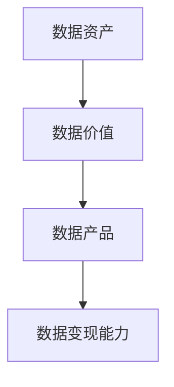
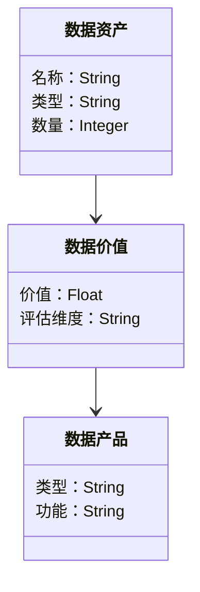
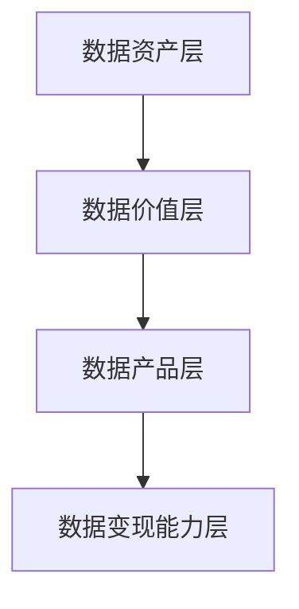
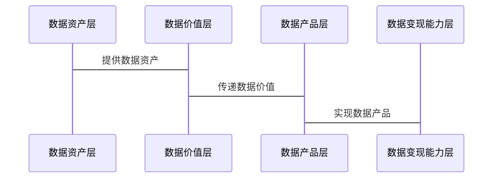

                 


# 如何评估企业的数据变现能力

---

## 关键词：
企业数据变现、数据资产、数据价值、数据产品、数据能力评估、数据驱动、数据安全

---

## 摘要：
在数据经济时代，企业的数据变现能力已成为核心竞争力之一。本文从数据资产、数据价值和数据产品的角度，系统地分析了如何评估企业的数据变现能力。通过背景介绍、核心概念、算法原理、系统架构设计和项目实战，深入探讨了数据变现的关键要素及其数学模型。文章还提供了具体的Python代码示例和实际案例分析，帮助读者理解数据变现的实现过程。最后，本文总结了数据变现能力评估的最佳实践和未来趋势。

---

# 第一部分：企业数据变现能力评估的背景与核心概念

## 第1章：数据变现能力评估的背景与问题描述

### 1.1 数据经济时代的到来  
#### 1.1.1 数据成为核心资产的背景  
在数字化转型的浪潮中，数据已成为企业最重要的资产之一。企业通过收集和分析数据，能够优化业务流程、提升客户体验，并创造新的收入来源。  

#### 1.1.2 数据驱动业务增长的现状  
当前，数据驱动的商业模式正在改变传统行业的格局。例如，电子商务平台通过分析用户行为数据，优化推荐算法，从而实现精准营销。  

#### 1.1.3 数据变现能力对企业价值的影响  
数据变现能力直接关系到企业的市场竞争力和盈利能力。能够高效利用数据的企业，往往能够在市场中占据领先地位。  

---

### 1.2 数据变现的核心问题与挑战  
#### 1.2.1 数据资产化的核心问题  
数据资产化的核心问题是如何将数据转化为可量化的资产。这需要解决数据的清洗、存储和价值评估等问题。  

#### 1.2.2 数据变现的难点与障碍  
数据变现的难点在于数据的质量、隐私保护和数据安全问题。此外，数据的多样性和复杂性也增加了变现的难度。  

#### 1.2.3 数据安全与隐私保护的平衡  
在数据变现过程中，企业需要在数据利用和隐私保护之间找到平衡点。这要求企业建立完善的数据安全管理体系。  

---

### 1.3 数据变现能力的定义与边界  
#### 1.3.1 数据变现能力的定义  
数据变现能力是指企业通过数据的收集、分析和利用，将其转化为经济收益的能力。  

#### 1.3.2 数据变现能力的边界与外延  
数据变现能力的边界在于数据的可利用性和数据的安全性。其外延包括数据资产管理、数据产品开发和数据服务提供。  

#### 1.3.3 数据变现能力与企业战略的关系  
数据变现能力是企业战略的重要组成部分。通过数据变现，企业能够优化资源配置，提升核心竞争力。  

---

## 第2章：数据变现能力的核心概念与联系  

### 2.1 数据资产、数据价值与数据产品的概念对比  
#### 2.1.1 数据资产的属性特征  
数据资产具有可量化的价值、可存储性和可扩展性。  

#### 2.1.2 数据价值的评估维度  
数据价值可以从数据的质量、数量和用途三个维度进行评估。  

#### 2.1.3 数据产品的定义与分类  
数据产品是指基于数据开发的工具或服务。常见的数据产品包括数据分析报告、数据可视化工具和数据预测模型。  

---

### 2.2 数据变现能力的实体关系图  
#### 2.2.1 数据资产、数据价值与数据产品的关系  
数据资产是数据价值的来源，数据价值通过数据产品实现变现。  

#### 2.2.2 数据变现能力的ER实体关系图（Mermaid）  



---

# 第二部分：数据变现能力评估的算法与数学模型  

## 第3章：数据变现能力评估的算法原理  

### 3.1 数据价值评估的算法流程  
#### 3.1.1 数据清洗与预处理  
数据清洗是数据价值评估的第一步，包括去重、去噪和数据格式统一。  

#### 3.1.2 数据特征提取与选择  
通过特征工程提取关键特征，并使用特征选择算法优化特征集。  

#### 3.1.3 数据价值评估模型的训练与验证  
使用回归模型或分类模型对数据价值进行评估，并通过交叉验证优化模型性能。  

---

### 3.2 数据变现能力评估的数学模型  
#### 3.2.1 数据资产价值的计算公式  
$$ 数据资产价值 = \text{数据质量} \times \text{数据数量} \times \text{数据用途} $$  

例如，假设某企业数据质量得分为0.8，数据数量为100万条，数据用途为市场分析，则：  
$$ 数据资产价值 = 0.8 \times 100万 \times 1 = 80万 $$  

---

## 第4章：数据变现能力评估的系统分析与架构设计  

### 4.1 系统功能设计  
#### 4.1.1 领域模型设计（Mermaid类图）  



---

### 4.2 系统架构设计（Mermaid架构图）  



---

### 4.3 系统交互设计（Mermaid序列图）  



---

## 第5章：数据变现能力评估的项目实战  

### 5.1 环境安装与配置  
#### 5.1.1 Python环境安装  
安装Python和必要的库，如Pandas、Scikit-learn和Jupyter Notebook。  

#### 5.1.2 数据集准备  
获取目标行业的数据集，例如电商行业的用户行为数据。  

---

### 5.2 核心代码实现  

#### 5.2.1 数据清洗与预处理  
```python
import pandas as pd

# 加载数据集
data = pd.read_csv('user_behavior.csv')

# 去重和去噪
data.drop_duplicates(inplace=True)
data.dropna(inplace=True)
```

#### 5.2.2 数据特征提取与选择  
```python
# 特征工程
data['购买频率'] = data['购买次数'] / data['用户总数']
data['转化率'] = data['购买用户数'] / data['访问用户数']
```

#### 5.2.3 数据价值评估模型  
```python
from sklearn.linear_model import LinearRegression

# 训练模型
model = LinearRegression()
model.fit(X_train, y_train)

# 预测数据价值
y_pred = model.predict(X_test)
```

---

### 5.3 实际案例分析与解读  
以电商行业为例，通过用户行为数据进行数据价值评估，并开发推荐算法，提升用户购买转化率。  

---

## 第6章：数据变现能力评估的最佳实践与总结  

### 6.1 最佳实践  
- 数据安全是数据变现的基础，必须严格遵守数据隐私保护法规。  
- 数据产品的开发应以用户需求为导向，注重用户体验。  

### 6.2 小结  
本文从理论到实践，全面探讨了企业数据变现能力的评估方法。通过数据资产化、数据价值评估和数据产品开发，企业能够有效提升数据变现能力。  

### 6.3 注意事项  
- 数据处理时需注意数据的完整性和准确性。  
- 数据模型的选择应基于实际业务需求和数据特征。  

### 6.4 拓展阅读  
推荐阅读《数据驱动的商业模式创新》和《大数据分析与商业决策》。  

---

## 作者：AI天才研究院/AI Genius Institute & 禅与计算机程序设计艺术 /Zen And The Art of Computer Programming

