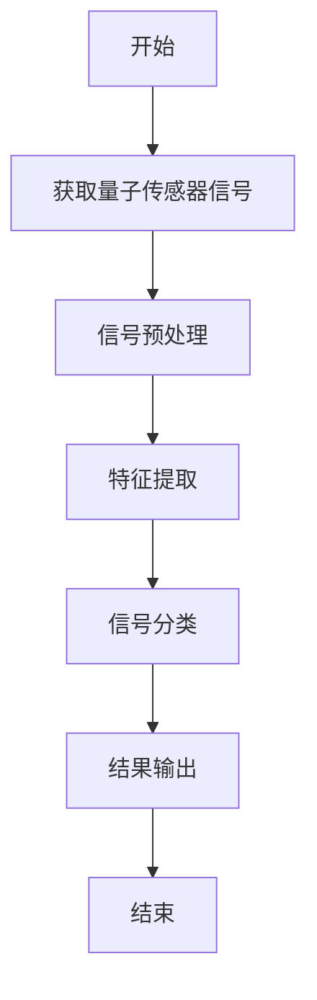
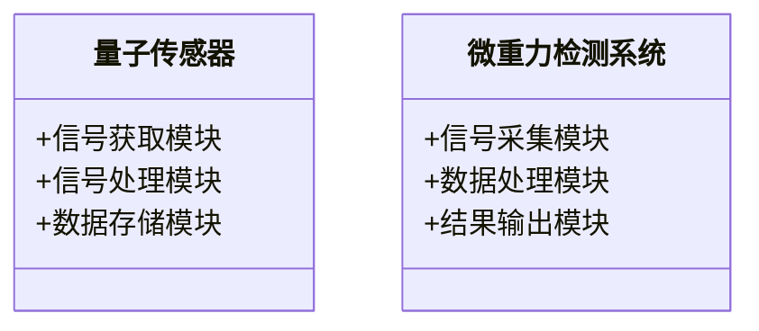
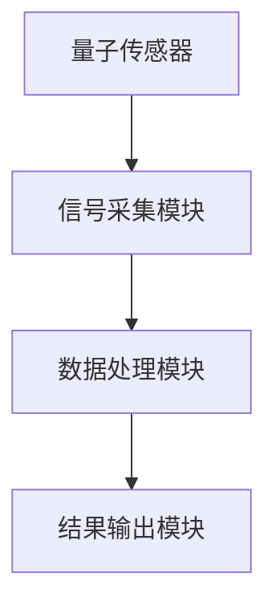
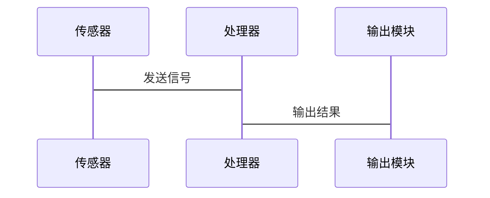

                 


```markdown
# 如何评估企业的量子传感器微重力检测应用

> 关键词：量子传感器，微重力检测，企业应用，技术评估，传感器原理

> 摘要：本文详细探讨了如何评估企业在微重力检测中应用量子传感器的有效性。通过分析量子传感器的核心概念、算法原理、系统架构以及实际项目案例，为企业提供全面的技术评估框架。

---

## 第一部分：量子传感器与微重力检测基础

### 第1章：量子传感器与微重力检测概述

#### 1.1 量子传感器的基本概念

##### 1.1.1 量子传感器的定义
量子传感器是一种基于量子力学原理设计的精密测量工具，能够以极高的灵敏度检测微弱信号。与传统传感器相比，量子传感器具有更高的精度和更快的响应速度，特别适用于微重力检测等高精度测量场景。

##### 1.1.2 微重力检测的基本原理
微重力检测是指在地球表面或其附近区域，测量微小的重力变化。这种技术广泛应用于地质勘探、建筑工程等领域，用于检测地下结构、矿产资源分布等。

##### 1.1.3 量子传感器的优势与局限性
- **优势**：
  - 高灵敏度：量子传感器能够检测到比传统传感器低几个数量级的重力变化。
  - 快速响应：量子传感器的响应时间极短，适合实时监测。
  - 高稳定性：在复杂环境下，量子传感器的性能依然稳定。
- **局限性**：
  - 技术复杂：量子传感器的设计和制造需要高度专业的技术。
  - 成本高昂：由于其高精度和复杂性，量子传感器的成本较高。

#### 1.2 企业应用背景

##### 1.2.1 微重力检测在企业中的应用场景
企业在地质勘探、建筑工程、环境监测等领域需要精确测量微重力变化。例如，在矿产资源勘探中，微重力检测可以帮助企业发现地下矿藏的位置和储量。

##### 1.2.2 量子传感器技术对企业的影响
量子传感器的引入显著提升了微重力检测的精度和效率，为企业节省了成本，提高了生产效率。同时，量子传感器的应用也推动了相关技术的发展，为企业带来了竞争优势。

##### 1.2.3 微重力检测的市场需求与技术趋势
随着技术的进步，市场对高精度微重力检测设备的需求不断增加。量子传感器作为新兴技术，正在逐步取代传统传感器，成为企业的首选。

#### 1.3 量子传感器与微重力检测的关系

##### 1.3.1 微重力检测的核心需求
微重力检测的核心需求是高精度、实时性和稳定性。量子传感器的高灵敏度和快速响应正好满足了这些需求。

##### 1.3.2 量子传感器在微重力检测中的作用
量子传感器通过精确测量微小的重力变化，帮助企业在地质勘探、环境监测等领域做出更准确的决策。

##### 1.3.3 微重力检测的边界与外延
微重力检测的边界包括测量范围、测量精度和测量环境。外延则涉及相关技术如量子传感、数据分析等。

#### 1.4 本章小结
本章介绍了量子传感器的基本概念、微重力检测的应用场景以及量子传感器在企业中的重要性。通过对比传统传感器和量子传感器的优缺点，为后续的技术评估奠定了基础。

---

## 第二部分：量子传感器微重力检测的核心概念与原理

### 第2章：量子传感器微重力检测的核心概念

#### 2.1 核心概念与属性特征

##### 2.1.1 量子传感器的属性特征对比

| 属性         | 传统传感器          | 量子传感器          |
|--------------|---------------------|---------------------|
| 灵敏度       | 较低               | 极高               |
| 响应时间     | 较慢               | 极快               |
| 稳定性       | 中等               | 高                 |
| 精度         | 低                 | 极高               |
| 成本         | 较低               | 高                 |

##### 2.1.2 微重力检测的核心属性
微重力检测的核心属性包括测量精度、响应速度和稳定性。量子传感器在这些方面具有显著优势。

##### 2.1.3 量子传感器的数学模型
量子传感器的信号处理可以表示为：
$$
y = a \cdot x + b
$$
其中，$y$ 是输出信号，$x$ 是输入信号，$a$ 是灵敏度系数，$b$ 是偏置。

#### 2.2 实体关系架构

##### 2.2.1 实体关系图
```mermaid
er
actor 顾客
actor 企业
actor 研究机构
actor 传感器制造商
```

---

## 第三部分：量子传感器微重力检测的算法原理

### 第3章：量子传感器微重力检测算法原理

#### 3.1 算法原理概述

##### 3.1.1 量子传感器信号处理的基本原理
量子传感器通过量子干涉效应检测微小的重力变化。信号处理过程包括信号获取、预处理、特征提取和分类。

##### 3.1.2 微重力检测的信号分析方法
常用的信号分析方法包括傅里叶变换、小波变换等。傅里叶变换用于分析信号的频率特性，小波变换用于分析信号的时间-频率特性。

#### 3.2 算法流程图

##### 3.2.1 算法流程


#### 3.3 算法实现代码

##### 3.3.1 核心代码
```python
def quantum_sensor_signal_processing(signal):
    # 信号预处理
    preprocessed_signal = preprocess(signal)
    
    # 特征提取
    features = extract_features(preprocessed_signal)
    
    # 信号分类
    result = classify(features)
    
    return result
```

##### 3.3.2 信号预处理
```python
def preprocess(signal):
    # 去噪处理
    filtered_signal = apply_filter(signal)
    
    # 标准化处理
    normalized_signal = normalize(filtered_signal)
    
    return normalized_signal
```

##### 3.3.3 特征提取
```python
def extract_features(signal):
    # 傅里叶变换
    fft_result = perform_fft(signal)
    
    # 特征选择
    selected_features = select_features(fft_result)
    
    return selected_features
```

##### 3.3.4 信号分类
```python
def classify(features):
    # 使用机器学习模型进行分类
    model = load_model('quantum_sensor_classifier')
    prediction = model.predict(features)
    
    return prediction
```

#### 3.4 算法数学模型

##### 3.4.1 傅里叶变换
傅里叶变换用于将信号从时域转换到频域，公式为：
$$
X(f) = \sum_{n=-\infty}^{\infty} x(n) e^{-j2\pi f n}
$$

##### 3.4.2 小波变换
小波变换用于信号的多分辨率分析，公式为：
$$
c_{j,k} = \int_{-\infty}^{\infty} x(t) \psi_{j,k}(t) dt
$$

---

## 第四部分：量子传感器微重力检测的系统分析与架构设计

### 第4章：系统分析与架构设计

#### 4.1 系统功能设计

##### 4.1.1 领域模型


#### 4.2 系统架构设计

##### 4.2.1 系统架构图


#### 4.3 系统接口设计

##### 4.3.1 序列图


---

## 第五部分：量子传感器微重力检测的项目实战

### 第5章：项目实战

#### 5.1 环境安装

##### 5.1.1 量子传感器开发框架
需要安装以下工具和库：
- 量子传感器硬件
- Python编程语言
- 相关的信号处理库（如NumPy、SciPy）

#### 5.2 系统核心实现

##### 5.2.1 核心代码实现
```python
import numpy as np
from scipy.fft import fft

def process_signal(sensor_signal):
    # 傅里叶变换
    fft_result = fft(sensor_signal)
    # 特征提取
    dominant_frequency = np.argmax(np.abs(fft_result))
    return dominant_frequency
```

##### 5.2.2 代码解读
- **傅里叶变换**：使用SciPy库中的fft函数对信号进行傅里叶变换，提取信号的主要频率成分。
- **特征提取**：通过比较傅里叶变换结果的幅度，找到最大的幅度对应的频率，作为主要特征。

#### 5.3 实际案例分析

##### 5.3.1 矿产资源勘探
在矿产资源勘探中，使用量子传感器测量微重力变化，帮助地质学家确定矿藏的位置和储量。

##### 5.3.2 建筑工程应用
在建筑工程中，使用量子传感器检测地基的微重力变化，评估建筑的安全性。

#### 5.4 项目小结
通过实际案例分析，展示了量子传感器在微重力检测中的强大能力。企业的应用可以显著提升检测效率和精度。

---

## 第六部分：最佳实践与总结

### 第6章：最佳实践与总结

#### 6.1 最佳实践

##### 6.1.1 数据质量管理
确保数据的准确性和完整性，是量子传感器应用成功的关键。

##### 6.1.2 传感器校准
定期校准传感器，确保其测量精度。

##### 6.1.3 团队协作
量子传感器的应用需要跨学科团队的协作，包括物理学家、工程师和数据科学家。

#### 6.2 总结与展望

##### 6.2.1 总结
量子传感器在微重力检测中的应用前景广阔，能够显著提升企业的技术水平和竞争力。

##### 6.2.2 展望
未来，随着量子技术的不断发展，量子传感器的应用将更加广泛，为企业带来更多创新机会。

---

## 作者信息

作者：AI天才研究院/AI Genius Institute & 禅与计算机程序设计艺术 /Zen And The Art of Computer Programming

---

### 注意事项
在实际应用中，企业需要充分考虑量子传感器的技术复杂性和实施成本，确保在实施前进行全面的技术评估和规划。同时，数据安全和隐私保护也是需要重点关注的方面。

---

通过本文的详细分析，企业可以全面了解如何评估和应用量子传感器进行微重力检测，为企业的技术发展提供有力支持。
```

