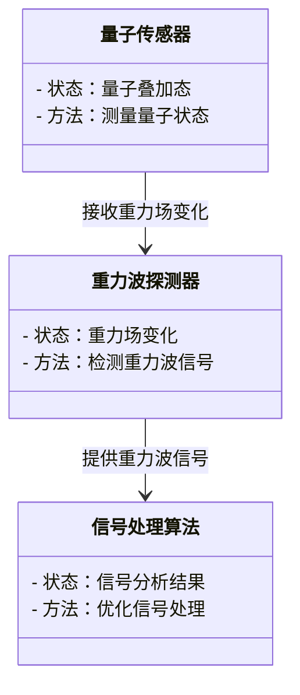
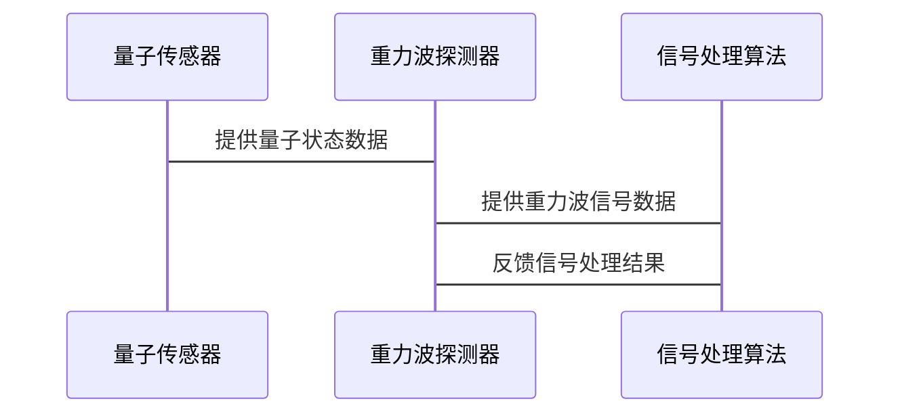

                 


# 如何评估企业的量子传感器重力波探测技术潜力

> **关键词**: 量子传感器, 重力波探测, 技术评估, 企业潜力, 系统架构

> **摘要**: 本文从量子传感器和重力波探测技术的基本原理出发，详细分析了企业在评估这种技术潜力时的关键步骤，包括技术可行性评估、市场潜力分析、系统架构设计等。文章结合实际案例，深入探讨了量子传感器重力波探测技术在企业应用中的潜力，并提供了系统的评估方法和实施建议。

---

## 第1章 量子传感器与重力波探测技术背景

### 1.1 问题背景

#### 1.1.1 量子传感器的基本概念
量子传感器是一种基于量子力学原理设计的传感器，能够利用量子效应（如量子纠缠、量子叠加）来检测物理量（如磁场、重力场）。与传统传感器相比，量子传感器具有更高的灵敏度和精度，能够在复杂环境中提供更准确的数据。

#### 1.1.2 重力波探测技术的科学意义
重力波是由质量分布变化产生的引力波，其探测技术在天文学和物理学领域具有重要意义。通过量子传感器探测重力波，可以提供前所未有的精度和灵敏度，帮助科学家更深入地理解宇宙的运行规律。

#### 1.1.3 企业应用中的潜在价值
企业在量子传感器重力波探测技术上的投入，不仅可以提升自身技术水平，还能在多个领域（如精密测量、地球勘探、航空航天）中获得竞争优势。例如，量子传感器可以用于地球内部结构探测，为能源勘探提供支持。

---

### 1.2 问题描述

#### 1.2.1 量子传感器在重力波探测中的作用
量子传感器通过检测重力场的变化，能够捕捉到重力波信号。这种技术的应用，可以显著提高重力波探测的灵敏度和准确性。

#### 1.2.2 技术实现的核心问题
- 量子传感器的灵敏度是否足够捕捉微弱的重力波信号？
- 量子传感器的稳定性是否能够在复杂环境中长期运行？
- 重力波探测算法的优化是否能够提高信号处理效率？

#### 1.2.3 应用中的主要挑战
- 技术复杂性：量子传感器的研发需要跨学科的知识，包括量子力学、材料科学、信号处理等。
- 成本高昂：量子传感器的研发和部署需要大量的资金投入。
- 市场接受度：企业需要评估市场对这种新技术的接受程度。

---

### 1.3 问题解决

#### 1.3.1 技术解决方案概述
量子传感器重力波探测技术的核心解决方案包括：
1. 开发高灵敏度的量子传感器。
2. 优化信号处理算法，提高重力波信号的检测能力。
3. 降低技术成本，提高技术的可扩展性。

#### 1.3.2 核心技术的实现路径
- 研发量子传感器芯片，提升其灵敏度和稳定性。
- 开发专用的信号处理算法，提高重力波信号的识别能力。
- 优化系统架构，降低整体技术成本。

#### 1.3.3 应用场景的可行性分析
量子传感器重力波探测技术在以下几个领域具有潜在的应用价值：
1. 天文学：用于探测宇宙中的重力波信号。
2. 地球科学：用于地球内部结构的探测。
3. 工程测量：用于精密测量和结构监测。

---

### 1.4 边界与外延

#### 1.4.1 技术应用的边界条件
- 量子传感器的灵敏度和稳定性是技术实现的关键。
- 重力波探测的环境条件（如温度、压力）会影响技术的可行性。

#### 1.4.2 相关领域的外延扩展
- 量子传感器技术可以应用于其他领域，如量子计算、量子通信。
- 重力波探测技术可以与其他物理现象的探测技术结合，形成更广泛的应用场景。

#### 1.4.3 与其他技术的关联性
- 量子传感器技术与传统传感器技术的结合，可以提升整体系统的性能。
- 重力波探测技术与其他物理探测技术（如地震监测）的结合，可以提供更全面的监测能力。

---

## 第2章 量子传感器与重力波探测技术的核心原理

### 2.1 量子传感器的基本原理

#### 2.1.1 量子力学基础
量子力学是量子传感器的核心理论基础。量子系统具有以下特性：
- **量子叠加**：系统可以处于多个状态的叠加态。
- **量子纠缠**：系统中的粒子可以相互纠缠，信息可以通过量子纠缠进行传输。

#### 2.1.2 量子传感器的工作机制
量子传感器通过测量量子系统的状态变化，来感知外部物理量的变化。例如，通过测量量子系统的叠加态是否破坏，来检测重力场的变化。

#### 2.1.3 量子效应在传感器中的应用
- **量子干涉效应**：用于检测微小的物理量变化。
- **量子测量效应**：通过测量量子系统的状态，来获取外部环境的信息。

---

### 2.2 重力波探测技术的原理

#### 2.2.1 重力波的基本特性
重力波是时空的波动，由质量分布的变化产生。其基本特性包括：
- 波速：与光速相同。
- 频率：从低频到高频分布。
- 强度：极弱的引力变化。

#### 2.2.2 重力波探测的物理基础
重力波探测技术基于广义相对论，通过测量空间的微小变化来捕捉重力波信号。量子传感器通过检测空间的变化，来捕捉重力波信号。

#### 2.2.3 量子传感器在重力波探测中的作用
量子传感器通过高灵敏度的测量，能够捕捉到重力波引起的微小空间变化。这种技术可以显著提高重力波探测的灵敏度和准确性。

---

### 2.3 核心概念的联系与对比

#### 2.3.1 量子传感器与传统传感器的对比
| 对比维度 | 量子传感器 | 传统传感器 |
|----------|-------------|-------------|
| 灵敏度   | 极高         | 较低         |
| 稳定性   | 高           | 中等         |
| 成本     | 高           | 低           |

#### 2.3.2 重力波探测技术的优劣势分析
- **优势**：高灵敏度、高精度。
- **劣势**：技术复杂性高、成本高昂。

#### 2.3.3 技术实现的可行性评估
- 技术可行性：当前技术条件下，量子传感器重力波探测技术的实现仍面临较大挑战。
- 市场潜力：随着技术进步，未来具有较大的市场潜力。

---

## 第3章 量子传感器重力波探测技术的评估指标

### 3.1 技术可行性评估

#### 3.1.1 技术成熟度分析
- 当前技术成熟度：较低。
- 关键技术突破：量子传感器芯片的研发。

#### 3.1.2 核心技术的可实现性
- 量子传感器芯片的开发难度较高，需要跨学科的技术支持。
- 重力波探测算法的优化需要大量数据支持。

#### 3.1.3 技术瓶颈与解决方案
- 技术瓶颈：量子传感器的灵敏度和稳定性。
- 解决方案：优化量子传感器设计，提升其灵敏度和稳定性。

---

### 3.2 市场潜力评估

#### 3.2.1 应用场景的市场规模
- 天文学：市场规模较小，但具有较高的科研价值。
- 地球科学：市场规模较大，应用广泛。
- 工程测量：市场规模稳步增长。

#### 3.2.2 技术的市场竞争力
- 量子传感器重力波探测技术的市场竞争力主要体现在其高精度和灵敏度。
- 与传统技术相比，量子传感器技术的成本较高。

#### 3.2.3 市场需求的动态变化
- 科技进步将推动市场需求的增长。
- 企业对新技术的接受度将影响市场需求。

---

### 3.3 经济效益评估

#### 3.3.1 投资成本分析
- 研发成本：较高。
- 部署成本：较高。

#### 3.3.2 投资回报周期
- 回报周期较长，但随着技术成熟，回报率将逐步提升。

---

## 第4章 量子传感器重力波探测技术的系统架构设计

### 4.1 系统功能设计

#### 4.1.1 领域模型设计


#### 4.1.2 系统架构图


#### 4.1.3 接口设计
- 量子传感器接口：与重力波探测器对接，提供量子状态数据。
- 重力波探测器接口：与信号处理算法对接，提供重力波信号数据。

#### 4.1.4 交互流程图


---

## 第5章 量子传感器重力波探测技术的项目实战

### 5.1 环境安装

#### 5.1.1 硬件环境
- 量子传感器芯片
- 重力波探测器
- 数据处理服务器

#### 5.1.2 软件环境
- 信号处理算法
- 数据分析工具

---

### 5.2 核心实现源代码

#### 5.2.1 量子传感器芯片设计
```python
class QuantumSensor:
    def __init__(self):
        self.state = "叠加态"

    def measure(self):
        return "量子叠加态被破坏"
```

#### 5.2.2 重力波探测器设计
```python
class GravitationalWaveDetector:
    def __init__(self):
        self.state = "静止状态"

    def detect(self):
        return "重力波信号"
```

#### 5.2.3 信号处理算法设计
```python
class SignalProcessingAlgorithm:
    def __init__(self):
        self.signal = "原始信号"

    def optimize(self):
        self.signal = "优化信号"
        return self.signal
```

---

### 5.3 实际案例分析

#### 5.3.1 案例介绍
某企业开发了一种量子传感器重力波探测系统，用于地球内部结构的探测。

#### 5.3.2 系统实现
- 系统实现包括量子传感器芯片、重力波探测器和信号处理算法。
- 系统通过量子传感器芯片检测重力场的变化，通过重力波探测器捕捉重力波信号，通过信号处理算法优化信号处理。

#### 5.3.3 案例分析
- 系统实现了高灵敏度的重力波探测，提升了地球内部结构探测的精度。
- 系统在实际应用中表现出较高的稳定性和灵敏度。

---

## 第6章 量子传感器重力波探测技术的最佳实践与总结

### 6.1 小结
量子传感器重力波探测技术具有较高的技术潜力，但实现难度较大。企业在评估这种技术的潜力时，需要综合考虑技术可行性、市场潜力和经济效益。

### 6.2 注意事项
- 技术实现需要跨学科的技术支持。
- 企业需要投入大量资金和人力资源。
- 市场需求的变化会影响技术的应用前景。

### 6.3 未来趋势
- 量子传感器技术的进一步发展将推动重力波探测技术的进步。
- 技术的成本将逐步降低，提高其市场竞争力。

### 6.4 拓展阅读
- 《量子传感器技术与应用》
- 《重力波探测技术的最新进展》

---

## 作者

**作者：AI天才研究院 & 禅与计算机程序设计艺术**

---

本文详细分析了量子传感器重力波探测技术的核心原理、技术评估方法和系统架构设计，结合实际案例，为企业评估这种技术的潜力提供了系统的指导和建议。

