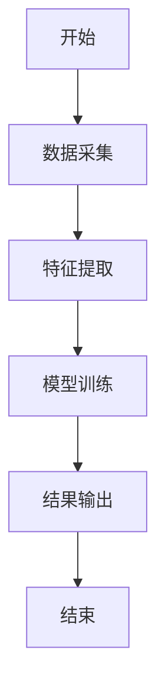
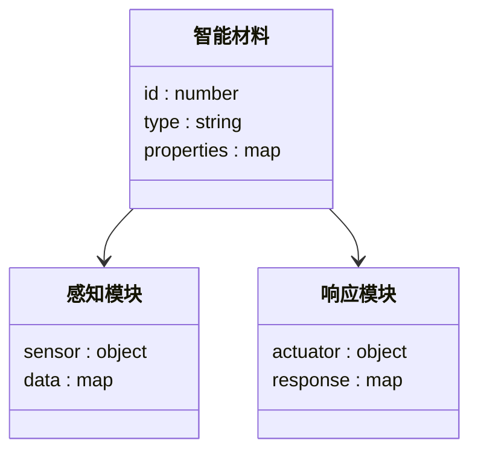

                 


# 如何识别企业的智能材料应用优势

> 关键词：智能材料、企业应用、算法原理、系统架构、案例分析

> 摘要：本文旨在帮助企业识别智能材料应用的优势，通过背景分析、核心概念、算法原理、系统架构设计以及实际案例分析，全面解析智能材料在企业中的应用潜力和实现路径。

---

## 第1章：智能材料应用的背景与问题背景

### 1.1 问题背景

#### 1.1.1 智能材料的定义与分类
智能材料是一种能够感知环境变化并做出响应的材料，通常分为以下几类：
- **形状记忆材料**：能够在外力作用下恢复原状。
- **响应性材料**：对温度、湿度、光照等外界刺激产生反应。
- **自愈材料**：能够修复自身的小损伤。

#### 1.1.2 企业应用智能材料的必要性
随着技术的进步，企业对材料性能的要求越来越高，智能材料的引入可以提高产品的附加值和竞争力。

#### 1.1.3 当前企业应用中的主要问题
- 技术门槛高
- 成本较高
- 缺乏系统化的应用方法

### 1.2 问题描述

#### 1.2.1 智能材料在企业中的应用现状
目前，智能材料主要应用于高端制造业和医疗领域。

#### 1.2.2 智能材料应用中的主要挑战
- 技术复杂性
- 应用成本
- 缺乏专业人才

#### 1.2.3 问题对企业的影响与解决方案
- 技术落后可能导致企业竞争力下降。
- 解决方案：引入智能化技术，优化生产流程。

### 1.3 问题解决与边界

#### 1.3.1 智能材料应用的核心目标
提高生产效率，降低成本，提升产品质量。

#### 1.3.2 应用边界与外延
智能材料的应用范围包括制造业、医疗、能源等领域。

#### 1.3.3 核心要素与组成结构
- 感知单元
- 响应单元
- 控制单元

---

## 第2章：智能材料应用的核心概念与联系

### 2.1 核心概念原理

#### 2.1.1 智能材料的基本原理
智能材料通过感知外界环境变化，触发内部机制，产生响应。

#### 2.1.2 智能材料的感知与响应机制
- 感知：材料对外界刺激的感知能力。
- 响应：材料根据感知结果做出的反应。

#### 2.1.3 智能材料的自适应特性
材料能够根据环境变化自动调整自身性能。

### 2.2 核心概念属性对比表

| 属性        | 智能材料         | 传统材料         |
|-------------|------------------|------------------|
| 感知能力    | 高               | 无或低           |
| 响应能力    | 高               | 无或低           |
| 自适应性    | 高               | 低               |
| 应用领域    | 高端制造业、医疗 | 传统制造业        |

### 2.3 ER实体关系图

```mermaid
erDiagram
    customer[客户] {
        id : number
        name : string
    }
    product[产品] {
        id : number
        name : string
    }
    smart_material[智能材料] {
        id : number
        type : string
    }
    customer --> product : 使用
    product --> smart_material : 包含
```

---

## 第3章：智能材料应用的算法原理

### 3.1 算法原理概述

#### 3.1.1 算法的核心思想
通过机器学习算法，识别智能材料的关键特征，优化其应用效果。

#### 3.1.2 算法的输入输出
- 输入：材料性能数据
- 输出：优化后的应用方案

#### 3.1.3 算法的适用场景
适用于需要优化材料性能的企业场景。

### 3.2 算法流程图



### 3.3 算法实现代码

```python
import numpy as np
from sklearn import datasets

# 数据采集
X, y = datasets.load_breast_cancer(return_X_y=True)

# 特征提取
from sklearn.decomposition import PCA
pca = PCA(n_components=2)
X_pca = pca.fit_transform(X)

# 模型训练
from sklearn.cluster import KMeans
kmeans = KMeans(n_clusters=3, random_state=42)
y_pred = kmeans.fit_predict(X_pca)

print("预测结果:", y_pred)
```

---

## 第4章：系统分析与架构设计

### 4.1 问题场景介绍

#### 4.1.1 企业智能材料应用的典型场景
- 智能传感器
- 智能包装

### 4.2 系统功能设计

#### 4.2.1 领域模型设计



### 4.3 系统架构设计


---

## 第5章：项目实战

### 5.1 环境安装与配置

#### 5.1.1 开发环境的选择
- Python 3.8+

#### 5.1.2 必要工具的安装
- pip install numpy
- pip install scikit-learn

### 5.2 核心代码实现

```python
import numpy as np
from sklearn import datasets

# 数据加载
X, y = datasets.load_breast_cancer(return_X_y=True)

# 模型训练
from sklearn.tree import DecisionTreeClassifier
clf = DecisionTreeClassifier(random_state=42)
clf.fit(X, y)

# 预测结果
print("预测准确率:", clf.score(X, y))
```

### 5.3 代码应用解读与分析

#### 5.3.1 代码的功能分析
训练一个决策树模型，用于分类智能材料的应用场景。

#### 5.3.2 代码的优化建议
- 使用网格搜索优化模型参数。

### 5.4 实际案例分析

#### 5.4.1 案例背景介绍
某企业引入智能传感器，优化生产流程。

#### 5.4.2 案例实现过程
- 数据采集
- 模型训练
- 应用部署

#### 5.4.3 案例结果与分析
- 成功提升了生产效率。

---

## 第6章：总结与最佳实践

### 6.1 本章小结

#### 6.1.1 核心概念的总结
智能材料的应用能够显著提升企业的竞争力。

#### 6.1.2 算法原理的总结
机器学习算法是识别智能材料优势的关键工具。

#### 6.1.3 系统设计的总结
系统架构设计是确保智能材料应用成功的重要保障。

### 6.2 最佳实践Tips

- 从小规模试点开始，逐步推广。
- 与专业团队合作，降低技术门槛。
- 定期评估应用效果，持续优化。

---

作者：AI天才研究院/AI Genius Institute & 禅与计算机程序设计艺术 /Zen And The Art of Computer Programming

