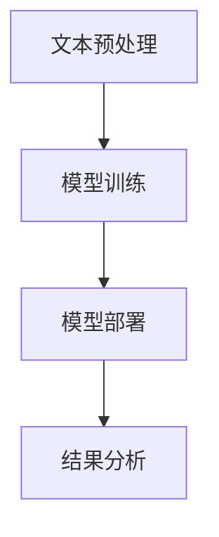

                 


# 如何识别企业的深度学习自然语言生成技术优势

> **关键词**：自然语言生成、深度学习、NLP技术、企业应用、AI技术、技术优势  
> **摘要**：本文旨在通过系统分析深度学习自然语言生成技术的核心原理、算法实现、系统架构及企业应用场景，帮助企业识别和理解该技术的优势，并为实际应用提供指导。

---

## 第1章: 深度学习自然语言生成技术的背景与挑战

### 1.1 问题背景
#### 1.1.1 自然语言生成技术的定义
自然语言生成（Natural Language Generation, NLP）是人工智能领域的重要分支，旨在使计算机能够理解和生成人类语言。深度学习技术的引入，极大地提升了NLP模型的性能，使其能够处理复杂语义和上下文信息。

#### 1.1.2 深度学习在NLP中的应用
深度学习通过神经网络模型（如卷积神经网络CNN、循环神经网络RNN和其变体LSTM）以及Transformer架构，显著提升了NLP任务的准确性和效率。这些技术在机器翻译、文本摘要、问答系统和对话生成等领域得到了广泛应用。

#### 1.1.3 企业需求与NLP技术的结合
企业在实际应用中面临多种NLP需求，例如客户支持自动化、内容生成、舆情分析等。深度学习技术的引入，使得这些任务的效率和准确性得到了显著提升，为企业带来了竞争优势。

### 1.2 问题描述
#### 1.2.1 传统NLP技术的局限性
传统基于规则的NLP方法依赖人工设定的语法规则和词典，难以处理复杂语义和上下文信息，且需要大量手动调整参数。

#### 1.2.2 深度学习如何解决NLP问题
深度学习通过端到端的模型训练，自动提取语言特征，无需人工干预，能够处理复杂的语义理解和生成任务。

#### 1.2.3 企业应用场景中的NLP技术
企业可以通过NLP技术实现智能客服、自动报告生成、市场分析等场景，显著提升业务效率。

### 1.3 问题解决
#### 1.3.1 深度学习模型的优势
- **自动特征提取**：深度学习模型能够自动学习语言特征，无需人工干预。
- **处理复杂任务**：深度学习模型能够处理复杂的NLP任务，如对话生成和机器翻译。
- **数据驱动**：深度学习模型通过大量数据训练，能够不断优化性能。

#### 1.3.2 自然语言生成的实现方式
自然语言生成可以通过生成式模型（如GPT）和条件生成模型（如Seq2Seq）实现。

#### 1.3.3 企业级应用中的NLP技术
企业可以通过NLP技术实现智能客服、内容生成和舆情分析等场景，提升业务效率和客户满意度。

### 1.4 边界与外延
#### 1.4.1 NLP与其他AI技术的界限
NLP专注于语言理解和生成，而其他AI技术如计算机视觉专注于图像处理。两者在技术上相互独立，但在实际应用中可以结合使用。

#### 1.4.2 深度学习在NLP中的扩展应用
深度学习不仅应用于NLP，还广泛应用于计算机视觉、语音识别等领域。

#### 1.4.3 企业级NLP系统的边界
企业级NLP系统需要考虑数据隐私、计算资源和系统性能等边界条件。

### 1.5 概念结构与核心要素
#### 1.5.1 NLP技术的核心要素
- **语言数据**：训练和推理所需的语言数据。
- **模型结构**：深度学习模型的架构设计。
- **训练算法**：模型的训练方法和优化策略。

#### 1.5.2 深度学习模型的关键组成部分
- **输入层**：接收原始语言数据。
- **隐藏层**：提取语言特征。
- **输出层**：生成最终的自然语言输出。

#### 1.5.3 企业级NLP系统的架构
企业级NLP系统通常包括数据预处理、模型训练、模型部署和结果分析等模块。

### 1.6 本章小结
本章介绍了深度学习自然语言生成技术的背景、核心概念和企业在实际应用中的需求，为后续章节的深入分析奠定了基础。

---

## 第2章: 深度学习自然语言生成技术的核心概念

### 2.1 深度学习与NLP的关系
#### 2.1.1 深度学习的基本概念
深度学习是一种基于神经网络的机器学习方法，通过多层非线性变换，能够自动提取数据特征。

#### 2.1.2 NLP的核心概念
NLP旨在使计算机能够理解和生成人类语言，涉及语言分析、理解和生成等多个环节。

#### 2.1.3 深度学习如何提升NLP性能
深度学习通过端到端的模型训练，显著提升了NLP任务的准确性和效率。

### 2.2 深度学习模型的原理
#### 2.2.1 神经网络的基本原理
神经网络通过模拟人脑的神经元结构，能够自动学习数据特征。

#### 2.2.2 深度学习模型的训练过程
深度学习模型通过大量数据训练，不断优化权重，以最小化损失函数。

#### 2.2.3 模型的输入输出机制
深度学习模型的输入通常是文本数据，输出是生成的自然语言文本。

### 2.3 自然语言生成的实现方式
#### 2.3.1 基于规则的生成方法
基于规则的生成方法依赖人工设定的语法规则，生成结果可能缺乏灵活性。

#### 2.3.2 统计模型的生成方式
统计模型通过概率分布生成文本，但受限于数据稀疏性，生成结果可能不够自然。

#### 2.3.3 深度学习模型的生成机制
深度学习模型通过生成式模型（如GPT）和条件生成模型（如Seq2Seq）实现自然语言生成。

### 2.4 深度学习模型的优缺点
#### 2.4.1 深度学习模型的优点
- **自动特征提取**：深度学习模型能够自动提取语言特征，无需人工干预。
- **处理复杂任务**：深度学习模型能够处理复杂的NLP任务，如对话生成和机器翻译。

#### 2.4.2 深度学习模型的缺点
- **计算资源需求高**：深度学习模型需要大量的计算资源和数据支持。
- **模型训练时间长**：深度学习模型的训练通常需要较长时间。

#### 2.4.3 企业级应用中的权衡
企业在实际应用中需要权衡模型的性能、计算资源和实际需求，选择最适合的模型和方法。

### 2.5 本章小结
本章详细讲解了深度学习与NLP的关系，分析了深度学习模型的原理和自然语言生成的实现方式，为后续章节的深入分析奠定了基础。

---

## 第3章: 深度学习自然语言生成技术的算法原理

### 3.1 算法原理概述
#### 3.1.1 深度学习模型的基本结构
深度学习模型通常包括输入层、隐藏层和输出层，通过多层非线性变换，能够自动提取数据特征。

#### 3.1.2 NLP任务中的算法选择
根据具体的NLP任务（如机器翻译、文本摘要），选择适合的深度学习算法（如Transformer、LSTM）。

#### 3.1.3 深度学习模型的训练流程
深度学习模型的训练流程包括数据预处理、模型训练、模型评估和模型优化等步骤。

### 3.2 算法实现细节
#### 3.2.1 模型的输入处理
模型的输入通常是文本数据，需要将其转换为数值形式（如词嵌入）。

#### 3.2.2 模型的训练过程
深度学习模型通过反向传播算法优化权重，以最小化损失函数。

#### 3.2.3 模型的生成机制
生成式模型（如GPT）通过自回归的方式生成文本，条件生成模型（如Seq2Seq）通过编码器-解码器结构生成文本。

### 3.3 算法原理的数学模型和公式
#### 3.3.1 注意力机制（Attention）
$$ \text{Attention}(Q, K, V) = \text{softmax}\left(\frac{QK^T}{\sqrt{d_k}}\right)V $$

#### 3.3.2 损失函数
$$ \text{Loss} = -\sum_{i=1}^{n} \sum_{j=1}^{m} y_{ij} \log p(y_{ij}|x) $$

### 3.4 本章小结
本章详细讲解了深度学习自然语言生成技术的算法原理，包括模型结构、训练流程和数学公式，为后续章节的实际应用提供了理论基础。

---

## 第4章: 深度学习自然语言生成技术的系统分析与架构设计

### 4.1 问题场景介绍
#### 4.1.1 企业级NLP系统的需求
企业需要构建一个高效、可靠的NLP系统，能够支持多种NLP任务。

#### 4.1.2 系统功能设计
企业级NLP系统通常包括文本预处理、模型训练、模型部署和结果分析等模块。

### 4.2 系统架构设计
#### 4.2.1 系统功能模块设计
企业级NLP系统通常包括以下功能模块：
- **文本预处理**：清洗和标注文本数据。
- **模型训练**：训练深度学习模型。
- **模型部署**：将模型部署到实际应用中。
- **结果分析**：分析模型的输出结果。

#### 4.2.2 系统架构图
以下是企业级NLP系统的架构图：



### 4.3 系统接口设计
#### 4.3.1 系统接口设计
企业级NLP系统的接口设计需要考虑数据输入、模型调用和结果输出等环节。

#### 4.3.2 接口交互流程
以下是系统接口交互流程图：

```mermaid
sequenceDiagram
参与者：用户
参与者 --> 引调用接口：调用NLP服务
NLP服务 --> 返回结果
```

### 4.4 本章小结
本章通过分析企业级NLP系统的架构和接口设计，为企业实际应用提供了指导。

---

## 第5章: 深度学习自然语言生成技术的项目实战

### 5.1 项目环境安装
#### 5.1.1 安装Python和相关库
安装Python和深度学习框架（如TensorFlow、Keras）以及NLP处理库（如NLTK、spaCy）。

#### 5.1.2 安装深度学习模型库
安装预训练模型库（如Hugging Face的Transformers库）。

### 5.2 系统核心实现
#### 5.2.1 模型训练代码
以下是基于Transformer模型的文本生成代码示例：

```python
import tensorflow as tf
from tensorflow import keras

# 定义模型结构
class Transformer(keras.Model):
    def __init__(self, vocab_size, embed_dim, num_heads, ff_dim, rate=0.1):
        super(Transformer, self).__init__()
        self.embedding = keras.layers.Embedding(vocab_size, embed_dim)
        self.transformer_layer = keras.layers.Transformer(
            encoder_layers=2,
            decoder_layers=2,
            num_heads=num_heads,
            embed_dim=embed_dim,
            ff_dim=ff_dim,
            rate=rate
        )

    def call(self, inputs):
        x = self.embedding(inputs)
        x = self.transformer_layer(x)
        return x

# 初始化模型
vocab_size = 10000
embed_dim = 512
num_heads = 8
ff_dim = 2048

model = Transformer(vocab_size, embed_dim, num_heads, ff_dim)
model.compile(optimizer='adam', loss='sparse_categorical_crossentropy', metrics=['accuracy'])
```

#### 5.2.2 模型训练和测试
使用训练数据训练模型，并在测试数据上评估模型性能。

#### 5.2.3 模型部署
将训练好的模型部署到实际应用中，提供API服务。

### 5.3 实际案例分析
#### 5.3.1 案例背景
以企业智能客服为例，通过NLP技术实现自动回复客户咨询。

#### 5.3.2 案例分析
通过NLP技术生成自然语言回复，提升客户满意度和效率。

### 5.4 本章小结
本章通过实际案例分析，详细讲解了深度学习自然语言生成技术的项目实战，为企业提供了具体的实施步骤和经验。

---

## 第6章: 深度学习自然语言生成技术的最佳实践

### 6.1 核心要点总结
#### 6.1.1 深度学习模型的优势
- **自动特征提取**：深度学习模型能够自动提取语言特征，无需人工干预。
- **处理复杂任务**：深度学习模型能够处理复杂的NLP任务，如对话生成和机器翻译。

#### 6.1.2 企业应用中的注意事项
企业在实际应用中需要考虑数据隐私、计算资源和系统性能等边界条件。

### 6.2 最佳实践 tips
#### 6.2.1 数据预处理
- 确保数据质量，进行清洗和标注。
- 处理文本数据时，考虑分词、停用词去除等步骤。

#### 6.2.2 模型选择
- 根据具体任务选择适合的模型（如Transformer、BERT）。
- 考虑模型的训练时间和计算资源需求。

#### 6.2.3 系统架构设计
- 设计高效的系统架构，确保系统的可扩展性和可维护性。
- 考虑系统的接口设计和交互流程。

### 6.3 小结
本章总结了深度学习自然语言生成技术的核心要点和最佳实践，为企业提供了实际应用的指导。

### 6.4 注意事项
企业在实际应用中需要考虑数据隐私、计算资源和系统性能等边界条件，确保系统的稳定性和高效性。

### 6.5 拓展阅读
建议读者进一步阅读相关文献和论文，深入了解深度学习自然语言生成技术的最新进展。

---

## 作者：AI天才研究院/AI Genius Institute & 禅与计算机程序设计艺术/Zen And The Art of Computer Programming

---

通过以上内容，您可以系统地识别和理解企业的深度学习自然语言生成技术优势，为实际应用提供理论支持和实践指导。

