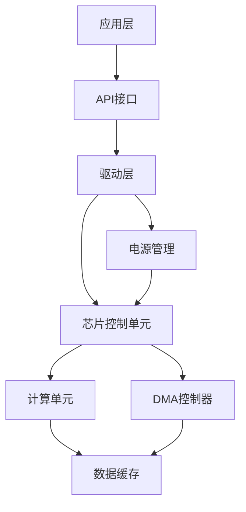
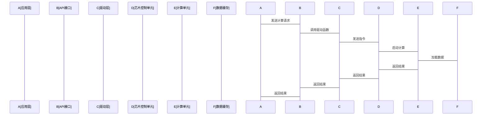

                 


# 如何识别企业的深度学习芯片设计优势

---

## 摘要

在人工智能快速发展的今天，深度学习芯片作为推动AI技术进步的核心硬件，其设计优势直接决定了企业的技术竞争力。本文将从背景、核心概念、算法原理、系统架构、项目实战等多个维度，详细分析如何识别和评估企业在深度学习芯片设计方面的优势。通过理论与实践结合的方式，帮助读者掌握识别和提升企业深度学习芯片设计能力的方法。

---

## 第一部分：深度学习芯片设计背景与概述

### 第1章：深度学习芯片设计背景与概述

#### 1.1 深度学习芯片的基本概念

##### 1.1.1 深度学习芯片的定义与特点

深度学习芯片（Deep Learning Chips）是专为加速深度学习模型的计算而设计的硬件。与通用处理器（如CPU）相比，深度学习芯片通过优化计算架构，显著提升了神经网络训练和推理的效率。其主要特点包括：

- **专用性**：针对神经网络计算优化，如矩阵乘法、激活函数等。
- **并行计算能力**：支持大规模并行计算，提升计算速度。
- **能效比高**：通过架构优化降低功耗，适合移动设备和边缘计算。

##### 1.1.2 深度学习芯片的发展历程

深度学习芯片的发展可以分为以下几个阶段：

1. **传统GPU时代（2000s）**：通用GPU开始被用于加速神经网络训练。
2. **专用芯片崛起（2010s）**：如英伟达的Volta架构和AMD的Radeon Pro，专为深度学习设计。
3. **专用AI芯片（2020s至今）**：如Google的TPU、寒武纪的MLU系列，针对特定任务优化。

##### 1.1.3 深度学习芯片在企业中的应用现状

目前，深度学习芯片广泛应用于云计算、自动驾驶、智能安防等领域。企业通过部署深度学习芯片，可以显著提升模型训练效率和推理速度，降低计算成本。

---

### 1.2 深度学习芯片设计的核心优势

##### 1.2.1 计算能力的提升

深度学习芯片通过优化计算架构，能够显著提升神经网络的计算速度。例如，GPU的并行计算能力使其在深度学习任务中表现优于CPU。

##### 1.2.2 能耗效率的优化

深度学习芯片通过架构优化和指令集改进，大幅降低了计算能耗，提升了能效比。例如，寒武纪的MLU100芯片在相同功耗下性能优于传统GPU。

##### 1.2.3 灵活性与可扩展性

深度学习芯片支持多种神经网络架构，且可以通过扩展计算单元满足更大规模的模型需求。例如，通过分布式计算可以支持万亿参数的大模型训练。

---

## 第二部分：深度学习芯片设计的核心概念与技术

### 第2章：深度学习芯片设计的核心概念与技术

#### 2.1 深度学习芯片的设计原理

##### 2.1.1 神经网络的计算模型

神经网络的计算模型主要基于矩阵乘法和激活函数。深度学习芯片通过优化这些计算步骤，提升计算效率。

##### 2.1.2 芯片架构的优化策略

深度学习芯片的架构优化包括：

1. **数据流优化**：减少数据传输的延迟和带宽占用。
2. **计算单元优化**：通过专用指令加速矩阵乘法。
3. **缓存层次结构优化**：提升数据访问效率。

##### 2.1.3 并行计算与流水线处理

深度学习芯片通过并行计算和流水线处理，显著提升了计算效率。例如，GPU的SIMD指令集和流水线处理技术。

#### 2.2 深度学习芯片的关键技术

##### 2.2.1 稀疏化技术

稀疏化技术通过减少权重和激活的非零元素数量，降低计算量和存储需求。例如，Google的TNN框架支持权重稀疏化训练。

##### 2.2.2 量化技术

量化技术将模型参数从浮点数降低到较低位宽（如8位整数），显著降低存储需求和计算能耗。例如，TensorFlow Lite支持8位量化模型。

##### 2.2.3 能效优化技术

通过动态电压调整和时钟频率调节，深度学习芯片可以在保证性能的同时降低能耗。例如，苹果的M1芯片在AI任务中采用动态能效优化。

---

## 第三部分：深度学习芯片设计的算法原理

### 第3章：深度学习芯片设计的算法原理

#### 3.1 神经网络的数学模型与计算流程

##### 3.1.1 神经网络的数学模型

神经网络的核心是矩阵乘法和激活函数。例如，一个典型的卷积层的计算公式为：

$$ y = \sigma(Wx + b) $$

其中，$W$是权重矩阵，$x$是输入向量，$b$是偏置项，$\sigma$是激活函数。

##### 3.1.2 神经网络的计算流程

计算流程包括前向传播和反向传播。前向传播用于生成输出，反向传播用于计算梯度并更新权重。

##### 3.1.3 并行计算与流水线处理

通过并行计算和流水线处理，深度学习芯片可以显著加速神经网络的计算。例如，使用并行矩阵乘法加速层间计算。

---

## 第四部分：系统分析与架构设计方案

### 第4章：系统分析与架构设计方案

#### 4.1 系统架构设计

##### 4.1.1 系统功能设计

深度学习芯片系统功能包括：

- **模型加载与初始化**：加载神经网络模型并初始化权重。
- **数据输入与处理**：接收输入数据并进行预处理。
- **计算加速**：通过专用指令加速神经网络计算。
- **结果输出与反馈**：输出计算结果并反馈给上层系统。

##### 4.1.2 系统架构图

以下是深度学习芯片的系统架构图：



#### 4.2 系统交互流程

##### 4.2.1 系统交互流程图

以下是系统交互流程图：



---

## 第五部分：项目实战与案例分析

### 第5章：项目实战与案例分析

#### 5.1 环境安装

##### 5.1.1 环境配置

以下是一个典型的深度学习芯片开发环境配置：

```bash
# 安装Python和依赖库
pip install numpy tensorflow
# 安装深度学习芯片驱动
sudo apt-get install nvidia-drivers
# 安装芯片SDK
pip install nvidia-cuda-toolkit
```

#### 5.2 核心代码实现

##### 5.2.1 矩阵乘法加速代码

以下是一个矩阵乘法加速的代码示例：

```python
import numpy as np

def matrix_multiply(a, b):
    return np.dot(a, b)

a = np.array([[1, 2], [3, 4]])
b = np.array([[5, 6], [7, 8]])
result = matrix_multiply(a, b)
print(result)
```

##### 5.2.2 神经网络层实现

以下是一个神经网络层实现的代码示例：

```python
import tensorflow as tf

def neural_network_layer(input_tensor, output_units):
    kernel = tf.Variable(tf.random.truncated_normal([input_tensor.shape[-1], output_units]))
    bias = tf.Variable(tf.zeros([output_units]))
    output = tf.nn.relu(tf.matmul(input_tensor, kernel) + bias)
    return output

input_layer = tf.keras.Input(shape=(input_dim,))
output_layer = neural_network_layer(input_layer, output_dim)
model = tf.keras.Model(inputs=input_layer, outputs=output_layer)
model.compile(optimizer='adam', loss='sparse_categorical_crossentropy', metrics=['accuracy'])
```

#### 5.3 案例分析与详细解读

##### 5.3.1 案例分析

以自动驾驶中的目标检测任务为例，深度学习芯片可以显著加速模型的推理速度。例如，使用MobileNet模型在边缘设备上进行实时目标检测。

##### 5.3.2 代码应用解读

通过上述代码示例，可以实现高效的矩阵乘法和神经网络层计算。这些代码可以在深度学习芯片上进行优化，提升计算效率。

---

## 第六部分：最佳实践与总结

### 第6章：最佳实践与总结

#### 6.1 最佳实践

1. **选择合适的芯片架构**：根据任务需求选择适合的深度学习芯片。
2. **优化模型结构**：通过模型剪枝、量化等技术降低计算需求。
3. **充分利用硬件特性**：结合芯片的指令集和架构特点进行优化。

#### 6.2 小结

深度学习芯片的设计优势直接决定了企业的技术竞争力。通过优化计算架构、算法和系统设计，可以显著提升芯片的性能和能效比。

#### 6.3 注意事项

- **硬件与算法的协同优化**：硬件设计需要与算法需求紧密结合。
- **安全性与可靠性**：确保芯片设计的安全性和可靠性。
- **可扩展性**：支持未来更大规模的模型和任务需求。

#### 6.4 拓展阅读

- 《深度学习芯片设计原理与实践》
- 《神经网络算法优化与硬件加速》
- 《AI芯片开发指南》

---

## 作者

作者：AI天才研究院/AI Genius Institute & 禅与计算机程序设计艺术 /Zen And The Art of Computer Programming

---

通过本文的详细分析和实战案例，读者可以系统地识别和评估企业在深度学习芯片设计方面的优势，从而在竞争激烈的市场中占据优势地位。

