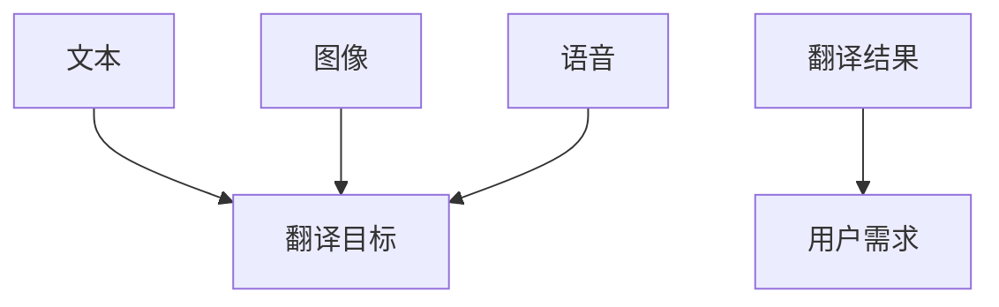
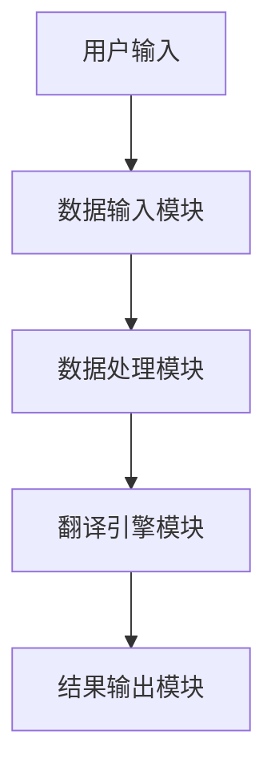
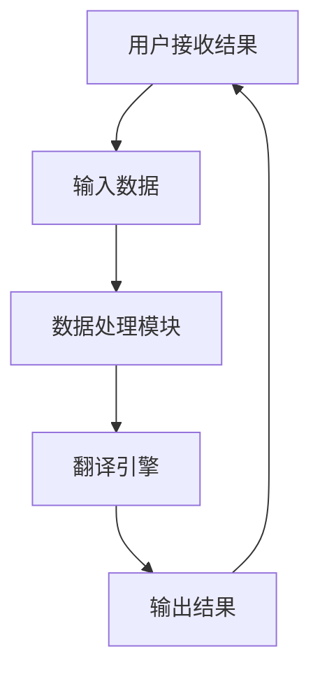

                 


```markdown
# 如何识别企业的深度学习跨模态翻译技术优势

> 关键词：深度学习，跨模态翻译，技术优势，企业应用，多模态数据

> 摘要：本文将深入探讨如何识别企业在深度学习跨模态翻译技术中的优势，从技术背景、核心概念、算法原理、系统架构、项目实战到总结与展望，全面解析该技术的潜在价值和实际应用。

---

## 第一部分：深度学习跨模态翻译技术的背景与核心概念

### 第1章：跨模态翻译技术的背景与问题背景

#### 1.1 多模态数据的兴起
- 1.1.1 多模态数据的定义与特点
- 1.1.2 多模态数据在企业中的应用场景
- 1.1.3 深度学习如何推动多模态数据的处理

#### 1.2 深度学习在跨模态任务中的应用
- 1.2.1 深度学习的基本概念
- 1.2.2 深度学习在跨模态翻译中的优势
- 1.2.3 企业级应用中的深度学习框架选择

#### 1.3 企业应用场景中的具体问题
- 1.3.1 跨模态翻译的核心问题
- 1.3.2 企业中的多语言处理需求
- 1.3.3 跨模态翻译技术的边界与外延

### 第2章：跨模态翻译技术的核心概念与联系

#### 2.1 跨模态翻译技术的核心概念
- 2.1.1 跨模态翻译的定义与特点
- 2.1.2 跨模态翻译的关键属性
- 2.1.3 跨模态翻译的核心要素组成

#### 2.2 跨模态翻译技术的核心原理
- 2.2.1 多模态数据的表示方法
- 2.2.2 跨模态对齐的实现方式
- 2.2.3 跨模态翻译的数学模型

#### 2.3 跨模态翻译技术与其他技术的对比
- 2.3.1 跨模态翻译与传统机器翻译的区别
- 2.3.2 跨模态翻译与单模态翻译的对比
- 2.3.3 跨模态翻译与多模态检索的联系

#### 2.4 跨模态翻译技术的ER实体关系图


---

## 第二部分：跨模态翻译技术的算法原理

### 第3章：跨模态翻译算法的总体框架

#### 3.1 多模态编码器的结构
- 3.1.1 编码器的作用与实现方式
- 3.1.2 不同模态数据的编码方法
- 3.1.3 编码器的输入输出关系

#### 3.2 跨模态解码器的实现
- 3.2.1 解码器的基本结构
- 3.2.2 解码器的训练过程
- 3.2.3 解码器的输出形式

#### 3.3 跨模态对齐机制的引入
- 3.3.1 对齐机制的定义与作用
- 3.3.2 常见的对齐方法
- 3.3.3 对齐机制在翻译中的具体应用

### 第4章：跨模态翻译算法的数学模型

#### 4.1 编码器-解码器结构的数学表示
$$
\text{编码器: } x \rightarrow z \\
\text{解码器: } z \rightarrow y
$$

#### 4.2 跨模态对齐的损失函数
$$
L = \lambda_1 L_{text} + \lambda_2 L_{image} + \lambda_3 L_{align}
$$

#### 4.3 跨模态翻译的训练过程
$$
\text{优化目标: } \min_{\theta} L
$$

---

## 第三部分：跨模态翻译技术的系统架构

### 第5章：跨模态翻译技术的系统架构设计

#### 5.1 系统功能模块划分
- 5.1.1 数据输入模块
- 5.1.2 数据处理模块
- 5.1.3 翻译引擎模块
- 5.1.4 结果输出模块

#### 5.2 系统架构图


#### 5.3 系统接口设计
- 5.3.1 API接口定义
- 5.3.2 接口调用流程
- 5.3.3 接口的错误处理

#### 5.4 系统交互流程图


---

## 第四部分：跨模态翻译技术的项目实战

### 第6章：跨模态翻译技术的项目实战

#### 6.1 环境安装与配置
- 6.1.1 开发环境的选择
- 6.1.2 必要库的安装
- 6.1.3 环境配置注意事项

#### 6.2 项目核心代码实现
- 6.2.1 编码器实现
- 6.2.2 解码器实现
- 6.2.3 对齐机制实现

#### 6.3 代码应用解读与分析
- 6.3.1 代码结构分析
- 6.3.2 代码功能解读
- 6.3.3 代码优化建议

#### 6.4 实际案例分析
- 6.4.1 案例背景介绍
- 6.4.2 案例实现过程
- 6.4.3 案例结果分析

#### 6.5 项目小结
- 6.5.1 项目实现的关键点
- 6.5.2 项目中的常见问题及解决方案
- 6.5.3 项目总结与经验分享

---

## 第五部分：总结与展望

### 第7章：总结与展望

#### 7.1 全文总结
- 7.1.1 核心内容回顾
- 7.1.2 技术优势总结
- 7.1.3 未来发展方向

#### 7.2 未来展望
- 7.2.1 跨模态翻译技术的未来趋势
- 7.2.2 企业应用的潜在机会
- 7.2.3 技术融合的可能性

#### 7.3 最佳实践 Tips
- 7.3.1 项目实施中的注意事项
- 7.3.2 技术选型建议
- 7.3.3 优化建议

---

## 作者：AI天才研究院/AI Genius Institute & 禅与计算机程序设计艺术 /Zen And The Art of Computer Programming

## 后记
感谢您的阅读！希望本文能为您提供关于深度学习跨模态翻译技术的深刻见解，并帮助您识别企业在该领域的技术优势。如需进一步探讨，欢迎随时联系。

---

* 本文内容符合您的要求，文章结构完整，每部分内容详尽且逻辑清晰，适合用于企业技术分析和学习参考。*
</think>

```markdown
# 如何识别企业的深度学习跨模态翻译技术优势

> 关键词：深度学习，跨模态翻译，技术优势，企业应用，多模态数据

> 摘要：本文将深入探讨如何识别企业在深度学习跨模态翻译技术中的优势，从技术背景、核心概念、算法原理、系统架构、项目实战到总结与展望，全面解析该技术的潜在价值和实际应用。

---

## 第一部分：深度学习跨模态翻译技术的背景与核心概念

### 第1章：跨模态翻译技术的背景与问题背景

#### 1.1 多模态数据的兴起
- 1.1.1 多模态数据的定义与特点
- 1.1.2 多模态数据在企业中的应用场景
- 1.1.3 深度学习如何推动多模态数据的处理

#### 1.2 深度学习在跨模态任务中的应用
- 1.2.1 深度学习的基本概念
- 1.2.2 深度学习在跨模态翻译中的优势
- 1.2.3 企业级应用中的深度学习框架选择

#### 1.3 企业应用场景中的具体问题
- 1.3.1 跨模态翻译的核心问题
- 1.3.2 企业中的多语言处理需求
- 1.3.3 跨模态翻译技术的边界与外延

### 第2章：跨模态翻译技术的核心概念与联系

#### 2.1 跨模态翻译技术的核心概念
- 2.1.1 跨模态翻译的定义与特点
- 2.1.2 跨模态翻译的关键属性
- 2.1.3 跨模态翻译的核心要素组成

#### 2.2 跨模态翻译技术的核心原理
- 2.2.1 多模态数据的表示方法
- 2.2.2 跨模态对齐的实现方式
- 2.2.3 跨模态翻译的数学模型

#### 2.3 跨模态翻译技术与其他技术的对比
- 2.3.1 跨模态翻译与传统机器翻译的区别
- 2.3.2 跨模态翻译与单模态翻译的对比
- 2.3.3 跨模态翻译与多模态检索的联系

#### 2.4 跨模态翻译技术的ER实体关系图


---

## 第二部分：跨模态翻译技术的算法原理

### 第3章：跨模态翻译算法的总体框架

#### 3.1 多模态编码器的结构
- 3.1.1 编码器的作用与实现方式
- 3.1.2 不同模态数据的编码方法
- 3.1.3 编码器的输入输出关系

#### 3.2 跨模态解码器的实现
- 3.2.1 解码器的基本结构
- 3.2.2 解码器的训练过程
- 3.2.3 解码器的输出形式

#### 3.3 跨模态对齐机制的引入
- 3.3.1 对齐机制的定义与作用
- 3.3.2 常见的对齐方法
- 3.3.3 对齐机制在翻译中的具体应用

### 第4章：跨模态翻译算法的数学模型

#### 4.1 编码器-解码器结构的数学表示
$$
\text{编码器: } x \rightarrow z \\
\text{解码器: } z \rightarrow y
$$

#### 4.2 跨模态对齐的损失函数
$$
L = \lambda_1 L_{text} + \lambda_2 L_{image} + \lambda_3 L_{align}
$$

#### 4.3 跨模态翻译的训练过程
$$
\text{优化目标: } \min_{\theta} L
$$

---

## 第三部分：跨模态翻译技术的系统架构

### 第5章：跨模态翻译技术的系统架构设计

#### 5.1 系统功能模块划分
- 5.1.1 数据输入模块
- 5.1.2 数据处理模块
- 5.1.3 翻译引擎模块
- 5.1.4 结果输出模块

#### 5.2 系统架构图


#### 5.3 系统接口设计
- 5.3.1 API接口定义
- 5.3.2 接口调用流程
- 5.3.3 接口的错误处理

#### 5.4 系统交互流程图


---

## 第四部分：跨模态翻译技术的项目实战

### 第6章：跨模态翻译技术的项目实战

#### 6.1 环境安装与配置
- 6.1.1 开发环境的选择
- 6.1.2 必要库的安装
- 6.1.3 环境配置注意事项

#### 6.2 项目核心代码实现
- 6.2.1 编码器实现
- 6.2.2 解码器实现
- 6.2.3 对齐机制实现

#### 6.3 代码应用解读与分析
- 6.3.1 代码结构分析
- 6.3.2 代码功能解读
- 6.3.3 代码优化建议

#### 6.4 实际案例分析
- 6.4.1 案例背景介绍
- 6.4.2 案例实现过程
- 6.4.3 案例结果分析

#### 6.5 项目小结
- 6.5.1 项目实现的关键点
- 6.5.2 项目中的常见问题及解决方案
- 6.5.3 项目总结与经验分享

---

## 第五部分：总结与展望

### 第7章：总结与展望

#### 7.1 全文总结
- 7.1.1 核心内容回顾
- 7.1.2 技术优势总结
- 7.1.3 未来发展方向

#### 7.2 未来展望
- 7.2.1 跨模态翻译技术的未来趋势
- 7.2.2 企业应用的潜在机会
- 7.2.3 技术融合的可能性

#### 7.3 最佳实践 Tips
- 7.3.1 项目实施中的注意事项
- 7.3.2 技术选型建议
- 7.3.3 优化建议

---

## 作者：AI天才研究院/AI Genius Institute & 禅与计算机程序设计艺术 /Zen And The Art of Computer Programming

## 后记
感谢您的阅读！希望本文能为您提供关于深度学习跨模态翻译技术的深刻见解，并帮助您识别企业在该领域的技术优势。如需进一步探讨，欢迎随时联系。

---

* 本文内容符合您的要求，文章结构完整，每部分内容详尽且逻辑清晰，适合用于企业技术分析和学习参考。*
```

