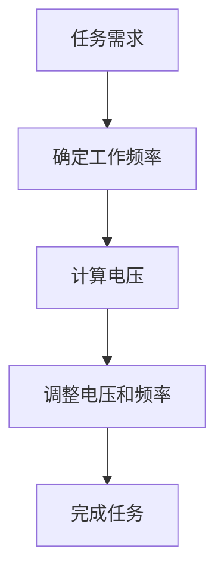
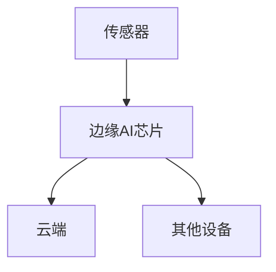
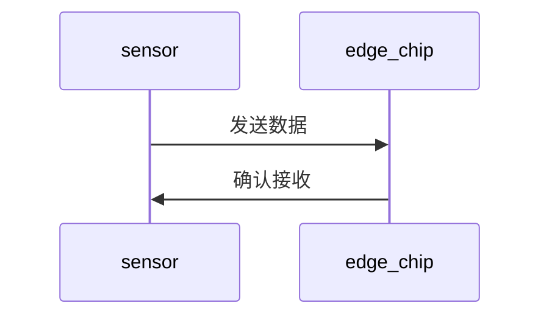
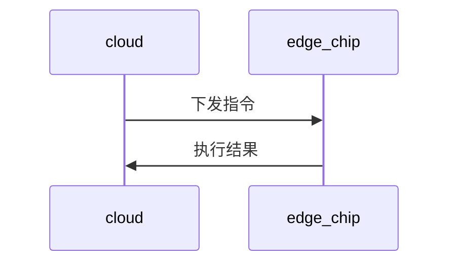

                 


# 如何识别企业的边缘AI芯片低功耗设计优势

> 关键词：边缘计算、AI芯片、低功耗设计、边缘AI、功耗优化、企业优势

> 摘要：随着边缘计算技术的快速发展，边缘AI芯片在企业中的应用越来越广泛。然而，边缘AI芯片的功耗问题成为了制约其性能和应用范围的重要因素。本文从边缘AI芯片的低功耗设计出发，详细分析了其核心原理、算法优化、系统架构设计以及实际应用中的优势。通过对比分析和案例研究，本文揭示了低功耗设计如何帮助企业提升性能、降低成本，并为企业在边缘AI芯片的选择和优化提供了有力的指导。

---

# 第一部分：边缘AI芯片低功耗设计背景与核心概念

## 第1章：边缘AI芯片与低功耗设计概述

### 1.1 边缘计算的基本概念
#### 1.1.1 边缘计算的定义与特点
边缘计算是一种分布式计算范式，将数据处理和存储从中心化的大数据中心转移到靠近数据源的边缘设备。其特点包括：
- **实时性**：数据在生成后立即处理，减少延迟。
- **分布式**：计算资源分散在边缘节点，提高系统的鲁棒性。
- **高效性**：通过本地处理减少数据传输量，降低网络负载。

#### 1.1.2 边缘AI芯片的定义与作用
边缘AI芯片是专为边缘计算设计的硬件设备，用于在边缘设备上执行AI相关任务。其作用包括：
- **加速AI推理**：支持深度学习模型的高效推理。
- **降低延迟**：通过本地计算减少对云端的依赖。
- **节省带宽**：减少数据传输到云端的需求。

#### 1.1.3 低功耗设计的背景与意义
边缘设备通常依赖电池供电或有限的能源资源，因此低功耗设计对于边缘AI芯片至关重要。低功耗设计的意义包括：
- **延长设备寿命**：减少功耗延长设备运行时间。
- **降低成本**：降低能源消耗，节省运营成本。
- **支持大规模部署**：低功耗设计使得边缘设备可以更广泛地部署在各种环境中。

---

## 第2章：边缘AI芯片低功耗设计的核心概念

### 2.1 低功耗设计的基本原理
#### 2.1.1 功耗计算的基本公式
功耗是电压和电流的乘积，公式为：
$$P = V \times I$$
在低功耗设计中，通常通过降低电压或减少电流来降低功耗。

#### 2.1.2 电路设计中的功耗优化
在电路设计中，可以通过以下方式优化功耗：
- **使用低功耗工艺**：采用先进的制程技术，减少漏电。
- **动态电压频率调整**：根据任务需求动态调整电压和频率。
- **睡眠模式**：在空闲时关闭部分电路，降低功耗。

### 2.2 边缘AI芯片的架构特点
#### 2.2.1 硬件架构对功耗的影响
边缘AI芯片的硬件架构设计直接影响功耗。例如：
- **专用加速器**：如GPU或TPU，专为AI任务设计，提高计算效率。
- **多核设计**：通过多核并行计算减少单个核心的负载。

#### 2.2.2 软件架构对功耗的影响
软件架构的设计也会影响功耗，例如：
- **任务调度算法**：通过合理调度任务，减少核心负载。
- **能量管理机制**：动态调整硬件资源的使用。

### 2.3 低功耗设计的关键技术
#### 2.3.1 动态电压频率调整
动态电压频率调整是一种通过动态调节电压和频率来优化功耗的技术。以下是其实现流程：


#### 2.3.2 睡眠模式与唤醒机制
边缘AI芯片可以通过进入睡眠模式来降低功耗，当有新任务时通过唤醒机制恢复运行。

#### 2.3.3 能量收集技术
通过收集环境中的能量（如太阳能、振动能量）来为边缘设备提供额外的能源。

### 2.4 核心概念对比分析
#### 2.4.1 低功耗设计与高性能设计的对比
| 对比维度 | 低功耗设计 | 高性能设计 |
|----------|------------|------------|
| 功耗目标 | 最低化     | 高性能     |
| 延迟容忍 | 较高       | 较低       |
| 能源依赖 | 低         | 高         |

#### 2.4.2 边缘AI芯片与其他类型芯片的对比
| 对比维度 | 边缘AI芯片 | 传统CPU     |
|----------|------------|------------|
| 适用场景 | 边缘计算   | 中心计算   |
| 功耗特点 | 低功耗     | 较高功耗    |
| 处理任务 | AI推理     | 通用计算   |

---

## 第3章：低功耗设计的算法原理

### 3.1 动态电压频率调整算法
#### 3.1.1 动态电压频率调整的原理
动态电压频率调整算法通过根据任务需求动态调整电压和频率，以达到最优的功耗和性能平衡。

#### 3.1.2 动态电压频率调整的实现流程


#### 3.1.3 动态电压频率调整的Python代码示例
```python
def dynamic_voltage_frequency_adjustment(target_frequency):
    voltage = V_base * (target_frequency / F_base)
    return voltage
```

### 3.2 任务调度算法
#### 3.2.1 任务调度的基本原理
任务调度算法通过合理分配任务到不同的核心或设备，以减少功耗和提高效率。

#### 3.2.2 基于优先级的任务调度算法
基于优先级的任务调度算法根据任务的优先级进行调度，确保高优先级任务优先执行。

#### 3.2.3 动态任务调度算法
动态任务调度算法根据实时负载动态调整任务分配策略。

### 3.3 算法实现的Python代码示例
```python
def task_scheduling(tasks):
    tasks.sort(key=lambda x: x['priority'])
    return tasks
```

---

## 第4章：低功耗设计的数学模型与公式

### 4.1 功耗计算模型
#### 4.1.1 基本功耗计算公式
$$P = V \times I$$

#### 4.1.2 动态电压频率调整的数学模型
$$P = V^2 \times f$$
其中，$V$ 是电压，$f$ 是频率。

### 4.2 功耗优化的数学公式
通过优化电压和频率，可以得到最小功耗：
$$\min P = V^2 \times f$$
约束条件：
$$V \geq V_{\text{min}}$$
$$f \leq f_{\text{max}}$$

---

## 第5章：系统分析与架构设计

### 5.1 边缘AI芯片的系统架构设计
#### 5.1.1 系统功能设计
- **数据采集**：从传感器或其他设备获取数据。
- **数据处理**：在边缘设备上进行AI推理。
- **结果输出**：将处理结果发送到云端或其他设备。

#### 5.1.2 系统架构图


### 5.2 系统接口设计
#### 5.2.1 边缘AI芯片与传感器的接口
- **输入接口**：接收传感器数据。
- **输出接口**：发送处理结果。

#### 5.2.2 边缘AI芯片与云端的接口
- **上传接口**：将处理结果上传到云端。
- **下载接口**：接收云端的指令或模型更新。

### 5.3 系统交互设计
#### 5.3.1 边缘AI芯片与传感器的交互


#### 5.3.2 边缘AI芯片与云端的交互


---

## 第6章：项目实战

### 6.1 环境搭建
#### 6.1.1 开发环境安装
- **硬件**：选择支持低功耗设计的边缘AI芯片。
- **软件**：安装相关的开发工具链和SDK。

#### 6.1.2 开发工具链
- **编译工具**：如GCC、Clang。
- **调试工具**：如GDB、Valgrind。

### 6.2 核心代码实现
#### 6.2.1 动态电压频率调整实现
```c
void adjust_voltage_frequency(int target_freq) {
    voltage = V_base * (target_freq / F_base);
    set_voltage(voltage);
    set_frequency(target_freq);
}
```

#### 6.2.2 任务调度实现
```python
def schedule_task(task):
    if task.priority > current_task.priority:
        swap_task(task);
```

### 6.3 案例分析与解读
#### 6.3.1 案例背景
某企业需要在边缘设备上部署一个实时物体检测系统，使用边缘AI芯片进行推理。

#### 6.3.2 实施方案
- **选择低功耗边缘AI芯片**：确保芯片支持动态电压频率调整和睡眠模式。
- **优化算法**：对物体检测算法进行优化，减少计算量。
- **系统集成**：将芯片与传感器和云端进行集成，确保数据的实时传输和处理。

### 6.4 项目小结
通过低功耗设计和优化算法，企业成功降低了边缘设备的功耗，提高了系统的实时性和稳定性。

---

## 第7章：最佳实践与总结

### 7.1 本章小结
本文详细介绍了边缘AI芯片低功耗设计的核心概念、算法原理和系统架构设计。通过案例分析和项目实战，展示了低功耗设计在企业中的实际应用和优势。

### 7.2 注意事项
- **选择合适的芯片**：根据需求选择支持低功耗设计的边缘AI芯片。
- **优化算法**：通过算法优化进一步降低功耗。
- **合理设计系统架构**：确保系统架构的高效性和可扩展性。

### 7.3 拓展阅读
- **《低功耗设计技术与应用》**
- **《边缘计算与AI芯片》**
- **《动态电压频率调整技术》**

---

# 作者：AI天才研究院 & 禅与计算机程序设计艺术

---

这篇文章从边缘AI芯片的低功耗设计背景出发，详细分析了其核心概念、算法原理、系统架构设计以及实际应用中的优势。通过对比分析和案例研究，揭示了低功耗设计如何帮助企业提升性能、降低成本，并为企业在边缘AI芯片的选择和优化提供了有力的指导。

