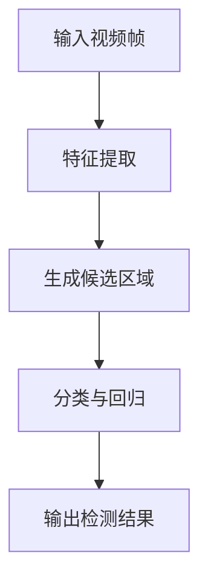
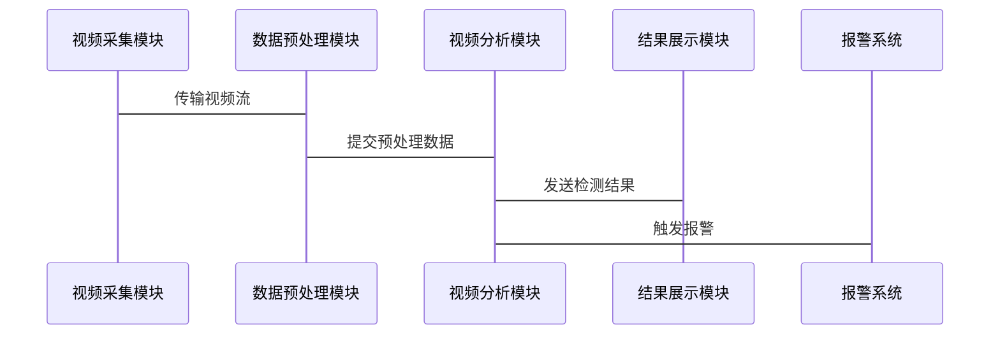

                 


```markdown
# 如何识别企业的边缘AI视频分析芯片优势

> 关键词：边缘计算, AI视频分析, 芯片优势, 算法原理, 系统架构, 项目实战

> 摘要：本文旨在探讨如何识别企业边缘AI视频分析芯片的优势。通过分析背景、核心概念、算法原理、系统架构及项目实战，深入解析边缘AI视频分析芯片的关键优势，帮助企业更好地识别和利用这些优势。

---

## 第一部分：企业边缘AI视频分析芯片的背景与优势

### 第1章：边缘AI视频分析芯片的背景介绍

#### 1.1 边缘计算的概念与发展
- 1.1.1 边缘计算的概念
  - 定义：边缘计算是指在靠近数据源的地方进行数据处理和分析，减少数据传输到云端的延迟。
  - 发展历程：从分布式计算到边缘计算的演变。
  - 核心特点：实时性、低延迟、高效性。

- 1.1.2 AI视频分析技术的演进
  - 早期的视频分析技术：基于规则的传统视频监控。
  - 人工智能的引入：从模式识别到深度学习的转变。
  - 当前趋势：边缘AI视频分析的普及。

- 1.1.3 边缘AI视频分析芯片的出现
  - 背景需求：实时性、低功耗、高效计算的需求推动边缘AI芯片的发展。
  - 技术突破：AI芯片的专用化设计，如GPU、TPU等。
  - 市场驱动：企业对高效、低成本解决方案的需求。

#### 1.2 企业的边缘AI视频分析芯片优势
- 1.2.1 性能优势
  - 高计算能力：边缘AI芯片在视频分析中的处理效率。
  - 低功耗设计：在保证性能的同时减少能源消耗。

- 1.2.2 低功耗与高效能
  - 芯片架构优化：专用指令集和硬件加速。
  - 能耗管理：动态调整计算资源，适应不同负载需求。

- 1.2.3 实时性与响应速度
  - 边缘计算的优势：减少数据传输延迟，提高实时响应能力。
  - 系统设计优化：高效的调度算法和数据处理机制。

- 1.2.4 部署灵活性与成本优化
  - 边缘设备的部署：无需依赖云端，本地部署降低成本。
  - 规模化部署：灵活扩展，适应不同规模的企业需求。

### 1.3 市场现状与趋势分析
- 1.3.1 当前市场格局
  - 主流厂商：NVIDIA、Google、寒武纪等。
  - 市场规模：边缘AI芯片市场的增长趋势。
  - 竞争态势：技术驱动下的市场格局变化。

- 1.3.2 技术发展趋势
  - 芯片架构的创新：如专用AI指令集、异构计算架构。
  - 算法优化：模型压缩、量化、知识蒸馏等技术提升芯片效率。
  - 生态系统的完善：开发者工具、SDK的完善推动应用开发。

- 1.3.3 企业需求与挑战
  - 企业需求：实时性、低延迟、高效计算。
  - 挑战：技术复杂性、成本控制、兼容性问题。

---

## 第二部分：核心概念与技术原理

### 第2章：边缘AI视频分析芯片的核心概念

#### 2.1 边缘AI视频分析芯片的工作原理
- 数据流处理：从视频流输入到特征提取，再到目标识别的全过程。
- 硬件加速：利用专用硬件加速深度学习模型的计算。
- 软件协同：优化的算法框架与芯片硬件的协同工作。

#### 2.2 边缘AI视频分析芯片的关键技术
- 芯片架构设计：专用指令集、计算单元、缓存结构。
- 算法优化：模型量化、剪枝、蒸馏等技术。
- 能耗管理：动态电压频率调整、任务调度优化。

#### 2.3 边缘AI视频分析芯片的应用场景
- 智能安防：实时监控、目标检测。
- 工业检测：缺陷检测、流程监控。
- 智慧交通：车辆识别、流量监控。

### 2.4 边缘AI视频分析芯片与传统芯片的对比分析
- 性能对比：
  | 参数       | 边缘AI芯片       | 传统CPU/GPU     |
  |------------|------------------|------------------|
  | 计算效率   | 高               | 中               |
  | 能耗       | 低               | 高               |
  | 延迟       | 低               | 高               |
  | 适用场景   | AI推理           | 通用计算         |
- 优缺点对比：
  - 优势：高效、低延迟、低功耗。
  - 劣势：适用场景有限，生态相对封闭。

### 2.5 ER实体关系图：边缘AI视频分析芯片的核心要素

```mermaid
er
  entity(芯片) {
    id_chip
    name
    architecture
    power_consumption
    processing_speed
  }
  entity(算法) {
    id_algorithm
    name
    model_type
    processing_capability
  }
  entity(数据) {
    id_data
    type
    source
    timestamp
  }
  entity(设备) {
    id_device
    type
    location
    status
  }
  entity(系统) {
    id_system
    name
    version
    deployment_mode
  }
  chip -left-> algorithm: 实现
  algorithm -left-> data: 处理
  data -left-> device: 来自
  device -left-> system: 部署于
```

---

## 第三部分：算法原理与数学模型

### 第3章：边缘AI视频分析芯片的算法原理

#### 3.1 目标检测算法原理
- 算法流程：
  1. 图像输入：获取视频帧。
  2. 特征提取：通过CNN提取特征图。
  3. 区域建议：生成候选区域。
  4. 分类与回归：对候选区域进行分类和位置回归。
- 算法流程图：



#### 3.2 目标检测算法实现代码
```python
import tensorflow as tf
from tensorflow.keras.models import Model
from tensorflow.keras.layers import Input, Conv2D, MaxPooling2D, Dense

def build_model(input_shape):
    inputs = Input(shape=input_shape)
    x = Conv2D(32, (3,3), activation='relu')(inputs)
    x = MaxPooling2D((2,2))(x)
    x = Conv2D(64, (3,3), activation='relu')(x)
    x = MaxPooling2D((2,2))(x)
    x = Flatten()(x)
    x = Dense(128, activation='relu')(x)
    predictions = Dense(1, activation='sigmoid')(x)
    return Model(inputs=inputs, outputs=predictions)
```

#### 3.3 算法的数学模型
- 损失函数：二分类交叉熵损失。
  $$ L = -\sum_{i=1}^{n} [y_i \log p_i + (1-y_i) \log (1-p_i)] $$
- 优化目标：最小化损失函数，采用Adam优化器。
  $$ \text{Adam} = \text{Momentum} + \text{RMSProp} $$

---

## 第四部分：系统分析与架构设计

### 第4章：边缘AI视频分析系统的架构设计

#### 4.1 项目背景与目标
- 项目背景：实时视频监控需求。
- 项目目标：设计一个高效的边缘AI视频分析系统。

#### 4.2 系统功能设计
- 视频采集模块：实时获取视频流。
- 数据预处理模块：格式转换、分辨率调整。
- 视频分析模块：目标检测、分类。
- 结果展示模块：实时显示检测结果。
- 报警模块：触发警报通知。

#### 4.3 系统架构设计
- 分层架构：数据采集层、数据处理层、业务逻辑层、用户界面层。
- 模块间关系：
  ```mermaid
  graph TD
    DataCollector --> DataPreprocessor
    DataPreprocessor --> VideoAnalyzer
    VideoAnalyzer --> ResultDisplay
    ResultDisplay --> AlarmSystem
  ```

#### 4.4 系统接口设计
- 视频流接口：接收H.264编码的视频流。
- API接口：提供RESTful API供其他系统调用。
- 报警接口：通过HTTP POST触发报警通知。

#### 4.5 系统交互序列图


---

## 第五部分：项目实战

### 第5章：边缘AI视频分析芯片的实现

#### 5.1 环境安装与配置
- 安装Python 3.8+
- 安装TensorFlow或Keras框架
- 安装芯片开发工具包（如NVIDIA的CUDA toolkit）

#### 5.2 芯片实现代码
```python
# 安装依赖
pip install tensorflow-cpu numpy opencv-python

# 实例代码
import cv2
import numpy as np
import tensorflow as tf

def load_model(model_path):
    model = tf.keras.models.load_model(model_path)
    return model

def process_frame(frame, model):
    # 预处理
    frame = cv2.resize(frame, (224, 224))
    frame = frame / 255.0
    frame = np.expand_dims(frame, axis=0)
    # 预测
    prediction = model.predict(frame)
    return prediction[0][0]

# 主函数
def main():
    model = load_model('model.h5')
    cap = cv2.VideoCapture(0)
    while cap.isOpened():
        ret, frame = cap.read()
        if not ret:
            break
        result = process_frame(frame, model)
        print(f'Prediction: {result}')
        cv2.imshow('Video', frame)
        if cv2.waitKey(1) & 0xFF == ord('q'):
            break
    cap.release()
    cv2.destroyAllWindows()

if __name__ == '__main__':
    main()
```

#### 5.3 实际案例分析与总结
- 案例分析：智能安防系统的部署。
- 优化措施：模型量化、任务调度优化、缓存机制。
- 总结：系统性能提升的经验与教训。

---

## 第六部分：总结与展望

### 6.1 总结
- 识别企业边缘AI视频分析芯片优势的关键点：
  - 高效计算能力
  - 低功耗设计
  - 实时响应能力
  - 灵活部署与成本优化

### 6.2 注意事项
- 数据隐私与安全
- 系统兼容性问题
- 算法模型的可扩展性

### 6.3 拓展阅读
- 推荐书籍：《深度学习》（Ian Goodfellow）
- 推荐技术博客：NVIDIA Developer Blog
- 推荐工具：TensorFlow Lite、OpenVINO

---

## 作者信息

作者：AI天才研究院 & 禅与计算机程序设计艺术

---

*本文由AI天才研究院出品，转载请注明出处。*
```

