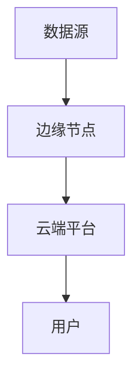
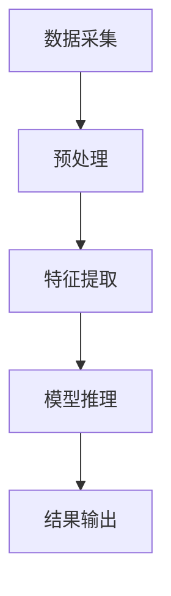
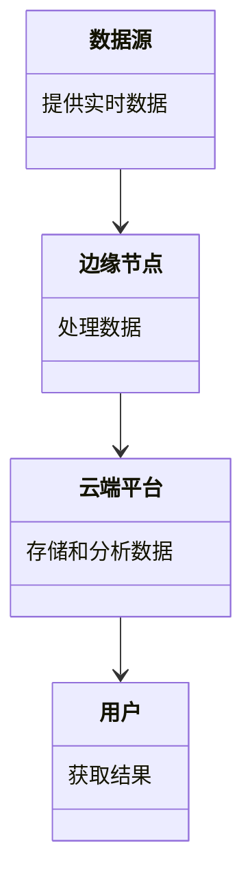
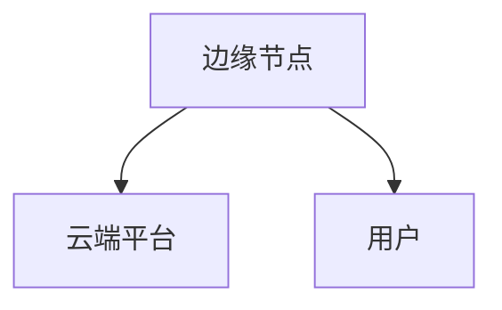

                 


# 如何识别企业的边缘计算实时推理优势

> 关键词：边缘计算、实时推理、企业优势、技术分析、系统架构

> 摘要：边缘计算作为一种新兴的技术，正在迅速改变企业处理实时数据的方式。本文将深入分析边缘计算在实时推理中的优势，探讨其核心概念、算法原理、系统架构，并通过实际案例展示其在企业中的应用。通过本文，读者将能够识别和理解边缘计算在实时推理中的独特优势，为企业决策提供有力支持。

---

## 第一部分: 边缘计算与实时推理概述

### 第1章: 边缘计算的背景与优势

#### 1.1 边缘计算的定义与特点
边缘计算是一种分布式计算范式，将计算能力从中心服务器转移到靠近数据源的边缘设备。其特点包括低延迟、高实时性、数据隐私保护和减少带宽消耗。

#### 1.2 边缘计算的应用场景
边缘计算广泛应用于工业自动化、智慧城市和智慧医疗等领域，尤其在需要实时响应的场景中表现出色。

#### 1.3 边缘计算与实时推理的关系
实时推理是边缘计算的核心功能之一，边缘计算通过将计算能力推向边缘，显著提高了实时推理的效率和响应速度。

---

## 第2章: 边缘计算的核心概念与联系

### 2.1 边缘计算的核心原理
边缘计算的数据处理流程包括数据采集、预处理、特征提取和模型推理，确保数据在边缘节点高效处理。

### 2.2 边缘计算与云计算的对比
通过对比边缘计算与云计算的异同，可以发现边缘计算的独特优势在于其低延迟和实时性，而云计算则在数据存储和处理能力上更具优势。

### 2.3 边缘计算的实体关系图


---

## 第3章: 边缘计算实时推理的算法原理

### 3.1 实时推理算法概述
实时推理算法分类包括目标检测和图像分类。选择算法时需考虑模型复杂度和计算资源。

### 3.2 实时推理算法的实现流程


### 3.3 实时推理算法的数学模型
- **线性回归模型**：$$ y = \beta_0 + \beta_1x + \epsilon $$
- **支持向量机模型**：$$ \text{maximize} \quad \frac{1}{2}\|w\|^2 $$
  $$ \text{subject to} \quad y_i(w \cdot x_i + b) \geq 1, \forall i $$

---

## 第4章: 边缘计算实时推理的系统架构

### 4.1 系统架构设计
边缘计算系统架构包括数据采集层、数据处理层和应用层，确保数据高效处理和实时推理。

### 4.2 系统功能设计


### 4.3 系统架构图


---

## 第5章: 边缘计算实时推理的项目实战

### 5.1 环境安装
安装必要的工具和库，如Python、TensorFlow和Keras。

### 5.2 核心代码实现
```python
import tensorflow as tf
import numpy as np

# 加载模型
model = tf.keras.models.load_model('model.h5')

# 推理函数
def predict(data):
    prediction = model.predict(data)
    return prediction
```

### 5.3 案例分析
通过实际案例展示边缘计算在实时推理中的应用，分析模型性能和系统优化。

### 5.4 项目总结
总结项目经验，提出改进建议，强调边缘计算在实时推理中的重要性。

---

## 第6章: 边缘计算实时推理的最佳实践

### 6.1 小结
边缘计算在实时推理中的优势显著，企业应积极识别和利用这些优势。

### 6.2 注意事项
在实施边缘计算时，需注意数据隐私、计算资源和系统维护等问题。

### 6.3 拓展阅读
推荐相关书籍和资源，供读者深入学习边缘计算和实时推理技术。

---

## 作者信息

作者：AI天才研究院 & 禅与计算机程序设计艺术

---

通过本文的详细分析，读者可以全面了解边缘计算在实时推理中的优势，并能够在实际项目中识别和利用这些优势，推动企业的技术进步和业务发展。

