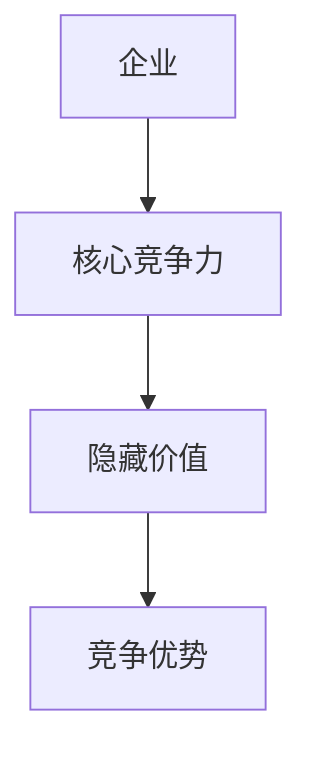
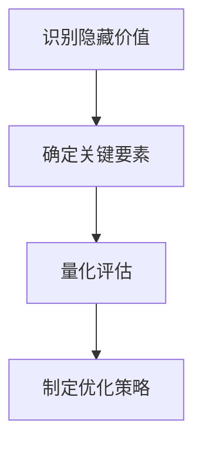
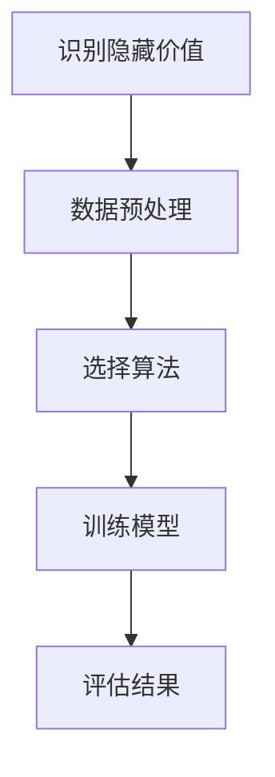
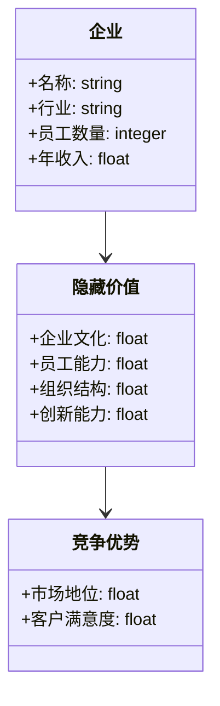
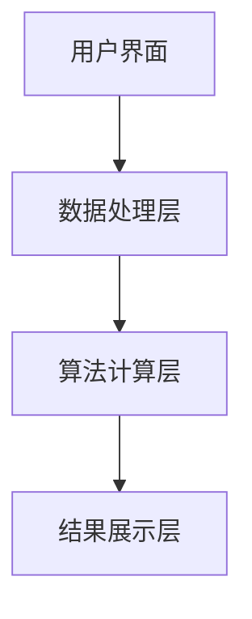
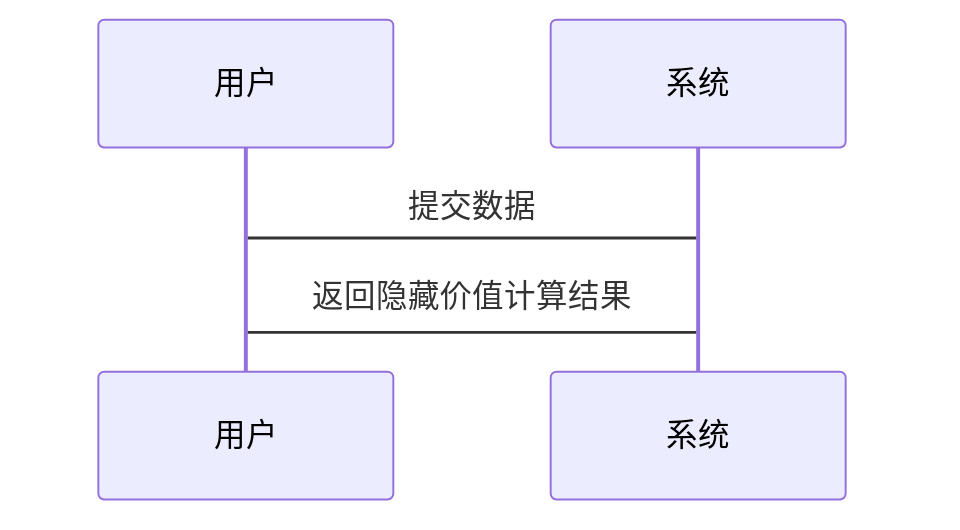

                 


# 如何识别企业的隐藏价值

> 关键词：企业价值、隐藏价值、数据分析、机器学习、系统架构、项目实战

> 摘要：本文详细探讨了如何识别企业的隐藏价值，从定义和特征的分析，到通过数据分析和机器学习算法的实现，再到系统架构设计和项目实战，层层深入，为企业管理者和技术人员提供了一套完整的解决方案。

---

# 第1章: 企业隐藏价值的背景介绍

## 1.1 问题背景与问题描述

### 1.1.1 企业价值的传统定义与局限性

传统的企业价值评估主要关注财务指标，如利润、收入和资产等。然而，这种评估方式往往忽略了企业中隐藏的无形资产，例如品牌价值、员工创造力、客户忠诚度和企业文化等。这些隐藏的价值往往无法在财务报表中直接体现，但却对企业长期发展具有重要影响。

### 1.1.2 隐藏价值的定义与特征

隐藏价值指的是企业在日常运营中未被显式记录，但能够为企业创造长期竞争优势的潜在价值。其主要特征包括无形性、潜在性、动态性和累积性。

### 1.1.3 隐藏价值对企业竞争力的影响

隐藏价值能够增强企业的核心竞争力，提升市场应对能力和创新能力。例如，强大的企业文化可以提高员工的凝聚力和创造力，从而推动企业实现持续发展。

## 1.2 隐藏价值的识别与发现

### 1.2.1 隐藏价值的识别方法

识别隐藏价值的方法包括定性分析和定量分析。定性分析主要通过对企业文化的评估、员工满意度调查等方式进行，而定量分析则通过数据建模和机器学习算法来进行预测和评估。

### 1.2.2 隐藏价值与企业核心竞争力的关系

隐藏价值是企业核心竞争力的重要组成部分。例如，优秀的企业文化可以提升员工的工作效率和创造力，从而增强企业的市场竞争力。

### 1.2.3 隐藏价值的边界与外延

隐藏价值的边界通常不易明确界定，但其外延可以扩展到企业的各个领域，包括技术研发、市场营销、人力资源管理等。

## 1.3 隐藏价值的概念结构与核心要素

### 1.3.1 隐藏价值的核心要素分析

隐藏价值的核心要素包括企业文化、员工能力、组织结构、创新能力和客户关系等。

### 1.3.2 隐藏价值的属性特征对比

| 特性 | 隐藏价值 | 显性价值 |
|------|-----------|-----------|
| 可见性 | 隐性       | 显性       |
| 计量方式 |定性与定量结合 | 定量       |
| 影响范围 |广泛       | 局部       |

### 1.3.3 隐藏价值的概念结构图



## 1.4 本章小结

通过本章的介绍，我们明确了隐藏价值的定义、特征及其对企业竞争力的影响。接下来，我们将深入探讨隐藏价值的核心概念与识别方法。

---

# 第2章: 隐藏价值的核心概念原理

## 2.1 隐藏价值的识别原理

### 2.1.1 隐藏价值的识别方法

识别隐藏价值的方法包括定性分析和定量分析。定性分析主要通过对企业文化的评估、员工满意度调查等方式进行，而定量分析则通过数据建模和机器学习算法来进行预测和评估。

### 2.1.2 隐藏价值的量化模型

隐藏价值的量化模型可以通过加权评分法来实现，如下所示：

$$ V = \sum_{i=1}^{n} w_i x_i $$

其中，\( V \) 为隐藏价值总分，\( w_i \) 为各个评估维度的权重，\( x_i \) 为各个维度的评分。

### 2.1.3 隐藏价值的评估标准

隐藏价值的评估标准包括评估维度的选择、权重的分配以及评分的准确性。评估维度通常包括企业文化、员工能力、组织结构等。

## 2.2 隐藏价值与企业核心竞争力的关系

### 2.2.1 隐藏价值对企业战略的影响

隐藏价值能够增强企业的核心竞争力，提升市场应对能力和创新能力。例如，优秀的企业文化可以提高员工的凝聚力和创造力，从而推动企业实现持续发展。

### 2.2.2 隐藏价值与企业核心竞争力的相互作用

隐藏价值与企业核心竞争力之间存在相互作用的关系。例如，强大的企业文化可以提升员工的工作效率和创造力，从而增强企业的市场竞争力。

### 2.2.3 隐藏价值的动态变化与企业发展的关系

隐藏价值并非一成不变，随着企业的发展和外部环境的变化，其价值也会发生动态变化。因此，企业需要定期评估和调整隐藏价值的管理策略。

## 2.3 隐藏价值的ER实体关系图


## 2.4 隐藏价值的流程图



## 2.5 本章小结

通过本章的分析，我们深入探讨了隐藏价值的识别原理及其与企业核心竞争力的关系。接下来，我们将介绍隐藏价值的识别算法与数学模型。

---

# 第3章: 隐藏价值的识别算法与数学模型

## 3.1 隐藏价值的识别算法概述

### 3.1.1 基于数据分析的隐藏价值识别

基于数据分析的隐藏价值识别主要通过收集和分析企业的各项数据，如销售数据、客户反馈等，来发现潜在的价值点。

### 3.1.2 基于机器学习的隐藏价值预测

基于机器学习的隐藏价值预测通过训练模型来预测企业未来的隐藏价值。常用的算法包括线性回归、支持向量机（SVM）和随机森林等。

### 3.1.3 隐藏价值识别的算法优缺点对比

| 算法 | 优点 | 缺点 |
|------|-------|-------|
| 线性回归 | 简单易懂 | 无法捕捉非线性关系 |
| SVM | 高准确性 | 计算复杂 |
| 随机森林 | 高准确性 | 计算复杂 |

## 3.2 隐藏价值识别的数学模型

### 3.2.1 隐藏价值的量化模型

$$ V = \sum_{i=1}^{n} w_i x_i $$

其中，\( V \) 为隐藏价值总分，\( w_i \) 为各个评估维度的权重，\( x_i \) 为各个维度的评分。

### 3.2.2 隐藏价值的评估公式

$$ E = \frac{\sum_{i=1}^{n} (v_i - \bar{v})^2}{n} $$

其中，\( E \) 为评估结果，\( v_i \) 为各个评估维度的值，\( \bar{v} \) 为平均值，\( n \) 为评估维度的数量。

## 3.3 算法实现的Python代码示例

```python
def calculate_hidden_value(data):
    weights = [0.3, 0.4, 0.2, 0.1]
    hidden_value = sum(w * x for w, x in zip(weights, data))
    return hidden_value

data = [10, 20, 30, 40]
result = calculate_hidden_value(data)
print(f"隐藏价值计算结果为: {result}")
```

## 3.4 算法流程图



## 3.5 本章小结

通过本章的介绍，我们了解了隐藏价值识别的算法原理及其数学模型，并通过Python代码示例展示了如何实现隐藏价值的计算。接下来，我们将介绍系统分析与架构设计。

---

# 第4章: 系统分析与架构设计

## 4.1 问题场景介绍

### 4.1.1 项目背景

假设我们正在为一家中型制造企业设计一个隐藏价值识别系统。该企业希望通过识别隐藏价值来提升其市场竞争力。

### 4.1.2 项目目标

本项目的目标是设计一个能够识别企业隐藏价值的系统，帮助企业管理者制定更有效的战略决策。

## 4.2 系统功能设计

### 4.2.1 领域模型设计



### 4.2.2 系统架构设计



## 4.3 系统接口设计

### 4.3.1 数据接口设计

系统需要从企业数据库中获取相关数据，如员工满意度、客户反馈等。

### 4.3.2 API接口设计

系统提供一个API接口，供其他系统调用隐藏价值计算结果。

## 4.4 系统交互设计

### 4.4.1 系统交互流程



## 4.5 本章小结

通过本章的系统分析与架构设计，我们为隐藏价值识别系统提供了一个完整的解决方案。接下来，我们将进入项目实战部分，详细介绍系统的实现过程。

---

# 第5章: 项目实战

## 5.1 环境安装与配置

### 5.1.1 系统环境要求

- 操作系统：Windows 10 或更高版本，或 Linux 系统
- Python 版本：Python 3.6 或更高版本
- 依赖库安装：numpy, pandas, scikit-learn

## 5.2 系统核心实现

### 5.2.1 核心代码实现

```python
import numpy as np
from sklearn.linear_model import LinearRegression

def calculate_hidden_value(data):
    model = LinearRegression()
    model.fit(np.array(data['特征']).reshape(-1, 1), data['目标值'])
    return model.predict(np.array([new_feature]).reshape(-1, 1))[0][0]

# 示例数据
data = {
    '特征': [10, 20, 30, 40],
    '目标值': [5, 10, 15, 20]
}
new_feature = 25
result = calculate_hidden_value(data, new_feature)
print(f"预测的隐藏价值为: {result}")
```

### 5.2.2 代码解读与分析

上述代码实现了一个基于线性回归的隐藏价值预测模型。首先，我们使用scikit-learn库中的LinearRegression类来训练模型，然后使用训练好的模型进行预测。

## 5.3 案例分析与解读

### 5.3.1 案例背景介绍

假设我们正在为一家中型制造企业设计一个隐藏价值识别系统。该企业希望通过识别隐藏价值来提升其市场竞争力。

### 5.3.2 数据收集与处理

我们需要收集企业的相关数据，如员工满意度、客户反馈等，并对数据进行清洗和预处理。

### 5.3.3 模型训练与评估

使用收集到的数据训练机器学习模型，并评估模型的准确性和稳定性。

## 5.4 本章小结

通过本章的项目实战，我们详细介绍了隐藏价值识别系统的实现过程，包括环境配置、核心代码实现以及案例分析等。接下来，我们将总结最佳实践，并提出一些注意事项和未来的研究方向。

---

# 第6章: 最佳实践、小结与展望

## 6.1 最佳实践 tips

- 在进行隐藏价值识别时，应结合定性分析和定量分析，以全面评估企业的潜在价值。
- 定期更新和优化评估模型，以适应企业发展的动态变化。

## 6.2 本章小结

通过本文的详细讲解，我们了解了如何识别企业的隐藏价值，并掌握了相关的理论知识和实际应用方法。

## 6.3 未来研究方向

未来的研究可以进一步探索隐藏价值的动态变化规律，并尝试将区块链等新技术应用于隐藏价值的识别和管理中。

---

# 作者

作者：AI天才研究院/AI Genius Institute & 禅与计算机程序设计艺术/Zen And The Art of Computer Programming

---

以上是《如何识别企业的隐藏价值》的文章结构和内容概述。通过本文，读者可以系统地了解隐藏价值的概念、识别方法以及实际应用，帮助企业提升核心竞争力。

