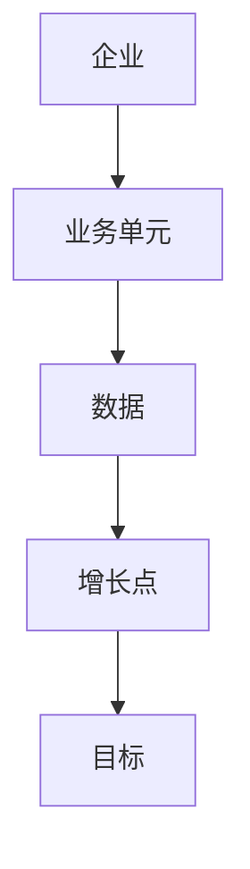
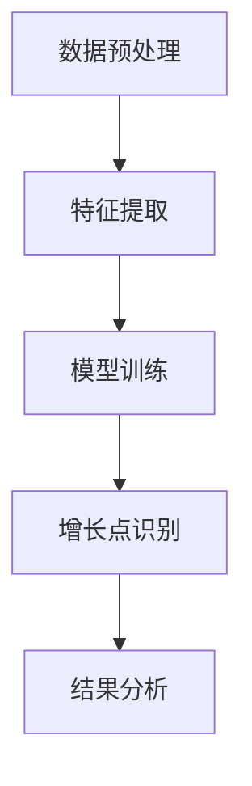
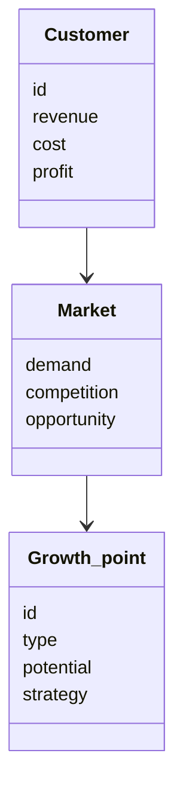
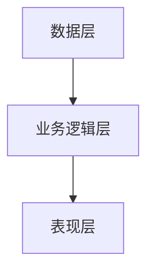
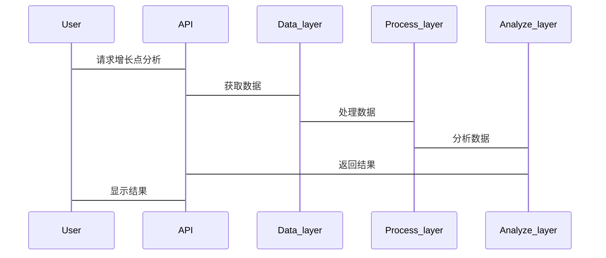

                 


# 如何识别企业的隐藏增长点

> 关键词：企业增长点、数据挖掘、业务洞察、技术驱动、增长策略、算法原理、系统架构

> 摘要：在当前竞争激烈的商业环境中，识别企业的隐藏增长点是实现持续发展的关键。本文从背景介绍、核心概念、算法原理、系统架构到项目实战，详细探讨了如何通过数据分析和技术创新发现隐藏的增长机会，并提供实际案例和最佳实践，帮助企业在复杂多变的市场中找到新的增长引擎。

---

## 第一部分：背景介绍

### 第1章：问题背景与描述

#### 1.1 问题背景
- 1.1.1 经济环境变化对企业的影响
  - 经济波动对企业运营的影响，如成本上升、市场需求变化等。
  - 技术进步对企业竞争力的推动作用，如数字化转型的需求。
- 1.1.2 企业增长点的定义与重要性
  - 增长点的定义：企业通过优化资源配置、技术创新或业务模式创新实现收入或利润增长的要素。
  - 隐藏增长点的重要性：通过挖掘潜在机会，增强企业抗风险能力和市场竞争力。
- 1.1.3 隐藏增长点的发现与挖掘
  - 隐藏增长点的特点：隐性、潜在、可扩展性强。
  - 发现隐藏增长点的方法：数据分析、市场调研、内部审计等。

#### 1.2 问题描述
- 1.2.1 企业增长点的分类
  - 显性增长点：已知的市场机会和竞争优势。
  - 隐藏增长点：尚未被发现或充分利用的增长机会。
- 1.2.2 隐藏增长点的特点
  - 隐性：未被现有数据分析或业务模式所捕捉。
  - 潜在：通过优化资源配置或技术创新可以释放的增长潜力。
  - 可扩展性：可以在一定范围内快速复制或推广的增长点。
- 1.2.3 隐藏增长点对企业发展的意义
  - 提升企业核心竞争力。
  - 扩大市场份额。
  - 提高企业抗风险能力。

#### 1.3 问题解决方法
- 1.3.1 数据分析方法
  - 利用大数据技术挖掘潜在市场机会。
  - 通过数据建模预测未来增长趋势。
- 1.3.2 业务模式创新
  - 引入新的商业模式，如订阅制、共享经济等。
  - 优化现有业务流程，提高效率。
- 1.3.3 技术驱动增长
  - 利用人工智能、大数据、区块链等技术提升业务能力。
  - 通过技术创新降低运营成本，提高盈利能力。

#### 1.4 边界与外延
- 1.4.1 隐藏增长点的边界
  - 不包括显性已知的增长机会。
  - 仅限于通过数据分析和技术手段可识别的潜在机会。
- 1.4.2 相关概念的对比
  - 与企业核心竞争力的对比：隐藏增长点是核心竞争力的一部分，但更侧重于潜在机会。
  - 与企业战略目标的对比：隐藏增长点是实现战略目标的手段之一。
- 1.4.3 隐藏增长点的外延
  - 包括技术创新、市场拓展、产品优化等多个方面。

#### 1.5 核心要素组成
- 1.5.1 数据驱动
  - 利用数据挖掘、机器学习等技术发现潜在增长机会。
- 1.5.2 业务洞察
  - 通过市场调研、竞争分析等方式识别隐藏的增长点。
- 1.5.3 技术支持
  - 采用先进技术优化业务流程，提升运营效率。

---

## 第二部分：核心概念与联系

### 第2章：核心概念原理

#### 2.1 增长点类型对比
- 2.1.1 显性增长点与隐性增长点的对比
  - 显性增长点：已知的市场机会，如现有产品的扩展、已知客户的增长。
  - 隐性增长点：未被发现或未被充分利用的市场机会，如新兴市场、潜在客户群体。
- 2.1.2 长期增长点与短期增长点的区分
  - 长期增长点：需要长期投入，但具有持续增长潜力。
  - 短期增长点：可以在较短时间内实现增长，但可能不具备持续性。
- 2.1.3 内部增长点与外部增长点的联系
  - 内部增长点：通过优化内部资源、流程实现增长。
  - 外部增长点：通过并购、合作伙伴关系等方式实现增长。

#### 2.2 核心概念属性特征对比表
- 表2.1：增长点类型与特征对比

| 类型       | 特征描述                         |
|------------|----------------------------------|
| 显性增长点  | 已经被识别和利用的市场机会       |
| 隐藏增长点  | 未被识别或未被充分利用的市场机会 |
| 长期增长点  | 需要长期投入，具有持续增长潜力   |
| 短期增长点  | 可在短期内实现，但可能不具备持续性 |
| 内部增长点  | 通过优化内部资源实现增长         |
| 外部增长点  | 通过外部合作或并购实现增长       |

#### 2.3 ER实体关系图


---

## 第三部分：算法原理讲解

### 第3章：算法原理与实现

#### 3.1 数据挖掘算法
- 3.1.1 聚类分析
  - 聚类分析的基本原理：将数据点分为若干个簇，簇内的数据点具有较高的相似性。
  - 应用场景：识别客户群体中的潜在增长机会。
- 3.1.2 回归分析
  - 回归分析的基本原理：通过建立变量之间的关系模型，预测未来趋势。
  - 应用场景：预测市场需求变化，识别潜在的增长点。
- 3.1.3 突变点检测
  - 突变点检测的基本原理：识别数据中的异常点，可能代表潜在的增长机会或风险。
  - 应用场景：检测市场波动，发现潜在的增长机会。

#### 3.2 算法流程图


#### 3.3 Python代码实现
```python
import pandas as pd
from sklearn.cluster import KMeans

# 示例数据加载
data = pd.read_csv('growth_points.csv')

# 特征提取
features = data[['revenue', 'cost', 'profit']]

# 模型训练
model = KMeans(n_clusters=3)
model.fit(features)

# 预测结果
labels = model.labels_
print("预测结果：", labels)
```

#### 3.4 数学模型和公式
- 聚类分析的数学模型
  - 聚类目标函数：$$ J = \sum_{i=1}^{k} \sum_{j=1}^{n_i} (x_j - c_i)^2 $$
  - 其中，$$ k $$ 是簇的数量，$$ n_i $$ 是第 $$ i $$ 个簇中的数据点数量，$$ x_j $$ 是数据点，$$ c_i $$ 是第 $$ i $$ 个簇的中心。

#### 3.5 举例说明
- 示例：假设某企业有客户数据，通过聚类分析发现某一客户群体的消费习惯相似，但尚未被充分挖掘，可以将其作为隐藏增长点进行针对性营销。

---

## 第四部分：系统分析与架构设计

### 第4章：系统分析与架构设计方案

#### 4.1 问题场景介绍
- 问题场景：某企业希望通过数据分析和技术创新识别隐藏增长点，提升市场竞争力。

#### 4.2 系统功能设计
- 领域模型：$$ Customer \rightarrow Market \rightarrow Growth \_ point $$



#### 4.3 系统架构设计
- 系统架构：采用分层架构，包括数据层、业务逻辑层和表现层。



#### 4.4 系统接口设计
- 接口设计：API接口用于数据采集、处理和分析。

#### 4.5 系统交互流程图


---

## 第五部分：项目实战

### 第5章：项目实战

#### 5.1 环境安装
- 安装Python、Pandas、Scikit-learn等工具。

#### 5.2 系统核心实现源代码
```python
import pandas as pd
from sklearn.cluster import KMeans

# 加载数据
data = pd.read_csv('growth_points.csv')

# 特征提取
features = data[['revenue', 'cost', 'profit']]

# 模型训练
model = KMeans(n_clusters=3)
model.fit(features)

# 预测结果
labels = model.labels_
print("预测结果：", labels)
```

#### 5.3 代码应用解读与分析
- 代码功能：通过聚类分析将客户数据分为三类，识别潜在的增长点。

#### 5.4 实际案例分析
- 案例：某电商企业通过分析用户购买数据，发现某一类用户的消费潜力未被充分挖掘，通过精准营销提升了销售额。

#### 5.5 项目小结
- 通过数据分析和技术创新，企业可以识别隐藏增长点，实现持续发展。

---

## 第六部分：最佳实践与总结

### 第6章：最佳实践 tips

- 6.1 最佳实践
  - 定期进行数据分析，识别潜在增长机会。
  - 采用先进技术优化业务流程，提升效率。
  - 与外部合作伙伴共享资源，扩大市场覆盖。

### 6.2 小结
- 本文详细探讨了如何识别企业的隐藏增长点，通过数据分析、技术创新和业务模式优化，帮助企业发现潜在的增长机会。

### 6.3 注意事项
- 数据分析结果仅供参考，需结合实际情况制定具体策略。
- 技术创新需谨慎，确保数据安全和隐私保护。

### 6.4 拓展阅读
- 推荐阅读《Data Mining: Concepts and Techniques》和《Machine Learning: A
  High-Level Overview》。

---

## 作者

作者：AI天才研究院/AI Genius Institute & 禅与计算机程序设计艺术/Zen And The Art of Computer Programming

---

以上是《如何识别企业的隐藏增长点》的完整目录大纲，涵盖了背景介绍、核心概念、算法原理、系统架构、项目实战以及最佳实践等部分。每个章节都详细展开了内容，确保读者能够全面理解如何识别企业的隐藏增长点。

