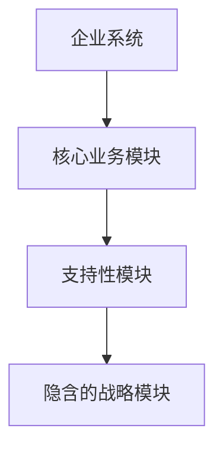

                 

# 如何识别企业的隐藏成长动力

---

## 关键词：
企业成长，隐藏动力，战略分析，组织优化，技术创新，可持续发展

---

## 摘要：
本文深入探讨了企业在发展过程中隐藏的成长动力，分析了这些动力在战略、组织、文化和技术层面的具体体现，并结合实际案例，详细阐述了如何识别和利用这些动力来推动企业的可持续发展。通过系统化的分析和实践，本文为企业提供了有效的识别方法和策略。

---

## 正文：

### 第一部分：背景与核心概念

#### 第1章：隐藏成长动力的定义与背景

##### 1.1 什么是隐藏成长动力
- **1.1.1 隐藏成长动力的定义**  
  隐藏成长动力是指企业在日常运营中不易察觉，但能够持续推动企业发展的内在因素。这些因素可能包括未被完全挖掘的市场机会、潜在的技术优势或尚未形成的组织文化。

- **1.1.2 隐藏成长动力的特征**  
  - 隐蔽性：不易被外界察觉。
  - 持续性：能够长期推动企业发展。
  - 可转化性：通过识别和优化，可以转化为实际的竞争力。

- **1.1.3 隐藏成长动力与企业发展的关系**  
  隐藏成长动力是企业发展的核心驱动力之一，能够帮助企业在全球化竞争中占据优势。

##### 1.2 隐藏成长动力的背景分析
- **1.2.1 当前企业面临的挑战**  
  当前市场竞争日益激烈，企业需要找到新的增长点，而这些增长点往往隐藏在企业的内部优势中。

- **1.2.2 隐藏成长动力对企业竞争力的影响**  
  隐藏成长动力能够增强企业的核心竞争力，帮助企业在市场中立于不败之地。

- **1.2.3 隐藏成长动力与企业可持续发展的关联**  
  隐藏成长动力是企业实现可持续发展的关键，能够确保企业在长期发展中保持活力。

---

### 第二部分：核心概念与识别方法

#### 第2章：隐藏成长动力的核心要素

##### 2.1 战略层面的隐藏动力
- **2.1.1 企业战略目标的隐性驱动**  
  企业的战略目标往往包含一些未被明确定义的隐性驱动因素，这些因素可能影响战略的执行效果。

- **2.1.2 战略执行中的隐藏因素**  
  战略执行过程中，一些未被预见的隐藏因素可能对结果产生重大影响。

- **2.1.3 战略调整与隐藏动力的关系**  
  隐藏动力是企业在战略调整中需要考虑的重要因素。

##### 2.2 组织层面的隐藏动力
- **2.2.1 组织结构与隐藏动力的相互作用**  
  组织结构的设计需要考虑隐藏动力的影响，以确保结构能够支持企业的长期发展。

- **2.2.2 组织文化对企业隐藏成长动力的影响**  
  组织文化是隐藏动力的重要来源，能够影响员工的行为和企业的整体表现。

- **2.2.3 隐含的组织变革驱动力**  
  隐藏动力是组织变革的重要驱动力，能够推动企业不断优化自身的结构和流程。

##### 2.3 技术层面的隐藏动力
- **2.3.1 技术创新与隐藏动力的关系**  
  技术创新是隐藏动力的重要表现形式，能够为企业带来新的发展机遇。

- **2.3.2 数字化转型中的隐藏动力**  
  数字化转型过程中，隐藏动力能够帮助企业更好地应对技术变革的挑战。

- **2.3.3 技术积累对企业成长的影响**  
  技术积累是隐藏动力的重要组成部分，能够为企业提供持续的技术支持。

---

### 第三部分：系统分析与架构设计

#### 第3章：企业系统中的隐藏成长动力分析

##### 3.1 企业系统模块划分
- **3.1.1 核心业务模块**  
  核心业务模块是企业的主要收入来源，隐藏动力往往体现在这些模块中。

- **3.1.2 支持性模块**  
  支持性模块为企业提供必要的支持，隐藏动力可能存在于这些模块的优化中。

- **3.1.3 隐含的战略模块**  
  隐藏动力往往体现在战略模块中，能够影响企业的长期发展。

##### 3.2 隐藏成长动力的系统架构图

---

### 第四部分：项目实战

#### 第4章：隐藏成长动力的识别与应用

##### 4.1 项目背景与目标
- **4.1.1 项目背景介绍**  
  本项目旨在识别某企业的隐藏成长动力，并将其转化为实际的竞争力。

- **4.1.2 项目目标设定**  
  - 识别企业内部的隐藏动力。
  - 分析隐藏动力对企业发展的影响。
  - 提出优化建议。

- **4.1.3 项目范围界定**  
  项目范围包括企业的战略、组织、文化和技术层面。

##### 4.2 项目实施过程
- **4.2.1 数据收集与分析**  
  通过问卷调查、访谈和数据分析等方式收集企业内部的数据，识别隐藏动力。

- **4.2.2 隐藏动力识别方法**  
  使用战略分析、组织优化和技术创新等方法识别隐藏动力。

- **4.2.3 实施中的关键问题解决**  
  在实施过程中，遇到了数据不完整和方法论不适用等问题，通过调整方法和补充数据最终解决了问题。

##### 4.3 项目成果与案例分析
- **4.3.1 成功案例介绍**  
  通过识别某企业的隐藏动力，帮助其优化了组织结构，提升了技术创新能力。

- **4.3.2 成果展示**  
  成功案例展示了隐藏动力识别方法的有效性。

- **4.3.3 经验总结与启示**  
  识别隐藏动力需要系统化的分析和深入的理解，同时需要结合企业的实际情况。

---

### 第五部分：总结与展望

#### 第5章：隐藏成长动力的未来趋势

##### 5.1 当前总结
- **5.1.1 核心观点回顾**  
  隐藏动力是企业发展的核心驱动力，能够帮助企业应对各种挑战。

- **5.1.2 实施中的关键点**  
  识别隐藏动力需要系统化的分析和深入的理解。

- **5.1.3 成功案例的经验总结**  
  成功案例表明，识别隐藏动力能够显著提升企业的竞争力。

##### 5.2 未来展望
- **5.2.1 新技术对企业隐藏动力的影响**  
  新技术的发展将为企业识别隐藏动力提供更多的工具和方法。

- **5.2.2 隐藏动力识别方法的未来发展**  
  隐藏动力识别方法将更加系统化和智能化。

- **5.2.3 隐藏动力在企业中的潜在应用领域**  
  隐藏动力在企业中的应用领域将更加广泛，包括数字化转型、组织优化和技术创新等方面。

##### 5.3 最佳实践与注意事项
- **5.3.1 实施过程中的注意事项**  
  - 需要注意数据的准确性和完整性。
  - 需要结合企业的实际情况进行分析。

- **5.3.2 最佳实践分享**  
  - 系统化分析是识别隐藏动力的关键。
  - 结合企业实际情况进行分析和优化。

- **5.3.3 需要避免的常见误区**  
  - 避免仅关注表面现象，忽略内在因素。
  - 避免过于依赖单一方法，忽略综合分析。

---

### 附录

#### 附录A：相关术语解释
- **隐藏成长动力**：企业在日常运营中不易察觉，但能够持续推动发展的内在因素。
- **战略驱动因素**：影响企业战略目标实现的关键因素。
- **组织变革动力**：推动组织结构和流程优化的内在因素。

---

## 作者：
**AI天才研究院/AI Genius Institute & 禅与计算机程序设计艺术 /Zen And The Art of Computer Programming**

---

以上是文章的完整结构，希望对您有所帮助！如果需要进一步修改或补充，请随时告诉我。

