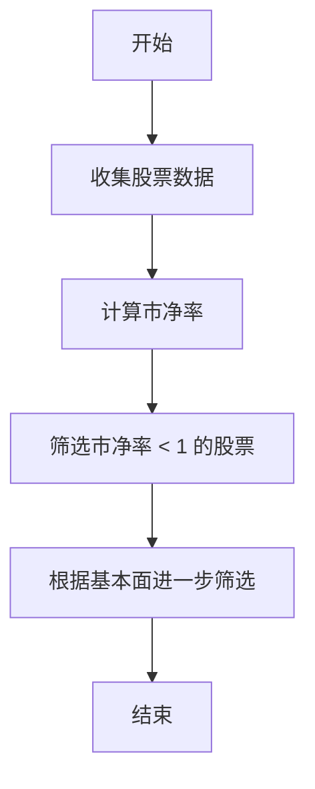
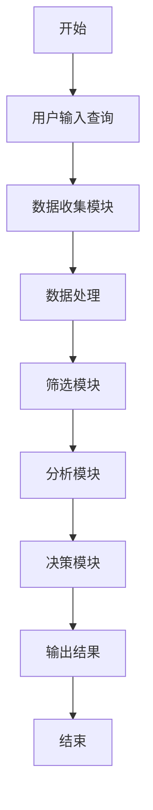

                 


# 如何运用格雷厄姆的净净股策略进行投资

> 关键词：格雷厄姆、净净股策略、投资、价值投资、市净率、投资决策系统、股票分析

> 摘要：本文深入探讨了如何运用格雷厄姆的净净股策略进行投资，从理论基础到实际应用，详细分析了净净股策略的核心概念、算法原理、系统架构设计以及实战案例。通过本文，读者将能够掌握如何通过市净率筛选出具有投资价值的股票，并构建一个完整的投资决策系统。

---

# 第一部分: 格雷厄姆投资理念与净净股策略基础

## 第1章: 格雷厄姆投资理念概述

### 1.1 格雷厄姆的生平与投资思想

#### 1.1.1 格雷厄姆的生平简介
本杰明·格雷厄姆（Benjamin Graham）是20世纪著名的投资大师，被誉为“价值投资之父”。他出生于1894年，逝世于1976年。格雷厄姆的职业生涯始于1920年代，他在金融分析领域做出了开创性的工作，并培养了包括沃伦·巴菲特在内的众多投资大师。

#### 1.1.2 格雷厄姆的投资哲学
格雷厄姆的投资哲学以“安全边际”为核心，主张以低于内在价值的价格购买优质股票。他认为，市场情绪的波动会导致股票价格偏离其真实价值，投资者应利用这种波动，以合理的价格买入优质资产。

#### 1.1.3 格雷厄姆与价值投资的关系
格雷厄姆是价值投资的鼻祖，他的思想深刻影响了巴菲特等后来者。价值投资的核心在于寻找市场低估的股票，并长期持有，等待其价值回归。

### 1.2 净净股策略的基本概念

#### 1.2.1 净净股的定义
净净股（Net-Net Stocks）是格雷厄姆提出的一种投资策略，指的是那些市场价格低于其账面价值的股票。具体来说，净净股的市净率（P/B Ratio）低于1，即市场价格低于每股净资产。

#### 1.2.2 净净股策略的核心思想
格雷厄姆认为，当股票的市场价格低于其账面价值时，该股票具有较高的安全边际，是一个值得投资的对象。这种策略特别适用于那些资产密集型的行业，如银行、制造业等。

#### 1.2.3 净净股策略的适用场景
净净股策略适用于市场低迷或行业低谷时期，此时许多优质股票可能会被市场低估，为投资者提供了捡便宜的机会。

## 第2章: 净净股策略的背景与意义

### 2.1 价值投资的理论基础

#### 2.1.1 价值投资的核心理念
价值投资的核心理念是寻找市场价格低于内在价值的股票。格雷厄姆的净净股策略正是这一理念的具体体现。

#### 2.1.2 格雷厄姆对价值投资的贡献
格雷厄姆通过净净股策略，为价值投资提供了可操作的筛选标准，使得投资者能够更系统地发现被低估的股票。

#### 2.1.3 净净股策略在价值投资中的地位
净净股策略是价值投资的重要组成部分，它帮助投资者在市场恐慌时发现机会，降低投资风险。

### 2.2 净净股策略的市场背景

#### 2.2.1 股市波动与投资机会
股市的波动为投资者提供了低位买入的机会。净净股策略尤其适用于市场底部，此时许多股票的价格可能远低于其账面价值。

#### 2.2.2 净净股策略的适用性分析
净净股策略适用于那些具有较高账面价值的行业，如银行、房地产等。这些行业的资产容易量化，且在市场低迷时更容易被低估。

#### 2.2.3 净净股策略的长期有效性
尽管市场环境会变化，但净净股策略的长期有效性得到了历史数据的验证。许多遵循这一策略的投资者在长期获得了超额收益。

---

# 第二部分: 净净股策略的核心概念与算法原理

## 第3章: 净净股策略的核心概念

### 3.1 净净股的定义与计算

#### 3.1.1 市净率（P/B Ratio）的计算公式
市净率是衡量股票价值的重要指标，其计算公式为：
$$ P/B = \frac{Market\ Price}{Book\ Value\ Per\ Share} $$

其中：
- Market Price 表示股票的市场价格
- Book Value Per Share 表示每股净资产

#### 3.1.2 净净股的筛选标准
格雷厄姆建议投资者选择那些市净率低于1的股票，即：
$$ P/B < 1 $$

#### 3.1.3 净净股与内在价值的关系
当市净率低于1时，股票的市场价格低于其账面价值，这意味着股票具有潜在的上涨空间。

### 3.2 净净股策略的属性特征对比

#### 3.2.1 净净股与市盈率（P/E Ratio）的对比
市盈率衡量的是市价与每股收益的关系，而市净率衡量的是市价与每股净资产的关系。两者都可以用来评估股票的估值，但市净率更适合资产密集型行业。

#### 3.2.2 净净股与股息率的对比
股息率高的股票可能具有吸引力，但净净股策略更关注股票的价格与资产价值的关系。

#### 3.2.3 净净股与市值的关系
净净股策略关注的是股票的内在价值，而非市值大小。因此，小盘股和大盘股都有可能成为净净股策略的目标。

## 第4章: 净净股策略的算法原理

### 4.1 净净股筛选算法

#### 4.1.1 算法步骤
1. **收集数据**：获取目标行业的股票列表及其财务数据。
2. **计算市净率**：使用公式 \( P/B = \frac{Market\ Price}{Book\ Value\ Per\ Share} \) 计算每只股票的市净率。
3. **筛选净净股**：选择市净率低于1的股票。
4. **进一步筛选**：根据公司的基本面（如盈利能力、管理团队等）进行进一步筛选。

#### 4.1.2 算法流程图


### 4.2 净净股策略的数学模型

#### 4.2.1 市净率计算公式
$$ P/B = \frac{P}{B} $$
其中：
- \( P \) 表示股票的市场价格
- \( B \) 表示每股净资产

#### 4.2.2 净净股筛选条件
$$ P/B < 1 $$

---

# 第三部分: 净净股策略的系统分析与架构设计

## 第5章: 投资决策系统的功能设计

### 5.1 系统功能模块

#### 5.1.1 数据收集模块
- 数据源：股票数据库、财务报表等
- 数据处理：清洗、转换、存储
- 数据更新：实时或定期更新

#### 5.1.2 筛选模块
- 计算市净率
- 筛选市净率 < 1 的股票
- 根据基本面进一步筛选

#### 5.1.3 分析模块
- 财务分析：盈利能力、成长性等
- 风险评估：行业风险、公司风险

#### 5.1.4 决策模块
- 投资建议：买入、卖出或持有
- 风险提示：潜在风险点

### 5.2 系统架构设计

#### 5.2.1 系统架构图


#### 5.2.2 系统功能流程图


---

## 第6章: 项目实战

### 6.1 环境安装
- 数据库：MySQL 或 PostgreSQL
- 开发工具：Python、Jupyter Notebook
- 库：pandas、numpy、scikit-learn

### 6.2 核心实现

#### 6.2.1 数据收集
```python
import pandas as pd

# 示例数据
data = {
    '股票代码': ['A', 'B', 'C', 'D'],
    '市场价格': [10, 15, 8, 12],
    '每股净资产': [12, 20, 10, 15]
}

df = pd.DataFrame(data)
```

#### 6.2.2 计算市净率
```python
df['市净率'] = df['市场价格'] / df['每股净资产']
```

#### 6.2.3 筛选净净股
```python
net_net_stocks = df[df['市净率'] < 1]
print(net_net_stocks)
```

### 6.3 案例分析

#### 6.3.1 案例背景
假设我们有一个包含10只股票的数据集，我们需要从中筛选出市净率低于1的股票。

#### 6.3.2 数据分析
```python
# 假设数据集
data = {
    '股票代码': ['A', 'B', 'C', 'D', 'E', 'F', 'G', 'H', 'I', 'J'],
    '市场价格': [5, 10, 7, 8, 6, 9, 4, 12, 3, 11],
    '每股净资产': [6, 8, 9, 10, 7, 11, 5, 14, 4, 13]
}

df = pd.DataFrame(data)
df['市净率'] = df['市场价格'] / df['每股净资产']
net_net_stocks = df[df['市净率'] < 1]
print(net_net_stocks)
```

#### 6.3.3 结果解读
输出结果为市净率低于1的股票，这些股票可能是被低估的投资机会。

### 6.4 项目小结
通过实际案例分析，我们验证了净净股策略的有效性。在实际操作中，投资者需要结合更多的因素，如公司的盈利能力、行业前景等，来做出更全面的投资决策。

---

## 第7章: 总结与展望

### 7.1 净净股策略的优势与局限性

#### 7.1.1 优势
- 简单易懂，易于操作
- 适合初学者和机构投资者
- 能够在市场底部发现投资机会

#### 7.1.2 局限性
- 仅适用于资产密集型行业
- 忽略了其他重要的财务指标
- 市场波动可能导致短期亏损

### 7.2 实际应用中的注意事项

#### 7.2.1 风险控制
- 设置止损点
- 分散投资
- 定期调整投资组合

#### 7.2.2 财务指标的综合分析
- 结合市盈率、股息率等其他指标
- 重视公司的管理团队和行业前景

### 7.3 未来的研究方向

#### 7.3.1 算法优化
- 结合机器学习优化筛选标准
- 引入更多的财务指标

#### 7.3.2 系统改进
- 实现自动化投资决策
- 提供实时数据监控

---

# 作者：AI天才研究院/AI Genius Institute & 禅与计算机程序设计艺术 /Zen And The Art of Computer Programming

