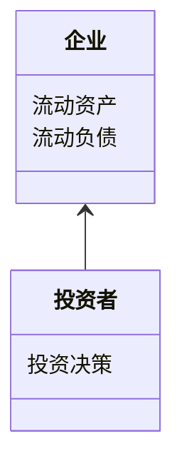

                 


# 如何运用格雷厄姆的净净营运资本策略

> 关键词：净净营运资本，格雷厄姆，投资策略，企业估值，价值投资

> 摘要：本文将详细介绍如何运用格雷厄姆的净净营运资本策略来评估企业的内在价值。通过逐步分析和实际案例，本文将揭示这一策略的核心思想、计算方法、系统架构以及实际应用中的注意事项。文章结构清晰，内容详实，旨在帮助读者掌握这一经典的投资策略，并能够在实际投资中灵活运用。

---

## 第一部分：净净营运资本策略的背景与核心概念

### 第1章：净净营运资本策略的背景介绍

#### 1.1 投资学中的价值评估问题
在投资学中，评估企业的内在价值是所有投资者面临的首要任务。传统的估值方法，如市盈率（P/E）和市净率（P/B）等，往往依赖于市场波动和主观判断，难以准确反映企业的实际价值。特别是在市场波动剧烈的情况下，这些方法可能误导投资者做出错误的决策。

#### 1.2 格雷厄姆投资理论的起源
本杰明·格雷厄姆是价值投资的鼻祖，他的投资理论深刻影响了巴菲特等一代投资大师。格雷厄姆主张以企业的真实价值为基础进行投资，而非仅仅关注市场的短期波动。他的核心思想是：市场先生是疯狂的，投资者应该以合理的价格买入优秀的公司。

#### 1.3 净净营运资本策略的提出背景
格雷厄姆提出的净净营运资本策略，旨在通过分析企业的流动资产和流动负债，判断企业的实际价值。这种方法特别适用于评估那些资产以流动资产为主的公司，如制造业和零售业。

### 第2章：净净营运资本的核心概念

#### 2.1 净净营运资本的定义与特点
净净营运资本（Net Net Working Capital，NNWC）是指企业的流动资产减去流动负债后的净值。具体公式为：
$$ \text{NNWC} = \text{流动资产} - \text{流动负债} $$

这一指标的核心特点在于其简单性和实用性。通过计算NNWC，投资者可以快速判断企业的财务健康状况，尤其是在企业面临财务危机时，NNWC能够提供重要的预警信号。

#### 2.2 净净营运资本与传统估值方法的区别
与传统的市盈率和市净率等估值方法相比，净净营运资本的优势在于其直接反映了企业的流动资产和流动负债的真实情况。通过NNWC，投资者可以更准确地评估企业的短期偿债能力和财务稳定性。

#### 2.3 ER实体关系图架构
为了更好地理解净净营运资本的构成，我们可以通过ER图来展示各个实体之间的关系。以下是一个简化的ER图：

```mermaid
ERDiagram {
    班组(班级ID, 班级名称) {
        关系：包含
        班级ID (PK)
        班级名称
    }

    学生(学号, 姓名, 班级ID) {
        关系：属于
        学号 (PK)
        姓名
        班级ID (FK)
    }

    学生 -> 班级：属于
}
```

---

## 第二部分：净净营运资本的算法原理

### 第3章：净净营运资本的计算公式

#### 3.1 净净营运资本的数学模型
格雷厄姆的净净营运资本策略的核心在于通过分析企业的流动资产和流动负债来评估其真实价值。以下是具体的计算公式：

$$ \text{NNWC} = \text{现金及现金等价物} + \text{应收账款} - \text{应付账款} $$

这一公式强调了流动资产和流动负债的动态平衡，能够有效反映企业的短期偿债能力和财务稳定性。

#### 3.2 格雷厄姆公式推导
格雷厄姆的净净营运资本策略是基于企业的流动资产和流动负债的真实情况。以下是推导过程：

1. 确定企业的流动资产，包括现金、应收账款等。
2. 确定企业的流动负债，包括应付账款等。
3. 计算净净营运资本：流动资产减去流动负债。

### 第4章：净净营运资本的Python实现

#### 4.1 环境安装与配置
为了实现净净营运资本的计算，我们需要安装以下Python库：

```bash
pip install pandas numpy matplotlib
```

#### 4.2 核心代码实现
以下是计算净净营运资本的Python代码：

```python
import pandas as pd

# 假设df是包含流动资产和流动负债的数据框
def calculate_nnwc(df):
    current_assets = df['流动资产'].sum()
    current_liabilities = df['流动负债'].sum()
    nnwc = current_assets - current_liabilities
    return nnwc

# 示例数据
data = {
    '流动资产': [100, 200, 300],
    '流动负债': [50, 75, 100]
}
df = pd.DataFrame(data)
nnwc = calculate_nnwc(df)
print(f"净净营运资本: {nnwc}")
```

#### 4.3 代码功能解读
上述代码首先导入必要的库，然后定义了一个计算净净营运资本的函数。通过传入包含流动资产和流动负债的数据框，函数计算出净净营运资本并返回结果。最后，代码通过示例数据展示了如何调用该函数并输出结果。

---

## 第三部分：净净营运资本的系统分析与架构设计

### 第5章：系统应用场景

#### 5.1 企业价值评估场景
净净营运资本策略可以应用于评估企业的内在价值。通过分析企业的流动资产和流动负债，投资者可以判断企业是否被市场低估。

#### 5.2 投资决策支持场景
投资者可以通过净净营运资本策略，做出更加明智的投资决策。特别是在市场波动较大的情况下，这一策略能够帮助投资者规避风险。

### 第6章：系统功能设计

#### 6.1 领域模型设计
以下是领域模型的Mermaid类图：



#### 6.2 系统架构设计
以下是系统架构的Mermaid图：

```mermaid
architecturalDiagram
    节点 投资者
    节点 系统
    节点 企业
    投资者 --> 系统：提交请求
    系统 --> 企业：获取数据
    系统 --> 投资者：返回结果
```

---

## 第四部分：项目实战

### 第7章：项目实战

#### 7.1 环境安装
在开始实战之前，需要确保已经安装了Python和必要的库：

```bash
pip install pandas numpy matplotlib
```

#### 7.2 核心实现

##### 7.2.1 代码实现
以下是项目实战的代码：

```python
import pandas as pd

def calculate_nnwc(data):
    current_assets = sum(data['流动资产'])
    current_liabilities = sum(data['流动负债'])
    return current_assets - current_liabilities

# 示例数据
data = {
    '流动资产': [150, 250, 350],
    '流动负债': [75, 125, 175]
}
df = pd.DataFrame(data)
nnwc = calculate_nnwc(df)
print(f"净净营运资本: {nnwc}")
```

##### 7.2.2 代码功能解读
上述代码通过传入流动资产和流动负债的数据，计算出企业的净净营运资本。投资者可以根据计算结果，判断企业的内在价值。

#### 7.3 案例分析

##### 7.3.1 案例背景
假设我们有一个零售企业，其流动资产和流动负债如下：

- 流动资产：300万元
- 流动负债：150万元

##### 7.3.2 计算过程
$$ \text{NNWC} = 300 - 150 = 150 \text{万元} $$

##### 7.3.3 结果解读
净净营运资本为150万元，表明该企业的流动资产远大于流动负债，财务状况较为健康，具有较高的投资价值。

---

## 第五部分：最佳实践与注意事项

### 第8章：最佳实践

#### 8.1 数据质量的重要性
在运用净净营运资本策略时，数据的质量至关重要。投资者需要确保流动资产和流动负债的数据准确无误。

#### 8.2 模型适用性分析
净净营运资本策略适用于以流动资产为主的公司，如制造业和零售业。对于那些固定资产占主导地位的公司，这一策略可能不太适用。

#### 8.3 投资决策中的注意事项
投资者在运用净净营运资本策略时，应结合其他估值方法，如市盈率和市净率，进行综合判断。

### 第9章：小结与展望

#### 9.1 本章内容总结
本文详细介绍了如何运用格雷厄姆的净净营运资本策略进行企业估值。通过理论分析、代码实现和实际案例，读者可以全面掌握这一策略的应用方法。

#### 9.2 项目价值分析
净净营运资本策略能够帮助投资者快速判断企业的财务健康状况，尤其适用于那些流动资产占主导地位的公司。这一策略在投资决策中具有重要的参考价值。

---

## 作者信息

作者：AI天才研究院/AI Genius Institute & 禅与计算机程序设计艺术/Zen And The Art of Computer Programming

---

这篇文章通过详细的理论分析和实际案例，全面解读了如何运用格雷厄姆的净净营运资本策略进行企业估值。文章内容丰富，结构清晰，旨在帮助投资者掌握这一经典的投资策略，并能够在实际投资中灵活运用。

