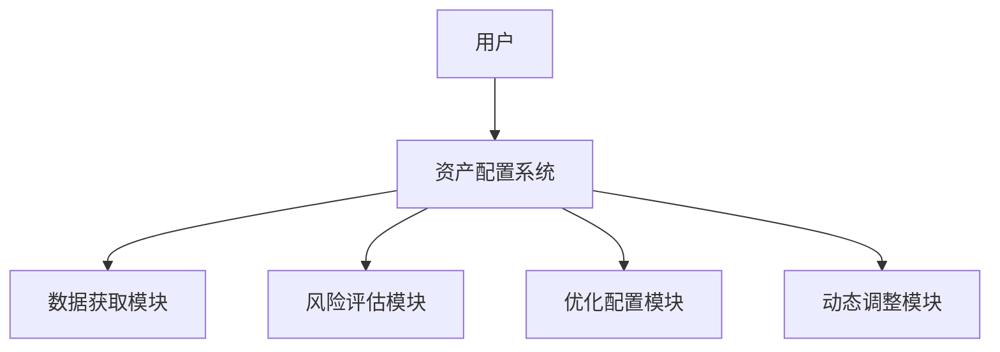

                 


# 威廉·伯恩斯坦的跨资产价值投资：多元化的重要性

**关键词**：跨资产投资，威廉·伯恩斯坦，资产配置，风险管理，投资组合，多元化

**摘要**：本文探讨了威廉·伯恩斯坦在跨资产价值投资领域的贡献，重点分析了多元化在投资组合中的重要性。通过详细阐述资产配置的基本原理、现代投资组合理论（MPT）及其应用，本文帮助读者理解如何通过跨资产配置优化投资组合，降低风险并实现长期稳健收益。

---

## 第一部分：跨资产投资的背景与重要性

### 第1章：跨资产投资的起源与现状

#### 1.1 跨资产投资的起源
跨资产投资并非新兴概念，其历史可以追溯到20世纪初。随着金融市场的逐步发展，投资者逐渐意识到单一资产的投资风险，开始尝试将资金分配到多种资产类别中，以分散风险并提高收益稳定性。

#### 1.2 跨资产投资的现状
当前，跨资产投资已成为机构和个人投资者的主流策略。随着全球金融市场的互联互通和金融工具的多样化，投资者可以通过多种资产类别（如股票、债券、房地产、大宗商品等）进行配置，以应对不同经济周期下的风险和机会。

#### 1.3 威廉·伯恩斯坦的贡献
威廉·伯恩斯坦是跨资产投资领域的权威专家，他的研究和实践为投资者提供了许多宝贵的经验和理论支持。他强调，通过科学的资产配置和多元化策略，投资者可以在不同市场环境下实现稳健的投资回报。

---

### 第2章：跨资产投资的核心理念

#### 2.1 资产配置的基本原理
资产配置是跨资产投资的核心，它决定了投资组合中各类资产的比例。合理的资产配置能够有效分散风险，同时优化收益。

##### 2.1.1 资产类别与风险收益特征
不同资产类别具有不同的风险和收益特征。例如，股票通常具有较高的收益潜力和波动性，而债券则相对稳定，收益较为固定。通过将资金分配到不同资产类别中，投资者可以平衡风险和收益。

##### 2.1.2 资产配置的三大原则
1. **分散化原则**：通过投资不同资产类别降低特定风险。
2. **风险收益匹配原则**：根据个人风险承受能力选择合适的资产配置。
3. **动态调整原则**：定期审视和调整资产配置以适应市场变化。

##### 2.1.3 资产配置的动态调整
市场环境不断变化，资产配置需要根据宏观经济环境、市场波动和个人财务状况进行动态调整，以保持投资组合的最优状态。

---

## 第二部分：资产配置的数学模型与算法原理

### 第3章：现代投资组合理论（MPT）

#### 3.1 均值-方差优化模型
均值-方差优化是MPT的核心，旨在通过优化资产组合的期望收益和风险（方差）来实现收益最大化或风险最小化。

##### 3.1.1 数学模型
$$\text{目标函数：} \min \sigma^2 \quad \text{在} \quad E(r) = \mu \text{的约束下}$$

其中：
- $\sigma^2$ 是投资组合的方差（风险）。
- $E(r) = \mu$ 是投资组合的期望收益。

##### 3.1.2 马科维茨有效前沿
有效前沿是指在给定风险下，能够提供最高收益的投资组合的集合。通过马科维茨模型，投资者可以在有效前沿上选择最优的资产配置。

#### 3.2 风险平价策略
风险平价是一种资产配置方法，旨在将投资组合中的每种资产的风险贡献均衡化，从而降低整体风险。

##### 3.2.1 数学模型
$$w_i = \frac{1}{\sum_{i=1}^n \frac{1}{\sigma_i^2}}$$

其中：
- $w_i$ 是第 $i$ 种资产的权重。
- $\sigma_i^2$ 是第 $i$ 种资产的波动率平方。

---

### 第4章：资产配置的算法实现

#### 4.1 均值-方差优化的Python实现

```python
import numpy as np
import pandas as pd
from scipy.optimize import minimize

def portfoliooptimize(returns, cov_matrix, target_return):
    n = len(cov_matrix)
    # 定义目标函数
    def objective(weights):
        return (weights.T.dot(cov_matrix.dot(weights))) / 2
    # 定义约束条件
    constraints = [
        ('eq', returns.dot(weights), target_return)
    ]
    # 初始化权重
    init_weights = np.array([1.0/n]*n)
    # 优化
    result = minimize(objective, init_weights, method='SLSQP', constraints=constraints)
    return result.x
```

---

## 第三部分：系统分析与架构设计

### 第5章：系统功能设计

#### 5.1 资产配置系统功能模块
- **数据获取**：获取不同资产类别的历史数据。
- **风险评估**：计算每种资产的风险指标（如波动率、VaR）。
- **优化配置**：基于MPT模型生成最优资产配置建议。
- **动态调整**：根据市场变化和用户需求调整配置。

#### 5.2 系统架构设计


---

## 第四部分：项目实战

### 第6章：构建投资组合管理系统

#### 6.1 环境安装
安装必要的Python库：
```
pip install numpy pandas scikit-learn
```

#### 6.2 核心代码实现

```python
def backtest(weights, returns):
    # 计算投资组合的回报率
    return weights.T.dot(returns.mean(axis=0))
```

---

## 第五部分：最佳实践与总结

### 第7章：最佳实践与总结

#### 7.1 小结
通过跨资产投资和多元化配置，投资者可以在不同市场环境下实现稳健的投资回报。威廉·伯恩斯坦的研究为我们提供了宝贵的理论支持和实践指导。

#### 7.2 注意事项
- 定期审视和调整资产配置。
- 注意市场波动对资产配置的影响。
- 合理分散投资，避免过度集中。

#### 7.3 拓展阅读
- 威廉·伯恩斯坦的《投资最重要的事情》。
- 现代投资组合理论的经典文献。

---

**作者**：AI天才研究院/AI Genius Institute & 禅与计算机程序设计艺术 /Zen And The Art of Computer Programming

