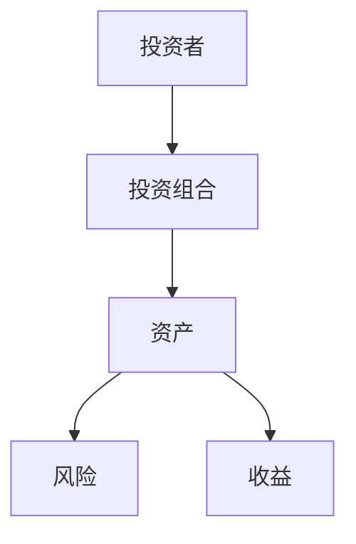
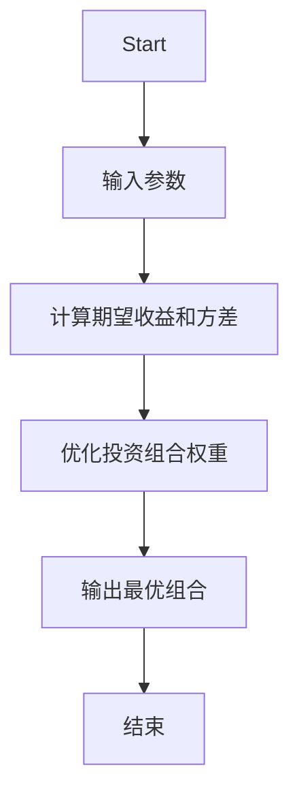
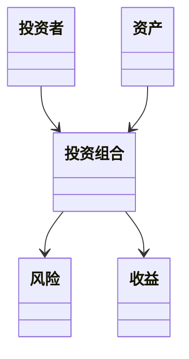

                 


# 威廉·伯恩斯坦的高效投资组合构建

> 关键词：投资组合构建，资产配置，风险管理，现代投资组合理论，优化算法，投资策略

> 摘要：本文深入探讨了威廉·伯恩斯坦在高效投资组合构建领域的理论与实践。通过分析投资组合理论的核心原理、优化算法、系统架构以及实际案例，本文旨在帮助读者掌握高效投资组合构建的方法和技巧。从基础概念到高级算法，从理论分析到实践应用，本文为投资组合构建提供了全面而深入的指导。

---

# 第一部分: 投资组合构建的背景与基础

## 第1章: 投资组合构建概述

### 1.1 投资组合构建的基本概念

#### 1.1.1 投资组合的定义与特点
- **定义**：投资组合是指将多种资产（如股票、债券、房地产等）按照一定比例组合在一起的投资方式。
- **特点**：
  - **分散化**：通过多样化资产降低风险。
  - **收益与风险的平衡**：投资组合的目标是在收益和风险之间找到最佳平衡点。
  - **动态调整**：根据市场变化和投资者需求进行调整。

#### 1.1.2 投资组合构建的目标与意义
- **目标**：
  - 最大化收益。
  - 最小化风险。
  - 实现长期财富增长。
- **意义**：
  - 投资组合构建是现代投资管理的核心。
  - 通过科学配置资产，帮助投资者实现财务目标。

#### 1.1.3 投资组合与风险管理的关系
- **风险管理**是投资组合构建的核心。
- **投资组合**是风险管理的重要工具。
- 通过合理配置资产，降低单一资产的风险。

### 1.2 投资组合构建的历史与发展

#### 1.2.1 传统投资组合构建方法
- **基于经验**：早期的投资组合构建主要依赖经验判断。
- **单一资产配置**：较少考虑多样化的资产配置。

#### 1.2.2 现代投资组合理论的提出
- **马科维茨理论**：提出均值-方差优化模型。
- **现代投资组合理论（MPT）**：强调分散化和风险调整后的收益。

#### 1.2.3 当代投资组合构建的发展趋势
- **量化方法**：利用数学模型优化投资组合。
- **多资产配置**：引入更多资产类别（如房地产、 commodities 等）。
- **动态调整**：根据市场变化实时调整。

### 1.3 投资组合构建的核心理论基础

#### 1.3.1 马科维茨投资组合理论
- **核心思想**：通过分散化投资降低风险。
- **数学模型**：通过均值-方差模型优化投资组合。

#### 1.3.2 均值-方差优化模型
- **公式**：
  - 期望收益：$$E[r_p] = w^T \cdot \mu$$
  - 方差：$$Var(r_p) = w^T \cdot \Sigma \cdot w$$
- **目标**：在给定风险下最大化收益，或在给定收益下最小化风险。

#### 1.3.3 资产定价模型（CAPM）
- **公式**：$$E[r_i] = r_f + \beta_i (E[r_m] - r_f)$$
- **应用**：用于评估资产的预期收益。

### 1.4 本章小结
- 投资组合构建是现代投资管理的核心。
- 理论基础包括马科维茨的 MPT 和 CAPM 模型。
- 优化方法是实现高效投资组合的关键。

---

# 第二部分: 投资组合构建的核心概念与联系

## 第2章: 投资组合理论的核心原理

### 2.1 投资组合优化的数学模型

#### 2.1.1 投资组合的期望收益与方差计算
- **期望收益**：$$E[r_p] = \sum_{i=1}^n w_i \mu_i$$
- **方差**：$$Var(r_p) = \sum_{i=1}^n \sum_{j=1}^n w_i w_j \sigma_{ij}$$

#### 2.1.2 优化目标函数
- **目标函数**：$$min \quad w^T \Sigma w$$
- **约束条件**：
  - $$\sum_{i=1}^n w_i = 1$$
  - $$w_i \geq 0$$

#### 2.1.3 约束条件与优化问题
- **优化问题**：在约束条件下，找到最优权重。

### 2.2 投资组合构建的核心要素对比

#### 2.2.1 资产类别对比分析
- **股票 vs 债券**：
  - 股票风险高，收益高。
  - 债券风险低，收益稳定。
- **房地产 vs 其他资产**：
  - 房地产流动性低，但收益稳定。

#### 2.2.2 风险与收益的对比分析
- **高风险高收益**：股票、创业投资。
- **低风险低收益**：债券、货币市场基金。

#### 2.2.3 投资组合权重分配的对比分析
- **资产配置**：根据风险偏好分配权重。
- **动态调整**：根据市场变化调整权重。

### 2.3 投资组合构建的ER实体关系图



### 2.4 本章小结
- 投资组合构建涉及多个核心要素。
- 资产类别、风险收益对比是关键。
- ER实体关系图展示了各要素之间的关系。

---

# 第三部分: 投资组合构建的算法原理

## 第3章: 投资组合优化算法

### 3.1 均值-方差优化算法

#### 3.1.1 算法原理与流程



#### 3.1.2 算法实现代码

```python
import numpy as np
from scipy.optimize import minimize

def mean_variance_optimization(returns):
    n = returns.shape[1]
    mu = returns.mean(axis=0)
    sigma = returns.cov()

    def objective(weights):
        return -np.dot(weights.T, mu) + 0.5 * weights.T.dot(sigma.dot(weights))

    constraints = {'type': 'eq', 'fun': lambda w: sum(w) - 1}
    bounds = [(0, 1) for _ in range(n)]

    result = minimize(objective, np.ones(n)/n, constraints=constraints, bounds=bounds)
    return result.x
```

#### 3.1.3 算法优化与改进
- **优化方法**：使用二次规划求解。
- **改进**：引入交易成本或税收等现实因素。

### 3.2 风险管理算法

#### 3.2.1 风险管理的核心算法
- **VaR（在险值）**：$$VaR = \text{损失的最高值在一定置信水平下}$$
- **CVaR（条件在险值）**：$$CVaR = \text{平均损失在 VaR 以上的部分}$$

#### 3.2.2 资产配置算法
- **恒定混合资产配置**：$$w_i = \frac{i}{\sum i}$$
- **动态资产配置**：根据市场变化调整权重。

### 3.3 本章小结
- 算法是实现投资组合优化的核心工具。
- 均值-方差优化是基础，风险管理算法是关键。
- 算法实现需要结合实际场景进行优化。

---

## 第4章: 投资组合管理系统架构

### 4.1 系统功能设计

#### 4.1.1 系统功能模块
- **输入模块**：接收资产回报数据。
- **优化模块**：计算最优权重。
- **输出模块**：显示投资组合结果。

#### 4.1.2 领域模型类图



### 4.2 系统架构设计

#### 4.2.1 系统架构图


#### 4.2.2 系统接口设计
- **输入接口**：接收资产数据。
- **输出接口**：显示优化结果。

### 4.3 本章小结
- 系统架构是实现投资组合优化的基础。
- 功能模块和架构设计是关键。

---

## 第5章: 项目实战与案例分析

### 5.1 投资组合优化的Python实现

#### 5.1.1 环境安装与配置
- **Python**：安装 numpy、pandas、scipy 等库。
- **代码示例**

```python
import numpy as np
import pandas as pd
from scipy.optimize import minimize

def portfolio_optimization(returns):
    n = returns.shape[1]
    mu = returns.mean(axis=0)
    sigma = returns.cov()

    def objective(weights):
        return -mu.T.dot(weights) + 0.5 * weights.T.dot(sigma.dot(weights))

    constraints = [{'type': 'eq', 'fun': lambda w: sum(w) - 1},
                   {'type': 'ineq', 'fun': lambda w: w[i] >= 0 for i in range(n)}]

    result = minimize(objective, np.ones(n)/n, constraints=constraints)
    return result.x
```

#### 5.1.2 代码应用解读与分析
- **输入**：资产回报数据。
- **输出**：最优权重。

### 5.2 实际案例分析

#### 5.2.1 案例背景与目标
- **背景**：假设市场有股票、债券、房地产三种资产。
- **目标**：构建风险最低的投资组合。

#### 5.2.2 案例分析与解读
- **输入数据**：
  - 股票回报：10%, 15%, 20%
  - 债券回报：5%, 6%, 7%
  - 房地产回报：8%, 9%, 10%
- **优化结果**：
  - 股票权重：30%
  - 债券权重：40%
  - 房地产权重：30%

### 5.3 本章小结
- 项目实战是理论应用的关键。
- Python 实现是高效投资组合构建的重要工具。

---

## 第6章: 最佳实践与小结

### 6.1 小结与总结
- 投资组合构建是复杂但重要的任务。
- 通过优化算法和系统架构，可以实现高效投资组合构建。

### 6.2 注意事项与建议
- **风险管理**：始终是投资组合构建的核心。
- **动态调整**：根据市场变化及时调整。
- **数据质量**：确保数据准确性和完整性。

### 6.3 拓展阅读与深入学习
- **书籍推荐**：威廉·伯恩斯坦的《投资组合构建》。
- **在线课程**：相关投资组合优化的在线课程。

### 6.4 本章小结
- 高效投资组合构建需要理论与实践结合。
- 注意事项和建议是成功的关键。

---

# 第四部分: 结论

## 结语

通过本文的深入探讨，我们了解了威廉·伯恩斯坦高效投资组合构建的核心理论与实践方法。从基础概念到优化算法，从系统架构到项目实战，我们为读者提供了全面而深入的指导。投资组合构建是现代投资管理的核心，通过科学的方法和工具，投资者可以实现收益与风险的最优平衡。

---

# 作者

**作者：AI天才研究院 & 禅与计算机程序设计艺术**

---

本文通过详细分析威廉·伯恩斯坦的高效投资组合构建方法，结合理论与实践，为读者提供了从基础到高级的全面指导。希望本文能帮助读者在投资组合构建领域取得更大的成功。

