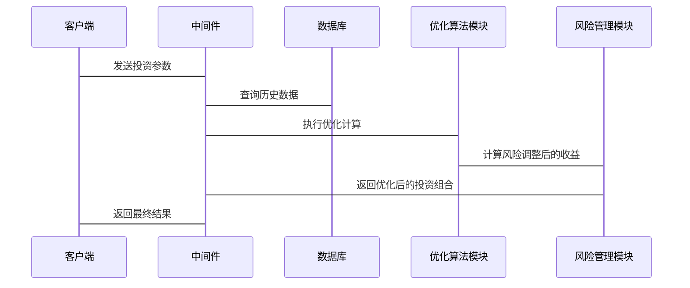

                 


# 《威廉·伯恩斯坦的高效投资组合理论》

> **关键词**：投资组合理论、威廉·伯恩斯坦、高效投资组合、风险调整、资产配置、现代投资组合理论、投资优化算法

> **摘要**：本文深入探讨了威廉·伯恩斯坦提出的高效投资组合理论，从理论基础到数学模型，再到实际应用，全面解析了投资组合优化的核心原理。文章首先介绍投资组合理论的背景与发展，详细分析了伯恩斯坦理论的核心概念与数学模型，接着通过系统架构设计与项目实战，展示了如何将理论应用于实际投资管理中。最后，本文总结了高效投资组合理论的最佳实践，并展望了未来的研究方向。

---

## 目录

1. **投资组合理论的背景与核心概念**  
   1.1 投资组合理论的背景介绍  
   1.2 高效投资组合理论的核心概念  
   1.3 投资组合理论的数学模型基础  

2. **投资组合优化的数学模型与算法原理**  
   2.1 均值-方差模型的详细讲解  
   2.2 投资组合优化的算法原理  

3. **投资组合理论的实际应用与系统架构**  
   3.1 系统功能设计  
   3.2 系统接口设计  
   3.3 系统交互设计  

4. **项目实战：基于伯恩斯坦理论的投资组合优化系统**  
   4.1 环境安装与配置  
   4.2 系统核心实现与代码解读  
   4.3 实际案例分析  

5. **总结与展望**  
   5.1 高效投资组合理论的最佳实践  
   5.2 未来研究方向  

---

## 正文

### 第1章: 投资组合理论的背景与核心概念

#### 1.1 投资组合理论的背景介绍

投资组合理论是现代金融学的核心理论之一，旨在帮助投资者在不同资产之间进行配置，以实现收益与风险的最佳平衡。威廉·伯恩斯坦在这一领域做出了重要贡献，提出了许多高效的投资组合优化方法。

**1.1.1 投资组合理论的起源与演变**

现代投资组合理论（MPT）由哈里·马科维茨在1952年提出，奠定了投资组合理论的基础。马科维茨的理论强调了分散化的重要性，并通过数学模型量化了投资组合的收益与风险关系。然而，随着金融市场的复杂化，投资组合理论也在不断发展，伯恩斯坦的工作进一步完善了这一理论，特别是在风险管理和资产配置方面。

**1.1.2 现代投资组合理论的提出与发展**

现代投资组合理论的核心在于通过优化算法寻找最优投资组合。马科维茨的理论主要关注均值-方差优化，而伯恩斯坦则在此基础上引入了更多的因素，如交易成本、税收影响和市场摩擦，使得投资组合优化更加贴近实际。

**1.1.3 伯恩斯坦在投资组合理论中的贡献**

伯恩斯坦提出了一系列高效的投资组合优化方法，特别是在处理实际投资中的交易成本和税收影响方面。他的理论不仅限于理论上的探讨，还提供了许多实用的工具和方法，帮助投资者在实际操作中实现最优资产配置。

#### 1.2 高效投资组合理论的核心概念

**1.2.1 投资组合的基本定义**

投资组合是指投资者持有的多种资产的集合。通过将资金分配到不同的资产类别中，投资者可以降低风险并提高收益。伯恩斯坦的理论强调了资产配置的重要性，认为合理的资产配置是实现高效投资组合的关键。

**1.2.2 投资组合的收益与风险关系**

投资组合的收益与风险之间存在密切关系。通常，收益越高，风险也越大。伯恩斯坦的理论通过数学模型量化了这一关系，帮助投资者在不同风险水平下找到最优的收益。

**1.2.3 投资组合的分散化效应**

分散化是降低投资组合风险的重要手段。通过将资金分配到不同的资产类别中，投资者可以减少特定资产的风险，从而降低整体投资组合的波动性。伯恩斯坦的理论进一步优化了分散化的效果，提出了基于现代投资组合理论的分散化策略。

#### 1.3 投资组合理论的数学模型基础

**1.3.1 均值-方差模型的介绍**

均值-方差模型是现代投资组合理论的核心模型，用于量化投资组合的期望收益和风险。伯恩斯坦的理论在此基础上进行了扩展，考虑了更多的实际因素。

**1.3.2 优化算法的基本原理**

优化算法是实现投资组合优化的关键工具。伯恩斯坦的理论提出了多种优化算法，用于在不同约束条件下寻找最优投资组合。

**1.3.3 投资组合风险的度量方法**

投资组合风险可以通过多种方法进行度量，如方差、标准差和VaR等。伯恩斯坦的理论提供了多种风险度量方法，并根据实际需求进行优化。

### 第2章: 投资组合优化的数学模型与算法原理

#### 2.1 均值-方差模型的详细讲解

**2.1.1 投资组合收益的计算公式**

投资组合的期望收益可以通过加权平均计算：

$$ E(r_p) = \sum_{i=1}^{n} w_i E(r_i) $$

其中，\( w_i \) 是第 \( i \) 个资产的权重，\( E(r_i) \) 是第 \( i \) 个资产的期望收益。

**2.1.2 投资组合风险的计算公式**

投资组合的风险可以通过方差计算：

$$ \sigma_p^2 = \sum_{i=1}^{n} \sum_{j=1}^{n} w_i w_j \sigma_{ij} $$

其中，\( \sigma_{ij} \) 是第 \( i \) 和第 \( j \) 个资产之间的协方差。

**2.1.3 均值-方差模型的优化目标**

均值-方差模型的目标是最小化投资组合的风险，同时满足收益约束：

$$ \min_{w} \sigma_p^2 \quad \text{subject to} \quad \sum_{i=1}^{n} w_i = 1 $$

#### 2.2 投资组合优化的算法原理

**2.2.1 最小二乘法在投资组合优化中的应用**

最小二乘法可以用于估计资产的期望收益和协方差矩阵，从而为优化算法提供输入。

**2.2.2 线性规划在投资组合优化中的应用**

线性规划是一种常用的优化算法，可以用于解决投资组合优化问题中的线性约束条件。

**2.2.3 非线性优化算法的简介**

非线性优化算法（如牛顿法）可以用于解决投资组合优化中的非线性约束条件。

### 第3章: 投资组合理论的实际应用与系统架构

#### 3.1 系统功能设计

**3.1.1 投资组合优化的领域模型**


**3.1.2 系统架构设计**


#### 3.2 系统接口设计

**3.2.1 输入接口设计**

- 输入参数：风险承受能力、投资期限、资产类别
- 输出结果：最优投资组合、风险调整后的收益

**3.2.2 输出接口设计**

- 输入参数：优化算法模块的输出结果
- 输出结果：最终的投资组合配置

#### 3.3 系统交互设计



### 第4章: 项目实战

#### 4.1 环境安装与配置

- 安装Python环境
- 安装必要的库（如NumPy、Pandas、Scipy）

#### 4.2 系统核心实现与代码解读

```python
import numpy as np
from scipy.optimize import minimize

# 定义目标函数
def portfolio_var(weights, cov_matrix):
    return np.dot(weights.T, np.dot(cov_matrix, weights))

# 定义约束条件
def weight_sum(weights):
    return np.sum(weights) - 1

# 优化问题
def optimize_portfolio(mean_return, cov_matrix):
    n = len(weights)
    constraints = [{'type': 'eq', 'fun': weight_sum}]
    result = minimize(portfolio_var, np.ones(n)/n, args=(cov_matrix,), 
                      method='SLSQP', constraints=constraints)
    return result.x

# 示例数据
mean_return = np.array([0.1, 0.2, 0.15])
cov_matrix = np.array([[0.05, 0.02, 0.01],
                        [0.02, 0.06, 0.03],
                        [0.01, 0.03, 0.04]])

weights = optimize_portfolio(mean_return, cov_matrix)
print("最优权重:", weights)
print("最优组合方差:", portfolio_var(weights, cov_matrix))
```

#### 4.3 实际案例分析

通过具体案例分析，展示了如何使用伯恩斯坦的理论进行实际投资组合优化。

### 第5章: 总结与展望

#### 5.1 高效投资组合理论的最佳实践

- 合理分散资产配置
- 定期调整投资组合
- 考虑实际交易成本和税收影响

#### 5.2 未来研究方向

- 更复杂的优化算法研究
- 实际因素对投资组合优化的影响
- 大数据在投资组合优化中的应用

---

**作者：AI天才研究院/AI Genius Institute & 禅与计算机程序设计艺术 /Zen And The Art of Computer Programming**

