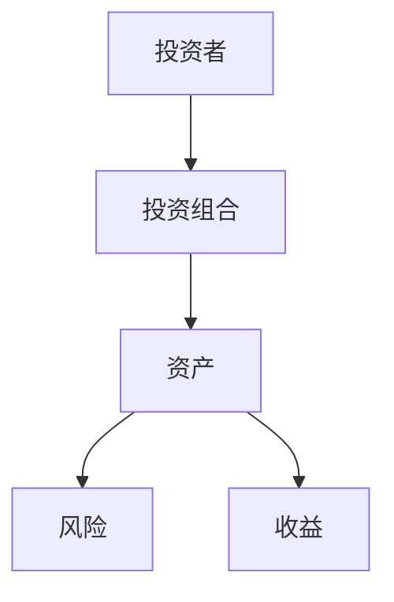
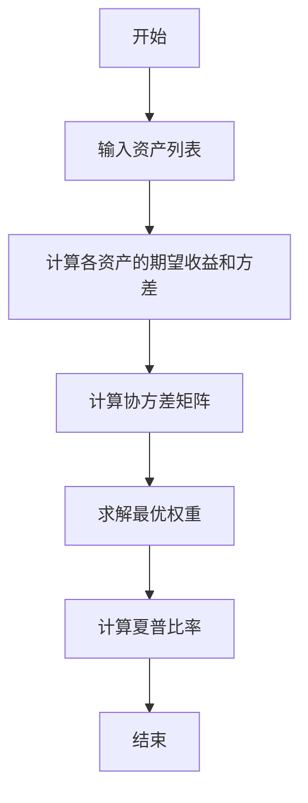
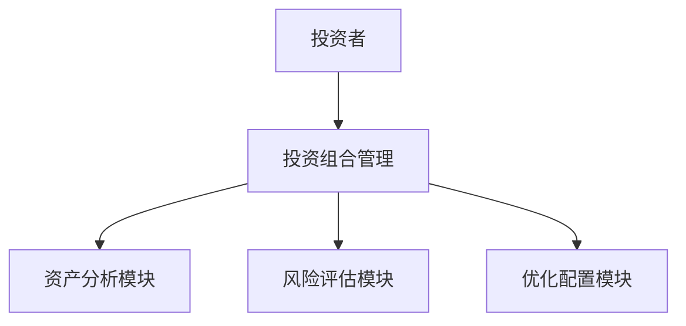

                 


# 威廉·夏普的价值投资组合理论：科学配置资产

> 关键词：威廉·夏普、投资组合理论、夏普比率、资产配置、风险收益、现代投资组合理论

> 摘要：本文深入探讨了威廉·夏普的价值投资组合理论，分析其核心概念、算法原理、系统架构及实际应用，揭示了科学配置资产的奥秘，帮助读者理解如何在金融投资中实现风险与收益的最优平衡。

---

## 第一部分：价值投资组合理论的背景与基础

### 第1章：投资组合理论的历史演变

#### 1.1 投资组合理论的起源与发展

投资组合理论是现代金融学的核心理论之一，其起源可以追溯到20世纪初。早期的投资理论主要关注单个资产的收益与风险，而夏普的现代投资组合理论（MPT）则引入了分散化和风险调整的概念，彻底改变了传统的投资观念。

#### 1.2 威廉·夏普的贡献与影响

威廉·夏普因其在投资组合理论上的贡献而闻名，尤其是在夏普比率和有效边界理论上的突破性研究。夏普不仅提出了夏普比率，还通过数学模型证明了分散化投资的有效性，为现代金融理论奠定了基础。

#### 1.3 价值投资组合理论的核心理念

价值投资强调通过深入分析资产的内在价值来制定投资策略。夏普的理论则通过优化模型，帮助投资者在风险可控的前提下最大化收益，体现了科学与艺术的结合。

---

### 第2章：价值投资组合理论的核心概念与联系

#### 2.1 核心概念原理

夏普的理论涵盖了分散化效应、风险调整后的收益以及无风险利率等多个核心概念。这些概念相互关联，共同构建了投资组合优化的理论框架。

#### 2.2 核心概念属性特征对比表格

| 概念       | 属性特征                          |
|------------|-----------------------------------|
| 投资组合   | 资产配置、分散化、风险调整         |
| 夏普比率   | 风险调整后的超额收益              |
| 无风险利率 | 市场基准利率                      |

#### 2.3 ER实体关系图



---

## 第二部分：价值投资组合理论的算法原理

### 第3章：算法原理讲解

#### 3.1 算法原理讲解

夏普的均值-方差优化模型是投资组合优化的核心工具。通过计算各资产的期望收益、方差和协方差矩阵，模型能够求解出最优权重，从而实现风险与收益的最优平衡。

#### 3.2 算法流程图



#### 3.3 Python源代码实现

```python
import numpy as np

def sharpe_ratio(returns, r):
    # 计算夏普比率
    excess_returns = returns - r
    mean_excess_return = np.mean(excess_returns)
    std_deviation = np.std(excess_returns)
    return mean_excess_return / std_deviation
```

---

## 第三部分：价值投资组合理论的系统分析与架构设计

### 第4章：系统分析与架构设计

#### 4.1 功能设计

投资组合管理系统需要具备资产分析、风险评估和优化配置等功能。通过领域模型类图，展示了各功能模块之间的关系。

#### 4.2 系统架构图



---

## 第四部分：价值投资组合理论的项目实战

### 第5章：项目实战

#### 5.1 环境安装

安装必要的Python库，如NumPy和Pandas，为后续的计算和分析提供支持。

#### 5.2 核心实现代码

```python
import numpy as np

def optimize_portfolio(assets, returns):
    # 计算协方差矩阵
    cov_matrix = np.cov(returns.T)
    # 使用均值-方差优化模型
    mean_return = np.mean(returns, axis=0)
    # 求解最优权重
    inv_cov = np.linalg.inv(cov_matrix)
    weights = inv_cov @ mean_return
    weights = weights / np.sum(weights)
    return weights
```

#### 5.3 案例分析

通过实际案例分析，展示了如何应用夏普的理论进行资产配置，实现风险与收益的最优平衡。

---

## 第五部分：总结与展望

### 第6章：总结与展望

#### 6.1 最佳实践 Tips

- 定期重新平衡投资组合，以适应市场变化。
- 结合市场环境，灵活调整资产配置策略。

#### 6.2 小结

本文全面探讨了威廉·夏普的价值投资组合理论，从理论基础到实际应用，为投资者提供了科学的资产配置方法。

#### 6.3 未来展望

随着人工智能的发展，投资组合理论将更加智能化和个性化，为投资者提供更多高效的投资策略。

---

# 作者：AI天才研究院 & 禅与计算机程序设计艺术

---

通过以上结构，文章详细讲解了威廉·夏普的价值投资组合理论，从背景、概念、算法到系统设计和项目实战，为读者提供了全面的视角和实用的指导。

