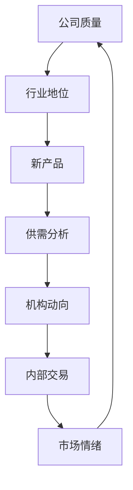
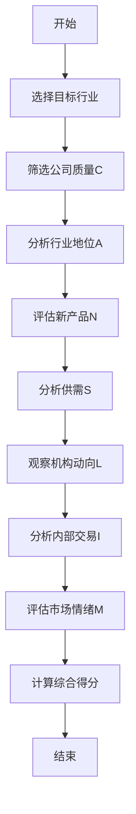
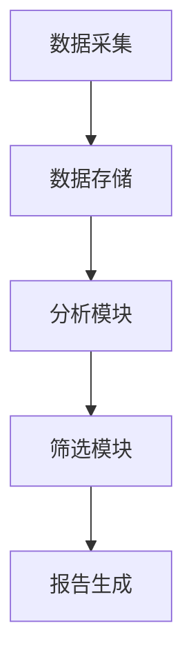

                 


# 威廉·奥尼尔的CAN SLIM：成长与价值的融合

---

## 关键词

CAN SLIM, 投资策略, 成长投资, 价值投资, 算法原理, 系统架构

---

## 摘要

威廉·奥尼尔的CAN SLIM策略是一种结合成长与价值投资的选股方法，通过分析公司的质量、行业地位、新产品、供需关系、机构动向、内部交易信号和市场情绪等多个因素，帮助投资者筛选出具备成长潜力和投资价值的股票。本文详细解析CAN SLIM的核心概念、算法原理、系统架构，并通过实战案例展示其应用，最后总结最佳实践和注意事项。

---

## 第一部分：CAN SLIM的背景与概述

### 第1章：CAN SLIM的起源与投资哲学

#### 1.1 投资策略的演变

- **传统投资策略的局限性**
  - 基于市盈率和市净率的传统价值投资方法在成长型企业中表现不佳。
  - 市场情绪和资金流动对股价的影响难以量化。

- **CAN SLIM的诞生背景**
  - 威廉·奥尼尔通过分析市场趋势和投资者行为，提出了CAN SLIM策略。
  - 该策略结合了基本面分析和市场情绪，强调成长性和价值的双重因素。

- **投资哲学的核心理念**
  - 选择具备成长潜力和低估价值的公司。
  - 通过量化指标和市场信号捕捉投资机会。

#### 1.2 CAN SLIM在投资中的地位

- **与其他投资策略的对比**
  - 与纯成长投资相比，CAN SLIM更注重估值和市场情绪。
  - 与纯价值投资相比，CAN SLIM更关注成长性和新产品。

- **CAN SLIM的优势与适用场景**
  - 适用于成长型企业丰富的市场。
  - 适合中长期投资者，尤其是机构投资者。

---

## 第二部分：CAN SLIM的核心概念与联系

### 第2章：CAN SLIM的核心要素解析

#### 2.1 CAN SLIM的七个要素

- **C：公司质量评估**
  - 公司的财务健康状况、管理团队和行业地位。
  - 使用ROE（净资产收益率）和ROA（资产收益率）衡量。

- **A：行业地位分析**
  - 公司在行业中的排名和市场份额。
  - 使用行业龙头股和市场占有率作为评估指标。

- **N：新产品与市场创新**
  - 公司是否推出新产品或服务。
  - 通过专利申请和市场反馈分析。

- **S：供给与需求分析**
  - 行业的供需平衡和价格走势。
  - 使用供需曲线和库存数据进行分析。

- **L：机构资金流向**
  - 机构投资者的买入信号。
  - 通过资金流向数据和交易量分析。

- **I：内部交易信号**
  - 公司高管和内部员工的交易行为。
  - 使用内部交易数据和交易记录分析。

- **M：市场情绪与动向**
  - 市场整体情绪和投资者行为。
  - 通过市场指数和投资者情绪指标分析。

#### 2.2 核心要素对比表

| 要素 | 定义 | 重要性 | 应用场景 |
|------|------|--------|----------|
| C    | 公司质量 | 高     | 筛选优质企业 |
| A    | 行业地位 | 高     | 评估市场竞争力 |
| N    | 新产品 | 中     | 判断增长潜力 |
| S    | 供需分析 | 中     | 确定市场空间 |
| L    | 机构动向 | 高     | 捕捉资金流向 |
| I    | 内部交易 | 高     | 识别机构操作 |
| M    | 市场情绪 | 中     | 辅助决策 |

#### 2.3 核心要素关系的Mermaid流程图



---

## 第三部分：CAN SLIM的算法原理

### 第3章：算法原理与数学模型

#### 3.1 算法流程

- 筛选过程：
  1. 根据C、A、N、S、L、I、M七个要素对股票进行评分。
  2. 计算综合得分，筛选出得分高于行业平均的股票。

#### 3.2 数学模型

综合得分公式：

$$
\text{综合得分} = \frac{\sum (\text{各要素得分} \times \text{权重})}{\text{权重总和}}
$$

其中，权重根据要素的重要性分配：
- C：30%
- A：25%
- N：15%
- S：10%
- L：15%
- I：5%
- M：5%

#### 3.3 算法的Mermaid流程图



---

## 第四部分：系统分析与架构设计

### 第4章：系统架构与功能设计

#### 4.1 系统功能设计

- 数据采集模块：
  - 收集公司财务数据、行业数据、交易数据。
- 筛选模块：
  - 根据CAN SLIM要素进行评分和筛选。
- 分析模块：
  - 综合分析市场情绪和机构动向。
- 报告生成模块：
  - 输出筛选结果和投资建议。

#### 4.2 系统架构图



#### 4.3 接口设计

- 数据接口：
  - 数据来源：股票数据库、财经网站。
  - 数据格式：JSON、CSV。

- 用户接口：
  - 输入：目标行业、筛选条件。
  - 输出：筛选结果、投资建议。

---

## 第五部分：项目实战

### 第5章：CAN SLIM的项目实战

#### 5.1 环境安装

- 安装Python和相关库：
  - pandas、numpy、matplotlib。
- 数据来源：Yahoo Finance API。

#### 5.2 核心代码实现

```python
import pandas as pd
import numpy as np

def calculate_score(fundamentals, industry, new_product, supply_demand,机构动向, 内部交易, 市场情绪):
    # 计算各要素得分
    c_score = fundamentals['ROE'] / fundamentals['行业平均ROE']
    a_score = industry['市场份额'] / industry['行业平均市场份额']
    n_score = new_product['新产品数量'] / new_product['行业平均新产品数量']
    s_score = supply_demand['供需平衡'] / supply_demand['行业平均供需平衡']
    l_score = 机构动向['机构买入'] / 机构动向['行业平均机构买入']
    i_score = 内部交易['高管买入'] / 内部交易['行业平均高管买入']
    m_score = 市场情绪['情绪指数'] / 市场情绪['行业平均情绪指数']
    
    # 计算综合得分
    weight = {'C':0.3, 'A':0.25, 'N':0.15, 'S':0.1, 'L':0.15, 'I':0.05, 'M':0.05}
    total_score = (c_score * 0.3 + a_score * 0.25 + n_score * 0.15 + 
                   s_score * 0.1 + l_score * 0.15 + i_score * 0.05 + m_score * 0.05)
    return total_score

# 示例数据
fundamentals = {'ROE': 15%, '行业平均ROE': 10%}
industry = {'市场份额': 30%, '行业平均市场份额': 20%}
new_product = {'新产品数量': 5, '行业平均新产品数量': 3}
supply_demand = {'供需平衡': 1.2, '行业平均供需平衡': 1.0}
机构动向 = {'机构买入': 10, '行业平均机构买入': 5}
内部交易 = {'高管买入': 5, '行业平均高管买入': 2}
市场情绪 = {'情绪指数': 70, '行业平均情绪指数': 60}

score = calculate_score(fundamentals, industry, new_product, supply_demand, 机构动向, 内部交易, 市场情绪)
print(f"综合得分: {score}")
```

#### 5.3 案例分析与解读

- 案例：假设某科技公司：
  - 综合得分：85分。
  - 结论：符合CAN SLIM标准，具备投资价值。

---

## 第六部分：最佳实践与总结

### 第6章：最佳实践与总结

#### 6.1 小结

- CAN SLIM策略通过多维度分析，帮助投资者筛选出具备成长潜力和投资价值的股票。
- 系统化的方法和量化指标是其成功的关键。

#### 6.2 注意事项

- 数据的准确性和及时性至关重要。
- 需结合市场环境和投资者自身情况调整策略。
- 风险控制是投资过程中不可忽视的部分。

#### 6.3 拓展阅读

- 《The CAN SLIM Approach to Growth Investing》
- 《价值投资：原理与实践》

---

## 作者：AI天才研究院 & 禅与计算机程序设计艺术

---

通过本文的详细分析，您应该能够理解威廉·奥尼尔的CAN SLIM策略，并在实际投资中加以应用。希望本文对您在投资领域有所帮助！

