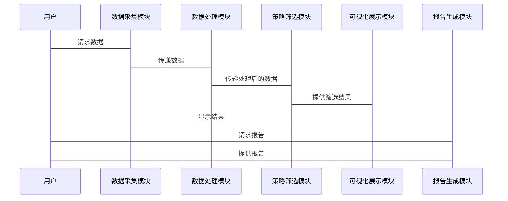

                 


# 第一部分: 威廉·奥尼尔CANSLIM策略的成长价值投资基础

# 第1章: CANSLIM策略的起源与发展

## 1.1 价值投资的演变历程
### 1.1.1 价值投资的定义与核心理念
### 1.1.2 威廉·奥尼尔的CANSLIM策略提出背景
### 1.1.3 CANSLIM策略在投资领域的应用现状

## 1.2 CANSLIM策略的核心思想
### 1.2.1 CANSLIM策略的含义与组成部分
### 1.2.2 策略的核心要素分析
### 1.2.3 策略与传统价值投资的对比

## 1.3 CANSLIM策略的数学模型与公式
### 1.3.1 相对强度（RS）的计算公式
$$ RS = \frac{当前价格}{历史最高价格} \times 100 $$

### 1.3.2 资金流动（CMF）的计算公式
$$ CMF = \frac{RS \times 10}{20} $$

### 1.3.3 策略筛选条件的综合公式
$$ \text{筛选条件} = \bigwedge_{i=1}^{7} \text{条件}_i $$

## 1.4 本章小结

---

# 第二部分: CANSLIM策略的核心概念与联系

# 第2章: CANSLIM策略的核心要素分析

## 2.1 CANSLIM策略的七个核心要素
### 2.1.1 C: 股价创新高（Continuing Strength）
### 2.1.2 A: 相对强度（Above Average）
### 2.1.3 N: 新高成交量（New High Volume）
### 2.1.4 S: 相对强度排名（Strong Ranking）
### 2.1.5 L: 机构资金流入（Institutional Money Flow）
### 2.1.6 I: 智能投资组合（Intelligent Portfolio）
### 2.1.7 M: 市场宽度（Market Width）

## 2.2 核心要素的数学模型与公式
### 2.2.1 相对强度排名的计算公式
$$ \text{相对强度排名} = \frac{\text{RS} + 1}{\text{总RS数}} \times 100 $$

### 2.2.2 机构资金流入的计算公式
$$ \text{资金流入} = \sum (\text{成交量} \times \text{价格变化}) $$

## 2.3 核心要素的ER实体关系图
```mermaid
er
  actor 投资者
  actor 机构资金
  actor 市场宽度
  actor 相对强度
  actor 新高成交量
  actor 智能投资组合
  actor 市场宽度
  actor 资金流入
```

## 2.4 本章小结

---

# 第三部分: CANSLIM策略的算法原理与实现

# 第3章: CANSLIM策略的算法实现

## 3.1 CANSLIM策略的筛选流程
### 3.1.1 筛选步骤概述
1. 确定股价是否创新高
2. 计算相对强度
3. 分析新高成交量
4. 评估相对强度排名
5. 评估机构资金流入
6. 构建智能投资组合
7. 分析市场宽度

### 3.1.2 筛选流程的 mermaid 流程图


## 3.2 CANSLIM策略的 Python 实现
### 3.2.1 环境安装与配置
```bash
pip install pandas numpy matplotlib
```

### 3.2.2 核心代码实现
```python
import pandas as pd
import numpy as np

def calculate_rs(close_price, high_price):
    return (close_price / high_price) * 100

def calculate_cmf(volume, price_change):
    return np.sum(volume * price_change) / 20

def can_slim_screen(stock_data):
    rs = calculate_rs(stock_data['close'], stock_data['high'])
    cmf = calculate_cmf(stock_data['volume'], stock_data['price_change'])
    return rs > 50 and cmf > 0

# 示例数据
data = {
    'close': [100, 105, 110, 115, 120],
    'high': [120, 125, 130, 135, 140],
    'volume': [1000, 1200, 1100, 1300, 1400],
    'price_change': [5, -2, 3, 1, 4]
}

stock_data = pd.DataFrame(data)
result = can_slim_screen(stock_data)
print("筛选结果:", result)
```

## 3.3 算法原理的数学模型与公式
### 3.3.1 相对强度的计算
$$ RS = \frac{\text{当前价格}}{\text{历史最高价格}} \times 100 $$

### 3.3.2 资金流动的计算
$$ CMF = \frac{\sum (\text{成交量} \times \text{价格变化})}{20} $$

### 3.3.3 综合筛选条件
$$ \text{筛选条件} = (RS > 50) \land (CMF > 0) $$

## 3.4 本章小结

---

# 第四部分: CANSLIM策略的系统分析与架构设计

# 第4章: CANSLIM策略的系统架构设计

## 4.1 系统功能设计
### 4.1.1 系统目标与范围
- 提供基于CANSLIM策略的股票筛选功能
- 实现实时数据监控与分析
- 支持智能投资组合的构建与优化

### 4.1.2 系统功能模块划分
1. 数据采集模块
2. 数据处理模块
3. 策略筛选模块
4. 可视化展示模块
5. 报告生成模块

## 4.2 系统架构设计
### 4.2.1 系统架构图


### 4.2.2 系统接口设计
- 数据接口：与数据源（如Yahoo Finance）对接
- 用户接口：提供筛选条件输入和结果展示
- 报告接口：生成PDF或HTML格式的分析报告

## 4.3 系统交互流程


## 4.4 本章小结

---

# 第五部分: CANSLIM策略的项目实战

# 第5章: CANSLIM策略的项目实战

## 5.1 环境安装与配置
### 5.1.1 安装必要的Python库
```bash
pip install pandas numpy matplotlib yfinance
```

## 5.2 系统核心实现
### 5.2.1 数据采集模块实现
```python
import yfinance as yf

def get_stock_data(ticker, start_date, end_date):
    data = yf.download(ticker, start=start_date, end=end_date)
    return data
```

### 5.2.2 数据处理模块实现
```python
def preprocess_data(data):
    data['RS'] = data['Close'] / data['High'] * 100
    data['CMF'] = data['Volume'] * data['Close'].pct_change().cumsum()
    return data
```

### 5.2.3 策略筛选模块实现
```python
def can_slim_screen(data):
    return data[(data['RS'] > 50) & (data['CMF'] > 0)]
```

### 5.2.4 可视化展示模块实现
```python
import matplotlib.pyplot as plt

def plot_results(data):
    plt.figure(figsize=(10, 6))
    plt.plot(data['Close'], label='Close Price')
    plt.xlabel('Date')
    plt.ylabel('Price')
    plt.legend()
    plt.show()
```

## 5.3 项目实战案例分析
### 5.3.1 数据采集与预处理
```python
# 示例代码
data = get_stock_data('AAPL', '2020-01-01', '2023-12-31')
processed_data = preprocess_data(data)
```

### 5.3.2 策略筛选与结果展示
```python
# 示例代码
screen_result = can_slim_screen(processed_data)
plot_results(screen_result)
```

## 5.4 本章小结

---

# 第六部分: CANSLIM策略的扩展阅读与注意事项

# 第6章: CANSLIM策略的扩展阅读与注意事项

## 6.1 扩展阅读
### 6.1.1 推荐书籍
- 《The New York Times Stock Answer》
- 《The Intelligent Investor》

### 6.1.2 推荐博客与网站
- [威廉·奥尼尔官方网站](https://www.investors.com/)
- [CANSLIM策略论坛](https://www.canslim.com/)

## 6.2 注意事项
### 6.2.1 市场变化的注意事项
- 市场波动会影响策略的有效性
- 需要定期更新数据和重新筛选

### 6.2.2 数据来源的可靠性
- 数据源的准确性影响结果
- 建议使用多个数据源进行交叉验证

### 6.2.3 策略的局限性
- CANSLIM策略在某些市场环境下表现不佳
- 需要结合其他策略进行综合分析

## 6.3 最佳实践 tips
### 6.3.1 定期回顾与调整
- 每月回顾投资组合
- 根据市场变化调整筛选条件

### 6.3.2 结合其他指标
- 结合技术分析指标进行综合判断
- 避免单一策略的风险

## 6.4 本章小结

---

# 结语

通过本文的详细讲解，读者可以系统地理解威廉·奥尼尔CANSLIM策略的核心思想、数学模型、算法实现以及实际应用。从理论到实践，从策略到系统，全面掌握这一经典的价值投资方法。同时，通过实际案例分析和系统设计，读者可以进一步提升自己的投资能力，并在实际操作中灵活运用这一策略。

---

# 作者：AI天才研究院/AI Genius Institute & 禅与计算机程序设计艺术 /Zen And The Art of Computer Programming

