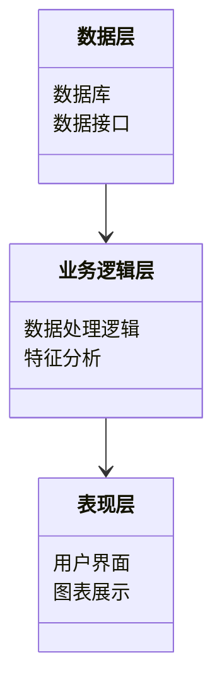
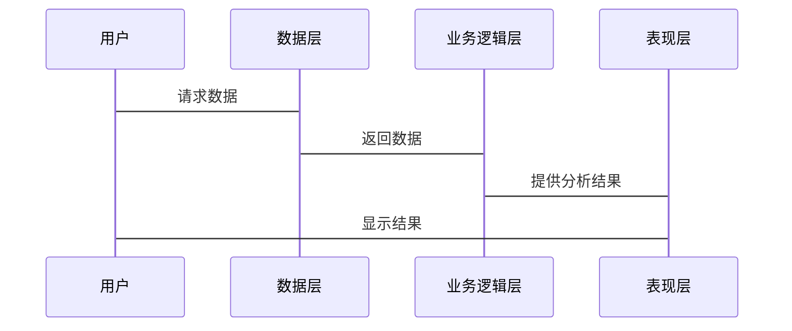

                 


# 威廉·欧奈尔的市场领导者特征分析

> 关键词：威廉·欧奈尔，市场领导者，相对强度指数，投资分析，企业特征

> 摘要：本文详细分析了威廉·欧奈尔提出的市场领导者特征，从内在和外在两个维度探讨了市场领导者的定义和判定标准。通过量化分析和算法模型，结合实际案例，本文阐述了如何识别和评估市场领导者，并提供了系统化的解决方案。

---

## 第1章: 背景介绍

### 1.1 威廉·欧奈尔的投资理念
#### 1.1.1 威廉·欧奈尔的背景与成就
威廉·欧奈尔（William O'Neil）是美国著名投资家、企业家和作家，以其在投资领域的独特见解和成功策略闻名。他在20世纪70年代创立了欧奈尔公司（O'Neil & Company），并提出了许多被广泛认可的投资理论，其中包括“市场领导者”概念。

#### 1.1.2 欧奈尔投资方法的核心思想
欧奈尔的投资方法强调对市场的深刻理解，尤其是对市场领导者的识别。他认为，市场领导者是能够在市场中占据主导地位，并且能够在不同市场条件下持续表现优异的公司。这种公司通常具备强大的市场影响力、卓越的盈利能力以及创新的能力。

#### 1.1.3 市场领导者的定义
市场领导者是指在某一行业中占据领先地位，能够对市场趋势和消费者需求做出快速反应，并在竞争中占据优势地位的企业。市场领导者通常具有较高的市场占有率、品牌影响力和客户忠诚度。

---

## 第2章: 市场领导者特征分析

### 2.1 市场领导者的内在特征
#### 2.1.1 领导力与决策能力
市场领导者需要具备强大的领导力和决策能力。这包括对市场趋势的敏锐洞察、对战略方向的准确把握以及在关键时刻做出正确决策的能力。

#### 2.1.2 创新能力与技术优势
市场领导者往往拥有领先的技术和创新能力。他们能够在市场中不断推出新产品或服务，满足消费者的需求，并在竞争中保持优势。

#### 2.1.3 财务健康与盈利能力
市场领导者的财务状况通常较为稳健，具有较高的盈利能力。他们能够通过持续的创新和高效的运营，实现稳定的收益增长。

### 2.2 市场领导者的外在特征
#### 2.2.1 市场占有率与品牌影响力
市场领导者通常具有较高的市场占有率和强大的品牌影响力。他们能够在市场上占据主导地位，并通过品牌建设吸引更多的消费者。

#### 2.2.2 行业地位与竞争优势
市场领导者在行业中通常处于领先地位，具有显著的竞争优势。他们能够通过规模效应、成本优势和技术优势，确保在市场中的领先地位。

#### 2.2.3 客户满意度与忠诚度
市场领导者注重客户体验，能够通过优质的产品和服务赢得客户的满意度和忠诚度。这不仅有助于巩固市场地位，还能为企业的长期发展提供坚实的基础。

---

## 第3章: 市场领导者特征的量化分析

### 3.1 市场领导者特征的量化指标
为了更好地分析市场领导者特征，我们需要将这些特征转化为可量化的指标。常见的量化指标包括：
1. **市场占有率**：市场份额的大小。
2. **相对强度指数（RSI）**：衡量市场的相对表现。
3. **盈利能力**：如净利润率、ROE（净资产收益率）等。
4. **品牌影响力**：如品牌知名度、客户忠诚度等。

### 3.2 相对强度指数（RSI）的计算与应用
相对强度指数（RSI）是一种衡量市场表现的指标，其计算公式如下：

$$ RSI = \frac{P_i}{P_m} $$

其中，$P_i$表示当前价格，$P_m$表示市场平均价格。

RSI的值越大，表明该市场的表现越强，反之则越弱。通过RSI，我们可以更好地识别市场领导者。

---

## 第4章: 系统分析与架构设计方案

### 4.1 系统分析
为了实现市场领导者特征的分析，我们需要构建一个完整的系统架构。该系统包括以下几个模块：
1. **数据采集模块**：收集市场数据，包括价格、成交量等。
2. **特征分析模块**：对市场特征进行分析，计算相对强度指数等指标。
3. **预测模块**：基于历史数据和特征分析，预测市场走势。
4. **可视化模块**：将分析结果以图表形式展示，便于理解。

### 4.2 系统架构设计
系统的架构设计采用分层架构，包括数据层、业务逻辑层和表现层。以下是系统架构的类图（Mermaid）：



### 4.3 系统交互设计
以下是系统交互的序列图（Mermaid）：



---

## 第5章: 项目实战

### 5.1 环境安装
为了进行市场领导者特征分析，我们需要安装以下环境：
- Python 3.x
- 数据分析库（如Pandas、NumPy）
- 可视化库（如Matplotlib、Seaborn）
- 投资分析库（如Prypto）

### 5.2 核心代码实现
以下是相对强度指数计算的Python代码示例：

```python
import pandas as pd
import numpy as np

def calculate_rsi(data, period=14):
    # 计算相对强度指数
    delta = data['收盘价'].diff().dropna()
    up = delta.where(delta >= 0)
    down = delta.where(delta < 0).abs()
    RS = up.rolling(period).mean() / down.rolling(period).mean()
    RSI = 100 - (100 - RS.rolling(period).mean())
    return RSI

data = pd.read_csv('market_data.csv')
rsi = calculate_rsi(data)
print(rsi)
```

### 5.3 案例分析
以苹果公司为例，我们可以分析其是否符合市场领导者特征。通过计算RSI指标和分析市场表现，我们可以得出结论。

---

## 第6章: 总结与展望

### 6.1 总结
通过本文的分析，我们深入探讨了威廉·欧奈尔提出的市场领导者特征，并从内在和外在两个维度进行了详细分析。我们还通过量化分析和系统设计，提供了识别和评估市场领导者的方法。

### 6.2 展望
未来的研究可以进一步完善市场领导者特征的量化模型，并结合人工智能技术，如机器学习，提升市场预测的准确性。此外，还可以研究市场领导者在不同行业中的表现差异，为投资者提供更精准的指导。

---

## 作者：AI天才研究院/AI Genius Institute & 禅与计算机程序设计艺术 /Zen And The Art of Computer Programming

