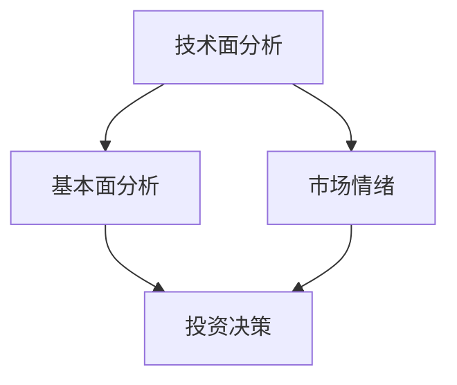
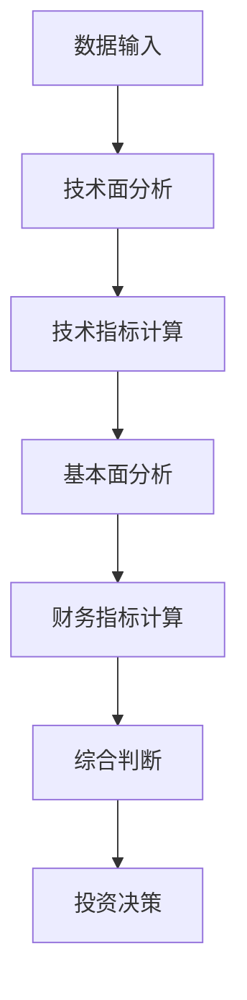
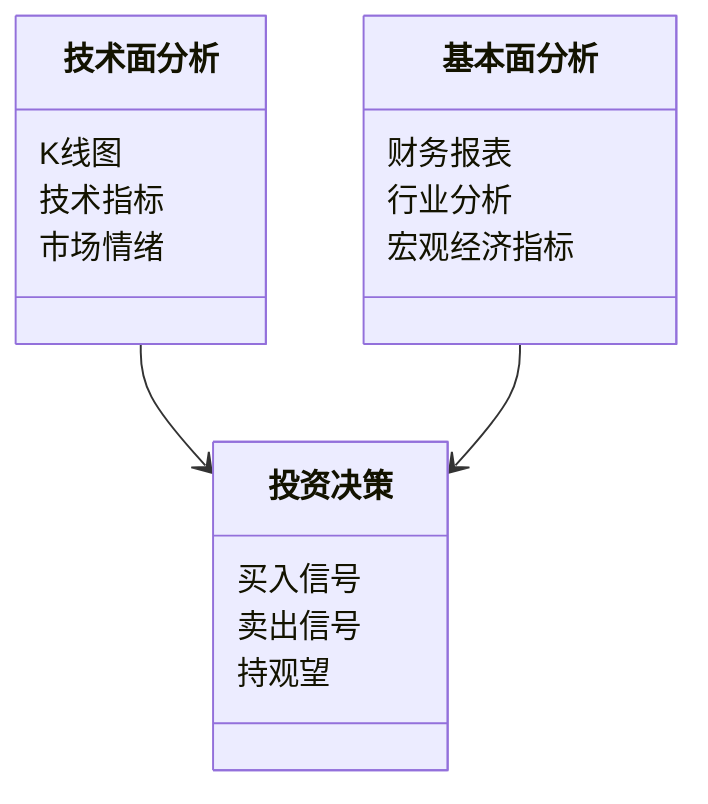
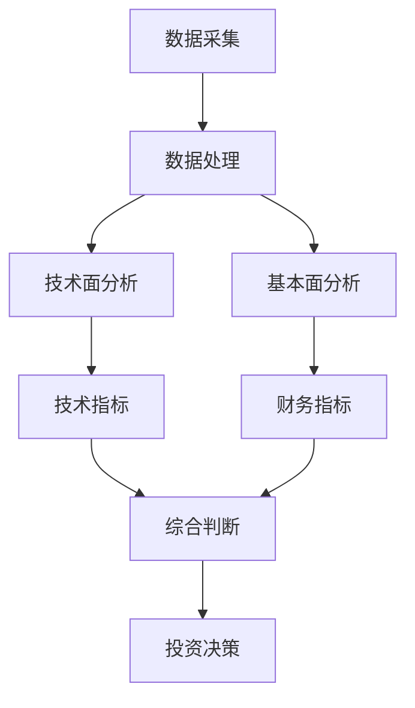
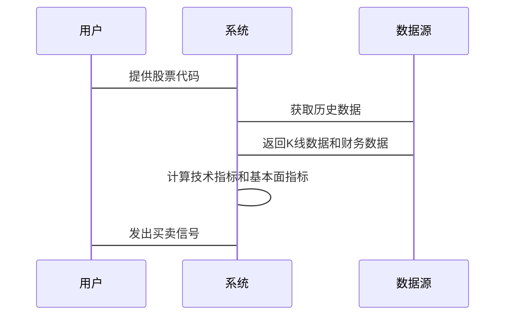

                 


# 《威廉·欧奈尔的技术面与基本面结合策略》

**关键词**：技术分析、基本面分析、投资策略、威廉·欧奈尔、技术指标、财务指标

**摘要**：  
威廉·欧奈尔的技术面与基本面结合策略是一种将技术分析与基本面分析相结合的投资方法。本文将详细介绍该策略的核心概念、算法原理、系统架构设计以及实际应用案例，帮助读者理解如何通过结合技术面和基本面信息做出更明智的投资决策。我们将从背景介绍、核心概念、算法实现、系统设计到项目实战，全面解析这一策略的理论基础与实践应用。

---

## 目录

### 第一部分：技术面与基本面结合策略概述

#### 第1章：技术面与基本面分析的背景与概念

##### 1.1 技术分析的定义与核心要素
- 1.1.1 技术分析的基本概念
  - K线图、成交量、价格走势
- 1.1.2 技术分析的核心要素
  - 趋势、形态、支撑与阻力
- 1.1.3 技术分析的优缺点
  - 短期预测能力强，但受市场情绪影响较大

##### 1.2 基本面分析的定义与核心要素
- 1.2.1 基本面分析的基本概念
  - 公司财务报表、行业分析、宏观经济指标
- 1.2.2 基本面分析的核心要素
  - 盈利能力、成长性、估值指标（PE、PB、ROE）
- 1.2.3 基本面分析的优缺点
  - 长期预测准确，但短期波动难以捕捉

##### 1.3 技术面与基本面分析的结合必要性
- 1.3.1 技术面与基本面分析的互补性
  - 技术面捕捉短期市场情绪，基本面提供长期价值评估
- 1.3.2 结合分析的优势与应用场景
  - 在震荡市中利用技术面寻找买卖点，在牛市中通过基本面筛选优质标的
- 1.3.3 本书的核心目标与框架
  - 结合威廉·欧奈尔的理论，提供一套可操作的投资策略

#### 第2章：技术面与基本面分析的核心概念与联系

##### 2.1 技术面分析的核心原理
- 2.1.1 K线图的构成与解读
  - 开盘价、收盘价、最高价、最低价
- 2.1.2 技术指标的分类与特点
  - 超买超卖指标（RSI）、相对强弱指数（RSI）、移动平均收敛散度（MACD）
- 2.1.3 常见的技术分析方法
  - 趋势分析、形态分析、支撑与阻力位

##### 2.2 基本面分析的核心原理
- 2.2.1 财务报表分析的基础知识
  - 利润表、资产负债表、现金流量表
- 2.2.2 行业分析与公司估值方法
  - 行业生命周期、竞争优势（波特五力模型）
- 2.2.3 宏观经济指标对投资决策的影响
  - 利率、通货膨胀、GDP增速

##### 2.3 技术面与基本面的关联与整合
- 2.3.1 技术面与基本面的实体关系图（Mermaid图）

- 2.3.2 技术面与基本面分析的对比表格
| 属性 | 技术面分析 | 基本面分析 |
|------|------------|------------|
| 数据来源 | 市场价格、成交量等 | 公司财务数据、行业数据等 |
| 分析周期 | 短期到中期 | 中期到长期 |
| 分析目标 | 短期价格波动预测 | 公司长期价值评估 |

### 第二部分：技术面与基本面结合的算法原理

#### 第3章：技术面与基本面结合的算法原理

##### 3.1 技术面分析的数学模型
- 3.1.1 移动平均线（MA）的计算公式
  $$ MA_n = \frac{1}{n} \sum_{i=1}^{n} P_i $$
  其中，$P_i$ 表示第i天的价格，$n$ 表示计算天数。
- 3.1.2 相对强弱指数（RSI）的计算公式
  $$ RSI = \frac{100}{1 + \frac{A}{B}} $$
  其中，$A$ 是上涨幅度，$B$ 是下跌幅度。

##### 3.2 基本面分析的数学模型
- 3.2.1 市盈率（PE）的计算公式
  $$ PE = \frac{股价}{每股收益} $$
- 3.2.2 市净率（PB）的计算公式
  $$ PB = \frac{股价}{每股净资产} $$

##### 3.3 技术面与基本面结合的算法流程（Mermaid图）


##### 3.4 技术面与基本面结合的Python实现示例
```python
import pandas as pd
import numpy as np

# 假设data是一个包含'收盘价'和'净利润'的DataFrame
# 技术指标：5日移动平均线
data['MA5'] = data['收盘价'].rolling(5).mean()

# 基本面指标：市盈率（PE）
data['PE'] = data['收盘价'] / (data['净利润'].rolling(5).mean())

# 综合判断：当MA5上穿价格且PE低于行业平均时，发出买入信号
data['信号'] = np.where((data['MA5'] > data['收盘价']) & (data['PE'] < data['PE'].mean()), '买入', '观望')
```

### 第三部分：技术面与基本面结合的系统架构设计

#### 第4章：技术面与基本面结合的系统架构设计

##### 4.1 项目介绍
- 系统目标：开发一个结合技术面与基本面分析的投资决策支持系统
- 项目范围：股票投资分析、策略生成、风险控制

##### 4.2 系统功能设计（领域模型）


##### 4.3 系统架构设计（架构图）


##### 4.4 接口设计与交互流程


### 第四部分：技术面与基本面结合的项目实战

#### 第5章：技术面与基本面结合的项目实战

##### 5.1 环境安装与数据准备
- 安装Python环境及必要的库（pandas、numpy、matplotlib）
- 数据来源：Yahoo Finance API或本地数据库

##### 5.2 核心代码实现
```python
import pandas as pd
import numpy as np
import requests

# 获取股票数据
def get_data(stock):
    url = f"https://query1.finance.yahoo.com/v8/finance/chart/{stock}"
    response = requests.get(url)
    data = response.json()
    df = pd.DataFrame(data['chart']['result'][0]['prices'])
    df['Date'] = pd.to_datetime(df[0])
    df = df.set_index('Date')
    df = df[['open', 'high', 'low', 'close', 'volume']]
    return df

# 计算技术指标
def calculate_technical_indicators(df):
    df['MA5'] = df['close'].rolling(5).mean()
    df['RSI'] = (100 / (1 + (df['close'].diff().apply(lambda x: x if x > 0 else 0).rolling(5).mean() / df['close'].diff().apply(lambda x: -x if x < 0 else 0).rolling(5).mean())))
    return df

# 计算基本面指标
def calculate_fundamental_indicators(stock):
    url = f"https://query1.finance.yahoo.com/v11/finance/peRatio/{stock}"
    response = requests.get(url)
    data = response.json()
    pe_ratio = data['peRatio']['value']
    return pe_ratio

# 综合判断
def generate_signal(stock_data, pe_ratio, industry_pe):
    if (stock_data['MA5'][-1] > stock_data['close'][-1]) and (pe_ratio < industry_pe):
        return '买入'
    elif (stock_data['MA5'][-1] < stock_data['close'][-1]) and (pe_ratio > industry_pe):
        return '卖出'
    else:
        return '观望'

# 主程序
def main():
    stock = 'AAPL'
    df = get_data(stock)
    df = calculate_technical_indicators(df)
    pe_ratio = calculate_fundamental_indicators(stock)
    industry_pe = 15  # 示例行业平均PE
    signal = generate_signal(df, pe_ratio, industry_pe)
    print(f"信号：{signal}")

if __name__ == '__main__':
    main()
```

##### 5.3 案例分析与结果解读
- 以AAPL为例，分析技术面与基本面指标如何共同作用于投资决策
- 通过图表展示MA5、RSI、PE指标的变化趋势
- 结合市场环境解读信号的合理性

##### 5.4 项目小结
- 代码实现的功能总结
- 系统的优缺点分析
- 可扩展的方向与改进建议

### 第五部分：技术面与基本面结合策略的最佳实践

#### 第6章：技术面与基本面结合策略的最佳实践

##### 6.1 技术面与基本面结合策略的小结
- 策略的有效性与适用场景总结
- 策略在不同市场环境下的表现分析

##### 6.2 技术面与基本面结合策略的注意事项
- 数据质量的重要性
- 指标参数的选择与调整
- 风险控制与仓位管理

##### 6.3 技术面与基本面结合策略的拓展阅读
- 威廉·欧奈尔的原著《击败华尔街》
- 相关技术分析与基本面分析的经典书籍
- 学术研究与实证分析文献

### 第七部分：结论与展望

#### 第7章：结论与展望

##### 7.1 技术面与基本面结合策略的总结
- 该策略的核心思想与实际应用价值
- 通过结合技术面与基本面分析，投资者可以做出更全面的投资决策

##### 7.2 未来研究方向与技术展望
- 结合机器学习与大数据分析，优化指标筛选与权重分配
- 研究不同市场环境下的策略适应性
- 探索多因子模型在技术面与基本面结合中的应用

---

**作者：AI天才研究院/AI Genius Institute & 禅与计算机程序设计艺术 /Zen And The Art of Computer Programming**

---

通过以上目录结构，我们可以系统地探讨威廉·欧奈尔的技术面与基本面结合策略，从理论到实践，从算法到系统，全面解析这一投资策略的核心思想与实际应用。

